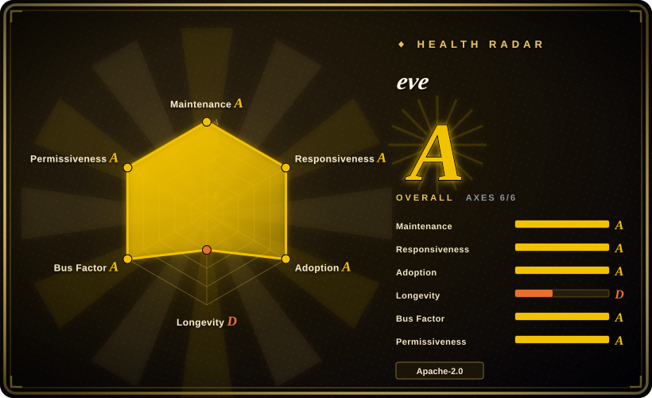
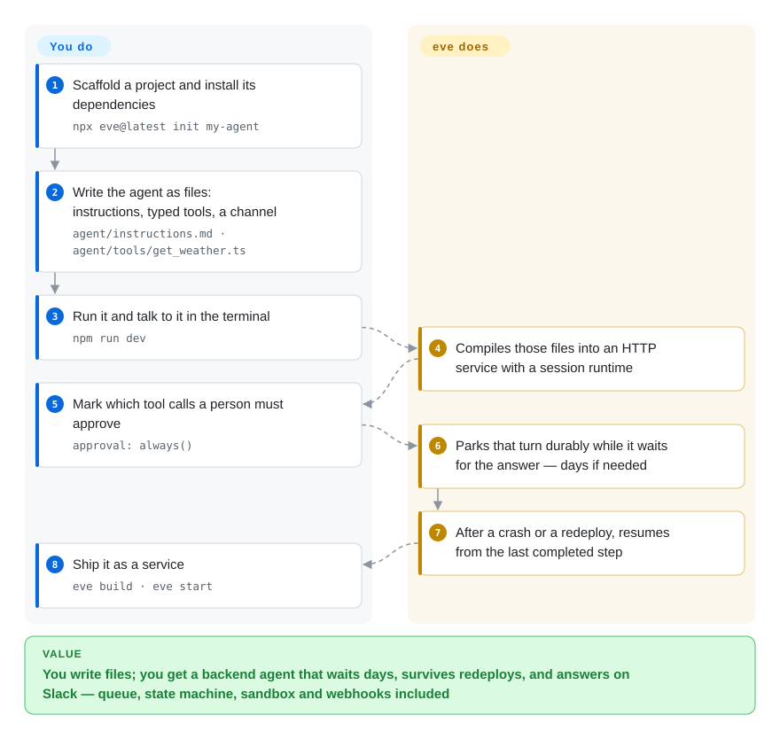

# eve

Vercel's filesystem-first framework for durable backend agents: you declare the agent as files, and it runs each session as a checkpointed workflow with its own sandbox and message channels.

## When to use

You are building an agent that has to **wait**, and the wait outlives the request: a refund needs a manager's approval, an OAuth sign-in has to come back, or a long analysis has to finish before the next step. You are shipping it as a service rather than a script, so you also need an HTTP route, a stream a browser can reconnect to, and at least one chat surface — Slack, Discord, Teams, Telegram, GitHub or Linear. Doing that by hand means building a queue, a state machine, crash recovery, a sandbox, per-platform signature verification and route auth, then re-doing all of it on the next project.

Reach for eve when you want that stack as a single dependency and you are willing to author agents the way coding agents are configured: as plain files in a directory. The deciding tradeoff against the closest options in this index is **execution-level durability in TypeScript**. LangGraph, OpenAI Agents SDK and Pydantic AI give you the agent loop but not a deployable service whose session survives a process kill mid-turn; AgentScope has the sandbox-and-approvals story but is Python and does not make the session itself a resumable workflow. What you pay is a public-beta foundation and Vercel-shaped defaults.

## How it works

eve makes the filesystem the authoring interface: an `agent/` directory holds `instructions.md` (the always-on prompt), `tools/*.ts` (typed functions with Zod schemas), `skills/*.md`, `channels/*.ts`, and optional `subagents/` and `schedules/`. **You write those files and the code inside the tools; eve compiles them and owns everything about running them.** Each session becomes one durable workflow that checkpoints at step boundaries, so a crash, a timeout or a redeploy resumes from the last completed step and replays that step's recorded result rather than re-running the turn. Model-initiated shell and file work is proxied into a per-session sandbox that holds no credentials, while your tool code and secrets stay in the trusted app runtime. When a turn needs a person, the workflow parks at `session.waiting` — holding no compute — for seconds or days.

<!-- flow-steps:begin (generated from flows/eve.json by tools/flow_card.py — do not edit) -->

Text version of the flow

1. **You**: Scaffold a project and install its dependencies — `npx eve@latest init my-agent`
2. **You**: Write the agent as files: instructions, typed tools, a channel — `agent/instructions.md · agent/tools/get_weather.ts`
3. **You**: Run it and talk to it in the terminal — `npm run dev`
4. **eve**: Compiles those files into an HTTP service with a session runtime
5. **You**: Mark which tool calls a person must approve — `approval: always()`
6. **eve**: Parks that turn durably while it waits for the answer — days if needed
7. **eve**: After a crash or a redeploy, resumes from the last completed step
8. **You**: Ship it as a service — `eve build · eve start`

**Value**: You write files; you get a backend agent that waits days, survives redeploys, and answers on Slack — queue, state machine, sandbox and webhooks included

<!-- flow-steps:end -->

## When NOT to use

- **There is no LLM in the loop.** If what you need is durable waiting, retries and scheduling around ordinary steps, use a general durable-execution engine (Temporal-class) instead: it is stable, not tied to Node 24 or a beta protocol, and does not care about turns or model calls. eve's durability is only interesting because the wait sits *inside* an agent turn.
- **Your production runtime is pinned below Node 24.** eve declares `engines: >=24`; Node 20/22 LTS is out. Either move the runtime first or pick a framework from the comparison table whose engine floor your platform already meets — you cannot downgrade this requirement.
- **You need a compatibility promise today.** eve is 0.x public beta under Vercel's beta terms, and its own docs say the framework, APIs, documentation and behavior may change before GA. It has already shipped a full execution-model migration (old drivers import into the new runtime, with no transparent rollback) plus removals of `experimental_workflow` and `experimentalServices`. For internal tools that is fine; for anything with an external API contract, wait for 1.0 or pick a stable 1.x option.
- **Your team is Python, or your tools are Python.** The framework is TypeScript; Python only runs *as a subprocess inside the sandbox*, not as the authoring language. If the team writes Python, AgentScope, Pydantic AI or smolagents will cost you far less friction.
- **You need inbound attachments on Discord, GitHub, Twilio or Linear, or schedules inside a subagent.** The docs state that inbound file attachments "are not supported on this channel today" for those channels, and `schedules/` is root-only — a declared subagent cannot own a recurring job.
- **You assumed the defaults are safe.** Omitting `approval` on a tool behaves like `never()`, so tool calls can execute with no human review, and the responsible-use doc warns that sandbox network egress is not deny-all unless you configure it. If you cannot own approval policy, egress rules and route auth yourself, choose a framework with deny-by-default policy or bring your own gate.

## Comparison

| Alternative | In index | Our verdict | Tradeoff |
|---|---|---|---|
| [AgentScope](../agent-sdks/agentscope.md) | ✅ | Pick AgentScope when the team is Python-first and wants multi-agent message passing with sandboxed tools, permissions and tracing out of the box; pick eve when the session itself must survive a crash and resume, and Node 24 is acceptable. | Both ship sandbox plus human-in-the-loop and tracing. AgentScope is a Python multi-agent runtime without a durable session workflow; eve is TypeScript and makes durability the core primitive, but carries beta APIs and a higher runtime floor. |
| [LangGraph](../agent-sdks/langgraph.md) | ✅ | Pick LangGraph when you want to model the agent as an explicit graph whose checkpoints you control, inside a large Python ecosystem; pick eve when you want durability *and* the service surface — HTTP route, channels, sandbox — handed to you. | LangGraph's checkpointer covers persistence and interrupts in Python, but you still supply the server, the sandbox and the chat integrations. eve bundles those and trades away Python and graph-level control. |
| [OpenAI Agents SDK](../agent-sdks/openai-agents-sdk.md) | ✅ | Pick the OpenAI Agents SDK for a small, dependency-light agent loop inside an app you already run; pick eve when the agent must be its own long-lived deployment that waits days for a human and answers on chat platforms. | The SDK is minimal and unopinionated about hosting — no durable session store, no sandbox, no channels. eve is heavier and more prescriptive, and supplies exactly those three. |
| [Pydantic AI](../agent-sdks/pydantic-ai.md) | ✅ | Pick Pydantic AI when you want type-safe Python agents wired into your existing services through dependency injection; pick eve when the agent needs durable waiting and multi-channel delivery as first-class features. | Pydantic AI's strength is typed, testable agent code in the ecosystem you already have; a durable session and channel layer is up to you, which is precisely what eve ships. |
| [OpenClaw](../personal-assistants/openclaw.md) | ✅ | Pick OpenClaw when you want a personal assistant on your own devices across many messaging platforms out of the box; pick eve when you are building that product for *other people* and need multi-tenant auth, per-tenant credentials and a deployable service. | OpenClaw is a ready-made personal product — very young, no Lindy record. eve is a framework you assemble and operate: more work up front, but with multi-tenancy, durable sessions and an HTTP/session-stream surface OpenClaw does not expose. |

## Tech stack

- **Language and runtime floor:** TypeScript; published package `eve@0.63.0` (2026-09-19) declares `engines: >=24`. Repo is a pnpm workspace orchestrated by Turborepo.
- **Core libraries:** Vercel AI SDK v7 (`ai`) for the model loop; Zod v4 for tool schemas; the Workflow SDK (`@workflow/core`, `@workflow/builders`, `@workflow/world*`) at the `5.0.0-beta` line for durable execution; Nitro (`3.0.260903-beta`) as the server/host layer; OpenTelemetry plus `@vercel/otel` for tracing.
- **Surfaces:** the `eve` CLI with an interactive terminal UI; an HTTP API under `/eve/v1/`; client SDKs for React, Vue and Svelte; framework integrations for Next.js, Nuxt and SvelteKit.
- **First-party channels and connections:** channels for Slack, Discord, Telegram, Teams, Twilio, GitHub, Linear, iMessage (via Photon/Linq chat adapters) and MCP, plus custom HTTP channels; roughly 40 connections in the `eve add` registry (Stripe, Neon/Postgres-class databases, Sentry, Datadog, ClickHouse, Notion, Airtable, Shopify, …).
- **Sandbox backends:** local default, Docker, microsandbox, `just-bash`, Vercel Sandbox.
- **Swap points:** the root agent can select a different Workflow world with `defineAgent({ experimental: { workflow: { world } } })`, and sandbox backends are adapters — so the durability and compute layers are replaceable in principle, though custom worlds must match the vendored `@workflow/*` protocol.

## Dependencies

- **Node.js 24+** and a model credential. A gateway model-id string routes through Vercel AI Gateway (OIDC or `AI_GATEWAY_API_KEY`); `eve/models/openai` and `eve/models/anthropic` call providers directly with their API keys. A local ChatGPT subscription (`chatgpt()`) works in development only.
- **A Workflow "world" for durable state.** Default is local disk (`.eve/.workflow-data`); alternatives include `@workflow/world-postgres`, `@workflow/world-vercel`, or a custom world. The world must be built against the same `@workflow/* 5.0.0-beta` line — the runtime rejects incompatible protocol versions.
- **A sandbox backend** if you use the built-in `bash` / `read_file` / `write_file` tools (local, Docker, microsandbox, or Vercel Sandbox).
- **Per-channel provisioning and signing secrets** for every platform you expose, plus a real route `AuthFn` — the scaffold's `placeholderAuth()` keeps production closed until you replace it.
- **Self-hosting adds:** a process manager or container platform, TLS, persistent storage for the workflow data directory, and a reverse proxy that forwards **both** `/eve/` and `/.well-known/workflow/` without rewriting paths. Forwarding only `/eve/` lets a session start but stalls the run when the workflow callback cannot reach eve.
- **Optional:** a Vercel project (`eve link` / `eve deploy`, Vercel Workflow, Vercel Sandbox, Vercel Blob for the file memory provider), Neon/Upstash if you adopt the chat template's production mode, and Braintrust or Datadog if you want those eval/trace exporters.

## Ops difficulty

**Medium to high — noticeably higher than the one-command quick start implies.** Local development is `npx eve@latest init` plus `npm run dev`; production is a real service deployment. You must choose and persist a workflow world, choose a sandbox backend and decide its network egress policy, replace `placeholderAuth()` with a verifier your host can validate, register and secure every channel, and confirm that unauthenticated production traffic actually gets a 401. Self-hosting adds the proxy rule above — get the callback prefix wrong and runs stall silently at the first wait instead of failing loudly. You also inherit 0.x upgrade work: this project has already shipped a full execution-model migration and two `experimental*` removals in its first three months.

## Health & viability

- **Maintenance (2026-09-20):** extremely active. ~1,492 commits and a release cadence up to `eve@0.63.0` (2026-09-19) inside three months of existence, with multiple releases in a single day. 858 open issues is high, but consistent with that churn rather than dormancy.
- **Governance and bus factor:** owned and roadmap-controlled by Vercel (GitHub `Organization`), not a foundation. `CODEOWNERS` names nine people plus an `@vercel/eve:team` approval group; CI requires signed commits **and** DCO trailers. A vendor-controlled roadmap is the main governance risk — the roadmap follows Vercel's interests, not a neutral committee's.
- **Backing and Lindy:** strong backing, almost no age. The repo was created 2026-06-16, so on the Lindy prior this is a young project and a **weak long-term bet today**: ~5.3k stars in three months is a risk flag rather than social proof. Age × still-active fails on the age axis only.
- **Adoption and ecosystem:** ~5.3k stars and 572 forks as of 2026-09, but only ~20 watchers and no visible "Used by" list — the star-to-watcher ratio is anomalous and I could not verify production users. **Do not read the radar's adoption axis as eve's adoption:** it scores the npm package `eve`, and that name was first published in 2011 and carried nine releases through 2017 before this project took it over, so its measured 3,024,554 monthly downloads and 10,309 dependent repos almost certainly belong to the package's earlier life. Ecosystem is Vercel-shaped and growing fast: ~40 official connections, an `eve add` registry, four official templates, and first-party channel packages.
- **Risk flags:** public beta under Vercel beta terms with an explicit "APIs and behavior may change before GA"; durability rests on the `@workflow/* 5.0.0-beta` line; permissive security defaults (an omitted `approval` behaves like `never()`, sandbox egress is not deny-all); a full execution-model migration already shipped. Apache-2.0 with DCO and no CLA seen — no relicense history.

## Caveats (unverified)

- [未验证] I did not run eve end to end. The central claim — that a parked session resumes after a process kill or redeploy without re-running the completed step — is read from `docs/concepts/execution-model-and-durability.mdx`, not reproduced. A minimal repro (trigger from Slack, park on an approval, kill the process, approve, check that it resumes exactly once) is the test that would settle it.
- [未验证] Production adoption is unverified: GitHub shows no "Used by", and ~5.3k stars against ~20 watchers and 858 open issues is a ratio I could not explain from available sources.
- [未验证] The health radar's adoption grade is not trustworthy for this project. It measures the npm package `eve`, whose registry entry dates to 2011 and had nine releases through 2017 before this framework adopted the name; the measured ~3M monthly downloads and ~10.3k dependent repos are plausibly the earlier package's, not this project's. I could not separate the two.
- [未验证] Model ids written in the docs and templates (`openai/gpt-5.6-terra`, `openai/gpt-5.6-luna-fast`, `anthropic/claude-opus-4.8`, and the templates' Grok/Claude/GPT/Kimi names) could not be confirmed as existing; only that the documentation writes them.
- [未验证] The `## Comparison` row for a general durable-execution engine names Temporal, which is a real repository not yet indexed here. It is used only as an out-of-scope contrast in `When NOT to use`; giving it a page was out of scope for this batch, and the reason is recorded in the commit/PR summary.
- [推断] How Vercel came to control the npm package name `eve` is undocumented: the registry entry was created 2011-04-18, while the current maintainers are `rauchg`, `vercel-release-bot` and `matt.straka`, and the manifest points at this repo.
- [推断] `CONTRIBUTING.md` still lists `packages/eve-scaffold`, which does not exist in the current `packages/` tree — likely stale contributor docs.
- [推断] Whether Vercel keeps investing in eve through 1.0 cannot be read off the repository. Vercel has both maintained and wound down open-source projects, so treat the vendor commitment as a bet, not a guarantee.
- [推断] The `## Tech stack` swap-point claim (custom worlds and sandbox backends are replaceable) rests on documented interfaces; I did not exercise a non-default world or backend.
