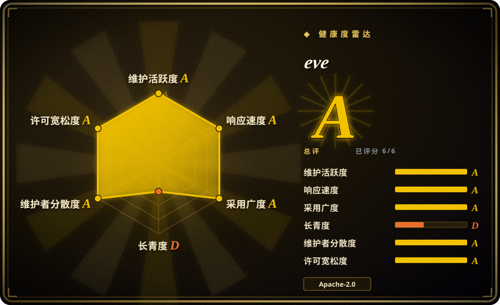
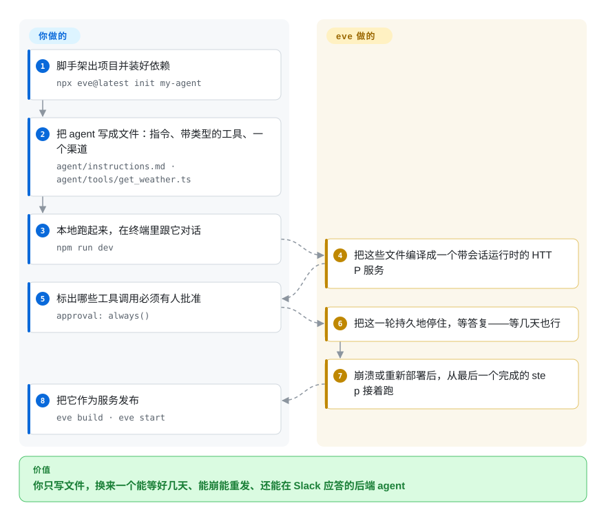

# eve

Vercel 的“文件系统优先”框架，用来跑持久化的后端 agent：你把 agent 写成文件，它把每个会话跑成一个带检查点的工作流，并自带沙箱和消息渠道。

## 何时使用

你要做的 agent 必须**等**，而且这个等待比一次请求长：退款要经理批准、OAuth 登录要等回调、一段长分析要跑完才能进下一步。你还要把它作为**服务**而不是脚本交付——因此需要 HTTP 路由、浏览器可重连的事件流，以及至少一个聊天入口（Slack、Discord、Teams、Telegram、GitHub 或 Linear）。这些手工做一遍，意味着队列、状态机、崩溃恢复、沙箱、各平台的签名校验和路由鉴权，然后下个项目再重做一遍。

当你想把这一整套收进一个依赖、并且愿意用“配置编码 agent 的那套方式”来写 agent（一个目录里的普通文件）时，就用 eve。与本文索引里最接近的几个方案相比，决定性的取舍是**用 TypeScript 换来执行级持久化**：LangGraph、OpenAI Agents SDK、Pydantic AI 给的是 agent 循环，不是一个“进程被杀掉后会话仍能在原处续跑”的可部署服务；AgentScope 有沙箱和审批，但它是 Python，而且没有把会话本身做成可恢复的工作流。你付出的代价是：公开 beta 的地基，以及 Vercel 形状的默认值。

## 怎么用起来

eve 把文件系统当作编写界面：`agent/` 目录里放 `instructions.md`（常驻提示词）、`tools/*.ts`（带 Zod schema 的类型化函数）、`skills/*.md`、`channels/*.ts`，以及可选的 `subagents/` 和 `schedules/`。**这些文件和工具里的代码由你写；编译它们、以及运行它们所需的全部机制，由 eve 负责。** 每个会话会变成一个持久工作流，在 step 边界打检查点，所以崩溃、超时或重新部署之后，它从最后一个完成的 step 接着跑，并直接重放该 step 记录下来的结果，而不是把整轮重跑。模型发起的 shell 和文件操作会被代理进一个按会话隔离、不持有任何凭据的沙箱，而你的工具代码和密钥始终留在可信的 app runtime 里。当某一轮需要人介入时，工作流会停在 `session.waiting`——不占任何算力——等几秒或几天都可以。

<!-- flow-steps:begin (generated from flows/eve.json by tools/flow_card.py — do not edit) -->

流程文字版

1. **你**：脚手架出项目并装好依赖 — `npx eve@latest init my-agent`
2. **你**：把 agent 写成文件：指令、带类型的工具、一个渠道 — `agent/instructions.md · agent/tools/get_weather.ts`
3. **你**：本地跑起来，在终端里跟它对话 — `npm run dev`
4. **eve**：把这些文件编译成一个带会话运行时的 HTTP 服务
5. **你**：标出哪些工具调用必须有人批准 — `approval: always()`
6. **eve**：把这一轮持久地停住，等答复——等几天也行
7. **eve**：崩溃或重新部署后，从最后一个完成的 step 接着跑
8. **你**：把它作为服务发布 — `eve build · eve start`

**价值**：你只写文件，换来一个能等好几天、能崩能重发、还能在 Slack 应答的后端 agent

<!-- flow-steps:end -->

## 何时不用

- **循环里没有 LLM。** 如果你要的只是普通步骤之上的持久等待、重试和排程，请改用通用的持久执行引擎（Temporal 一类）：它更稳定，不绑定 Node 24，也不绑定 beta 协议，而且根本不关心什么 turn 和模型调用。eve 的持久化只有在“等待发生在 agent 的一轮对话中间”时才有意义。
- **你的生产运行时被钉在 Node 24 以下。** eve 声明 `engines: >=24`，Node 20/22 LTS 不在支持范围。要么先把运行时升上去，要么从横向对比表里挑一个引擎下限已被你平台满足的方案——这个要求降不下来。
- **你今天就需要兼容性承诺。** eve 是按 Vercel beta 条款发布的 0.x 公开 beta，官方文档明说框架、API、文档和行为在 GA 之前都可能变。它已经交付过一次完整的执行模型迁移（旧 driver 的会话要导入新运行时，而且不支持透明回滚），并移除过 `experimental_workflow` 和 `experimentalServices`。内部工具无所谓；只要涉及对外 API 契约，就等 1.0，或选一个稳定的 1.x 方案。
- **你的团队是 Python，或你的工具是 Python。** 框架本身是 TypeScript，Python 只能**作为沙箱里的子进程**运行，不能当编写语言。团队写 Python 的话，AgentScope、Pydantic AI、smolagents 的摩擦会小得多。
- **你需要 Discord、GitHub、Twilio、Linear 的入站附件，或子 agent 里的排程。** 官方文档写明这些渠道的入站附件“today”暂不支持，而 `schedules/` 只支持根 agent——被声明的子 agent 不能拥有自己的定时任务。
- **你默认它开箱就是安全的。** 工具上省略 `approval` 等价于 `never()`，也就是说工具调用可以在无人复核的情况下执行；官方负责使用文档也提醒，沙箱的网络出站默认不是 deny-all。如果你无法自己承担审批策略、出站规则和路由鉴权，请选择默认拒绝策略的框架，或自己加一道闸门。

## 横向对比

| 替代品 | 是否收录 | 我们的评价 | 取舍 |
|---|---|---|---|
| [AgentScope](../agent-sdks/agentscope.zh.md) | ✅ | 团队以 Python 为主、想要开箱的多智能体消息传递加沙箱工具、权限和 tracing 时，选 AgentScope；当“会话本身必须能崩溃后续跑”、且可以接受 Node 24 时，选 eve。 | 两者都提供沙箱、人工介入和 tracing。AgentScope 是 Python 多智能体运行时，没有持久会话工作流；eve 是 TypeScript，把持久化当核心原语，代价是 beta API 和更高的运行时门槛。 |
| [LangGraph](../agent-sdks/langgraph.zh.md) | ✅ | 想把 agent 建模成一张检查点由你掌控的显式图、并且身处庞大 Python 生态时，选 LangGraph；想让持久化和服务面（HTTP 路由、渠道、沙箱）一并交给你时，选 eve。 | LangGraph 的 checkpointer 在 Python 里覆盖了持久化和中断，但服务器、沙箱、聊天集成都得你自己补。eve 把这些打包好，换来的是放弃 Python 和图层面的控制力。 |
| [OpenAI Agents SDK](../agent-sdks/openai-agents-sdk.zh.md) | ✅ | 想在已有应用里塞一个轻量、依赖极少的 agent 循环时，选 OpenAI Agents SDK；当 agent 必须是独立的长生命周期部署、要等上几天并能在聊天平台上应答时，选 eve。 | 该 SDK 极简、对托管方式不表态——没有持久会话存储、没有沙箱、没有渠道。eve 更重、更强制，但它提供的正是这三样。 |
| [Pydantic AI](../agent-sdks/pydantic-ai.zh.md) | ✅ | 想要类型安全的 Python agent，并通过依赖注入接进现有服务时，选 Pydantic AI；当 agent 需要把持久等待和多渠道投递做成一等能力时，选 eve。 | Pydantic AI 的长处是在你已有的生态里写出有类型、可测试的 agent 代码；持久会话和渠道层得你自己做，而这恰好是 eve 自带的部分。 |
| [OpenClaw](../personal-assistants/openclaw.zh.md) | ✅ | 想在自己设备上开箱获得一个横跨多消息平台的个人助手时，选 OpenClaw；当你是在**为别人**做这个产品、需要多租户鉴权、按租户隔离的凭据和可部署服务时，选 eve。 | OpenClaw 是现成的个人产品——极其年轻，没有 Lindy 记录。eve 是需要你自己装配和运维的框架：前期更费工，但具备多租户、持久会话以及 OpenClaw 不暴露的 HTTP／会话流接口。 |

## 技术栈

- **语言与运行时下限：** TypeScript；已发布包 `eve@0.63.0`（2026-09-19）声明 `engines: >=24`。仓库是 pnpm workspace，用 Turborepo 编排。
- **核心库：** 模型循环用 Vercel AI SDK v7（`ai`）；工具 schema 用 Zod v4；持久执行用 Workflow SDK（`@workflow/core`、`@workflow/builders`、`@workflow/world*`，处于 `5.0.0-beta` 线）；服务／宿主层用 Nitro（`3.0.260903-beta`）；tracing 用 OpenTelemetry 加 `@vercel/otel`。
- **对外形态：** `eve` CLI 及交互式终端 UI；`/eve/v1/` 下的 HTTP API；React、Vue、Svelte 客户端 SDK；Next.js、Nuxt、SvelteKit 框架集成。
- **官方渠道与集成：** Slack、Discord、Telegram、Teams、Twilio、GitHub、Linear、iMessage（经 Photon／Linq chat adapter）和 MCP 的 channel，外加自定义 HTTP channel；`eve add` registry 里约 40 个 connection（Stripe、Neon／Postgres 类数据库、Sentry、Datadog、ClickHouse、Notion、Airtable、Shopify 等）。
- **沙箱后端：** 本地默认、Docker、microsandbox、`just-bash`、Vercel Sandbox。
- **可替换点：** 根 agent 可用 `defineAgent({ experimental: { workflow: { world } } })` 选择不同的 Workflow world，沙箱后端也是适配器——理论上持久层和算力层可替换，但自定义 world 必须匹配它 vendored 的 `@workflow/*` 协议。

## 依赖

- **Node.js 24+** 和一个模型凭据。网关模型 id 字符串走 Vercel AI Gateway（OIDC 或 `AI_GATEWAY_API_KEY`）；`eve/models/openai` 与 `eve/models/anthropic` 用各自的 API key 直连供应商。本地 ChatGPT 订阅（`chatgpt()`）只能在开发期用。
- **一个 Workflow「world」来存持久状态。** 默认是本地磁盘（`.eve/.workflow-data`）；也可换成 `@workflow/world-postgres`、`@workflow/world-vercel` 或自定义 world。该 world 必须与同一条 `@workflow/* 5.0.0-beta` 协议线构建，否则运行时会拒绝。
- **一个沙箱后端**，用于内置的 `bash`、`read_file`、`write_file` 工具（本地、Docker、microsandbox 或 Vercel Sandbox）。
- **逐个渠道的平台配置与签名密钥**，以及真正的路由 `AuthFn`——脚手架里的 `placeholderAuth()` 会让生产环境一直关闭，直到你替换它。
- **自托管额外需要：** 进程管理器或容器平台、TLS、给 workflow 数据目录准备持久存储，以及一个把 `/eve/` 和 `/.well-known/workflow/` **两个前缀都不改写路径地**转发的反向代理。只转发 `/eve/` 时，会话能起来，但工作流回调打不回来，run 会卡住。
- **可选：** Vercel 项目（`eve link`／`eve deploy`、Vercel Workflow、Vercel Sandbox、file memory provider 用的 Vercel Blob）；采用 chat template 生产模式时的 Neon／Upstash；想要对应 eval／trace 导出器时的 Braintrust 或 Datadog。

## 运维难度

**中等偏高——比它“一条命令跑起来”的快速开始给人的印象高不少。** 本地开发就是 `npx eve@latest init` 加 `npm run dev`；生产则是一次真实的服务部署。你得选并持久化一个 workflow world，选沙箱后端并决定它的网络出站策略，把 `placeholderAuth()` 换成你自己宿主能校验的验证器，给每个渠道注册并配好密钥，并确认生产环境的未认证请求确实返回 401。自托管还要加上上面那条代理规则——回调前缀弄错的话，run 不会大声报错，而是在第一个等待点静默卡住。你还会继承 0.x 的升级工作量：这个项目在头三个月里已经交付了一次完整的执行模型迁移和两次 `experimental*` 移除。

## 健康度与可持续性

- **维护（2026-09-20）：** 极度活跃。项目存在三个月内约 1,492 次提交，发布节奏一路到 `eve@0.63.0`（2026-09-19），单日可发多个版本。858 个 open issue 数量偏高，但与这种变动强度相符，而非停滞。
- **治理与 bus factor：** 归 Vercel 所有、路线图由 Vercel 控制（GitHub 上是 `Organization`），不是基金会。`CODEOWNERS` 列了九个人，另有一个 `@vercel/eve:team` 审批组；CI 同时要求签名提交**和** DCO 尾注。厂商控制路线图是主要治理风险——路线图服务的是 Vercel 的利益，不是中立委员会。
- **背书与 Lindy：** 背书强，但几乎没有历史。仓库创建于 2026-06-16，按 Lindy 先验，**今天押长期是弱注**：三个月约 5.3k stars 是风险信号，而不是社保证据。age × still-active 只在 age 这一轴上失分。
- **采用与生态：** 截至 2026-09 约 5.3k stars、572 forks，但 watchers 仅约 20 个，也没有可见的 “Used by” 列表——star 与 watcher 的比例异常，我无法核实其生产用户。**不要把雷达图的采用轴读成 eve 的采用量：** 它打分的对象是 npm 包 `eve`，而这个包名 2011 年就首次发布、在 2017 年前已有九次发布，之后才被本项目接手，所以测得的 3,024,554 次月下载与 10,309 个依赖仓库很可能属于这个包的上一段生命。生态是 Vercel 形状且在快速扩张：约 40 个官方 connection、一个 `eve add` registry、四个官方模板，以及一方维护的 channel 包。
- **风险信号：** 按 Vercel beta 条款发布的公开 beta，官方明确写着“API 与行为在 GA 前可能变化”；持久化建立在 `@workflow/* 5.0.0-beta` 线上；安全默认值偏宽松（省略 `approval` 等价于 `never()`，沙箱出站不是 deny-all）；已经交付过一次完整的执行模型迁移。Apache-2.0，要求 DCO，未见 CLA——没有重新许可的历史。

## 存疑（未验证）

- [未验证] 我没有端到端跑过 eve。核心声称——被 park 的会话在进程被杀或重新部署后能从原处续跑、且不重跑已完成的 step——是读 `docs/concepts/execution-model-and-durability.mdx` 得来的，不是复现出来的。要坐实它，最小复现是：从 Slack 触发、在审批处停住、杀掉进程、批准，然后检查它只续跑一次。
- [未验证] 生产采用情况未经核实：GitHub 没有 “Used by”，而约 5.3k stars 对应约 20 watchers、858 个 open issue，这个比例我无法从可得的来源解释。
- [未验证] 健康度雷达的采用轴对这个项目不可信。它测量的是 npm 包 `eve`，而该 registry 条目始于 2011 年、在 2017 年前已有九次发布，之后才被本框架接手；测得的约 300 万月下载与约 1.03 万依赖仓库很可能是上一段生命的，不是本项目的。我无法把两者分开。
- [未验证] 文档与模板里写的模型 id（`openai/gpt-5.6-terra`、`openai/gpt-5.6-luna-fast`、`anthropic/claude-opus-4.8`，以及模板里的 Grok/Claude/GPT/Kimi 名称）无法确认存在，只能确认文档如此书写。
- [未验证] `## 横向对比` 中那条“通用持久执行引擎”指向 Temporal，它是真实仓库、但本文索引尚未收录。它只作为 `何时不用` 里一个越界对照出现；在这一批里为它单独建页超出范围，原因记录在 commit/PR 摘要里。
- [推断] Vercel 如何取得 npm 包名 `eve` 没有文档记录：registry 条目创建于 2011-04-18，而当前 maintainers 是 `rauchg`、`vercel-release-bot`、`matt.straka`，manifest 指向本仓库。
- [推断] `CONTRIBUTING.md` 仍在提 `packages/eve-scaffold`，而当前 `packages/` 目录里并不存在它——大概是过时的贡献者文档。
- [推断] Vercel 会不会一路投入到 1.0，无法从仓库读出。Vercel 既有长期维护的开源项目，也有被终止的，因此把厂商承诺当成一个赌注而非担保。
- [推断] `## 技术栈` 里关于“可替换点”的说法（自定义 world 与沙箱后端可替换）依据的是文档化的接口；我没有实际跑过非默认的 world 或后端。
