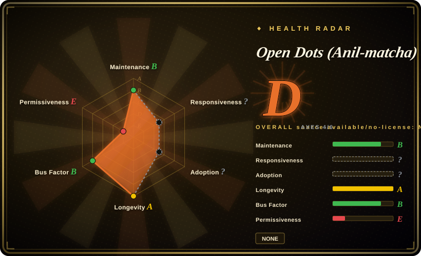
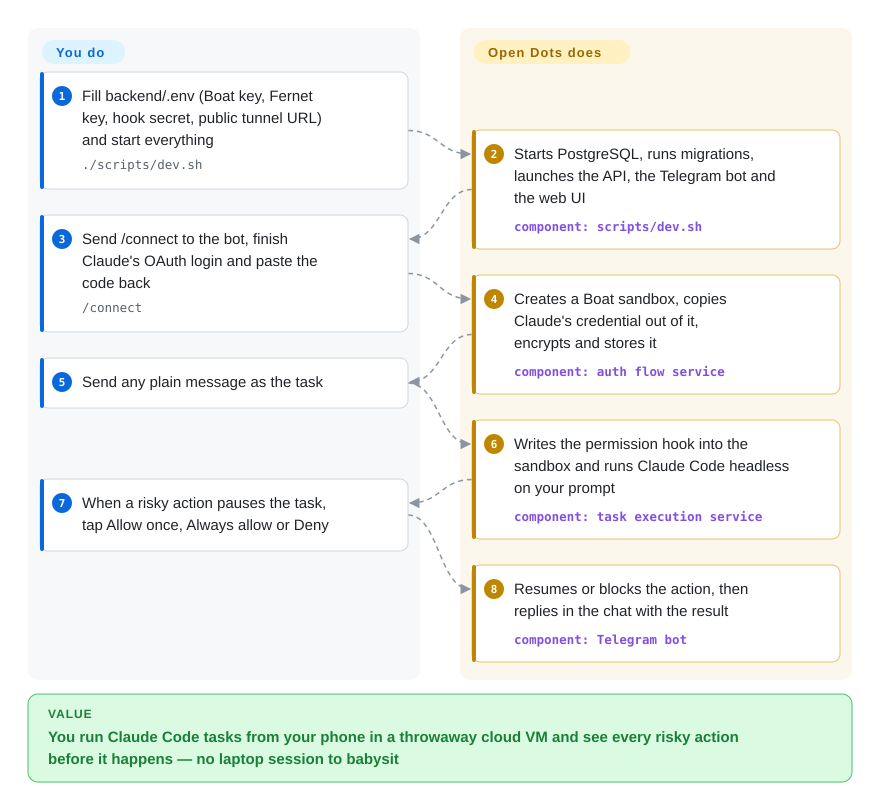

# Open Dots (Anil-matcha)

You want to tell Claude Code to do something while you are away from your laptop — "fix the failing test and push" from your phone — but Claude Code lives in a terminal you have to sit at, and leaving it on auto-approve means nobody sees the `git push` before it happens. Open Dots is a small self-run backend that takes the message from a Telegram bot or a web page, runs `claude -p` inside a rented cloud VM, and pauses every risky action until you tap Allow or Deny.

## When to use

You are a developer who already pays for Claude and has a few small chores you would like to fire off from a chat app: "regenerate the changelog", "open a PR that bumps this dependency", "every weekday at 08:00 summarise yesterday's issues". Running Claude Code on your own machine means the laptop must stay awake, and the chat bridges you found either run the agent on that same machine or skip permission checks. You clone Open Dots, fill in a Boat API key (a paid hosted VM service), an encryption key, a shared hook secret and an ngrok URL, run `./scripts/dev.sh`, then send `/connect` to your bot. From then on a plain Telegram message becomes a Claude Code run in your own disposable VM, and when Claude wants to write a file or run `git push`, the bot posts **Allow once / Always allow / Deny** buttons — with `git` commands split by verb, so "always allow commit" does not also allow push.

Pick it over [CloudCLI](../../../agent-tooling/supervision-surfaces/claudecodeui.md) when you want the agent to run off your machine in a throwaway VM rather than steer sessions on your own box; over [OpenAgentCore](openagentcore.md) when you want a finished chat-and-approval front end for one person rather than an API to build a product on. Treat it as a prototype you read and adapt, not a service you hand to other people: the code is about ten days old and the API has no authentication (see When NOT to use).

## How it works

Three processes run on your side: a FastAPI backend with PostgreSQL, a Telegram bot, and a Next.js web page; both front ends call the same REST API. When you connect, the backend asks Boat — a commercial service that rents Linux VMs by the second — for a sandbox, runs `claude auth login` inside it, and after you paste the OAuth code back, copies Claude's credential file out of the VM, encrypts it (Fernet, a symmetric-encryption recipe from the Python `cryptography` library) and stores it in PostgreSQL. Each task then writes a `.claude/settings.json` into the VM that registers an HTTP **PermissionRequest hook** — Claude Code's built-in "ask before acting" callback — pointing at your backend's public URL, and runs `claude -p "<your prompt>" --output-format json`. Every risky tool call arrives at your backend first; a per-user rule table answers it, or the task pauses until you answer in Telegram or the web page (110 seconds, then deny). Schedules are cron rows that three 30-second loops in the API process turn into tasks and report back over Telegram. You supply the accounts (Boat, Claude, optionally GitHub and Telegram), a public tunnel and the host; the project supplies the plumbing between chat, VM, Claude Code and the approval buttons — like a doorman who relays your instructions to a contractor in a rented workshop and phones you before any wall comes down.

<!-- flow-steps:begin (generated from flows/open-dots.json by tools/flow_card.py — do not edit) -->

Text version of the flow

1. **You**: Fill backend/.env (Boat key, Fernet key, hook secret, public tunnel URL) and start everything — `./scripts/dev.sh`
2. **Open Dots (Anil-matcha)**: Starts PostgreSQL, runs migrations, launches the API, the Telegram bot and the web UI — component: `scripts/dev.sh`
3. **You**: Send /connect to the bot, finish Claude's OAuth login and paste the code back — `/connect`
4. **Open Dots (Anil-matcha)**: Creates a Boat sandbox, copies Claude's credential out of it, encrypts and stores it — component: `auth flow service`
5. **You**: Send any plain message as the task
6. **Open Dots (Anil-matcha)**: Writes the permission hook into the sandbox and runs Claude Code headless on your prompt — component: `task execution service`
7. **You**: When a risky action pauses the task, tap Allow once, Always allow or Deny
8. **Open Dots (Anil-matcha)**: Resumes or blocks the action, then replies in the chat with the result — component: `Telegram bot`

**Value**: You run Claude Code tasks from your phone in a throwaway cloud VM and see every risky action before it happens — no laptop session to babysit

<!-- flow-steps:end -->

## When NOT to use

- **Anyone but you can reach it.** The REST API has no authentication: `GET /api/v1/tasks?user_id=…` lists any user's tasks, `POST /api/v1/tasks` takes `user_id` and `box_id` from the request body, and `POST /api/v1/permissions/ask/{ask_id}/answer` approves a pending action without a credential (`backend/app/routers/task.py`, `permission.py`). The README admits the web UI "has no real authentication". Yet the permission hook requires a public URL, so the usual ngrok tunnel publishes the whole API. The Telegram bot has no user allowlist either — anyone who finds its username can `/connect` and spin up VMs billed to your Boat account. For governed multi-user agents use [OpenBot](openbot.md); for a remote cockpit over your own Claude Code sessions behind a private network, use [CloudCLI](../../../agent-tooling/supervision-surfaces/claudecodeui.md).
- **You want the "open alternative to OpenAI Dots / Meta Muse / Grok Bot" the description promises.** The current code runs one thing: `claude -p` tasks (`PROVIDER_COMMANDS` holds only `claude`). There is no general chat, no browser computer, no connectors beyond GitHub login, no model choice. The chat workspace with a Docker/Playwright computer that the GitHub description still describes was replaced on 2026-10-07. For a self-hosted personal agent with a persistent browser computer use [Rakazo](../personal-assistants/rakazo.md); for an assistant across many messaging apps use [OpenClaw](../personal-assistants/openclaw.md). Two other open projects pitched the same way — CopilotKit's OpenDots and OpenMausBot — are separate repos, not this one.
- **You want everything on your own hardware.** "Self-hosted" here means the control plane: execution happens only on Boat's hosted VMs (`boat-sdk` is hard-wired in `box_operations.py`, `BOAT_API_KEY` is required; boat.dev advertises a 7-day trial, then from $20/month, checked 2026-10-08). Sandboxes are never stopped or deleted automatically (README, Known limitations), so testing leaks cost. If the VMs must be yours, use [OpenAgentCore](openagentcore.md) (Docker or microsandbox nodes) or [Rakazo](../personal-assistants/rakazo.md) (Docker, E2B, Daytona or Box).
- **You need another agent, an API key, or long jobs.** Only Claude Code is wired, logged in through its OAuth flow; the credential file is copied into your database, and whether your Claude plan's terms allow driving it from a hosted service is yours to check [未验证]. Each task command times out at 600 seconds. For Codex or other harnesses on your own infrastructure use [OpenAgentCore](openagentcore.md); for a Telegram bridge to Claude Code on a machine you already own, overwirehq/claude-code-telegram (not indexed).
- **You need a license to build on.** The current tree has no LICENSE file, and GitHub detects none. The MIT files that existed belonged to code that has since been replaced (privateGPT © 2023 SamurAIGPT; Open Dots v1 © 2026 Anil-matcha). Until a license is committed, forking for redistribution or commercial use rests on a claim in the description alone. Apache-2.0 [Rakazo](../personal-assistants/rakazo.md) or MIT [OpenAgentCore](openagentcore.md) cover similar ground with a license file.
- **You need a stable codebase or a trustworthy popularity signal.** The default branch has been replaced by unrelated histories at least twice (see Health & viability), and the 5.5k stars mostly predate the current code. Pin a commit SHA and vendor it, or wait for releases.

## Comparison

| Alternative | In index | Our verdict | Tradeoff |
| --- | --- | --- | --- |
| [OpenAgentCore](openagentcore.md) | ✅ | If you are building a product that hands work to Claude Code, Codex or MiniMax Code in sandboxes you control, pick OpenAgentCore; pick Open Dots only for a personal Telegram-plus-approval front end you will patch yourself. | OpenAgentCore is an MIT service with durable sessions, several harnesses and your own nodes, but no chat front end or approval buttons; Open Dots has those, on Boat only, with no API auth and no license file. |
| [CloudCLI (Claude Code UI)](../../../agent-tooling/supervision-surfaces/claudecodeui.md) | ✅ | When the agent should keep running on your own machine and you want to steer it from a phone browser, pick CloudCLI; pick Open Dots when each task should run in a disposable cloud VM with a per-action approval gate. | CloudCLI is a mature AGPL cockpit with files, terminal and git panes over your local sessions; Open Dots is a ten-day-old prototype whose only view is task result plus approve/deny. |
| [Rakazo](../personal-assistants/rakazo.md) | ✅ | For the "self-hosted Grok Bot / Dots" use case — a persistent bot with a real browser computer, routines and any model — pick Rakazo; Open Dots does not do browsing or general assistant work. | Rakazo is Apache-2.0 with several sandbox backends and heavy ops; Open Dots is lighter to start but tied to Claude Code and Boat. |
| [OpenClaw](../personal-assistants/openclaw.md) | ✅ | When you want one assistant answering across Telegram, WhatsApp, Slack and more on your own devices, pick OpenClaw; pick Open Dots only if the job is specifically "run Claude Code tasks in a cloud VM and ask me first". | OpenClaw is a huge, fast-moving MIT ecosystem with channels and skills; Open Dots is a single-purpose relay with one channel plus a web page. |
| overwirehq/claude-code-telegram | not indexed | When you want to chat with Claude Code on your own machine from Telegram with session persistence, try this bridge; pick Open Dots when the run must happen in a cloud VM, gated by per-action approval. | A year older and focused on one workstation (not added in this tab batch); Open Dots adds scheduled tasks, the web page and Boat VMs, but no access control. |

## Tech stack

- **Python ≥ 3.14** backend (`backend/pyproject.toml`): FastAPI, SQLAlchemy 2 async with asyncpg and psycopg2, Alembic (9 migrations), pydantic-settings, `cryptography` (Fernet with key rotation), structlog, APScheduler, `python-telegram-bot` 22, `boat-sdk` (an OpenAPI-generated client, first published 2026-09-16).
- **PostgreSQL 17** (Docker Compose file still named `vadoo-grok`) for users' sandboxes, encrypted credentials, tasks, permission rules/asks and schedules.
- **TypeScript** web page: Next.js 16.3.5, React 19.2, Tailwind 4 — one page with Connect Telegram / Claude / GitHub cards and a task composer.
- **Inside each VM**: the Claude Code CLI (`claude auth login`, `claude -p … --output-format json --session-id/--resume`) and optionally `gh auth login` for GitHub device flow.
- Size (2026-10-08): ~3.8k lines of backend Python, ~1.3k lines of TS/TSX, ~1.3k lines of pytest across 14 files.

## Dependencies

- `uv`, Node.js 18+ and npm, Docker (for PostgreSQL), Bash for `scripts/dev.sh`.
- A **Boat** account and API key — mandatory; plus `BOAT_ORG_ID` if your key's personal account also belongs to a paid org, or sandbox creation returns `402 Payment Required` (README).
- A **public URL** that the VM can reach (ngrok or similar) set as `PERMISSION_HOOK_BASE_URL`; without it any task that triggers a risky action hangs until the prompt times out.
- `TOKEN_ENCRYPTION_KEYS` (Fernet key) and `HOOK_TOKEN` (shared secret) you generate.
- A Claude account that can complete `claude auth login`; optionally a Telegram bot token from @BotFather and a GitHub account.

## Ops difficulty

**Low to start, high to run safely.** `./scripts/dev.sh` brings up PostgreSQL, migrations, the API, the bot and the web page in one command, so a local trial takes minutes once the accounts exist. Everything after that is on you: putting authentication in front of the API before any tunnel, restricting who may talk to the bot, deleting Boat VMs that are never cleaned up, rotating the Fernet key, replacing the default `vadoo` database password, and running Python 3.14. Debugging a failed task crosses your backend, the tunnel, Boat's API and the Claude Code CLI inside the VM. There are no releases, so upgrading means pulling `main`, which has been replaced wholesale before.

## Health & viability

- **Provenance (decides the page, checked 2026-10-08)**: GitHub repo id 645381450 was created on 2023-05-25 as **SamurAIGPT/privateGPT**, a local document-chat app (Flask + Next.js + GPT4All). `SamurAIGPT/privateGPT` and `SamurAIGPT/Generative-Media-Skills` both still redirect here. By 2026-04 the default branch held an unrelated history, a MuAPI-powered "Generative Media Skills" pack (that content now lives in a separate, new `Anil-matcha/Generative-Media-Skills`, created 2026-09-29). Around 2026-09-29 the "Open Dots" v1 chat workspace was stacked on top of that pack (MIT, © 2026 Anil-matcha). On **2026-10-07 04:38 UTC** `main` was force-pushed to another history with no common ancestor: the current Claude Code task runner, whose first commit is "initial commit for core agent engine" (2026-09-29). Issues #99–#118 and merged PRs #120–#130 describe code that is no longer on `main`.
- **What the stars measure**: 5,520 stars and 686 forks; 299 of the forks were created in 2023–2025, the privateGPT era, and 188 since 2026-09-01. The stargazer list is not served by the API, so the star split cannot be measured. It is safest to read the count as belonging mostly to earlier projects, not to this code. The same owner's `awesome-muse-connectors` (created 2024-04, 1.3k stars) now describes a 2026 product, which looks like the same pattern [推断].
- **Substance**: a real but small prototype — ~3.8k lines of backend Python, ~1.3k of web code, 14 test files, 28 commits. The core engine is by one collaborator (`inderpreet001`, 7 commits); an outside contributor (`rudycelekli`) landed eight focused bug-fix PRs on 2026-10-07 (cron weekday semantics, credential escaping, sandbox recovery, permission deadlines), merged the same morning. The owner's own commits are merges and README positioning.
- **Maintenance & governance**: active this week, single-owner User account, no releases or tags, no CONTRIBUTING/SECURITY files. The roadmap is whatever the owner points the repo at next — it has changed purpose three times in five months.
- **Lindy**: none. Code age is ~9 days; the 2023 creation date belongs to a different program. The radar's longevity axis is computed from repository age and is therefore inflated for this page — discount it.
- **Risk flags**: no license file; the description advertises features that are not in the current code; no API auth; mandatory paid third-party VM provider; Claude subscription credentials stored by a third-party app.

## Caveats (unverified)

- [未验证] Runtime behaviour: this page is from the README, `backend/` and `frontend/` source, manifests, `.env.example`, git history, PR/issue lists and the GitHub API; I did not run the stack, create a Boat VM or complete a Claude login.
- [未验证] Whether Anthropic's terms for Claude subscriptions permit logging in Claude Code inside a third-party hosted VM and storing that credential in another service's database — not checked against the current terms.
- [推断] The star count is mostly inherited from the privateGPT (2023) and Generative Media Skills (2026) eras: inferred from the redirects and fork creation dates; the stargazer endpoint returned 404, so no star timeline was available.
- [推断] `awesome-muse-connectors` following the same repurposing pattern is inferred from its 2024-04 creation date versus a description about a 2026 product; its history was not examined.
- [推断] The `vadoo-grok` names in the Compose file and default database credentials suggest the engine began as an internal project at the owner's company; not confirmed.
- [未验证] Boat pricing ("7-day free trial, then from $20/mo") is from boat.dev's page metadata on 2026-10-08; per-second VM rates and limits were not checked.
- [未验证] Whether overwirehq/claude-code-telegram (moved from RichardAtCT) has the session persistence and project access its description claims; only its metadata was read (license field null in the API).
