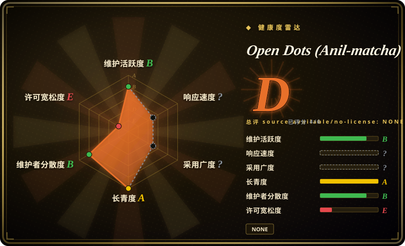
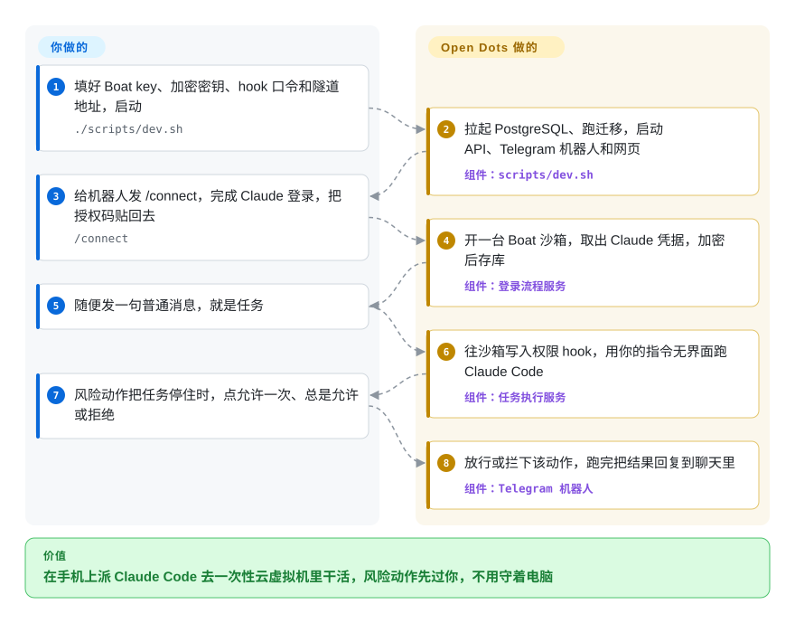

# Open Dots (Anil-matcha)

你人不在电脑前，想让 Claude Code 干点活——在手机上说一句“把挂掉的测试修好再 push”——可 Claude Code 住在终端里，得有人守着；要是开成全自动放行，`git push` 发出去之前谁也看不到。Open Dots 是一个自己跑的小后端：从 Telegram 机器人或网页收下这句话，在一台租来的云端虚拟机里跑 `claude -p`，每遇到有风险的动作就停下来，等你点“允许”或“拒绝”。

## 何时使用

你是个已经在给 Claude 付费的开发者，手头有些小活想在聊天软件里随手派出去：“重新生成 changelog”“开个 PR 把这个依赖升一下”“每个工作日早上 8 点汇总昨天的 issue”。在自己电脑上跑 Claude Code，电脑就得一直开着；你找到的聊天桥接要么也在这台电脑上跑 agent，要么干脆跳过权限确认。你把 Open Dots 克隆下来，填上 Boat 的 API key（一个按量收费的云虚拟机服务）、一把加密密钥、一个共享的 hook 口令和一个 ngrok 地址，跑 `./scripts/dev.sh`，再给机器人发 `/connect`。之后你在 Telegram 里发的每句普通消息，都会变成在你自己那台一次性虚拟机里的一次 Claude Code 运行；Claude 想写文件或跑 `git push` 时，机器人会弹出 **Allow once / Always allow / Deny** 三个按钮——而且 `git` 命令按子命令分开记规则，“一直允许 commit”不会顺带允许 push。

和 [CloudCLI](../../../agent-tooling/supervision-surfaces/claudecodeui.zh.md) 比，选它是因为你想让 agent 离开你的电脑、在用完即扔的虚拟机里跑，而不是遥控自己机器上的会话；和 [OpenAgentCore](openagentcore.zh.md) 比，选它是因为你要的是给一个人用的现成“聊天 + 审批”前端，而不是拿来搭产品的 API。把它当成一个读懂后自己改的原型，别当成可以交给别人用的服务：代码只有十来天，API 也没有任何鉴权（见“何时不用”）。

## 怎么用起来

在你这边跑三个进程：一个带 PostgreSQL 的 FastAPI 后端、一个 Telegram 机器人、一个 Next.js 网页；两个前端调的是同一套 REST API。你连接账号时，后端向 Boat（一家按秒出租 Linux 虚拟机的商业服务）要一台沙箱，在里面执行 `claude auth login`；你把 OAuth 授权码贴回来以后，它把 Claude 的凭据文件从虚拟机里拷出来，用 Fernet（Python `cryptography` 库里的一种对称加密方案）加密后存进 PostgreSQL。之后每个任务都会先往虚拟机里写一份 `.claude/settings.json`，注册一个 HTTP 形式的 **PermissionRequest hook**——Claude Code 自带的“动手前先问一声”回调——指向你后端的公网地址，然后执行 `claude -p "<你的指令>" --output-format json`。每个有风险的工具调用都会先打到你的后端：按用户的规则表直接答复，或者让任务暂停，等你在 Telegram 或网页上回答（110 秒没人理就按拒绝处理）。定时任务就是数据库里的 cron 行，API 进程里三个每 30 秒转一圈的循环把它们变成任务，再通过 Telegram 回报结果。账号（Boat、Claude，可选 GitHub 和 Telegram）、公网隧道和主机由你出；项目负责把聊天、虚拟机、Claude Code 和审批按钮串起来——像个门房，把你的吩咐转给租来工坊里的施工队，拆墙之前先给你打电话。

<!-- flow-steps:begin (generated from flows/open-dots.json by tools/flow_card.py — do not edit) -->

流程文字版

1. **你**：填好 Boat key、加密密钥、hook 口令和隧道地址，启动 — `./scripts/dev.sh`
2. **Open Dots (Anil-matcha)**：拉起 PostgreSQL、跑迁移，启动 API、Telegram 机器人和网页 — 组件：`scripts/dev.sh`
3. **你**：给机器人发 /connect，完成 Claude 登录，把授权码贴回去 — `/connect`
4. **Open Dots (Anil-matcha)**：开一台 Boat 沙箱，取出 Claude 凭据，加密后存库 — 组件：`登录流程服务`
5. **你**：随便发一句普通消息，就是任务
6. **Open Dots (Anil-matcha)**：往沙箱写入权限 hook，用你的指令无界面跑 Claude Code — 组件：`任务执行服务`
7. **你**：风险动作把任务停住时，点允许一次、总是允许或拒绝
8. **Open Dots (Anil-matcha)**：放行或拦下该动作，跑完把结果回复到聊天里 — 组件：`Telegram 机器人`

**价值**：在手机上派 Claude Code 去一次性云虚拟机里干活，风险动作先过你，不用守着电脑

<!-- flow-steps:end -->

## 何时不用

- **除了你还有别人能连到它。** REST API 没有鉴权：`GET /api/v1/tasks?user_id=…` 能列出任意用户的任务，`POST /api/v1/tasks` 的 `user_id` 和 `box_id` 直接取自请求体，`POST /api/v1/permissions/ask/{ask_id}/answer` 不带任何凭据就能批准一个挂起的动作（见 `backend/app/routers/task.py`、`permission.py`）。README 自己也承认网页“没有真正的鉴权”。可权限 hook 偏偏要求公网地址，于是常用的 ngrok 隧道会把整套 API 都暴露出去。Telegram 机器人也没有用户白名单——谁知道它的用户名，谁就能 `/connect`，开出记在你 Boat 账上的虚拟机。要给多人用、带治理的 agent，用 [OpenBot](openbot.zh.md)；只想在私有网络里远程操作自己的 Claude Code 会话，用 [CloudCLI](../../../agent-tooling/supervision-surfaces/claudecodeui.zh.md)。
- **你要的是简介里说的“OpenAI Dots / Meta Muse / Grok Bot 的开源替代”。** 现在的代码只干一件事：跑 `claude -p` 任务（`PROVIDER_COMMANDS` 里只有 `claude`）。没有通用聊天，没有浏览器“电脑”，除了 GitHub 登录没有别的连接器，也不能选模型。GitHub 简介里还在描述的那个带 Docker/Playwright 电脑的聊天工作台，已在 2026-10-07 被整体替换。想要自托管、带持久浏览器电脑的个人 agent，用 [Rakazo](../personal-assistants/rakazo.zh.md)；想要一个横跨多个聊天软件的助手，用 [OpenClaw](../personal-assistants/openclaw.zh.md)。另外两个同样这么宣传的开源项目——CopilotKit 的 OpenDots 和 OpenMausBot——是别的仓库，不是这一个。
- **你要求一切都跑在自己的硬件上。** 这里的“自托管”只指控制面：执行只能在 Boat 托管的虚拟机上（`box_operations.py` 写死了 `boat-sdk`，`BOAT_API_KEY` 必填；boat.dev 标的是 7 天试用、之后每月 20 美元起，2026-10-08 查）。沙箱从不自动停止或删除（README 的已知限制），测试会一直漏钱。虚拟机必须是你自己的，就用 [OpenAgentCore](openagentcore.zh.md)（Docker 或 microsandbox 节点）或 [Rakazo](../personal-assistants/rakazo.zh.md)（Docker、E2B、Daytona 或 Box）。
- **你要别的 agent、用 API key，或者跑长任务。** 只接了 Claude Code，靠它的 OAuth 流程登录；凭据文件会被拷进你的数据库，你的 Claude 套餐条款是否允许从托管服务里这样驱动它，需要你自己去核实 [未验证]。每个任务命令 600 秒超时。要在自己的基础设施上跑 Codex 或其他 harness，用 [OpenAgentCore](openagentcore.zh.md)；只想用 Telegram 连到你已有那台机器上的 Claude Code，可以看 overwirehq/claude-code-telegram（未收录）。
- **你需要一个能放心在上面开发的许可证。** 当前代码树里没有 LICENSE 文件，GitHub 也识别不出许可证。之前存在过的 MIT 文件属于已被替换掉的代码（privateGPT © 2023 SamurAIGPT；Open Dots v1 © 2026 Anil-matcha）。在许可证真正提交之前，拿它分发或商用，依据只有简介里的一句话。覆盖相近场景、带许可证文件的有 Apache-2.0 的 [Rakazo](../personal-assistants/rakazo.zh.md) 和 MIT 的 [OpenAgentCore](openagentcore.zh.md)。
- **你需要稳定的代码库，或者能信的热度信号。** 默认分支至少两次被换成毫无关联的历史（见“健康度与可持续性”），5.5k 星大多早于现在这份代码。要用就钉住一个 commit SHA 自己 vendor，或者等它出 release。

## 横向对比

| 替代品 | 是否收录 | 我们的评价 | 取舍 |
| --- | --- | --- | --- |
| [OpenAgentCore](openagentcore.zh.md) | ✅ | 如果你在做一个把活交给 Claude Code、Codex 或 MiniMax Code 的产品，沙箱要由你掌控，选 OpenAgentCore；只有想要一个自己会去改的个人“Telegram + 审批”前端时才选 Open Dots。 | OpenAgentCore 是 MIT 的服务，有持久会话、多种 harness、自己的节点，但没有聊天前端和审批按钮；Open Dots 有这些，代价是只能用 Boat、API 无鉴权、没有许可证文件。 |
| [CloudCLI（Claude Code UI）](../../../agent-tooling/supervision-surfaces/claudecodeui.zh.md) | ✅ | 想让 agent 继续跑在自己电脑上、用手机浏览器遥控，选 CloudCLI；想让每个任务在一次性云虚拟机里跑、每个动作都要审批，选 Open Dots。 | CloudCLI 是成熟的 AGPL 控制台，能看本地会话的文件、终端和 git；Open Dots 是十来天的原型，界面只有任务结果和允许/拒绝。 |
| [Rakazo](../personal-assistants/rakazo.zh.md) | ✅ | 真要“自托管的 Grok Bot / Dots”——常驻机器人、真浏览器电脑、例行任务、任意模型——选 Rakazo；Open Dots 不能浏览网页，也不做通用助手。 | Rakazo 是 Apache-2.0，支持多种沙箱后端，运维重；Open Dots 起步轻，但绑死 Claude Code 和 Boat。 |
| [OpenClaw](../personal-assistants/openclaw.zh.md) | ✅ | 想要一个在你自己设备上、同时应答 Telegram、WhatsApp、Slack 等渠道的助手，选 OpenClaw；只有活儿恰好是“在云虚拟机里跑 Claude Code，动手前先问我”时才选 Open Dots。 | OpenClaw 是体量大、迭代快的 MIT 生态，渠道和技能都多；Open Dots 是单一用途的中转，一个聊天渠道加一个网页。 |
| overwirehq/claude-code-telegram | 未收录 | 想在 Telegram 里和自己机器上的 Claude Code 对话、保留会话，试这个桥接；要求在云虚拟机里跑、每个动作单独审批时，选 Open Dots。 | 它早一年，专注一台工作机（本批未收录）；Open Dots 多了定时任务、网页和 Boat 虚拟机，但没有访问控制。 |

## 技术栈

- **Python ≥ 3.14** 后端（`backend/pyproject.toml`）：FastAPI、SQLAlchemy 2 异步（asyncpg 与 psycopg2）、Alembic（9 个迁移）、pydantic-settings、`cryptography`（支持轮换的 Fernet）、structlog、APScheduler、`python-telegram-bot` 22、`boat-sdk`（OpenAPI 生成的客户端，2026-09-16 首次发布）。
- **PostgreSQL 17**（Docker Compose 文件里的名字仍是 `vadoo-grok`），存用户沙箱、加密凭据、任务、权限规则与待批请求、定时任务。
- **TypeScript** 网页：Next.js 16.3.5、React 19.2、Tailwind 4——一个页面，几张“连接 Telegram / Claude / GitHub”卡片加一个任务输入框。
- **每台虚拟机里**：Claude Code 命令行（`claude auth login`，`claude -p … --output-format json --session-id/--resume`），可选 `gh auth login` 走 GitHub 设备码登录。
- 体量（2026-10-08）：后端 Python 约 3.8k 行，TS/TSX 约 1.3k 行，pytest 约 1.3k 行、14 个文件。

## 依赖

- `uv`、Node.js 18+ 与 npm、Docker（跑 PostgreSQL）、Bash（跑 `scripts/dev.sh`）。
- **Boat** 账号和 API key——必需；如果 key 所属的个人账号同时在一个付费组织里，还要填 `BOAT_ORG_ID`，否则建沙箱会返回 `402 Payment Required`（README）。
- 一个虚拟机能访问到的**公网地址**（ngrok 之类），填进 `PERMISSION_HOOK_BASE_URL`；没有它，任何触发风险动作的任务都会一直挂到审批超时。
- 你自己生成的 `TOKEN_ENCRYPTION_KEYS`（Fernet 密钥）和 `HOOK_TOKEN`（共享口令）。
- 一个能完成 `claude auth login` 的 Claude 账号；可选的 @BotFather 机器人 token 和 GitHub 账号。

## 运维难度

**起步低，安全地跑起来高。** `./scripts/dev.sh` 一条命令拉起 PostgreSQL、迁移、API、机器人和网页，账号齐了几分钟就能本地试。之后全靠你自己：开隧道前先给 API 加上鉴权，限制谁能和机器人说话，清理从不自动回收的 Boat 虚拟机，轮换 Fernet 密钥，换掉默认的 `vadoo` 数据库密码，以及跑 Python 3.14。排查一个失败任务要跨你的后端、隧道、Boat 的 API 和虚拟机里的 Claude Code 命令行。没有 release，升级就是拉 `main`——而 `main` 以前整个被换掉过。

## 健康度与可持续性

- **来历（决定本页结论，2026-10-08 查）**：GitHub 仓库 id 645381450 于 2023-05-25 以 **SamurAIGPT/privateGPT** 的身份创建，是一个本地文档问答应用（Flask + Next.js + GPT4All）。`SamurAIGPT/privateGPT` 和 `SamurAIGPT/Generative-Media-Skills` 至今都重定向到这里。到 2026-04，默认分支上已是一段毫无关联的历史：一套基于 MuAPI 的“Generative Media Skills”技能包（这部分内容现在放在一个新建的 `Anil-matcha/Generative-Media-Skills` 里，创建于 2026-09-29）。2026-09-29 前后，“Open Dots” v1 聊天工作台叠在这套技能包之上（MIT，© 2026 Anil-matcha）。**2026-10-07 04:38 UTC**，`main` 被强推成另一段没有共同祖先的历史：也就是现在的 Claude Code 任务运行器，第一个提交是 “initial commit for core agent engine”（2026-09-29）。issue #99–#118 和已合并的 PR #120–#130 讲的都是已经不在 `main` 上的代码。
- **星数衡量的是什么**：5,520 星、686 个 fork；其中 299 个 fork 建于 2023–2025 年的 privateGPT 时期，188 个建于 2026-09-01 之后。API 不提供 stargazer 列表，星数怎么拆分量不出来。最稳妥的读法是：这些星大多属于之前的项目，而不是这份代码。同一作者的 `awesome-muse-connectors`（2024-04 创建，1.3k 星）现在描述的是一个 2026 年的产品，看起来是同一种做法 [推断]。
- **实质内容**：一个真实但很小的原型——后端 Python 约 3.8k 行，网页代码约 1.3k 行，14 个测试文件，28 个提交。核心引擎出自一位协作者（`inderpreet001`，7 个提交）；一位外部贡献者（`rudycelekli`）在 2026-10-07 提交了 8 个聚焦的修 bug PR（cron 星期语义、凭据转义、沙箱恢复、审批截止时间），当天上午就被合并。仓库主人自己的提交是合并和 README 定位文案。
- **维护与治理**：本周活跃，单一个人账号持有，没有 release 和 tag，没有 CONTRIBUTING/SECURITY 文件。路线图就是作者下一步把仓库指向哪里——五个月里它已经换了三次用途。
- **Lindy**：无。代码只有约 9 天；2023 年的创建日期属于另一个程序。雷达图的“长寿”轴按仓库年龄算，所以对本页是虚高的——要打折看。
- **风险信号**：没有许可证文件；简介宣传的功能不在当前代码里；API 无鉴权；强制依赖一家付费的第三方虚拟机服务；Claude 订阅凭据被第三方应用保存。

## 存疑（未验证）

- [未验证] 运行表现：本页依据 README、`backend/` 与 `frontend/` 源码、依赖清单、`.env.example`、git 历史、PR/issue 列表和 GitHub API；没有实际跑起这套服务，没有创建 Boat 虚拟机，也没有完成 Claude 登录。
- [未验证] Anthropic 对 Claude 订阅的条款是否允许在第三方托管的虚拟机里登录 Claude Code、并把凭据存进另一个服务的数据库——未对照现行条款核查。
- [推断] 星数主要继承自 privateGPT（2023）和 Generative Media Skills（2026）时期：依据是重定向关系和 fork 创建时间；stargazer 接口返回 404，拿不到加星时间线。
- [推断] `awesome-muse-connectors` 也走同样的“旧仓换新用途”路子，依据只是它 2024-04 的创建日期与描述 2026 年产品的简介不符；没有检查它的历史。
- [推断] Compose 文件和默认数据库凭据里的 `vadoo-grok` 字样，暗示引擎最初是作者公司内部的项目；未证实。
- [未验证] Boat 价格（“7 天免费试用，之后每月 20 美元起”）取自 2026-10-08 boat.dev 页面的元信息；按秒费率和额度没有核查。
- [未验证] overwirehq/claude-code-telegram（从 RichardAtCT 迁来）是否真有简介里说的会话持久化和项目访问能力；只读了它的元数据（API 里 license 字段为空）。
