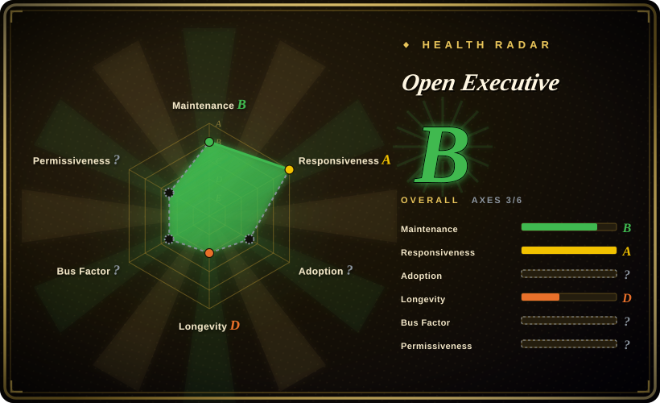
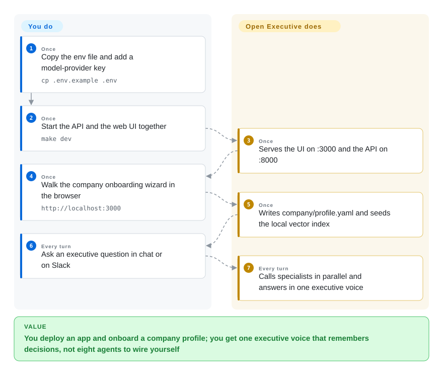

# Open Executive

You keep asking a chatbot "should we raise", then "what's our runway", then "how do we talk to the board" in three threads that do not share a company or a decision log. Open Executive is a self-hosted app that answers as one executive: it routes the question to specialist agents, reads your company docs, and writes the decision down for next time.

## When to use

You run a small company and the leadership questions are the same ones every week — competitive move, cash, hiring, a board update — but they currently live in a generic chat window, a spreadsheet, and last month's Slack thread. You do not want to author a CrewAI crew or a LangGraph. You want to deploy an app, fill a company profile, and talk to one voice that already has CSO / CFO / CHRO / GC / COO / CMO / CPO / Board Comms behind it, and that can also sit on Slack, Discord, Telegram, email, or an MCP client.

Reach for Open Executive when the deciding tradeoff is **a packaged executive product versus a framework you assemble**. Against [CrewAI](../agent-sdks/crewai.md) you give up graph-level control and gain an onboarding wizard, episodic memory, a scheduler, and a web UI. Against [OpenClaw](../personal-assistants/openclaw.md) you give up consumer-messenger reach and gain a company profile plus specialist council. Against [eve](eve.md) you give up durable waiting-as-infrastructure and gain a finished executive persona.

## How it works

You copy `.env.example`, put in a model-provider key, and run `make dev`. That starts a FastAPI API on port 8000 and a Next.js UI on port 3000. The first visit is an onboarding wizard (or a conversational interview at `/onboard`) that writes a gitignored `company/profile.yaml`. After that, every user message goes to one Executive orchestrator. The orchestrator is the only face: it decides which specialists to call via a `consult_specialist` tool, runs those calls in parallel, and synthesizes one reply. Each specialist retrieves two layers into the *user* turn — shipped MBA-level Markdown in ChromaDB, plus your uploaded company documents — so the cached system prompt stays stable. After the reply, a background cheap-model pass extracts decisions, initiatives, and advice into SQLite; the next session opens with a `<past_decisions>` block. A scheduler claims due rows with `UPDATE … RETURNING` and must run in a single API process.

**You** bring the provider key, the company profile, and any Slack/Discord/email tokens. **It** owns routing, retrieval, memory extraction, the UI, and the outbound-DM anti-spam gate.

<!-- flow-steps:begin (generated from flows/open-executive.json by tools/flow_card.py — do not edit) -->

Text version of the flow

1. **You** (Once): Copy the env file and add a model-provider key — `cp .env.example .env`
2. **You** (Once): Start the API and the web UI together — `make dev`
3. **Open Executive** (Once): Serves the UI on :3000 and the API on :8000
4. **You** (Once): Walk the company onboarding wizard in the browser — `http://localhost:3000`
5. **Open Executive** (Once): Writes company/profile.yaml and seeds the local vector index
6. **You** (Every turn): Ask an executive question in chat or on Slack
7. **Open Executive** (Every turn): Calls specialists in parallel and answers in one executive voice

**Value**: You deploy an app and onboard a company profile; you get one executive voice that remembers decisions, not eight agents to wire yourself

<!-- flow-steps:end -->

## When NOT to use

- **You want to program the agent graph yourself.** Use [CrewAI](../agent-sdks/crewai.md) or [LangGraph](../agent-sdks/langgraph.md) instead of Open Executive, because this repo is an opinionated product with eight named specialists, not a library you drop into your own service.
- **You are one person and the job is "answer me on WhatsApp / Telegram / iMessage".** Use [OpenClaw](../personal-assistants/openclaw.md) instead of Open Executive, because OpenClaw's value is channel reach on your devices; Open Executive's extra surface is a company profile, a council, and two containers you will operate.
- **Several people must share isolated agents on Feishu / WeCom.** Use [Octop](../personal-assistants/octop.md) instead of Open Executive, because Open Executive's `SECURITY.md` states the deployed product is a shared workspace with no per-user data isolation — every allow-listed user is treated as trusted.
- **The agent must wait days for a human or a webhook and survive a redeploy as a workflow.** Use [eve](eve.md) instead of Open Executive, because Open Executive's scheduler is a SQLite poll loop in one process, not a durable session runtime.
- **You need unattended agents on a timer from one binary.** Use [OpenFang](openfang.md) instead of Open Executive, because Open Executive is a FastAPI + Next.js stack with ChromaDB and sentence-transformers, not a single Rust OS.
- **You need to run more than one API replica.** `docs/deployment.md` is explicit: a second API container double-fires every scheduled action. Pin the API to one instance or pick a runtime with leader election.
- **You need a recruiting / talent pipeline or staff-onboarding workflows.** Those verticals were removed in v0.2.0 (2026-09-22); leftover SQLite tables are not dropped. Use a dedicated ATS, not this app.
- **You read "spend approval thresholds" as a procurement engine.** The code exposes `authority_scopes` enums on a Person row (`spend_lt_2k`, `spend_lt_10k`, `spend_gt_10k`, …). That is a roster field the model can look up, not an approval workflow with tickets and dual control.
- **You cannot send company data to the model endpoint.** Profile, documents, and conversations leave the box as prompts. Local / OpenRouter backends exist, but the default path is Anthropic, and `SECURITY.md` puts prompt-injection leading to outbound MCP actions in scope.
- **You need licensed legal, tax, or financial advice.** The specialists are prompts plus shipped Markdown, scored by an in-repo LLM-as-judge. Use a human GC/CFO; do not treat a GC specialist call as counsel.

## Comparison

| Alternative | In index | Our verdict | Tradeoff |
|---|---|---|---|
| [CrewAI](../agent-sdks/crewai.md) | ✅ | When you need to author role-based crews inside your own Python app, pick CrewAI; pick Open Executive when you want a finished executive app with UI, memory, and channels already wired. | CrewAI is a framework you program; Open Executive is a product you deploy. You gain the council and the wizard, and you give up graph-level control and a mature ecosystem. |
| [OpenClaw](../personal-assistants/openclaw.md) | ✅ | When you want a personal assistant on many consumer messengers, pick OpenClaw; pick Open Executive when the user is a company and the voice must stay one executive. | OpenClaw wins on channel count and a personal shape; Open Executive wins on company profile, specialist routing, and a web console, at the cost of a heavier Python/Node stack. |
| [Octop](../personal-assistants/octop.md) | ✅ | When several people need isolated agents on Feishu/WeCom with chats on disk, pick Octop; pick Open Executive when isolation is not required and the job is one shared executive council. | Octop's premise is JWT multi-user on Tencent IM; Open Executive's premise is one trusted workspace. Neither substitutes for the other's threat model. |
| [eve](eve.md) | ✅ | When the agent must be durable infrastructure that parks for days, pick eve; pick Open Executive when you want an executive persona and company RAG, not a workflow SDK. | eve is a TypeScript framework you author as files; Open Executive is an app with a fixed council. Durability and multi-tenancy sit with eve; MBA knowledge and onboarding sit here. |
| [OpenFang](openfang.md) | ✅ | When you want scheduled autonomous work from one Rust binary, pick OpenFang; pick Open Executive when the operator will talk to it in a browser and on Slack as a virtual exec. | OpenFang is an agent OS with a scheduler and a small footprint; Open Executive is two containers, ChromaDB, and a Next.js UI. Footprint and unattended work vs. executive UX. |

## Tech stack

- **Backend:** Python 3.11+, FastAPI, Pydantic v2, Click CLI, `uv` (`packages/core/pyproject.toml` version 0.2.1)
- **Frontend:** Next.js (`packages/ui/package.json` declares `next ^16.3.5`, React 19, Tailwind 4, Auth.js / next-auth 5 beta) — the README still badges "Next.js 15"
- **LLM:** Anthropic SDK by default (`DEFAULT_MODEL=claude-sonnet-5`, `DEEP_REASONING_MODEL=claude-opus-5`, `ROUTING_MODEL=claude-haiku-4-5` in `config.py`); optional OpenRouter and OpenAI-compatible local servers
- **Retrieval:** ChromaDB + `sentence-transformers` (pulls `torch`; the API image pins the CPU wheel as of 0.2.1)
- **State:** SQLite (`episodic_memory.db`) for memory, people, alerts, scheduler, audit; YAML company profile
- **Channels:** Slack Bolt, discord.py, Telegram webhook, Google Chat, IMAP/SMTP-class email via Gmail MCP, Streamable HTTP MCP at `/mcp`
- **No LangGraph / CrewAI** in the runtime — architecture docs state direct Anthropic tool use

## Dependencies

- At least one model backend: `ANTHROPIC_API_KEY`, or `OPENROUTER_ENABLED` + key, or `LOCAL_MODELS_ENABLED` + `LOCAL_BASE_URL`. The app refuses to start with none.
- Python 3.11+ and Node 22+ for `make dev`; first boot downloads an embedding model (~90 MB per README) and `uv sync` pulls ChromaDB + torch.
- For production: Docker, one persistent volume at `/data`, `BACKEND_SHARED_SECRET` + `OE_PUBLIC_DEPLOYMENT=1` on any internet-reachable API, Google OAuth (`AUTH_*`) if you use the UI allow-list.
- Optional: Slack/Discord/Telegram/Google tokens, Honcho for per-person memory, `workspace-mcp` for Gmail/Calendar/Drive.
- Images: `ghcr.io/sentelabsai/openexecutive-api` and `…-ui`, `linux/amd64` only.

## Ops difficulty

**Medium to stand up, high if it sits on the public internet and talks to real inboxes.** Local path is `cp .env.example .env` and `make dev`. Production is two containers, a 2 GB RAM API, a ~5 minute health-check grace period, and a hard single-replica pin. You must set the shared-secret gate yourself — without `OE_PUBLIC_DEPLOYMENT=1` the API boots unauthenticated with only a log line. Day-2 costs: Google allow-list plus People roster (v0.2.0 widened sign-in to the union of both), SQLite backups via `.backup` not a file copy, schema that does not roll back with the image, outbound MCP/email as a prompt-injection surface, and model spend (default specialists include Opus-tier deep reasoning). There is no leader election and no snapshot cron in the repo.

## Health & viability

- **Maintenance:** Grade B (scored 2026-09-22) — last default-branch commit the same day, 5/13 trailing weeks active. Tags `v0.2.0` and `v0.2.1` both dated 2026-09-22; `CHANGELOG.md` follows Keep a Changelog. Pre-1.0: 0.2.0 removed the talent and staff-onboarding verticals.
- **Responsiveness:** Grade A — median first-response 6.5 hours across 22 qualifying issues (relaxed_solo band).
- **Adoption:** Grade ? (`no_package_structural`) — the scorer skips download graphs for `type: app`. GitHub on 2026-09-22: 5,119 stars / 530 forks / 39 watchers / 3 open issues. No production-user list verified; watcher count is the calmer proxy.
- **Longevity:** Grade D — created 2026-06-11, 103 days old. The app cohort's C bar is older than that. 5.1k stars in three months is a launch-shaped signal, not a Lindy prior.
- **Governance:** Grade ? (`empty_or_gated`). Independently: GitHub Organization `SenteLabsAI`, created the same day as the repo, two public repos. `CODEOWNERS` is `@johnrufusone @banuakman`. Contributor listing is dominated by `johnrufusone` (186) then a `claude` account (44) and Dependabot (21); `banuakman` has 4. Roadmap rides on one young vendor, not a foundation.
- **Risk / License:** Grade ? (`license_unparsed`) — GitHub API reports `NOASSERTION` while `LICENSE` and `pyproject.toml` are Apache-2.0. Separate from that grade: shared workspace with no per-user isolation; fail-open API unless `OE_PUBLIC_DEPLOYMENT` is set; scheduler cannot scale out; first-party eval gate and cache-hit claims are unaudited; README / `docs/architecture.md` / `config.py` disagree on default model ids (`config.py` is runtime truth). A managed cloud is advertised at `openexecutive.ai` as coming — that is not this repository.

## Caveats (unverified)

- [未验证] I did not install or run Open Executive. Orchestrator, memory extraction, scheduler claim, and MCP auth behaviour are read from README, `docs/architecture.md`, `docs/deployment.md`, `SECURITY.md`, `config.py`, and `pyproject.toml`, not reproduced.
- [未验证] README cache-hit claim (up to 85%) and eval CI gate (≥ 3.5/5, 29 scenarios, `claude-opus-4-7` as judge) are first-party; no third-party eval found.
- [未验证] "Digital twin of a busy leader" is README marketing. The implemented path is a company profile plus an Executive persona prompt, not a verified clone of a named person's judgment.
- [未验证] Production adoption is unverified. 5.1k stars / 39 watchers in ~3 months is consistent with launch attention.
- [推断] `docs/architecture.md` still lists `claude-sonnet-4-6` / `claude-opus-4-7` while `config.py` and the README default to `claude-sonnet-5` / `claude-opus-5`. Treat `config.py` as runtime truth; the architecture doc is stale on this point.
- [推断] GitHub license API `NOASSERTION` vs a full Apache 2.0 `LICENSE` plus `pyproject.toml license = {text = "Apache-2.0"}` — SPDX on the page is Apache-2.0 from the file, not from the API badge.
