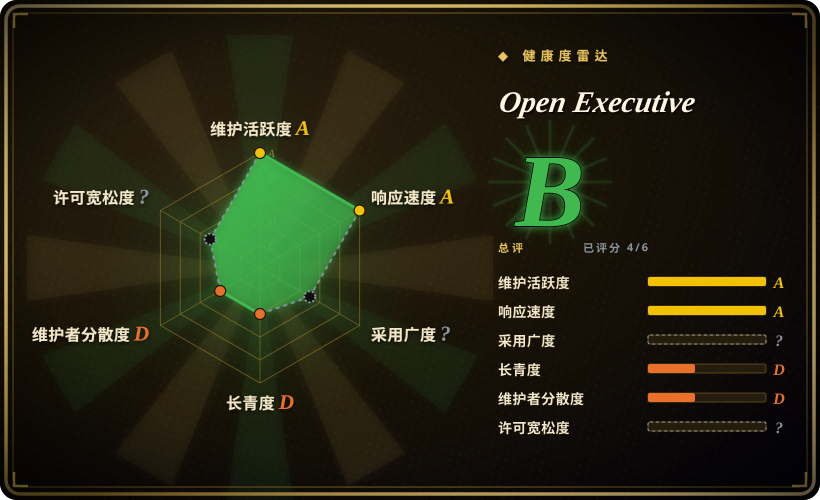
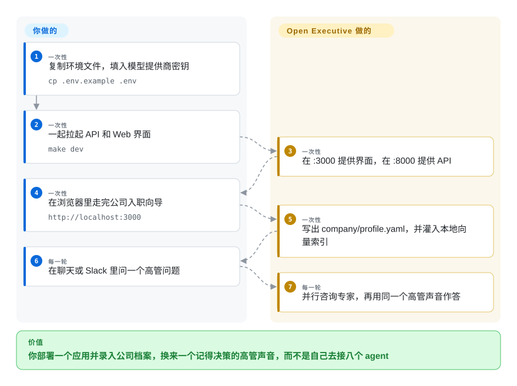

# Open Executive

你老在一个聊天窗口里问“该不该融资”，再在另一个线程问“账上还能撑几个月”，董事会材料又在上个月的 Slack 里。三处对话不共享同一家公司和决策记录。Open Executive 是一个自托管应用：它用一个高管的声音回答，把问题分给专家 agent，读你的公司文档，并把决策写下一次。

## 何时使用

你管一家小公司，每周都是同一类领导问题——竞品动作、现金、招人、董事会更新——但它们现在散落在通用聊天窗口、表格和上个月的 Slack 线程里。你不想自己写一套 CrewAI crew 或 LangGraph。你想部署一个应用、填一份公司档案，然后对着一个已经带着 CSO / CFO / CHRO / GC / COO / CMO / CPO / Board Comms 的声音说话，并且它还能坐在 Slack、Discord、Telegram、邮件或 MCP 客户端上。

选 Open Executive 的决定性取舍是**包装好的高管产品，对你自己组装的框架**。相对 [CrewAI](../agent-sdks/crewai.zh.md)，你交出图级控制，换来入职向导、情景记忆、调度器和 Web 界面。相对 [OpenClaw](../personal-assistants/openclaw.zh.md)，你交出消费级即时通讯覆盖，换来公司档案和专家委员会。相对 [eve](eve.zh.md)，你交出“等好几天”的持久工作流，换来已经写好的高管人设。

## 怎么用起来

你复制 `.env.example`、填入模型提供商密钥，跑 `make dev`。这会在 8000 端口拉起 FastAPI，在 3000 端口拉起 Next.js 界面。第一次访问是入职向导（或 `/onboard` 上的对话式访谈），写出被 gitignore 的 `company/profile.yaml`。之后每条用户消息都进同一个 Executive 编排器。编排器是唯一的脸：它用 `consult_specialist` 工具决定叫哪些专家、并行跑完，再合成一条回复。每个专家在**用户轮**里检索两层——随包的 MBA 级 Markdown（ChromaDB）和你上传的公司文档——这样缓存的系统提示词保持稳定。回复之后，后台用便宜模型把决策、事项和建议抽进 SQLite；下一次会话开头带上 `<past_decisions>`。调度器用 `UPDATE … RETURNING` 领取到期行，必须跑在单个 API 进程里。

**你**负责提供商密钥、公司档案，以及 Slack/Discord/邮件 token。**它**负责路由、检索、记忆抽取、界面，以及主动私信的反骚扰闸门。

<!-- flow-steps:begin (generated from flows/open-executive.json by tools/flow_card.py — do not edit) -->

流程文字版

1. **你**（一次性）：复制环境文件，填入模型提供商密钥 — `cp .env.example .env`
2. **你**（一次性）：一起拉起 API 和 Web 界面 — `make dev`
3. **Open Executive**（一次性）：在 :3000 提供界面，在 :8000 提供 API
4. **你**（一次性）：在浏览器里走完公司入职向导 — `http://localhost:3000`
5. **Open Executive**（一次性）：写出 company/profile.yaml，并灌入本地向量索引
6. **你**（每一轮）：在聊天或 Slack 里问一个高管问题
7. **Open Executive**（每一轮）：并行咨询专家，再用同一个高管声音作答

**价值**：你部署一个应用并录入公司档案，换来一个记得决策的高管声音，而不是自己去接八个 agent

<!-- flow-steps:end -->

## 何时不用

- **你想自己编排 agent 图。** 用 [CrewAI](../agent-sdks/crewai.zh.md) 或 [LangGraph](../agent-sdks/langgraph.zh.md) 代替 Open Executive，因为这个仓是带八个具名专家的意见化产品，不是你能丢进自己服务的库。
- **你是一个人，任务是“在 WhatsApp / Telegram / iMessage 上答我”。** 用 [OpenClaw](../personal-assistants/openclaw.zh.md) 代替 Open Executive，因为 OpenClaw 的价值是设备上的渠道覆盖；Open Executive 多出来的是公司档案、委员会，以及你要运维的两个容器。
- **几个人必须在飞书 / 企微上共用隔离 Agent。** 用 [Octop](../personal-assistants/octop.zh.md) 代替 Open Executive，因为 Open Executive 的 `SECURITY.md` 写明：部署后的产品是共享工作区，没有按用户隔离数据——允许名单上的每个人都被当作可信。
- **Agent 必须为一个人或一个 webhook 等上好几天，并以工作流形态扛住重新部署。** 用 [eve](eve.zh.md) 代替 Open Executive，因为 Open Executive 的调度器是单进程里的 SQLite 轮询，不是持久会话运行时。
- **你要一个二进制、按计划无人值守干活。** 用 [OpenFang](openfang.zh.md) 代替 Open Executive，因为 Open Executive 是 FastAPI + Next.js，还带着 ChromaDB 和 sentence-transformers，不是单个 Rust OS。
- **你需要跑不止一个 API 副本。** `docs/deployment.md` 写死了：第二个 API 容器会把每条定时动作再发一遍。把 API 钉成单实例，或换一个有选主的运行时。
- **你需要招聘 / 人才管道或员工入职工作流。** 这些垂直能力在 v0.2.0（2026-09-22）整块删掉了；遗留的 SQLite 表没有 drop。用专门的 ATS，不要用这个应用。
- **你把“花费审批阈值”读成采购引擎。** 代码在 Person 行上暴露 `authority_scopes` 枚举（`spend_lt_2k`、`spend_lt_10k`、`spend_gt_10k` 等）。那是模型可以查找的花名册字段，不是带工单和双人控制的审批流。
- **你不能把公司数据送到模型端点。** 档案、文档和对话会作为提示词离开这台机器。本地 / OpenRouter 后端存在，但默认路径是 Anthropic，且 `SECURITY.md` 把“提示注入导致主动 MCP 外发”列为在范围内。
- **你需要有执业资格的法律、税务或财务意见。** 专家是提示词加随包 Markdown，用仓内 LLM-as-judge 打分。请找真人 GC/CFO；不要把一次 GC 专家调用当成法律意见。

## 横向对比

| 替代品 | 是否收录 | 我们的评价 | 取舍 |
|---|---|---|---|
| [CrewAI](../agent-sdks/crewai.zh.md) | ✅ | 你要在自己的 Python 应用里写基于角色的 crew，选 CrewAI；你要一个已经接好界面、记忆和渠道的现成高管应用，选 Open Executive。 | CrewAI 是你编程的框架；Open Executive 是你部署的产品。你拿到委员会和向导，交出图级控制和更成熟的生态。 |
| [OpenClaw](../personal-assistants/openclaw.zh.md) | ✅ | 你要一个人在许多消费级即时通讯上被应答，选 OpenClaw；用户是一家公司、声音必须是同一个高管，选 Open Executive。 | OpenClaw 赢在渠道数量和个人形态；Open Executive 赢在公司档案、专家路由和 Web 控制台，代价是更重的 Python/Node 栈。 |
| [Octop](../personal-assistants/octop.zh.md) | ✅ | 几个人必须在飞书/企微上共用隔离 Agent、对话留在磁盘，选 Octop；不需要隔离、任务是一个共享的高管委员会，选 Open Executive。 | Octop 的前提是腾讯 IM 上的 JWT 多用户；Open Executive 的前提是一个可信工作区。彼此替不了对方的威胁模型。 |
| [eve](eve.zh.md) | ✅ | Agent 必须是能停好几天的持久基础设施，选 eve；你要高管人设和公司 RAG、不要工作流 SDK，选 Open Executive。 | eve 是用文件编写的 TypeScript 框架；Open Executive 是带固定委员会的应用。持久性和多租户在 eve；MBA 知识和入职向导在这里。 |
| [OpenFang](openfang.zh.md) | ✅ | 你要一个 Rust 二进制按计划自治干活，选 OpenFang；操作者会在浏览器和 Slack 里把它当虚拟高管来聊，选 Open Executive。 | OpenFang 是带调度器、体积小的 agent OS；Open Executive 是两个容器、ChromaDB 和 Next.js 界面。体积与无人值守，对高管体验。 |

## 技术栈

- **后端：** Python 3.11+、FastAPI、Pydantic v2、Click CLI、`uv`（`packages/core/pyproject.toml` 版本 0.2.1）
- **前端：** Next.js（`packages/ui/package.json` 声明 `next ^16.3.5`、React 19、Tailwind 4、Auth.js / next-auth 5 beta）——README 徽章仍写 “Next.js 15”
- **LLM：** 默认 Anthropic SDK（`config.py` 里 `DEFAULT_MODEL=claude-sonnet-5`、`DEEP_REASONING_MODEL=claude-opus-5`、`ROUTING_MODEL=claude-haiku-4-5`）；可选 OpenRouter 和 OpenAI 兼容的本地服务器
- **检索：** ChromaDB + `sentence-transformers`（会拉 `torch`；0.2.1 起 API 镜像钉 CPU wheel）
- **状态：** SQLite（`episodic_memory.db`）存记忆、人员、告警、调度器、审计；YAML 公司档案
- **渠道：** Slack Bolt、discord.py、Telegram webhook、Google Chat、经 Gmail MCP 的邮件、`/mcp` 上的 Streamable HTTP MCP
- **运行时没有 LangGraph / CrewAI**——架构文档写明直接走 Anthropic tool use

## 依赖

- 至少一个模型后端：`ANTHROPIC_API_KEY`，或 `OPENROUTER_ENABLED` 加密钥，或 `LOCAL_MODELS_ENABLED` 加 `LOCAL_BASE_URL`。一个都没有则拒绝启动。
- `make dev` 需要 Python 3.11+ 和 Node 22+；首次启动会下载 embedding 模型（README 写约 90 MB），`uv sync` 会拉 ChromaDB 和 torch。
- 生产：Docker、`/data` 上一个持久卷、任何能从公网摸到的 API 都要设 `BACKEND_SHARED_SECRET` 和 `OE_PUBLIC_DEPLOYMENT=1`；用 UI 允许名单时还要 Google OAuth（`AUTH_*`）。
- 可选：Slack/Discord/Telegram/Google token、Honcho 做人级记忆、`workspace-mcp` 做 Gmail/日历/网盘。
- 镜像：`ghcr.io/sentelabsai/openexecutive-api` 和 `…-ui`，仅 `linux/amd64`。

## 运维难度

**本地拉起来中等，挂到公网并接到真实邮箱就高。** 本地路径是 `cp .env.example .env` 再 `make dev`。生产是两个容器、API 要 2 GB 内存、健康检查大约给 5 分钟宽限期，以及硬性的单副本钉死。共享密钥闸门必须自己设——没有 `OE_PUBLIC_DEPLOYMENT=1` 时，API 会无认证启动，只打一行日志。第二天的成本：Google 允许名单加上 People 花名册（v0.2.0 把登录放宽成两者的并集）、SQLite 备份要用 `.backup` 而不是拷文件、schema 不会跟着镜像回滚、外发 MCP/邮件是提示注入面、以及模型账单（默认专家含 Opus 档深度推理）。仓里没有选主，也没有快照 cron。

## 健康度与可持续性

- **维护活跃度：** Grade A（评分 2026-09-22）——默认分支最近一次提交就在当天，过去 13 周里 6 周有提交。`v0.2.0` 和 `v0.2.1` 都标在 2026-09-22；`CHANGELOG.md` 跟 Keep a Changelog。仍是 pre-1.0：0.2.0 整块删掉了人才和员工入职。
- **响应速度：** Grade A——22 个合格 issue 的首次响应中位数 6.5 小时（relaxed_solo 档）。
- **采用广度：** Grade ?（`no_package_structural`）——评分器对 `type: app` 跳过下载图谱。2026-09-22 的 GitHub 为 5,119 star / 530 fork / 39 watcher / 3 个未关 issue。未核实生产用户名单；watcher 数是更冷静的代理。
- **长青度：** Grade D——创建于 2026-06-11，103 天。app 队列的 C 档比这更老。三个月 5.1k star 是上线形态，不是 Lindy 先验。
- **治理：** Grade D。独立观察：GitHub 组织 `SenteLabsAI`，与仓同一天创建，两个公开仓。`CODEOWNERS` 是 `@johnrufusone @banuakman`。贡献列表被 `johnrufusone`（186）主导，其次是名为 `claude` 的账号（44）和 Dependabot（21）；`banuakman` 有 4 次。路线图骑在一个年轻厂商上，不是基金会。
- **许可风险：** Grade ?（`license_unparsed`）——GitHub API 报 `NOASSERTION`，而 `LICENSE` 和 `pyproject.toml` 是 Apache-2.0。与该档位分开的事实：共享工作区、无按用户隔离；除非设 `OE_PUBLIC_DEPLOYMENT`，API 默认 fail-open；调度器不能横向扩展；第一方评测门槛和缓存命中宣称未经审计；README / `docs/architecture.md` / `config.py` 对默认模型 id 不一致（运行时以 `config.py` 为准）。托管云在 `openexecutive.ai` 上写成即将推出——那不是这个仓库。

## 存疑（未验证）

- [未验证] 没有安装或运行过 Open Executive。编排器、记忆抽取、调度器领取和 MCP 鉴权行为来自 README、`docs/architecture.md`、`docs/deployment.md`、`SECURITY.md`、`config.py` 和 `pyproject.toml`，不是复现。
- [未验证] README 的缓存命中宣称（最高 85%）和评测 CI 门槛（≥ 3.5/5、29 个场景、`claude-opus-4-7` 当评委）是第一方；未找到第三方评测。
- [未验证] “忙碌领导者的数字孪生”是 README 营销。实现路径是公司档案加 Executive 人设提示词，不是对某个具名人士判断的已验证克隆。
- [未验证] 生产采用未核实。约 3 个月 5.1k star / 39 watcher，更像上线注意力。
- [推断] `docs/architecture.md` 仍写 `claude-sonnet-4-6` / `claude-opus-4-7`，而 `config.py` 和 README 默认是 `claude-sonnet-5` / `claude-opus-5`。把 `config.py` 当运行时真相；架构文档在这一点上过时。
- [推断] GitHub 许可 API 报 `NOASSERTION`，仓里是完整的 Apache 2.0 `LICENSE`，且 `pyproject.toml` 写 `license = {text = "Apache-2.0"}`——本页 SPDX 取自文件，不是 API 徽章。
