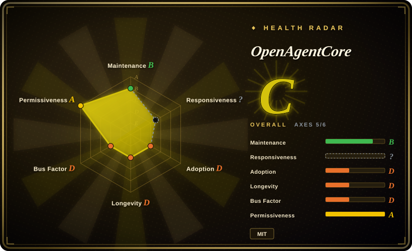
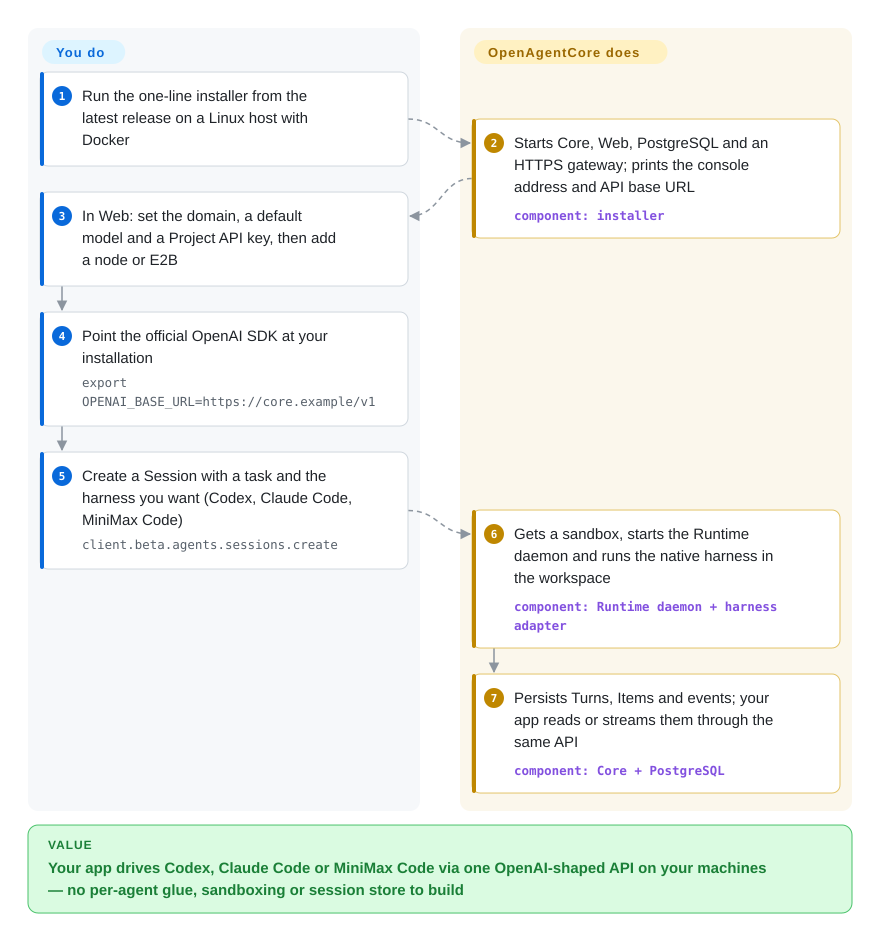

# OpenAgentCore

Your product wants to hand a user's request to a real coding agent — Codex, Claude Code — that edits files in its own workspace, but each agent has its own CLI, event format and session storage, and the agent has to run somewhere that isn't your API server. OpenAgentCore is a server you install that answers the same HTTP API as OpenAI's hosted Agents API: your app creates a "Session" with the stock OpenAI SDK, and the server starts the agent you named inside a sandbox (or on a machine you connect), runs it, and keeps every turn in PostgreSQL.

## When to use

You are building a product feature — an "ask the agent to fix this repo" button, an internal ops bot, a hosted coding workbench — and you want the agent to be a full native harness (the agent program's own model-and-tool loop: Codex's app-server, Claude Code via the Claude Agent SDK, or MiniMax Code), not a loop you wrote. Your first prototype shells out to `codex` on the API host; then two users run at once, one deletes the other's checkout, and the transcript is gone when the process exits. You install OpenAgentCore on a Linux host, add a node (microsandbox or Docker) or an E2B key, and from your backend call `client.beta.agents.sessions.create(...)` with `OPENAI_BASE_URL` pointed at your installation. Core creates a sandbox per Session, starts the selected harness inside it, persists turns, items and events, and lets you stream, steer, cancel, upload files, attach Skills and MCP servers through the same API — and switch a Session from Codex to Claude Code by changing one field, `x_agents_core.harness`.

Pick it over [E2B](../../../sandboxing/e2b.md) or [Microsandbox](../../../sandboxing/microsandbox.md) alone when the missing piece is not the sandbox but everything above it — session state, turn scheduling, cancellation, per-Project API keys — since OpenAgentCore uses those as its compute backends. Pick it over rivet-dev's sandbox-agent (not indexed) when you want a whole operated service with durable state and an admin console rather than an adapter binary you drop into each sandbox. Pick it over the [OpenAI Agents SDK](../agent-sdks/openai-agents-sdk.md) when you do not want to write the agent loop at all; and pick it over OpenAI's hosted Agents API when the agent must run on your hardware, with your model provider (it is not limited to OpenAI models).

## How it works

Three pieces run on your side: **Core** (a Go service that owns the public `/v1` API, authorization, scheduling and the PostgreSQL record of every Session and Turn), **Web** (an admin console where you set the domain, default model, nodes and Project API keys), and a **Runtime daemon** that runs inside each sandbox or on a machine you connect and dials back to Core over an authenticated WebSocket. When your app creates a Session, Core asks a Sandbox Provider (Docker, microsandbox — small virtual machines that need KVM — or E2B's cloud) for compute; the daemon prepares the workspace, installs requested Skills, packages and MCP servers, and starts a *harness adapter* — a thin translator that drives the agent through its own official interface (Codex's app-server, one streaming Claude Agent SDK query, MiniMax Code over ACP, a JSON-RPC agent protocol). The agent runs its own model and tool loop; OpenAgentCore never re-implements it, and it never translates between model protocols, so Codex needs a Responses-API provider and Claude Code an Anthropic-protocol one. Think of a staffing agency's front desk: you file one standard work order, the desk books a room and calls in the specialist you asked for, and keeps the paperwork — but the specialist works in their own way. You supply the model key, the capacity (nodes or E2B) and the application; the project supplies provisioning, lifecycle, durable records and the OpenAI-compatible surface.

<!-- flow-steps:begin (generated from flows/openagentcore.json by tools/flow_card.py — do not edit) -->

Text version of the flow

1. **You**: Run the one-line installer from the latest release on a Linux host with Docker
2. **OpenAgentCore**: Starts Core, Web, PostgreSQL and an HTTPS gateway; prints the console address and API base URL — component: `installer`
3. **You**: In Web: set the domain, a default model and a Project API key, then add a node or E2B
4. **You**: Point the official OpenAI SDK at your installation — `export OPENAI_BASE_URL=https://core.example/v1`
5. **You**: Create a Session with a task and the harness you want (Codex, Claude Code, MiniMax Code) — `client.beta.agents.sessions.create`
6. **OpenAgentCore**: Gets a sandbox, starts the Runtime daemon and runs the native harness in the workspace — component: `Runtime daemon + harness adapter`
7. **OpenAgentCore**: Persists Turns, Items and events; your app reads or streams them through the same API — component: `Core + PostgreSQL`

**Value**: Your app drives Codex, Claude Code or MiniMax Code via one OpenAI-shaped API on your machines — no per-agent glue, sandboxing or session store to build

<!-- flow-steps:end -->

## When NOT to use

- **You need the agent's network locked down per Session.** The capability matrix rejects `network: disabled` and `restricted` on every harness, and `docs/concepts.md` states the daemon "adds no filesystem, permission or network isolation" — isolation is whatever the outer sandbox gives you (a microsandbox node allows Core, DNS and public addresses; Docker nodes are "root-equivalent" on the host). If egress control is the requirement, run agents on [OpenSandbox](../../../sandboxing/opensandbox.md) or [Microsandbox](../../../sandboxing/microsandbox.md) with its per-sandbox egress policy and drive the agent yourself.
- **You need a stable API or an upgrade path.** It is pre-release (v0.0.1→v0.0.4 in three days, 2026-09-29…10-01), and its own `AGENTS.md` says "Keep no version fallback, compatibility shim or migration for superseded behavior". Treat each upgrade as a reinstall-and-retest. If you only need agents in your own process with a stable API, use the [OpenAI Agents SDK](../agent-sdks/openai-agents-sdk.md); for a long-lived coding-agent platform with years of track record, look at [OpenHands](../../coding-agents/orchestration-and-review/openhands.md).
- **You expect every harness to support every API feature.** Support is per harness and per placement, and the matrix is explicit: structured output only on Claude SDK; public function tools and image input rejected on MiniMax Code; enabled web search rejected everywhere; token usage counters only on Codex (Claude and MiniMax report null). If your app needs uniform features across agents, read `contracts/agents-api/harness-capabilities.md` first — or pick one harness and drive it directly.
- **You want a different agent (OpenCode, Cursor, Amp, Gemini CLI).** Only Codex, Claude SDK and MiniMax Code are qualified, and adding one means writing a Go adapter, a Core profile, a runtime image and an acceptance run. rivet-dev's sandbox-agent (not indexed) already wraps Claude Code, Codex, OpenCode, Cursor, Amp and Pi behind one HTTP API.
- **You want sandboxes on a self-hosted E2B-compatible service or on Kubernetes.** The E2B backend talks only to the official E2B cloud today (issue #179, open since 2026-09-28, asks for custom endpoints), and there is no Kubernetes provider. Use [E2B](../../../sandboxing/e2b.md) self-hosted directly, or [Agent Sandbox](../../../sandboxing/agent-sandbox.md) for pod-per-sandbox on Kubernetes.
- **You must keep everything under an OSI license.** OpenAgentCore is MIT, but its Claude harness bundles `@anthropic-ai/claude-agent-sdk` 0.3.269, whose npm license field reads "SEE LICENSE IN README.md" (Anthropic's terms, not an open-source license). Disable that harness or use only Codex (Apache-2.0 upstream) and MiniMax Code.
- **You want a multi-user product UI.** Web is an operator console that signs in with one shared Core key and "has no user accounts"; end-user accounts, roles and workspaces are your application's job. For a finished staff-facing agent product, look at [OpenBot](openbot.md).

## Comparison

| Alternative | In index | Our verdict | Tradeoff |
| --- | --- | --- | --- |
| OpenAI hosted Agents API | not a repo | When OpenAI models are fine and you would rather not operate anything, use OpenAI's hosted API; choose OpenAgentCore when the agents must run on your hardware, with your provider, or as Claude Code / MiniMax Code. | Hosted is a closed service — zero ops but OpenAI-only; OpenAgentCore keeps the same client code and adds a Linux host, PostgreSQL and sandbox capacity to run. |
| rivet-dev/sandbox-agent | not indexed | When you already own sandboxes and session storage and want one HTTP adapter for many coding agents (Claude Code, Codex, OpenCode, Cursor, Amp, Pi), pick sandbox-agent; pick OpenAgentCore when you want provisioning, durable turns and API keys handled too. | sandbox-agent is a single Rust binary inside each sandbox with more agents (not added in this tab batch); OpenAgentCore is a whole service with fewer harnesses, an OpenAI-shaped API and a capability matrix. |
| [E2B](../../../sandboxing/e2b.md) | ✅ | When you only need isolated compute for agent-generated code and will write the agent loop yourself, pick E2B; pick OpenAgentCore when you want a ready agent session API on top — it can use E2B as its backend. | E2B is the sandbox layer with mature SDKs; OpenAgentCore adds harnesses, Session/Turn state and scheduling, but is ten days old and supports only E2B's official cloud. |
| [OpenHands](../../coding-agents/orchestration-and-review/openhands.md) | ✅ | When you want an established autonomous coding agent with its own UI and runtime, pick OpenHands; pick OpenAgentCore when your app should call a standard API and choose among vendor-native agents. | OpenHands brings its own agent and a large community; OpenAgentCore brings no agent of its own — it hosts Codex / Claude Code / MiniMax Code and inherits their quirks. |
| [OpenAI Agents SDK](../agent-sdks/openai-agents-sdk.md) | ✅ | When the agent should live inside your own process and you will define its tools and handoffs, pick the SDK; pick OpenAgentCore when you want a ready coding harness in a remote workspace behind an API. | The SDK is a library with no infrastructure; OpenAgentCore is infrastructure you operate, in exchange for workspaces, sandboxes and persisted sessions. |

## Tech stack

- **Go 1.26** — Core service (`services/core`), Runtime daemon (`apps/daemon`), shared protocol packages (`internal/`); chi router, pgx + goose migrations on PostgreSQL, gorilla/websocket, moby Docker client, `openai-go` v3, OpenTelemetry exporters.
- **TypeScript** — Web admin console (`apps/web`), the `@oac/agents-client` package, the Claude adapter (`packages/claude-sdk-adapter`, pinned `@anthropic-ai/claude-agent-sdk` 0.3.269 and `@modelcontextprotocol/sdk` 1.30.0), the MiniMax Code workspace bridge (`packages/mcode-harness`, pinned MiniMax-AI/minimax-code 0.4.12 with a three-edit source patch).
- **Pinned native harnesses** — Codex CLI 0.153.4 in the Codex runtime image; one Runtime image per harness under `services/core/deploy/<kind>`.
- **Python** — E2B helper (pinned `e2b` 2.51.0) and the Python 3.9+ installer.
- **Protocol contracts** — OpenAPI generated from route annotations (`make openapi`); the public API pinned to `openai/openai-python` 3.13.0 `beta/agents` (`contracts/agents-api/upstream.json`).

## Dependencies

- A Linux amd64 host with Docker Engine + Compose ≥ 2.26.0, Python 3.9+ and curl; the installer brings Core, Web, PostgreSQL and an HTTPS gateway as images.
- A DNS hostname and inbound 80/443 before applications, nodes or E2B can reach Core.
- Execution capacity: Linux node hosts running microsandbox (need `/dev/kvm`) or Docker (root-equivalent; dedicate the host), **or** an E2B cloud account, **or** your own Linux / macOS / Windows machines running the daemon (no Docker or admin rights needed; MiniMax Code not on Windows).
- A model provider per harness, in its native protocol: Responses API for Codex, Anthropic protocol for Claude SDK, any of the three for MiniMax Code. There is no built-in model proxy.
- Client side: the official OpenAI SDK (quickstart pins `openai==3.13.0`) or plain HTTP with the `OpenAI-Beta: agents=v1` header.

## Ops difficulty

**Medium to high.** The one-line installer is careful (checksum, port and space checks, rollback on a failed first start, `oac status` / `oac apply` for repairs), and a single host can get you to a first Session. But a real deployment is several systems: the Core host with PostgreSQL and TLS, one or more sandbox nodes (KVM hosts for microsandbox, or dedicated Docker hosts), per-harness Runtime images and release upgrades that keep no compatibility layer, the encryption key that must survive restarts ("a missing or wrong encryption key fails closed"), and model credentials for each harness. Debugging a failed Turn crosses Core, the provider, the daemon and the vendor's agent binary.

## Health & viability

- **Maintenance (2026-10-01)**: extremely active — 685 commits since the repo was created on 2026-09-21, four tagged releases v0.0.1…v0.0.4 between 2026-09-29 and 2026-10-01, PRs merged daily, CI per directory. This is launch-phase velocity, not a settled cadence.
- **Governance / bus factor**: owned by the MiniMax-AI organization (the model vendor), but concentrated: of 7 contributors, `SaladDay` has 550 of 642 contributor-attributed commits (~86%) and `RyanLee-Dev` 75 (~97% together). The issue tracker so far holds maintainer-authored work items; no outside bug reports yet.
- **Backing & longevity**: MiniMax is a model company with a commercial interest in its own MiniMax Code harness and models; the repo is **ten days old** — zero Lindy signal — and whether it becomes a maintained product or a launch artifact is not yet knowable.
- **Adoption**: 107 stars, 5 forks, 0 watchers on 2026-10-01; 110 release-asset downloads across all four releases (5 for v0.0.4). No known production users beyond the bundled "Parsar" example app.
- **Risk flags**: self-declared pre-release with no compatibility guarantees; the Claude harness pulls a proprietary-licensed SDK; feature parity across harnesses is explicitly partial; isolation depends entirely on the sandbox backend you choose.

## Caveats (unverified)

- [未验证] Runtime behavior: this page is from the README, `AGENTS.md`, `docs/architecture.md`, `docs/concepts.md`, the install, quickstart, self-hosted and nodes guides, `contracts/agents-api/harness-capabilities.md`, `harness-onboarding.md`, `model-execution.md`, the deploy Dockerfiles, package manifests and issues #38/#179; I did not install it or run a Session.
- [未验证] The capability matrix's "Verified" cells are the project's own acceptance claims; I did not reproduce any of them.
- [推断] The 685-commit history in ten days, with a `codex` contributor account and a repo-level `AGENTS.md` written for coding agents, suggests heavy agent-assisted development and possibly code ported from an internal repository (the first commit is "Initialize standalone Core repository") — not confirmed.
- [推断] OpenAI's hosted Agents API is treated as a real product because openai-python ships `src/openai/resources/beta/agents` (checked 2026-10-01); its pricing, availability, feature set and which models it serves (the "OpenAI-only" tradeoff above) were not checked.
- [未验证] The exact terms behind `@anthropic-ai/claude-agent-sdk`'s "SEE LICENSE IN README.md" — not read; the claim is only that it is not an OSI license field.
- [未验证] Whether the pinned MiniMax Code patch and the E2B helper keep working as their upstreams move; the pins are recorded, their stability is not tested.
- [未验证] Performance, sandbox start latency and how many concurrent Sessions a node or Core host sustains — no benchmarks are published.
