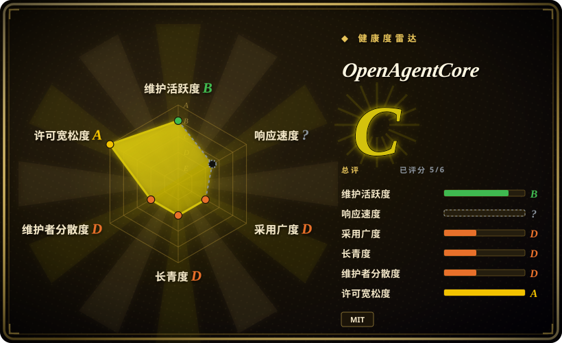
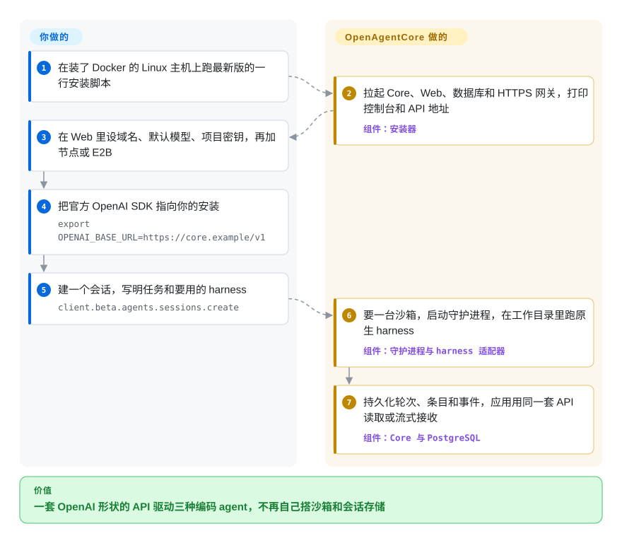

# OpenAgentCore

你的产品想把用户的请求交给一个真正的编码 agent——Codex、Claude Code——让它在自己的工作目录里改文件；可每个 agent 的命令行、事件格式、会话存储都不一样，而且它得跑在 API 服务器以外的某个地方。OpenAgentCore 是一套自己部署的服务，对外讲的 HTTP API 和 OpenAI 托管的 Agents API 一模一样：你的应用用原版 OpenAI SDK 建一个“会话”（Session），服务端就在沙箱里（或你接入的机器上）把你点名的 agent 拉起来跑，并把每一轮都记进 PostgreSQL。

## 何时使用

你在做一个产品功能——一个“让 agent 修好这个仓库”的按钮、一个内部运维机器人、一个托管的编码工作台——你要的是完整的原生 harness（agent 程序自带的“调模型—用工具”循环：Codex 的 app-server、通过 Claude Agent SDK 跑的 Claude Code，或 MiniMax Code），而不是自己手写一个循环。第一版原型直接在 API 主机上 shell 调 `codex`；结果两个用户同时用，一个把另一个的代码目录删了，进程一退出对话记录也没了。你在一台 Linux 主机上装好 OpenAgentCore，加一个节点（microsandbox 或 Docker）或填一个 E2B 密钥，然后在后端把 `OPENAI_BASE_URL` 指向这套安装，调用 `client.beta.agents.sessions.create(...)`。Core 为每个会话建一个沙箱、在里面启动选定的 harness、持久化每一轮（Turn）、条目和事件；流式输出、中途插话、取消、上传文件、挂 Skills 和 MCP 服务都走同一套 API——把一个会话从 Codex 换成 Claude Code，只改一个字段 `x_agents_core.harness`。

如果缺的不是沙箱本身，而是沙箱之上的一切——会话状态、轮次调度、取消、按项目（Project）发 API 密钥——就选它而不是单用 [E2B](../../../sandboxing/e2b.zh.md) 或 [Microsandbox](../../../sandboxing/microsandbox.zh.md)，OpenAgentCore 本来就拿它们当算力后端。想要一整套有持久状态和管理台的服务、而不是往每个沙箱里塞一个适配器二进制时，选它而不是 rivet-dev 的 sandbox-agent（未收录）。完全不想自己写 agent 循环时，选它而不是 [OpenAI Agents SDK](../agent-sdks/openai-agents-sdk.zh.md)；agent 必须跑在你自己的硬件上、用你自己的模型供应商时（不限于 OpenAI 模型），选它而不是 OpenAI 托管的 Agents API。

## 怎么用起来

你这边要跑三样东西：**Core**（Go 写的服务，负责对外的 `/v1` API、鉴权、调度，以及每个会话和每一轮在 PostgreSQL 里的记录）、**Web**（管理台，在这里设域名、默认模型、节点和项目 API 密钥），以及 **Runtime 守护进程**——它跑在每个沙箱里或你接入的机器上，主动通过带鉴权的 WebSocket 连回 Core。应用建会话时，Core 向沙箱提供方（Docker、microsandbox——需要 KVM 的小型虚拟机——或 E2B 云）要一份算力；守护进程准备好工作目录，装上请求里的 Skills、软件包和 MCP 服务，再启动一个 *harness 适配器*——一层很薄的翻译，用 agent 自家的官方接口去驱动它（Codex 的 app-server、Claude Agent SDK 的一条流式 query、MiniMax Code 走 ACP 这种 JSON-RPC agent 协议）。模型和工具的循环由 agent 自己跑，OpenAgentCore 从不重写它，也从不在模型协议之间做转换：所以 Codex 要配一个讲 Responses API 的供应商，Claude Code 要配讲 Anthropic 协议的。可以把它想成人力外包公司的前台：你填一张标准工单，前台订好房间、叫来你点名的专家、把文书归档——但专家怎么干活是专家自己的事。你出模型密钥、算力（节点或 E2B）和应用本身；项目负责开机器、管生命周期、留存记录，以及那层 OpenAI 兼容的接口。

<!-- flow-steps:begin (generated from flows/openagentcore.json by tools/flow_card.py — do not edit) -->

流程文字版

1. **你**：在装了 Docker 的 Linux 主机上跑最新版的一行安装脚本
2. **OpenAgentCore**：拉起 Core、Web、数据库和 HTTPS 网关，打印控制台和 API 地址 — 组件：`安装器`
3. **你**：在 Web 里设域名、默认模型、项目密钥，再加节点或 E2B
4. **你**：把官方 OpenAI SDK 指向你的安装 — `export OPENAI_BASE_URL=https://core.example/v1`
5. **你**：建一个会话，写明任务和要用的 harness — `client.beta.agents.sessions.create`
6. **OpenAgentCore**：要一台沙箱，启动守护进程，在工作目录里跑原生 harness — 组件：`守护进程与 harness 适配器`
7. **OpenAgentCore**：持久化轮次、条目和事件，应用用同一套 API 读取或流式接收 — 组件：`Core 与 PostgreSQL`

**价值**：一套 OpenAI 形状的 API 驱动三种编码 agent，不再自己搭沙箱和会话存储

<!-- flow-steps:end -->

## 何时不用

- **你需要按会话锁住 agent 的网络。** 能力矩阵在所有 harness 上都拒绝 `network: disabled` 和 `restricted`，`docs/concepts.md` 也写明守护进程“不额外提供文件系统、权限或网络隔离”——隔离完全取决于外层沙箱（microsandbox 节点放行 Core、DNS 和公网地址；Docker 节点对宿主机“等同 root”）。如果出网控制是硬要求，把 agent 跑在 [OpenSandbox](../../../sandboxing/opensandbox.zh.md) 或带单沙箱出网策略的 [Microsandbox](../../../sandboxing/microsandbox.zh.md) 上，自己驱动 agent。
- **你需要稳定的 API 或升级路径。** 它还是预发布版（三天里从 v0.0.1 发到 v0.0.4，2026-09-29 至 10-01），自己的 `AGENTS.md` 明说对被取代的行为“不保留版本回退、兼容垫片或迁移”。每次升级都当成重装加重测。如果只是要在自己进程里跑 agent、要稳定 API，用 [OpenAI Agents SDK](../agent-sdks/openai-agents-sdk.zh.md)；要一个有多年记录的长期编码 agent 平台，看 [OpenHands](../../coding-agents/orchestration-and-review/openhands.zh.md)。
- **你以为每个 harness 都支持每个 API 功能。** 支持情况按 harness、按部署位置分别列出，矩阵写得很直白：结构化输出只有 Claude SDK 支持；MiniMax Code 拒绝公开函数工具和图片输入；开启联网搜索在所有 harness 上都被拒绝；token 用量只有 Codex 有计数（Claude 和 MiniMax 返回 null）。如果应用需要跨 agent 一致的功能，先读 `contracts/agents-api/harness-capabilities.md`——或者只挑一个 harness 直接驱动它。
- **你想要别的 agent（OpenCode、Cursor、Amp、Gemini CLI）。** 目前只认证了 Codex、Claude SDK 和 MiniMax Code，加一个新的要写 Go 适配器、Core 配置档、运行时镜像，再跑一轮验收。rivet-dev 的 sandbox-agent（未收录）已经用一套 HTTP API 包了 Claude Code、Codex、OpenCode、Cursor、Amp 和 Pi。
- **你想把沙箱放在自托管的 E2B 兼容服务或 Kubernetes 上。** E2B 后端目前只连官方 E2B 云（issue #179 自 2026-09-28 起开着，要的正是自定义端点），也没有 Kubernetes 提供方。直接用自托管的 [E2B](../../../sandboxing/e2b.zh.md)，或者在 Kubernetes 上用一 Pod 一沙箱的 [Agent Sandbox](../../../sandboxing/agent-sandbox.zh.md)。
- **你必须全部守在 OSI 许可证之内。** OpenAgentCore 本身是 MIT，但它的 Claude harness 打包了 `@anthropic-ai/claude-agent-sdk` 0.3.269，其 npm 许可证字段写的是“SEE LICENSE IN README.md”（Anthropic 自己的条款，不是开源许可证）。关掉这个 harness，只用 Codex（上游 Apache-2.0）和 MiniMax Code。
- **你要的是多用户产品界面。** Web 是运维管理台，用一把共享的 Core 密钥登录，“没有用户账号”；终端用户的账号、角色和工作区都是你应用自己的事。要现成的、面向员工的 agent 产品，看 [OpenBot](openbot.zh.md)。

## 横向对比

| 替代品 | 是否收录 | 我们的评价 | 取舍 |
| --- | --- | --- | --- |
| OpenAI 托管 Agents API | 非仓库 | OpenAI 模型够用、又不想运维任何东西时，用 OpenAI 托管的 API；agent 必须跑在你的硬件上、用你的供应商，或要用 Claude Code／MiniMax Code 时，选 OpenAgentCore。 | 托管版是闭源服务——零运维但只有 OpenAI；OpenAgentCore 客户端代码不用改，代价是要多运维一台 Linux 主机、PostgreSQL 和沙箱算力。 |
| rivet-dev/sandbox-agent | 未收录 | 你已经有沙箱和会话存储、只想用一个 HTTP 适配器驱动多种编码 agent（Claude Code、Codex、OpenCode、Cursor、Amp、Pi）时，选 sandbox-agent；想把开机器、持久化轮次和 API 密钥也一并交出去时，选 OpenAgentCore。 | sandbox-agent 是每个沙箱里一个 Rust 二进制、支持的 agent 更多（本批次未收录）；OpenAgentCore 是一整套服务，harness 更少，但有 OpenAI 形状的 API 和能力矩阵。 |
| [E2B](../../../sandboxing/e2b.zh.md) | ✅ | 只需要给 agent 生成的代码一块隔离算力、agent 循环自己写时，选 E2B；想在上面直接拿到一套 agent 会话 API 时，选 OpenAgentCore——它本身就能拿 E2B 当后端。 | E2B 是沙箱层，SDK 成熟；OpenAgentCore 多了 harness、会话／轮次状态和调度，但只有十天大，而且只支持 E2B 官方云。 |
| [OpenHands](../../coding-agents/orchestration-and-review/openhands.zh.md) | ✅ | 想要一个成熟的自主编码 agent、自带界面和运行时，选 OpenHands；想让应用调一套标准 API、在厂商原生 agent 之间挑选时，选 OpenAgentCore。 | OpenHands 带着自己的 agent 和庞大社区；OpenAgentCore 自己没有 agent——它托管 Codex／Claude Code／MiniMax Code，也就继承了它们各自的脾气。 |
| [OpenAI Agents SDK](../agent-sdks/openai-agents-sdk.zh.md) | ✅ | agent 应该活在你自己的进程里、工具和交接由你定义时，选这个 SDK；想要一个跑在远端工作目录里、藏在 API 后面的现成编码 harness 时，选 OpenAgentCore。 | SDK 是库，没有基础设施；OpenAgentCore 是要你运维的基础设施，换来工作目录、沙箱和持久化的会话。 |

## 技术栈

- **Go 1.26**——Core 服务（`services/core`）、Runtime 守护进程（`apps/daemon`）、共享协议包（`internal/`）；chi 路由，pgx 加 goose 迁移跑在 PostgreSQL 上，gorilla/websocket，moby Docker 客户端，`openai-go` v3，OpenTelemetry 导出器。
- **TypeScript**——Web 管理台（`apps/web`）、`@oac/agents-client` 包、Claude 适配器（`packages/claude-sdk-adapter`，锁定 `@anthropic-ai/claude-agent-sdk` 0.3.269 和 `@modelcontextprotocol/sdk` 1.30.0）、MiniMax Code 工作区桥（`packages/mcode-harness`，锁定 MiniMax-AI/minimax-code 0.4.12，并对源码打三处补丁）。
- **锁定版本的原生 harness**——Codex 运行时镜像里是 Codex CLI 0.153.4；每个 harness 一个运行时镜像，放在 `services/core/deploy/<kind>`。
- **Python**——E2B 辅助程序（锁定 `e2b` 2.51.0）和需要 Python 3.9+ 的安装器。
- **协议契约**——OpenAPI 由路由注解生成（`make openapi`）；公开 API 对齐 `openai/openai-python` 3.13.0 的 `beta/agents`（`contracts/agents-api/upstream.json`）。

## 依赖

- 一台 Linux amd64 主机，装 Docker Engine 加 Compose ≥ 2.26.0、Python 3.9+ 和 curl；安装器以镜像形式带来 Core、Web、PostgreSQL 和 HTTPS 网关。
- 一个 DNS 主机名，并开放 80／443 入站，应用、节点或 E2B 才能连到 Core。
- 执行算力三选一：跑 microsandbox（要 `/dev/kvm`）或 Docker（等同 root，主机要专用）的 Linux 节点；**或**一个 E2B 云账号；**或**你自己的 Linux／macOS／Windows 机器跑守护进程（不需要 Docker 或管理员权限；Windows 上不支持 MiniMax Code）。
- 每个 harness 一个讲其原生协议的模型供应商：Codex 用 Responses API，Claude SDK 用 Anthropic 协议，MiniMax Code 三种都行。没有内置模型代理。
- 客户端：官方 OpenAI SDK（快速上手锁定 `openai==3.13.0`），或带 `OpenAI-Beta: agents=v1` 请求头的普通 HTTP。

## 运维难度

**中到高。** 一行安装器做得很细（校验和、端口与磁盘检查、首次启动失败自动回滚、用 `oac status`／`oac apply` 修复），一台主机就能跑通第一个会话。但真正上线是好几套系统：带 PostgreSQL 和 TLS 的 Core 主机、一台或多台沙箱节点（microsandbox 要 KVM 主机，Docker 要专用主机）、每个 harness 的运行时镜像、不留兼容层的版本升级、必须跨重启保持不变的加密密钥（“缺失或错误的加密密钥会直接拒绝服务”），以及每个 harness 各自的模型凭据。排查一轮失败的 Turn，要跨 Core、沙箱提供方、守护进程和厂商的 agent 二进制。

## 健康度与可持续性

- **维护（2026-10-01）**：极其活跃——仓库 2026-09-21 创建以来 685 次提交，2026-09-29 至 10-01 之间打了 v0.0.1 到 v0.0.4 四个版本，PR 天天合并，CI 按目录拆分。这是发布期的速度，不是稳定下来的节奏。
- **治理／巴士因子**：归 MiniMax-AI 组织（模型厂商）所有，但高度集中：7 个贡献者里 `SaladDay` 占 642 次署名提交中的 550 次（约 86%），`RyanLee-Dev` 75 次（两人合计约 97%）。issue 区目前都是维护者自己开的工作项，还没有外部用户报的 bug。
- **背书与寿命**：MiniMax 是模型公司，对自家 MiniMax Code harness 和模型有商业利益；仓库**只有十天大**——没有任何 Lindy 信号——它会变成持续维护的产品还是一次发布活动的产物，现在还无从判断。
- **采用度**：2026-10-01 时 107 星、5 个 fork、0 个 watcher；四个版本的发布资产累计下载 110 次（v0.0.4 只有 5 次）。除了仓库自带的“Parsar”示例应用，没有已知生产用户。
- **风险信号**：自称预发布、不做兼容保证；Claude harness 引入了专有许可的 SDK；各 harness 之间的功能对齐明确是不完整的；隔离强度完全取决于你选的沙箱后端。

## 存疑（未验证）

- [未验证] 实际运行行为：本页依据 README、`AGENTS.md`、`docs/architecture.md`、`docs/concepts.md`、安装／快速上手／自托管／节点指南、`contracts/agents-api/harness-capabilities.md`、`harness-onboarding.md`、`model-execution.md`、部署 Dockerfile、包清单以及 issue #38／#179 写成；我没有安装它，也没跑过会话。
- [未验证] 能力矩阵里标“Verified”的格子是项目自己的验收声明，我没有复现任何一项。
- [推断] 十天 685 次提交、有一个 `codex` 贡献者账号、仓库级 `AGENTS.md` 写给编码 agent 看——这暗示开发大量借助 agent，也可能是从内部仓库迁出的代码（第一条提交是“Initialize standalone Core repository”）；未确认。
- [推断] 把 OpenAI 托管 Agents API 当作真实产品，依据是 openai-python 里有 `src/openai/resources/beta/agents`（2026-10-01 查过）；它的定价、可用范围、功能集以及支持哪些模型（上文“只有 OpenAI”的取舍）都没有核实。
- [未验证] `@anthropic-ai/claude-agent-sdk` 那句“SEE LICENSE IN README.md”背后的具体条款没读；这里只断言它不是 OSI 许可证字段。
- [未验证] 锁定的 MiniMax Code 补丁和 E2B 辅助程序在上游变动后是否还能用；版本锁定有记录，稳定性没测。
- [未验证] 性能、沙箱启动延迟、单个节点或 Core 主机能撑多少并发会话——项目没公布基准。
