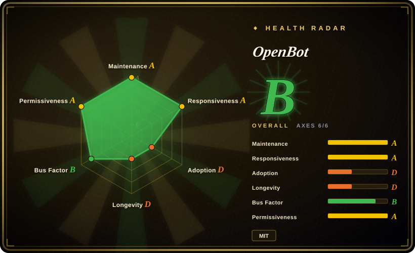
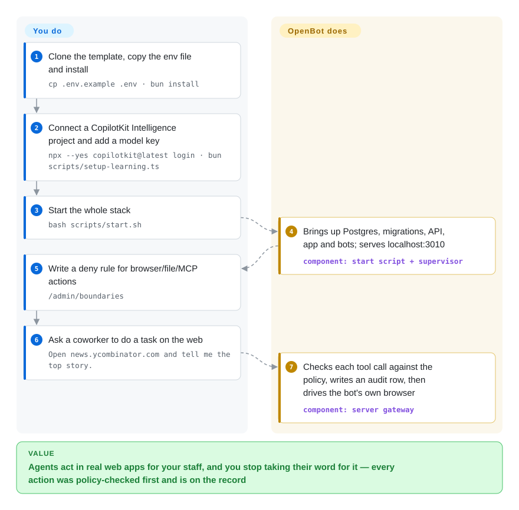

# OpenBot

Your company wants AI agents that actually click through web apps and edit files for staff, but nobody can answer "what did the bot submit on Tuesday, and who allowed it?" — and letting several agents share one logged-in browser is how an intern's bot ends up in finance's session. OpenBot is a clone-and-own company agent platform that gives each agent its own browser-and-shell container and routes every action through one gateway that checks a policy before acting and writes an audit row before anything happens.

## When to use

You run internal tools or IT at a company where people already want "a ChatGPT that can do things" — read an expense claim against policy, fill a vendor's web form, triage a ticket — and the blocker is not the model, it is governance. Legal asks for a record of every action; security wants a rule like "no bot presses Enter on a submit button" enforced, not promised in a prompt; and the agents your teams built live in three different frameworks. You clone OpenBot, point it at your PostgreSQL, sign people in with Google/Microsoft/Okta or your SAML/OIDC provider, and each "coworker" gets a channel, its own Chromium profile and `/workspace` volume, and only the MCP tools and skills an admin granted. When a bot hits a 2FA prompt it asks a person, who takes the wheel in the same panel and hands it back — and that handover is on the audit trail too.

Pick it over [LibreChat](../../../llm-chat-ui/librechat.md) or [Open WebUI](../../../llm-chat-ui/open-webui.md) when the deciding requirement is **governed action on a computer** (a CEL policy evaluated deny-first before every browser/file/shell/MCP call, with the refusing rule named in `/admin/audit`) rather than a multi-user chat window with tools. Pick it over [OpenMuse](../personal-assistants/openmuse.md) — the same vendor's personal agent — when you need many users, SSO and per-bot containers rather than one owner behind an access key. Pick it over a framework such as [eve](eve.md) when you want a finished product surface your staff open in a browser and your existing AG-UI agents (LangGraph, Mastra, CrewAI, Pydantic AI, ADK, hand-written) plug into, not a runtime you build the UI around.

## How it works

OpenBot ships the whole stack in one repo — React app, Hono API server, a per-bot "computer" (a container running Chromium plus a `/workspace` volume), a supervisor that creates one computer per bot, and sample agents — and you replace the example tenant package (`examples/fintech`) with your own coworkers, channels and skills. An agent is any endpoint speaking AG-UI (an open event protocol between an agent and a user interface), so the agent itself can live anywhere; what OpenBot owns is the path between that agent and the world. Every tool call the agent makes comes back to the server's gateway, which looks up the real target from its own snapshot, evaluates your CEL rules (CEL is Google's small expression language for policy checks — think a spreadsheet formula over `tool.name`, `page.host`, `command`), writes an audit row, and only then drives that bot's browser or shell — or refuses and names the rule. Like a company card with a spending policy: the employee still decides what to buy, but the card declines anything outside the rules and every swipe lands on a statement. Conversation history and memory are not stored by OpenBot itself: they live in CopilotKit Intelligence, a separate CopilotKit service (hosted, or self-hosted under separate terms) that the server refuses to start without.

<!-- flow-steps:begin (generated from flows/openbot.json by tools/flow_card.py — do not edit) -->

Text version of the flow

1. **You**: Clone the template, copy the env file and install — `cp .env.example .env · bun install`
2. **You**: Connect a CopilotKit Intelligence project and add a model key — `npx --yes copilotkit@latest login · bun scripts/setup-learning.ts`
3. **You**: Start the whole stack — `bash scripts/start.sh`
4. **OpenBot**: Brings up Postgres, migrations, API, app and bots; serves localhost:3010 — component: `start script + supervisor`
5. **You**: Write a deny rule for browser/file/MCP actions — `/admin/boundaries`
6. **You**: Ask a coworker to do a task on the web — `Open news.ycombinator.com and tell me the top story.`
7. **OpenBot**: Checks each tool call against the policy, writes an audit row, then drives the bot's own browser — component: `server gateway`

**Value**: Agents act in real web apps for your staff, and you stop taking their word for it — every action was policy-checked first and is on the record

<!-- flow-steps:end -->

## When NOT to use

- **You need a fully open, vendor-free stack.** The repo is MIT, but `server/src/config.ts` throws `CopilotKit Intelligence is required and is not configured` at boot if the Intelligence URL/key settings are missing (verified 2026-09-29), and CopilotKit's own docs state Intelligence has "separate terms" from the MIT SDKs. A request for a zero-credential local mode (issue #337) was closed as not planned. Use [LibreChat](../../../llm-chat-ui/librechat.md) or [Open WebUI](../../../llm-chat-ui/open-webui.md) when every server component must be open source you run.
- **You need to run air-gapped.** Beyond Intelligence, the out-of-the-box path needs a hosted model key and, for the desktop app, sends telemetry by default (opt out with `COPILOTKIT_TELEMETRY_DISABLED=true` or `DO_NOT_TRACK=1`, per `desktop/TELEMETRY.md`). Use [Open WebUI](../../../llm-chat-ui/open-webui.md) over local models instead.
- **You want governance for agents you already run, without adopting a product.** OpenBot's policy gateway is not a library you import; it only guards calls that flow through its own server and computers. Use [agent-governance-toolkit](../../../agent-governance/agent-governance-toolkit.md) to put policy and audit around an existing framework.
- **You want a dependency you can upgrade, not a fork you own.** The README calls it "a template, not a product": every workspace is `private`, nothing is published as a package, and you are expected to edit the tree. Tracking upstream means merging into your fork — 15 `v0.0.x` releases in ~5 weeks (latest v0.0.15, 2026-09-22) and database migrations already numbered to 0047 say the tree moves fast. Build on the CopilotKit SDK or a framework like [eve](eve.md) if you need a stable API boundary.
- **Per-bot isolation is your tenant boundary on serverless hosting.** Isolation comes from the supervisor, which needs the Docker socket; `docs/deployment.md` says serverless container platforms cannot run it, and without it every bot shares one browser, logins and files — "not fine as a boundary between tenants". Use the Helm chart on Kubernetes (`charts/openbot`) or a Docker host, or pick a dedicated sandbox platform.
- **You only need one person's assistant.** Multi-user auth, SSO, admin screens and per-bot containers are overhead for one owner. Use [OpenMuse](../personal-assistants/openmuse.md) (same vendor, single owner) or [Open Executive](open-executive.md) for a small-company leadership assistant.
- **You want an autonomous coding agent.** The shipped coworkers are office workflows (expenses, tickets, release notes); code work belongs in [OpenHands](../../coding-agents/orchestration-and-review/openhands.md).

## Comparison

| Alternative | In index | Our verdict | Tradeoff |
| --- | --- | --- | --- |
| [LibreChat](../../../llm-chat-ui/librechat.md) | ✅ | When staff need a multi-user, multi-model chat with agents and MCP tools and you want no vendor service in the path, pick LibreChat; pick OpenBot when agents must act in a browser/shell under a deny-first policy with a per-action audit trail. | LibreChat is a mature, fully open chat product; OpenBot adds per-bot computers, a policy gateway and take-the-wheel handover, and pays with a required CopilotKit Intelligence service and alpha maturity. |
| [Open WebUI](../../../llm-chat-ui/open-webui.md) | ✅ | When the goal is a polished self-hosted chat over local or hosted models, pick Open WebUI; pick OpenBot only when governed computer use is the actual requirement. | Open WebUI runs offline over local models; OpenBot cannot boot without Intelligence and a model key, but records and polices every action a bot takes. |
| [OpenMuse](../personal-assistants/openmuse.md) | ✅ | For one owner delegating errands from a phone app, pick OpenMuse; for a company rolling agents out to many people with SSO, admin grants and per-bot containers, pick OpenBot. | Same vendor, same Intelligence dependency and AG-UI core; OpenMuse is single-owner with a durable task engine, OpenBot is multi-user with a policy gateway and a heavier ops footprint. |
| [agent-governance-toolkit](../../../agent-governance/agent-governance-toolkit.md) | ✅ | When your agents already run in your own framework and you need policy/identity/audit middleware around them, pick agent-governance-toolkit; pick OpenBot when you also want the staff-facing product and the agents' computers. | The toolkit is embeddable SDKs with no UI or browser; OpenBot bundles UI, computers and gateway but only governs traffic that goes through its own server. |
| [Open Executive](open-executive.md) | ✅ | When a small company wants one executive voice over specialist agents and company docs, pick Open Executive; pick OpenBot when you need many role-specific coworkers that use a browser and files under audit. | Open Executive is a Python app with a packaged persona council and no required vendor service; OpenBot is framework-agnostic via AG-UI and governance-first, at the cost of Intelligence and Docker-level ops. |

## Tech stack

- **TypeScript** Bun 1.3 monorepo (`app`, `server`, `worker` workspaces), Biome for lint/format
- **Server** — Hono, `@copilotkit/runtime` 1.73, `@ag-ui/client`, Mastra, Better Auth (+ SSO), Drizzle ORM over PostgreSQL + pgvector, `cel-js` for policy, `@modelcontextprotocol/sdk`, `@composio/core`, Zod 4
- **App** — React + Vite UI; sandboxed components authored in `/admin/playground`
- **Computers** — Docker containers with Chromium driven via Playwright, optional gVisor (`COMPUTER_RUNTIME=runsc`)
- **Sample agents** — 14 `agent-*` bot directories (LangGraph, Mastra, CrewAI, Pydantic AI, Google ADK, Agno, AG2, LlamaIndex, Langroid, Strands, Microsoft Agent Framework, Claude SDK, and a proof-of-concept bot) beside `agent-computer`
- **Desktop** — Tauri (Rust) app under `desktop/`; **Kubernetes** — Helm chart `charts/openbot` (chart 0.1.3, appVersion 0.0.15)

## Dependencies

- **CopilotKit Intelligence** — required at boot (`INTELLIGENCE_API_URL`, `INTELLIGENCE_GATEWAY_WS_URL`, `INTELLIGENCE_API_KEY`); cloud-hosted free plan or self-hosted on Kubernetes/ECS under separate terms.
- A model provider key (OpenAI by default; Anthropic/Google for some sample bots; base URLs overridable for a gateway).
- PostgreSQL with the `vector` extension, or `EMBEDDED_POSTGRES=on` inside the published image.
- Docker (for the computers and the supervisor, which holds the Docker socket); Bun 1.3+ to run from source.
- For anyone but you: an identity provider (Google/Microsoft/Okta, or SAML/OIDC) plus TLS in front.
- Something external to fire routines and clean staged attachments on a schedule (`bun scripts/fire-routines.ts`, `bun scripts/cull-staged-attachments.ts`) when you run the single container; the Helm chart ships CronJobs for both.
- Optional: Composio account for its app catalogue; Google Drive / Notion MCP credentials.

## Ops difficulty

**High for a real deployment, medium for a laptop demo.** Locally, `bash scripts/start.sh` brings up Postgres, migrations, API, app, sample bots and the supervisor, and `.env.example` ships `OPENBOT_SINGLE_USER=true` so there is no sign-in to configure. Production is more: an identity provider, a real `KEY_ENCRYPTION_KEY`, TLS, a persistent volume mounted at the *parent* `/var/lib/postgresql` (the deployment doc explains how mounting the data dir itself yields a silent 502), 2–4 GB RAM per host plus ~100–200 MB per concurrent page, a Docker socket for per-bot isolation, and external schedulers for routines and attachment cleanup. Because you own a fork of an alpha that ships near-daily, day-2 is mostly merging upstream and re-running migrations; release images are digest-pinned in `container-images.json`, which `docs/releasing.md` recommends deploying over the moving `latest` tag.

## Health & viability

- **Maintenance (2026-09-29)**: very active — 446 commits since 2026-08-17, weekly commit counts 46–130 through September, last push 2026-09-28, 15 tagged releases (v0.0.1…v0.0.15, latest 2026-09-22), a user-facing CHANGELOG, CI plus a `zizmor` Actions security scan.
- **Governance / bus factor**: CopilotKit (vendor Organization) owns the roadmap; 33 contributors, the top two (`davidmckayv`, `kevin9327`) account for ~48% of the 446 commits, and outside PRs are being merged (e.g. #641, #649 from first-time contributors). A single vendor with a commercial service to sell, not a foundation.
- **Backing & longevity**: backed by the company behind the CopilotKit SDK (MIT, 37.6k stars, since 2023) and the AG-UI protocol. The repo itself is 43 days old — zero Lindy signal — and its README funnels to "have us build it with you", so OpenBot's future is tied to CopilotKit's Intelligence business.
- **Adoption**: 5.7k stars / 749 forks / 23 watchers in six weeks (2026-09-29) — a launch curve amplified by a Trendshift "#3 repository of the day" badge; no production users are named.
- **Risk flags**: self-labeled alpha; MIT app with a required separately-licensed service (open-core shape); security fixes already landed for bot shells reading deployment secrets (issues #66, #551, both closed) — expect more hardening churn; desktop telemetry on by default.

## Caveats (unverified)

- [未验证] Product behavior overall: this page comes from the README, `docs/deployment.md`, `prompt.txt`, `.env.example`, `CHANGELOG.md`, `desktop/TELEMETRY.md`, `package.json`/`server/package.json`, the Helm `Chart.yaml`, and a targeted read of `server/src/config.ts`; I did not install or run OpenBot.
- [未验证] CopilotKit Intelligence pricing, free-plan limits, and the exact self-hosting license terms — the docs say only "separate terms" and list a license step for self-hosting; not checked beyond that.
- [未验证] How strong the per-bot isolation is in practice (Docker default runtime vs gVisor, the Chromium sandbox off by default via `COMPUTER_SANDBOX`) — not tested; two secret-exposure issues were fixed, and others may exist.
- [推断] The star/fork velocity reflects launch promotion to CopilotKit's existing audience rather than production adoption; watchers (23) are low relative to stars.
- [未验证] Whether the top contributors are CopilotKit employees; org membership was not checked.
- [未验证] The 13 shipped example coworkers' output quality with any particular model — only their existence and roles were read from the README.
