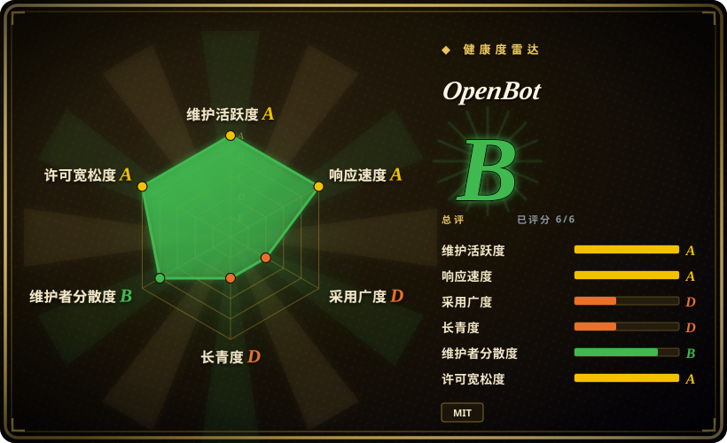
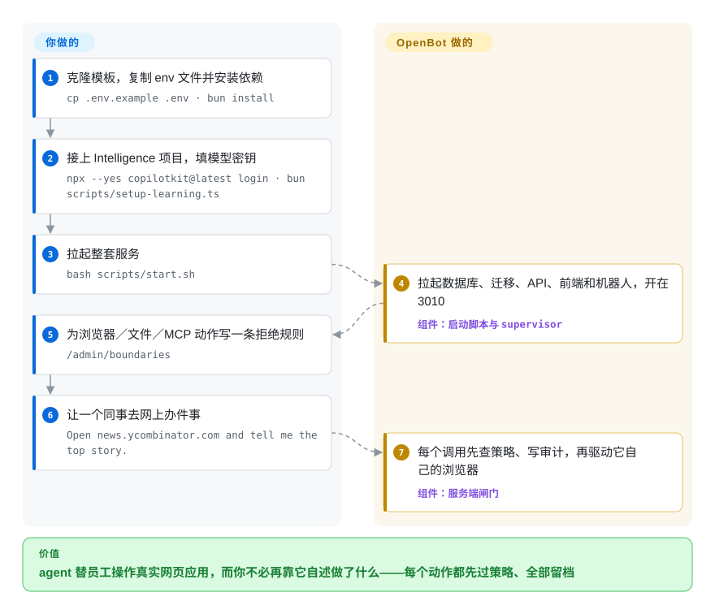

# OpenBot

公司想让 AI 替员工点网页、改文件，可没人答得上“周二那个机器人提交了什么、谁允许的”；几个 agent 共用一个已登录的浏览器，实习生的机器人就可能用上财务的会话。OpenBot 是一套克隆下来自己改的公司级 agent 平台：每个 agent 有自己的浏览器加 shell 容器，所有动作都经过同一道闸门——先按规则判定，写好审计记录，才真正执行。

## 何时使用

你在一家公司管内部工具或 IT，大家早就想要“能动手的 ChatGPT”：对照报销制度审一张报销单、填供应商网站上的表单、给工单分诊。卡住你的不是模型，而是治理：法务要每个动作都有记录；安全要“机器人不许在提交按钮上按回车”这种规则真的被执行，而不是写在提示词里求它自觉；而各团队做的 agent 分散在三个不同框架里。你把 OpenBot 克隆下来，接上自己的 PostgreSQL，用 Google／Microsoft／Okta 或公司的 SAML／OIDC 登录，每个“同事”（coworker）就有了自己的频道、自己的 Chromium 配置和 `/workspace` 卷，并且只拿得到管理员授权给它的 MCP 工具和技能。机器人碰到二次验证会找人求助，人在同一个面板里接过控制、办完再交还——这次交接本身也记进审计。

当决定性需求是**在电脑上受治理地动手**（每次浏览器／文件／shell／MCP 调用前先按“拒绝优先”评估一条 CEL 策略，被拒时 `/admin/audit` 里写明是哪条规则），而不只是一个带工具的多人聊天窗口时，选它而不是 [LibreChat](../../../llm-chat-ui/librechat.zh.md) 或 [Open WebUI](../../../llm-chat-ui/open-webui.zh.md)。需要多用户、SSO 和每个机器人一个容器，而不是一个主人守着一把访问密钥时，选它而不是同一厂商的个人 agent [OpenMuse](../personal-assistants/openmuse.zh.md)。想要员工直接在浏览器里用的成品界面、并把现有 AG-UI agent（LangGraph、Mastra、CrewAI、Pydantic AI、ADK 或手写的）直接接进来，而不是拿一个运行时再自己搭界面时，选它而不是 [eve](eve.zh.md) 这类框架。

## 怎么用起来

整套东西都在一个仓库里：React 前端、Hono API 服务、每个机器人一台“电脑”（跑着 Chromium 加一个 `/workspace` 卷的容器）、按机器人创建电脑的 supervisor，以及示例 agent；你要做的是把示例租户包（`examples/fintech`）换成自己的同事、频道和技能。agent 就是任何说 AG-UI 协议（agent 和用户界面之间的一套开放事件协议）的端点，所以 agent 本身可以部署在任何地方；OpenBot 管的是 agent 通往外部世界的那条路。agent 发出的每个工具调用都回到服务端的闸门：它从自己保存的快照里查出真实目标，评估你写的 CEL 规则（CEL 是 Google 的一种小型策略表达式语言，可以理解成对 `tool.name`、`page.host`、`command` 写的电子表格公式），写一条审计记录，然后才去驱动那个机器人的浏览器或 shell——或者拒绝并说出是哪条规则。就像一张带消费政策的公司卡：买什么还是员工自己定，但超出规则的刷卡会被拒，每一笔都会出现在账单上。对话历史和记忆不由 OpenBot 自己存，而是放在 CopilotKit Intelligence 里——这是 CopilotKit 的另一项服务（托管版，或按单独条款自托管），缺了它服务端直接拒绝启动。

<!-- flow-steps:begin (generated from flows/openbot.json by tools/flow_card.py — do not edit) -->

流程文字版

1. **你**：克隆模板，复制 env 文件并安装依赖 — `cp .env.example .env · bun install`
2. **你**：接上 Intelligence 项目，填模型密钥 — `npx --yes copilotkit@latest login · bun scripts/setup-learning.ts`
3. **你**：拉起整套服务 — `bash scripts/start.sh`
4. **OpenBot**：拉起数据库、迁移、API、前端和机器人，开在 3010 — 组件：`启动脚本与 supervisor`
5. **你**：为浏览器／文件／MCP 动作写一条拒绝规则 — `/admin/boundaries`
6. **你**：让一个同事去网上办件事 — `Open news.ycombinator.com and tell me the top story.`
7. **OpenBot**：每个调用先查策略、写审计，再驱动它自己的浏览器 — 组件：`服务端闸门`

**价值**：agent 替员工操作真实网页应用，而你不必再靠它自述做了什么——每个动作都先过策略、全部留档

<!-- flow-steps:end -->

## 何时不用

- **你要一套完全开源、不依赖任何厂商服务的栈。** 仓库是 MIT，但缺少 Intelligence 的地址／密钥配置时，`server/src/config.ts` 会在启动时抛出 `CopilotKit Intelligence is required and is not configured`（2026-09-29 核实），而 CopilotKit 自己的文档写明 Intelligence 与 MIT 的 SDK 适用“单独条款”。要求加一个零凭据本地模式的 issue #337 以 not planned 关闭。如果每个服务端组件都必须是你自己运行的开源软件，用 [LibreChat](../../../llm-chat-ui/librechat.zh.md) 或 [Open WebUI](../../../llm-chat-ui/open-webui.zh.md)。
- **你要在隔离网络里运行。** 除了 Intelligence，开箱路径还需要托管模型的密钥；桌面版默认开启遥测（按 `desktop/TELEMETRY.md`，用 `COPILOTKIT_TELEMETRY_DISABLED=true` 或 `DO_NOT_TRACK=1` 关闭）。这种场景改用接本地模型的 [Open WebUI](../../../llm-chat-ui/open-webui.zh.md)。
- **你只想给已经在跑的 agent 加治理，不想换一个产品。** OpenBot 的策略闸门不是可以 import 的库，只管得住经过它自己服务端和电脑的调用。要给现有框架套上策略和审计，用 [agent-governance-toolkit](../../../agent-governance/agent-governance-toolkit.zh.md)。
- **你要的是可升级的依赖，而不是自己维护的 fork。** README 明说它是“模板，不是产品”：所有 workspace 都是 `private`，不发布任何包，默认你会改源码。跟上游就意味着往自己的 fork 里合并——约 5 周发了 15 个 `v0.0.x` 版本（最新 v0.0.15，2026-09-22），数据库迁移已编号到 0047，变化很快。需要稳定的 API 边界，就在 CopilotKit SDK 或 [eve](eve.zh.md) 这类框架上自己搭。
- **你想在 serverless 平台上靠“每个机器人一个容器”做租户隔离。** 隔离靠 supervisor，而它需要 Docker socket；`docs/deployment.md` 写明 serverless 容器平台跑不了它，没有它时所有机器人共用一个浏览器、登录态和文件——“不适合作为租户之间的边界”。用 Kubernetes 上的 Helm chart（`charts/openbot`）或一台 Docker 主机，或者换专门的沙箱平台。
- **你只需要一个人的助手。** 多用户登录、SSO、管理页面和每机器人容器对单个主人都是负担。用同厂商的单人版 [OpenMuse](../personal-assistants/openmuse.zh.md)，或面向小公司管理层的 [Open Executive](open-executive.zh.md)。
- **你要的是自主编码 agent。** 自带的同事都是办公流程（报销、工单、发布说明）；写代码的活交给 [OpenHands](../../coding-agents/orchestration-and-review/openhands.zh.md)。

## 横向对比

| 替代品 | 是否收录 | 我们的评价 | 取舍 |
| --- | --- | --- | --- |
| [LibreChat](../../../llm-chat-ui/librechat.zh.md) | ✅ | 员工需要一个多用户、多模型、带 agent 和 MCP 工具的聊天界面，且链路上不想有任何厂商服务时，选 LibreChat；agent 必须在浏览器／shell 里按拒绝优先策略动手、并逐个动作留审计时，选 OpenBot。 | LibreChat 是成熟且完全开源的聊天产品；OpenBot 多了每机器人电脑、策略闸门和人工接管，代价是必须依赖 CopilotKit Intelligence，且还处在 alpha。 |
| [Open WebUI](../../../llm-chat-ui/open-webui.zh.md) | ✅ | 目标是一个精致的自托管聊天界面、接本地或托管模型时，选 Open WebUI；只有“受治理地操作电脑”才是真需求时才选 OpenBot。 | Open WebUI 可以接本地模型离线运行；OpenBot 没有 Intelligence 和模型密钥就起不来，但会记录并管住机器人的每个动作。 |
| [OpenMuse](../personal-assistants/openmuse.zh.md) | ✅ | 一个人用手机 App 派差事，选 OpenMuse；公司要把 agent 推给很多人，需要 SSO、管理员授权和每机器人容器，选 OpenBot。 | 同一厂商，同样依赖 Intelligence、同样以 AG-UI 为核心；OpenMuse 单主人、带持久任务引擎，OpenBot 多用户、带策略闸门，运维更重。 |
| [agent-governance-toolkit](../../../agent-governance/agent-governance-toolkit.zh.md) | ✅ | agent 已经跑在你自己的框架里、只缺策略／身份／审计中间件时，选 agent-governance-toolkit；还想要面向员工的产品界面和 agent 的电脑时，选 OpenBot。 | 工具包是可嵌入的 SDK，没有界面也没有浏览器；OpenBot 把界面、电脑和闸门打包在一起，但只治理经过它自己服务端的流量。 |
| [Open Executive](open-executive.zh.md) | ✅ | 小公司想要一个统领专家 agent 和公司文档的高管声音，选 Open Executive；需要很多按岗位分工、在审计下用浏览器和文件干活的同事，选 OpenBot。 | Open Executive 是自带人设委员会的 Python 应用，不依赖厂商服务；OpenBot 借 AG-UI 不绑定框架、以治理为先，代价是 Intelligence 依赖和 Docker 级运维。 |

## 技术栈

- **TypeScript**：Bun 1.3 monorepo（`app`、`server`、`worker` 三个 workspace），Biome 做 lint 和格式化
- **服务端**：Hono、`@copilotkit/runtime` 1.73、`@ag-ui/client`、Mastra、Better Auth（含 SSO）、Drizzle ORM 连 PostgreSQL + pgvector、策略用 `cel-js`、`@modelcontextprotocol/sdk`、`@composio/core`、Zod 4
- **前端**：React + Vite；沙箱组件在 `/admin/playground` 里编写
- **电脑**：跑 Chromium 的 Docker 容器，经 Playwright 驱动，可选 gVisor（`COMPUTER_RUNTIME=runsc`）
- **示例 agent**：14 个 `agent-*` 机器人目录（LangGraph、Mastra、CrewAI、Pydantic AI、Google ADK、Agno、AG2、LlamaIndex、Langroid、Strands、Microsoft Agent Framework、Claude SDK，外加一个概念验证机器人），旁边是 `agent-computer`
- **桌面端**：`desktop/` 下的 Tauri（Rust）应用；**Kubernetes**：Helm chart `charts/openbot`（chart 0.1.3，appVersion 0.0.15）

## 依赖

- **CopilotKit Intelligence**：启动必需（`INTELLIGENCE_API_URL`、`INTELLIGENCE_GATEWAY_WS_URL`、`INTELLIGENCE_API_KEY`）；可用云托管免费套餐，或按单独条款自托管在 Kubernetes／ECS 上。
- 一个模型服务商的密钥（默认 OpenAI；部分示例机器人支持 Anthropic／Google；base URL 可改指向网关）。
- 带 `vector` 扩展的 PostgreSQL，或在发布镜像里设 `EMBEDDED_POSTGRES=on`。
- Docker（电脑和持有 Docker socket 的 supervisor 需要）；从源码运行需要 Bun 1.3+。
- 只要不止你一个人用：一个身份提供方（Google／Microsoft／Okta，或 SAML／OIDC），前面再加 TLS。
- 单容器部署时，需要外部调度来触发定时任务、清理暂存附件（`bun scripts/fire-routines.ts`、`bun scripts/cull-staged-attachments.ts`）；Helm chart 两者都自带 CronJob。
- 可选：Composio 账号（接它的应用目录）；Google Drive／Notion 的 MCP 凭据。

## 运维难度

**真实部署偏高，笔记本演示中等。** 本地一条 `bash scripts/start.sh` 就拉起 Postgres、迁移、API、前端、示例机器人和 supervisor，`.env.example` 自带 `OPENBOT_SINGLE_USER=true`，不用配登录。生产要多做很多：身份提供方、真正的 `KEY_ENCRYPTION_KEY`、TLS、挂在*父目录* `/var/lib/postgresql` 上的持久卷（部署文档解释了直接挂数据目录为何会悄悄变成 502）、每台主机 2–4 GB 内存外加每个并发页面约 100–200 MB、为每机器人隔离准备 Docker socket，以及给定时任务和附件清理配外部调度。由于你维护的是一个几乎每天都在发版的 alpha 的 fork，日常运维主要是合并上游、重跑迁移；发布镜像在 `container-images.json` 里按 digest 固定，`docs/releasing.md` 建议部署这些 digest 而不是会变的 `latest` 标签。

## 健康度与可持续性

- **维护（2026-09-29）**：非常活跃——自 2026-08-17 起 446 次提交，九月每周 46–130 次，最后推送 2026-09-28，共 15 个 tag 版本（v0.0.1…v0.0.15，最新 2026-09-22），有面向运维者的 CHANGELOG，CI 之外还有 `zizmor` 的 Actions 安全扫描。
- **治理／巴士因子**：路线图归 CopilotKit（厂商组织）；33 位贡献者，前两位（`davidmckayv`、`kevin9327`）占 446 次提交的约 48%，外部 PR 也在合并（如首次贡献者的 #641、#649）。是一家有商业服务要卖的单一厂商，不是基金会。
- **背书与长期性**：背后是 CopilotKit SDK（MIT，3.76 万星，2023 年起）和 AG-UI 协议的公司。仓库本身只有 43 天——没有任何 Lindy 信号——README 还在引导“让我们帮你搭”，所以 OpenBot 的前途和 CopilotKit 的 Intelligence 生意绑在一起。
- **采用度**：六周 5.7k 星／749 fork／23 watcher（2026-09-29）——是被 Trendshift“当日第 3 名”徽章放大的发布曲线，没有点名的生产用户。
- **风险信号**：自标 alpha；MIT 应用 + 必需的另行授权服务（开放核心形态）；已修过机器人 shell 读取部署密钥的安全问题（#66、#551，均已关闭）——预计还会有加固带来的变动；桌面端默认开启遥测。

## 存疑（未验证）

- [未验证] 产品整体行为：本页依据 README、`docs/deployment.md`、`prompt.txt`、`.env.example`、`CHANGELOG.md`、`desktop/TELEMETRY.md`、`package.json`／`server/package.json`、Helm 的 `Chart.yaml`，以及对 `server/src/config.ts` 的定点阅读；没有安装或运行 OpenBot。
- [未验证] CopilotKit Intelligence 的价格、免费套餐限额和自托管的具体许可条款——文档只说“单独条款”并提到自托管有 license 步骤，没有进一步核实。
- [未验证] 每机器人隔离实际有多强（Docker 默认运行时还是 gVisor、`COMPUTER_SANDBOX` 默认不开 Chromium 自带沙箱）——没有测试；已修过两个泄露密钥的问题，可能还有别的。
- [推断] 星标和 fork 的增速反映的是面向 CopilotKit 既有受众的发布推广，而不是生产采用；watcher（23）相对星数很低。
- [未验证] 头部贡献者是否都是 CopilotKit 员工；没有核查组织成员身份。
- [未验证] 自带的 13 个示例同事在具体模型下的输出质量——只从 README 读到它们存在和各自职责。
