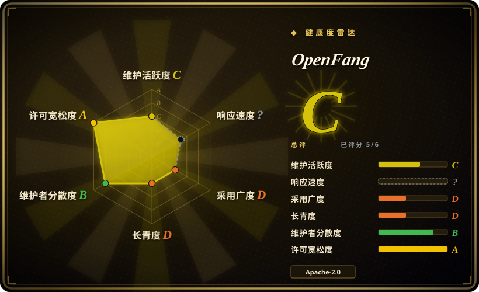
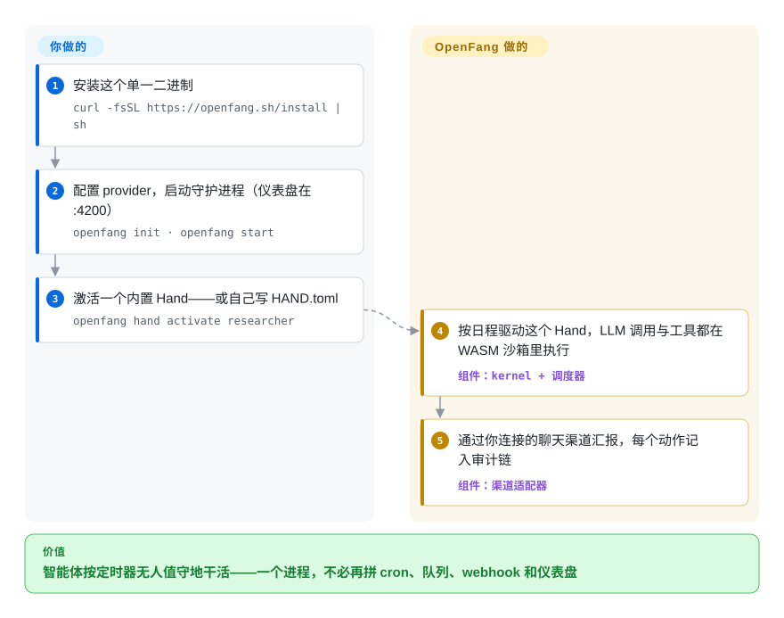

# OpenFang

一个用 Rust 写的“智能体操作系统”，以单个自包含二进制交付：它让自治智能体（"Hands"）按计划运行——7×24、无需你逐次提示——内置 kernel、调度器、WASM 工具沙箱、MCP 支持，以及 40 个消息渠道适配器。

## 何时使用

你是单干的创始人或小型运维团队，想要一个“按定时器干活”的智能体，而不是一个要你在对话框里盯着喂的。比如：每天早上抓取线索并按你的 ICP 打分、对竞品跑一轮 OSINT 变更检测、起草并定时发布 X/Twitter 内容，或让研究智能体交叉比对多源资料、给你一份带引用的简报——全部在你掌控的机器上无人值守运行。你不想把一个 Python 框架、一个 cron 守护进程、一个队列、一个仪表盘、再加上每个渠道的 webhook 胶水拼在一起；你想要一个进程，里面已经备好调度器、持久化、渠道适配器和护栏。OpenFang 用“操作系统”而非“库”的形态解决这件事：你 `openfang init`、放入一个 Hand（一份 `HAND.toml` 清单 + 系统提示 + skill 文档 + 审批门），它就按计划运行，通过 Telegram/Discord/Slack/WhatsApp 跟你对话，并把每个动作记入防篡改的审计链。

当你在意体积和自托管时它也合适。整套就是一个约 32 MB 的 Rust 二进制、空闲内存很低，所以放在小 VPS 或 homelab 机器上是可行的——换成笨重的 Python 智能体栈就会觉得不对劲；WASM 沙箱加上基于能力（capability）的访问控制，也给“让智能体去碰开放网络和你的账号”提供了一套安全说法。如果你正从 OpenClaw 迁移，OpenFang 明确在拉拢这部分人，提供迁移路径（专门的 `migrate` crate 与 README 章节，2026-09 核实在册）。

## 怎么用起来

OpenFang 以单个 Rust 二进制安装、以守护进程运行：`openfang init` 引导你配好 LLM provider，`openfang start` 启动一个 kernel，里面掌管调度器、SQLite 持久化、Web 仪表盘（`localhost:4200`）和 MCP/工具层。这个模型里的智能体叫 **Hand**——要么是内置的 7 个人设之一（researcher、lead、coder……），要么你自己写一份 `HAND.toml` 清单声明工具、设置与指标，再加系统提示和 skill 文档；一切编译进二进制，不下载、不用 pip install、不用 docker pull。激活一个 Hand（`openfang hand activate researcher`），调度器就按它自己的日程跑它——它去调你配置的 provider（README 称 27 家），工具在 **WASM 沙箱**里执行（WebAssembly：工具跑在进程内虚拟机里，受基于能力的访问控制约束，而不是拿守护进程的完整 shell），每个动作落进 Merkle 哈希链构成的防篡改审计记录。你可以 `openfang chat researcher` 跟它对话，或让它通过约 40 个渠道适配器之一来*找你*。留在你手上的：provider API key、渠道凭证、审批门与能力范围收敛，以及——鉴于 pre-1.0 状态——pin 到一个已知良好的版本。

<!-- flow-steps:begin (generated from flows/openfang.json by tools/flow_card.py — do not edit) -->

流程文字版

1. **你**：安装这个单一二进制 — `curl -fsSL https://openfang.sh/install | sh`
2. **你**：配置 provider，启动守护进程（仪表盘在 :4200） — `openfang init · openfang start`
3. **你**：激活一个内置 Hand——或自己写 HAND.toml — `openfang hand activate researcher`
4. **OpenFang**：按日程驱动这个 Hand，LLM 调用与工具都在 WASM 沙箱里执行 — 组件：`kernel + 调度器`
5. **OpenFang**：通过你连接的聊天渠道汇报，每个动作记入审计链 — 组件：`渠道适配器`

**价值**：智能体按定时器无人值守地干活——一个进程，不必再拼 cron、队列、webhook 和仪表盘

<!-- flow-steps:end -->

## 何时不用

- **你要的是会话式、在环路内的编排库，而不是一个 OS。** 如果你在自己的应用里搭一个请求/响应式智能体、需要对 LLM 调用图做细粒度控制，那么 [DSPy](../../workflow-builders/dspy.zh.md)、LangGraph 或 [AgentScope](../agent-sdks/agentscope.zh.md) 这类库更贴合——OpenFang 自己占有运行时、调度器和进程模型，正好是“嵌进我的服务里”的反面。
- **你需要成熟、API 稳定的底座。** 它明确处于 pre-1.0:README 警告会有粗糙之处、minor 版本之间会破坏兼容，生产环境请 pin 到具体 commit。今天就把业务关键管线建在它上面，意味着要承受频繁变动。
- **单厂商、年轻项目——而且公开仓库安静了下来。** 2026-02 创建，由一家公司（RightNow）主导；截至 2026-09，默认分支**自 2026-05-12 起无提交**（约 4 个半月），发版线也停在当日的 v0.6.9（其他分支的 push 到 2026-07 为止）。一个年轻、单组织、`main` 上停止落码的项目，带着多维护者基金会项目没有的弃坑与方向骤变风险。[推断：停滞判读基于公开提交，私有开发与否不可见]
- **你不信它的跑分/特性叙事。** README 以自跑对比开场（冷启动、空闲内存、“16 个安全系统”、“唯一带渠道适配器的”）。这些都是第一方、未经审计的——别在没有自测的情况下据此选型。[未验证]
- **你需要团队能扩展的语言/运行时。** 它从头到尾是 Rust；如果团队里没人写 Rust，那么在内置 Hand 之外（而非仅做配置）自己写新工具/Hand 的成本会很高。
- **合规/数据驻留，或规模化多租户 SaaS。** 它面向自托管的单运营者/小团队自治、基于 SQLite 的本地持久化；它不是托管的、横向扩展的多租户控制面。

## 横向对比

| 替代品 | 是否收录 | 我们的评价 | 取舍 |
|---|---|---|---|
| [DSPy](../../workflow-builders/dspy.zh.md) | ✅ | 需要用于“编程”和优化 LLM 管线的 Python 框架时，选 DSPy。 | 一个用于“编程”（并优化）LLM 管线的 Python 框架；你把它嵌进自己的应用。OpenFang 是反过来的：一个自己掌管调度与执行的自治运行时/OS，而非你去调用的库。 |
| [AgentScope](../agent-sdks/agentscope.zh.md) | ✅ | 需要面向开发者、显式控制多智能体应用的框架时，选 AgentScope。 | 面向开发者、用显式控制构建/编排多智能体应用的框架；OpenFang 用这份控制权，换来一个内置渠道与护栏、按计划驱动、开箱即用的 OS。 |
| [Symphony](symphony.zh.md) | ✅ | 当你的工作以跟踪器 issue 的形式到来（Linear/GitHub/Jira/Asana/GitLab）、希望每张工单变成一次隔离的 Codex 实现运行并以 PR 收尾时，选 Symphony；要的是常驻的多 provider 智能体与聊天渠道，就留在 OpenFang。 | Symphony 是窄的、OpenAI 形态的编排器（仅 Codex、预览阶段、状态在内存），以 spec 形式发布；OpenFang 占有整个运行时——调度器、27 家 provider 驱动、渠道、审计链——但没有第一方的 coding-agent 管线。 |
| [claude-octopus](../../coding-agents/orchestration-and-review/claude-octopus.zh.md) | ✅ | 当你只需要让几个 Claude Code agent 在一个仓库上并行干活——一个专用驱动器，而不是经营智能体群的平台——选 claude-octopus。 | 更窄的、以 Claude 为中心的编排工具；OpenFang 用这份专注换来了覆盖 27 provider、带调度器/渠道/审计链的通用 OS——学习面与运维面也大得多。 |
| [LangGraph](../agent-sdks/langgraph.zh.md) | ✅ | 需要在自有服务里构建有状态、交互式智能体图时，选 LangGraph。 | 在你自己服务里做有状态、交互式智能体图的 Python 默认选择；无内置调度器/渠道/二进制分发。OpenFang 把这一切反转成独立 OS。 |
| [OpenClaw](../personal-assistants/openclaw.zh.md) | ✅ | 需要 OpenFang 给自己设的对标对象及迁移来源时，选 OpenClaw。 | OpenFang 给自己设的对标对象，并提供从它迁移的路径；OpenFang 声称体积更小、有 OS 叙事。请自行核实该对比。 |
| [CrewAI](../agent-sdks/crewai.zh.md) / [AutoGen](../agent-sdks/autogen.zh.md) | ✅ | 需要面向角色/会话的 Python 多智能体框架来做应用内工作流时，选 CrewAI 或 AutoGen。 | 面向角色/会话的多智能体 Python 框架，用于应用内工作流；不是单二进制自治运行时。 |

## 技术栈

- **语言：** Rust（主语言，按 GitHub languages API 2026-09 约占字节 86%），仪表盘用 HTML/JS/CSS（合计约 10%），桌面端用 Tauri 2.0；另有少量 Python/Shell/PowerShell 安装脚本。
- **结构：** 一个约 14 crate 的 Cargo workspace——kernel（编排/调度/RBAC）、runtime（智能体循环、LLM 驱动、工具、WASM 沙箱、MCP）、api（REST/WS/SSE,OpenAI 兼容）、channels、memory、wire（P2P 协议）、CLI、desktop、migrate（crate 数/LOC 依 README）。
- **数据存储：** SQLite 持久化，加用于记忆的向量嵌入。
- **沙箱/安全：** WASM 工具沙箱、基于能力的访问控制、Merkle 哈希链审计、Ed25519 签名、提示注入扫描、SSRF 防护。
- **LLM/MCP:** 支持 Model Context Protocol；众多 provider 驱动（Anthropic、OpenAI、Gemini、Groq、DeepSeek、Ollama、vLLM 等——README 称 27 provider / 123+ 模型）。
- **渠道：** 约 40 个消息适配器（Telegram、Discord、Slack、WhatsApp 经 QR 网关、Signal、Matrix、Email、Teams 等）。

## 依赖

- **运行时：** 单个自包含二进制（README 称约 32 MB）；启动无需外部服务。通过 `curl … | sh`（macOS/Linux）或 PowerShell（Windows）安装。
- **可选：** 仅 WhatsApp Web（QR）网关需要 Node.js ≥ 18，该网关默认监听 3009 端口；仪表盘默认 4200 端口。
- **从源码构建：** 需要较新的 Rust 工具链 / Cargo（workspace 很大，全量构建并不轻量）。
- **外部：** 你路由到的 LLM provider 的 API key；本地模型则需 Ollama/vLLM 端点。

## 运维难度

**跑起来低，认真运营则中。** 顺路径确实很轻：一个二进制，`openfang init` / `openfang start`，一个本地仪表盘——更像跑一个 CLI 守护进程，而非部署 Python ML 栈，小体积也适合 VPS 或 homelab。一旦它开始干真活，难度就上来：你现在要为一个无人值守、对着真实账号和开放网络行动的智能体负责，因此必须配置审批门、收敛能力范围、管理密钥/API key、盯审计日志——再加上 pre-1.0 状态，升级时要 pin 到已知良好的 commit 并预留破坏性变更的成本。从源码构建或自己写新的 Rust 工具/Hand，对非 Rust 团队会推向**高**。

## 健康度与可持续性

- **响应速度**：无法计算——unknown。
- **维护——默认分支已停滞（截至 2026-09）。** `main` 最后提交 2026-05-12（距本次核查约 4 个半月）；最新发布仍是 v0.6.9（2026-05-12，针对 RUSTSEC 公告的安全补丁）；其他分支的 push 持续到 2026-07-02；未归档。6 月时它还读作「积极开发的 pre-1.0」；到 9 月，公开默认分支已安静——把发展势头当作未经证实，churn 风险的来源也从「快」变成了「停」。
- **治理与背书——单一厂商。** 由一家公司（RightNow / `RightNow-AI`）主导，而非基金会或多组织社区；路线图与延续性都系于该厂商。单厂商的 pre-1.0 项目带有方向骤变与弃坑风险，这是基金会项目所没有的——2026 年年中的公开停滞正是这类风险显形的形状。[推断]
- **年龄与 Lindy——非常年轻、未经证明。** 2026-02 创建，约 7 个月（截至 2026-09）。无历史沉淀；牢牢属于「年轻且被热捧」，而非 Lindy 安全——别在没承受 churn 准备的情况下把业务关键管线押在它上面。
- **采用——star 在涨、发版持平。** 约 18.2k star、约 2.3k fork（GitHub API，2026-09-27）——star 相比 6 月（约 17.9k）微涨，而发版线停在 v0.6.9；125 个未决 issue 提示有一批活跃但未被响应的用户。[推断：issue 积压含义未逐条阅读]
- **风险信号——第一方跑分 + 年轻单厂商 + 停滞。** 所有招牌数字（冷启动、内存、「27 provider / 40 渠道」、LOC）都是未经审计的 README 口径；许可为双授权 MIT OR Apache-2.0（无重许可历史）。主导风险是年轻 + 单厂商集中 + 默认分支安静，而非许可。

## 存疑（未验证）

- [未验证] 截至 2026-09 star 约 18.2k（18,209）——智能体框架领域的 GitHub star 不可靠且对时间敏感，仅供参考。
- [未验证] 所有跑分数字（冷启动约 180 ms、空闲内存约 40 MB、安装体积约 32 MB）以及“16 个安全系统 / 40 渠道 / 27 provider / 123+ 模型 / 14 crate / 137k LOC / 1,767+ 测试”均为 README 第一方数据，未经独立审计。
- [未验证] “唯一带消息渠道适配器的框架”以及与 LangGraph/CrewAI/AutoGen/OpenClaw 的延迟/内存对照都是项目自己的叙事；未找到第三方验证。
- [推断] 许可证为双授权 MIT OR Apache-2.0（仓库里 LICENSE-MIT 与 LICENSE-APACHE 并存；GitHub API 只暴露 Apache-2.0）——请确认条款对你的用途可接受。
- [推断] 单厂商（RightNow），2026-02 创建；对这么年轻的项目，维护广度与长期方向尚未被证明；默认分支自 2026-05-12 起的停滞，可能是转向、私有开发或漂移——从外部无法区分。
- [未验证] v0.6.9（2026-05-12 发布，“security patches”，修 RUSTSEC 公告）在 2026-09-27 复查时仍是最新发布（GitHub API）；两次核查间隔四个月，未出现新 tag。
- [推断] 具体的 crate/组件布局、provider 列表与渠道列表均按 README 概括（自 6 月核查以来默认分支同一 commit，README 未变）；依赖某个具体 provider/渠道/Hand 前请对照当前仓库核实。
