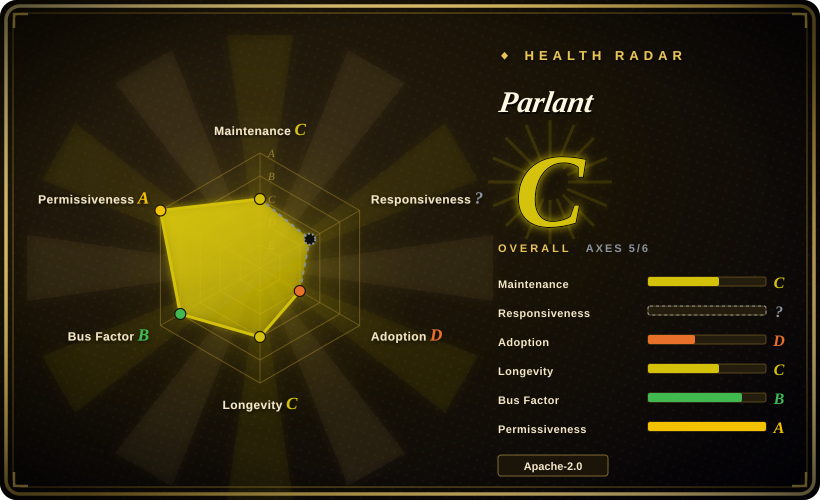
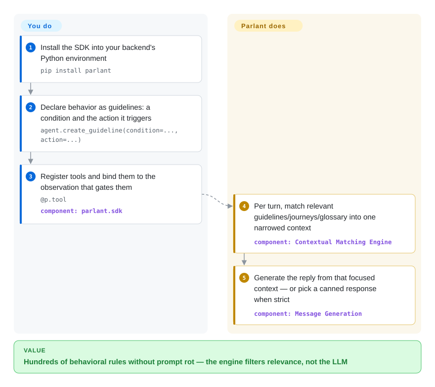

# Parlant

A Python framework for building reliable, controllable customer-facing LLM agents, where you steer behavior with declarative "guidelines" (behavioral rules that constrain what the agent does) rather than hand-tuning a mega-prompt and hoping it holds.

## When to use

You're an engineer at a company shipping a customer-facing support or sales agent — it talks to real customers, quotes prices, processes refunds, and answers policy questions. The bar isn't "demos well in a notebook"; it's "never promises a refund the policy forbids, never invents a discount, never goes off-script when a frustrated user pushes on it." You tried a single big system prompt and it mostly works, but under adversarial or long conversations it drifts: it follows instructions inconsistently, contradicts an earlier turn, or improvises a policy that doesn't exist. You need the agent to stay *on-rails* in ways you can audit and explain to compliance, not just "usually behave."

Parlant is built for exactly this lane. Instead of cramming everything into one prompt, you express behavior as **guidelines** — condition/action rules ("when the customer asks for a refund outside the return window, explain the policy and offer store credit instead") — plus tools the agent may call. The framework's job is to model the conversation and enforce that the agent actually applies the relevant guidelines at each turn, so the controllable, predictable behavior you'd otherwise try to coax out of prompt engineering becomes a structured, inspectable layer. Reach for it when the cost of an off-script answer is real (money, legal, brand) and you'd rather constrain the agent than trust it. The README positions it directly against hosted conversation platforms (Ada, Decagon, Sierra) as the open-source, self-hosted option, and it claims production deployments "at the most stringent organizations, including banks" — a first-party claim, but backed by named engineer testimonials (Slice Bank, JPMorgan Chase) as of 2026-09. [未验证：生产采用为厂商自述]

## How it works

Parlant runs as a Python server you embed in your own backend (`pip install parlant`; everything is driven through `parlant.sdk`). Instead of one mega-prompt, you declare behavior as objects: **guidelines** (condition → action rules), **journeys** (multi-step SOPs the agent follows but adapts), a **glossary** (domain terms and synonyms), **canned responses** (pre-approved templates), and **tools** (Python functions you register with `@p.tool`, bound to an "observation" that gates when they may fire). On each incoming customer message, the engine's contextual-matching layer decides which of those are relevant *this turn* and assembles a narrowed prompt — only the matched guidelines, the current journey step, and the related knowledge enter the model's context — then has the LLM compose its reply from that focused window; under a strict guideline it instead picks the canned response that best fits the draft, which is how it eliminates free-form wording at critical moments. What it does for you: per-turn context curation, tool-call gating, guideline priority/conflict rules (`exclude`, `dependencies`), and OpenTelemetry traces explaining why each guideline fired. What stays yours: authoring and maintaining the rule set, wiring the tools to your backends, choosing the model (OpenAI and Anthropic are the named recommendations, Emcie is the vendor's own Parlant-tuned API, anything else goes through LiteLLM with a warning that weak models drift), and running the service and its session storage.

<!-- flow-steps:begin (generated from flows/parlant.json by tools/flow_card.py — do not edit) -->

Text version of the flow

1. **You**: Install the SDK into your backend's Python environment — `pip install parlant`
2. **You**: Declare behavior as guidelines: a condition and the action it triggers — `agent.create_guideline(condition=..., action=...)`
3. **You**: Register tools and bind them to the observation that gates them — `@p.tool` — component: `parlant.sdk`
4. **Parlant**: Per turn, match relevant guidelines/journeys/glossary into one narrowed context — component: `Contextual Matching Engine`
5. **Parlant**: Generate the reply from that focused context — or pick a canned response when strict — component: `Message Generation`

**Value**: Hundreds of behavioral rules without prompt rot — the engine filters relevance, not the LLM

<!-- flow-steps:end -->

## When NOT to use

- **Your agent is simple or internal.** If it's a personal assistant, an internal dev tool, or a thin "call this LLM with a prompt" loop, Parlant's guideline/conversation-modeling machinery is overkill — a minimal agent library like [smolagents](../agent-sdks/smolagents.md) (or a raw provider SDK) has far less to learn for a low-stakes bot.
- **You want a free-form research/autonomous agent.** Parlant's whole point is *constraint*. For an exploratory ReAct/research agent that should range widely and improvise tool use, an opinionated guardrails-first model fights you; reach for a generic agent runtime instead.
- **Your problem is prompt/program *optimization*, not behavioral control.** If you're trying to compile and tune prompts/pipelines for quality, [DSPy](../../workflow-builders/dspy.md) is a different tool entirely — Parlant constrains behavior, it doesn't optimize prompts.
- **You need generic multi-agent orchestration / arbitrary control flow.** For graph/state-machine orchestration of many cooperating agents, a generic framework like [AgentScope](../agent-sdks/agentscope.md) or LangGraph is the closer fit; Parlant is opinionated toward *one* controllable conversational agent, not an orchestration substrate.
- **You're wary of single-vendor, young projects.** It's a ~2.6-year-old project driven by one company (Emcie), and its public cadence has decelerated in summer 2026 (last commit 2026-07-10, no release since April) [推断]; if you need a foundation-governed, long-proven framework with years of third-party recipes, that risk may outweigh the control benefits.
- **Lock-in to its modeling.** Behavior lives in Parlant's guideline/conversation abstractions. Adopting it means writing to its model; migrating off later means re-expressing that behavior elsewhere. Weigh that before betting a production support flow on it.

## Comparison

| Alternative | In index | Our verdict | Tradeoff |
|---|---|---|---|
| [AgentScope](../agent-sdks/agentscope.md) | ✅ | Choose AgentScope when you need a generic multi-agent serving framework with service/permission/sandbox/observability features. | Generic multi-agent serving framework (service/permission/sandbox/observability); "trust the model" loop, not a guardrails-first conversation model. Pick AgentScope to orchestrate/serve agents, Parlant to constrain one customer-facing agent. |
| [smolagents](../agent-sdks/smolagents.md) | ✅ | Choose smolagents when you need a minimal, code-first agent library. | Minimal, code-first agent library — small surface, great for simple/autonomous loops; no built-in behavioral-rule/guardrail layer, so high-stakes on-rails control is on you. |
| Rasa | 未收录 | Choose Rasa when you need a mature open-source conversational-AI/chatbot framework. | Mature open-source conversational-AI/chatbot framework (intents/stories/dialogue management); more classic NLU pipeline, heavier to operate, less LLM-native guideline modeling. |
| [LangGraph](../agent-sdks/langgraph.md) | ✅ | Choose LangGraph when you need graph/state-machine orchestration with explicit control flow and a large ecosystem. | Graph/state-machine orchestration with explicit control flow and a large ecosystem; you build guardrails yourself rather than getting a guideline-enforcement model out of the box. |
| Guidance / Guardrails (AI) | 未收录 | Choose Guidance/Guardrails when you only need output constraints for single-call structured generation. | Output-constraint / structured-generation libraries (constrain a single LLM call's format/validity); narrower than Parlant's conversation-level behavioral control across a multi-turn dialogue. |

## Tech stack

- **Language:** Python (≈94% of repo bytes per the GitHub languages API, 2026-09; a Gherkin test suite is the second-largest component). Requires Python 3.10+.
- **Core model:** declarative **guidelines** (condition → action behavioral rules) plus **observations**, **journeys** (multi-turn SOPs), **glossary terms**, **canned responses**, and **tools**, layered over a contextual-matching engine that decides which of them enter the model's context on each turn; guideline conflicts are resolved with explicit `exclude`/`dependencies` relations.
- **LLM backends:** provider-agnostic — the README names Emcie (the vendor's own Parlant-optimized API), OpenAI, and Anthropic as recommended, and any other model/provider via LiteLLM, with an explicit warning that models "too small" produce inconsistent results; models are swappable without changing behavioral configuration.
- **Observability:** built-in OpenTelemetry tracing of every guideline match and decision (logs/metrics/traces ship out of the box).
- **Surface:** ships as a Python package you embed/run as the agent backend (`import parlant.sdk as p`, an async server + agent/guideline/tool API), with its own session/conversation handling; an official React chat widget (`parlant-chat-react`) provides a drop-in frontend.

## Dependencies

- **Runtime:** Python ≥ 3.10 (per the README badge) plus the `parlant` package (`pip install parlant`).
- **Model provider:** at least one LLM API key — Parlant orchestrates and constrains model calls, it does not ship a model. Named options: Emcie, OpenAI, Anthropic, or anything reachable through LiteLLM.
- **Tools/integrations (yours):** any backend tools the agent should call (refund API, CRM, knowledge base, even another framework's graph — LangGraph/LlamaIndex/Agno flows are wrapped as Parlant tools) are code you write and register; those services are your infra to run.
- **External infra:** no heavyweight datastore/cluster is required to start; persistence/session storage specifics should be confirmed against current docs.

## Ops difficulty

**Medium.** Getting a first guideline-driven agent talking is straightforward — install the package, define a few guidelines and tools, point it at a model API. The work that justifies picking Parlant is the modeling: authoring and maintaining the guideline set so the agent behaves correctly across the messy long-tail of real customer conversations, testing that it actually stays on-rails under adversarial input, and versioning that behavioral spec as the policy changes. You also own the usual production concerns of an LLM service — model API keys/cost, latency, logging of conversations for audit, and the tool integrations behind the agent. It's not infrastructure-heavy; the difficulty is behavioral correctness and keeping the guideline model coherent as it grows.

## Health & viability

- **Responsiveness**: Cannot be scored — unknown.
- **Maintenance (2026-09):** active but decelerating — the default branch (`develop`) last received a commit 2026-07-10 and only ~2 commits landed since late June; the latest release is still v3.3.2 (2026-04-28) on PyPI. Not archived. The README has since been rewritten around a stronger commercial pitch ("production-ready", open-source alternative to Ada/Decagon/Sierra), which reads as a company focus on customers over repo churn. [推断：从公开信号推断，未见 roadmap]
- **Governance & bus factor (2026-06, re-checked 2026-09):** Organization-owned (`emcie-co` / Emcie), i.e. a single-vendor commercial startup rather than a neutral foundation (no Apache/LF/CNCF governance). That's a real **bus-factor and commercial-risk** consideration: roadmap and continuity follow one company's priorities and funding — and the vendor now also sells its own model (Emcie API) "built specifically for Parlant", so product and platform incentives are entangled. [推断]
- **Age & Lindy (2026-09):** created 2024-02, ~2.6 years old — still **young**, so the **Lindy prior is unproven**: it has momentum but not the multi-year track record that de-risks long-term bets. Use age × still-active here as "active but not yet seasoned."
- **Adoption & ecosystem:** ~18.3k GitHub stars (GitHub API, 2026-09-27); PyPI downloads 10,561/month and ~0 dependent repos on the dependency graph (health scorer, 2026-09), so *star* mindshare clearly outpaces *measured* adoption. The README now carries named production testimonials (Slice Bank, JPMorgan Chase principal engineer quotes) and ships an official React chat widget — first-party curated, but a step above anonymous hype. [未验证：生产采用]
- **Risk flags:** Apache-2.0 (permissive; the README explicitly markets "free for commercial use"; no relicense/CLA concerns observed). Main risks are **single-vendor governance**, **decelerating public cadence**, and **lock-in** to its guideline/conversation modeling. No CVEs were reviewed.

## Caveats (unverified)

- [未验证] Star count ~18.3k (18,294) as of 2026-09, from the GitHub API. Stars are unreliable and date-sensitive — treat as indicative only.
- [未验证] Latest release v3.3.2 published 2026-04-28 (still the newest tag and PyPI version as of 2026-09); default branch last commit 2026-07-10. Versions/dates shift — re-verify against the repo.
- [未验证] "Deployed in production at the most stringent organizations, including banks" and the Slice Bank / JPMorgan Chase quotes are first-party README material (curated testimonials, one with a misspelled company name); no independent confirmation of production adopters was obtained.
- [推断] The internal mechanism (how the contextual-matching engine scores and resolves guidelines per turn) is taken from the README's own diagrams and examples, not read line-by-line from source; confirm the architecture in current docs before relying on specifics.
- [未验证] Persistence/session storage backends and deployment topology are not confirmed here and may vary by version — read the current docs.
- [未验证] "Reliable / controllable / predictable" is the project's own framing (README), not an independently benchmarked claim about behavioral guarantees; LLM behavior is not guaranteed even under guideline constraints.
- [未验证] Relative comparisons (Rasa, LangGraph, Guidance/Guardrails, and indexed siblings) are positioning sketches, not benchmarked head-to-heads; verify each alternative's current scope before deciding. (The README itself now states the same split: Parlant = conversational governance, LangGraph = workflow automation, DSPy = prompt optimization.)
- [推断] Single-vendor (Emcie) backing and commercial/funding model are inferred from the GitHub owner being an Organization plus the vendor's own model offering; the company's runway and roadmap are not independently verified.
