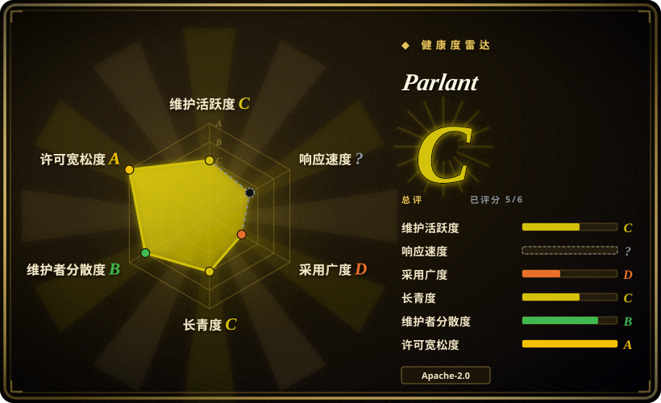
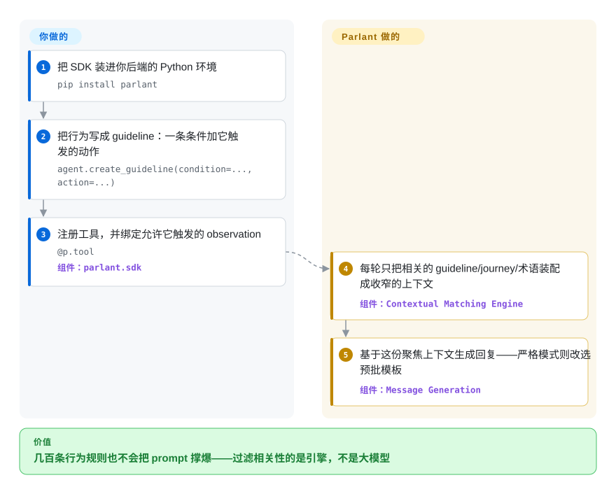

# Parlant

一个用于构建可靠、可控的面向客户 LLM agent 的 Python 框架——你用声明式的「guidelines」（约束 agent 行为的行为规则）来掌舵，而不是手调一个巨型 prompt 再祈祷它扛得住。

## 何时使用

你是某公司的工程师，要交付一个面向客户的支持或销售 agent——它直接和真实客户对话、报价、处理退款、回答政策问题。门槛不是「在 notebook 里 demo 得好看」，而是「绝不答应政策不允许的退款、绝不凭空编出折扣、被愤怒用户逼问时也绝不脱稿」。你试过一个大 system prompt，大体能跑，但在对抗性或长对话下它会漂移：指令执行时好时坏、和前一轮自相矛盾，或即兴编出一条根本不存在的政策。你需要这个 agent 以一种你能审计、能向合规解释的方式守在轨道上，而不只是「通常表现还行」。

Parlant 正是为这条线设计的。你不再把一切塞进一个 prompt，而是把行为表达成 **guidelines**——条件/动作规则（「当客户在退货窗口之外要求退款时，解释政策并改为提供 store credit」）——外加 agent 可调用的工具。框架的活儿就是对会话建模，并确保 agent 在每一轮真的应用了相关 guidelines，于是那种你本来要靠 prompt engineering 哄出来的可控、可预测行为，变成一层结构化、可检视的东西。当脱稿回答的代价是真金白银、法律或品牌时，你宁可约束 agent 而非信任它——那就该用它。README 把它直接对标托管对话平台（Ada、Decagon、Sierra），定位成开源自托管的那一个，并宣称已「在包括银行在内最苛刻的组织」投入生产——这是第一方说法，但 2026-09 有署名的工程师证言（Slice Bank、摩根大通）撑着。[未验证：生产采用为厂商自述]

## 怎么用起来

Parlant 以你嵌进自家后端的 Python 服务运行（`pip install parlant`，一切经 `parlant.sdk` 驱动）。不是一个巨型 prompt，而是把行为声明成对象：**guidelines**（条件 → 动作规则）、**journeys**（agent 遵循但会自适应的多步 SOP）、**glossary**（领域术语与同义词）、**canned responses**（预批模板），以及 **tools**（你用 `@p.tool` 注册的 Python 函数，绑一个 gating 它的「observation」）。每条客户消息进来，引擎的上下文匹配层判断*这一轮*哪些条目相关，装配出一份收窄的 prompt——只有匹配到的 guidelines、当前 journey 步骤和相关知识进入模型上下文——再让 LLM 基于这份聚焦窗口组织回复；命中严格 guideline 时则从草稿出发挑选最贴合的预批模板，这就是它在关键时刻消灭自由措辞的方式。它替你做的：逐轮上下文筛选、工具调用 gating、guideline 优先级/冲突裁决（`exclude`、`dependencies`），以及解释每条匹配为何触发的 OpenTelemetry 链路。留在你手上的：撰写维护规则集、把工具接到你的后端、选模型（README 点名 Emcie、OpenAI、Anthropic，其余经 LiteLLM）、以及跑起这个服务和它的会话存储。

<!-- flow-steps:begin (generated from flows/parlant.json by tools/flow_card.py — do not edit) -->

流程文字版

1. **你**：把 SDK 装进你后端的 Python 环境 — `pip install parlant`
2. **你**：把行为写成 guideline：一条条件加它触发的动作 — `agent.create_guideline(condition=..., action=...)`
3. **你**：注册工具，并绑定允许它触发的 observation — `@p.tool` — 组件：`parlant.sdk`
4. **Parlant**：每轮只把相关的 guideline/journey/术语装配成收窄的上下文 — 组件：`Contextual Matching Engine`
5. **Parlant**：基于这份聚焦上下文生成回复——严格模式则改选预批模板 — 组件：`Message Generation`

**价值**：几百条行为规则也不会把 prompt 撑爆——过滤相关性的是引擎，不是大模型

<!-- flow-steps:end -->

## 何时不用

- **你的 agent 很简单或纯内部用。** 如果它只是个人助手、内部开发工具，或一个薄薄的「拿 prompt 调一次 LLM」循环，那 Parlant 的 guideline/会话建模机制就是杀鸡用牛刀——像 [smolagents](../agent-sdks/smolagents.zh.md) 这种极简 agent 库（或裸 provider SDK）对低风险 bot 要学的东西少得多。
- **你想要自由发挥的研究/自治 agent。** Parlant 的全部要义就是*约束*。对于一个该广泛探索、即兴用工具的 ReAct/研究 agent，一个 guardrails 优先、带主张的模型会跟你对着干；那种场景请改用通用 agent 运行时。
- **你的问题是 prompt/程序*优化*，不是行为控制。** 如果你想编译并调优 prompt/流水线以提质量，[DSPy](../../workflow-builders/dspy.zh.md) 是完全不同的工具——Parlant 约束行为，不优化 prompt。
- **你需要通用的多智能体编排 / 任意控制流。** 要对许多协作 agent 做图/状态机式编排，像 [AgentScope](../agent-sdks/agentscope.zh.md) 或 LangGraph 这类通用框架更贴；Parlant 带主张地偏向*一个*可控的对话式 agent，而不是编排底座。
- **你对单一厂商、年轻项目心存戒备。** 它是个约 2 岁半、由一家公司（Emcie）主导的项目，且公开节奏在 2026 年夏天减速（最后提交 2026-07-10，4 月后未再发版）[推断]；如果你需要基金会治理、久经验证、有多年第三方配方的框架，这份风险可能盖过它带来的控制收益。
- **绑定到它的建模。** 行为活在 Parlant 的 guideline/会话抽象里。采用它意味着照它的模型来写；将来迁出又意味着把那套行为在别处重新表达一遍。把支持流程压在它身上前，先掂量这一点。

## 横向对比

| 替代品 | 是否收录 | 我们的评价 | 取舍 |
|---|---|---|---|
| [AgentScope](../agent-sdks/agentscope.zh.md) | ✅ | 需要带 service、权限、沙箱和可观测能力的通用多智能体服务框架时，选 AgentScope。 | 通用多智能体服务框架（service/权限/沙箱/可观测）；走「信任模型」的循环，不是 guardrails 优先的会话模型。要编排/服务 agent 选 AgentScope，要约束一个面向客户的 agent 选 Parlant。 |
| [smolagents](../agent-sdks/smolagents.zh.md) | ✅ | 需要极简、代码优先的 agent 库时，选 smolagents。 | 极简、代码优先的 agent 库——面小，适合简单/自治循环；没有内建的行为规则/guardrail 层，所以高风险的守轨控制要你自己扛。 |
| Rasa | 未收录 | 需要成熟的开源对话式 AI/聊天机器人框架时，选 Rasa。 | 成熟的开源对话式 AI/聊天机器人框架（intents/stories/对话管理）；更偏经典 NLU 流水线，运维更重，LLM 原生的 guideline 建模更弱。 |
| [LangGraph](../agent-sdks/langgraph.zh.md) | ✅ | 需要控制流显式、生态庞大的图/状态机式编排时，选 LangGraph。 | 图/状态机式编排，控制流显式、生态庞大；guardrail 要你自己搭，而非开箱即得一个 guideline 执行模型。 |
| Guidance / Guardrails（AI） | 未收录 | 只需要约束单次结构化生成输出时，选 Guidance 或 Guardrails。 | 输出约束 / 结构化生成库（约束单次 LLM 调用的格式/合法性）；比 Parlant 跨多轮对话的会话级行为控制更窄。 |

## 技术栈

- **语言：** Python（按 GitHub languages API 2026-09 约占仓库字节 94%，第二大成分是 Gherkin 测试套件）。要求 Python 3.10+。
- **核心模型：** 声明式 **guidelines**（条件 → 动作的行为规则）外加 **observations**、**journeys**（多轮 SOP）、**glossary** 术语、**canned responses** 与 **tools**，叠在一个上下文匹配引擎之上，由该引擎决定每一轮哪些条目进入模型上下文；guideline 冲突用显式的 `exclude`/`dependencies` 关系裁决。
- **LLM 后端：** 与 provider 无关——README 点名 Emcie（厂商自家为 Parlant 优化的 API）、OpenAI、Anthropic 为推荐项，其余模型/provider 经 LiteLLM 接入，并明确警告「太小」的模型会产出前后不一致的结果；换模型不必改行为配置。
- **可观测性：** 内建 OpenTelemetry，逐条记录每个 guideline 匹配与决策（logs/metrics/traces 开箱即有）。
- **形态：** 以 Python 包发布，作为 agent 后端嵌入/运行（`import parlant.sdk as p`，异步 server + agent/guideline/tool API），自带会话/对话处理；官方还有即插即用的 React 聊天组件（`parlant-chat-react`）。

## 依赖

- **运行时：** Python ≥ 3.10（README 徽章）加 `parlant` 包（`pip install parlant`）。
- **模型 provider：** 至少一个 LLM API key——Parlant 编排并约束模型调用，它本身不带模型。README 点名的选项：Emcie、OpenAI、Anthropic，或经 LiteLLM 接入的任意 provider。
- **工具/集成（你自己的）：** agent 要调用的后端工具（退款 API、CRM、知识库，甚至另一个框架的图——LangGraph/LlamaIndex/Agno 流程可包成 Parlant tool）是你写并注册为 tools 的代码；那些服务是你要跑的基础设施。
- **外部基础设施：** 起步不需要重型数据存储/集群；持久化/会话存储的具体做法请对照当前文档确认。

## 运维难度

**中。** 让第一个 guideline 驱动的 agent 开口很直接——装包、定义几条 guideline 和 tool、指向一个模型 API。真正值回「为什么选 Parlant」的功夫在建模：撰写并维护 guideline 集，让 agent 在真实客户对话杂乱的长尾里都行为正确，测试它在对抗性输入下真的守轨，并随政策变化为这份行为 spec 做版本管理。你同样要担 LLM 服务的常规生产问题——模型 API key/成本、延迟、为审计记录对话，以及 agent 背后的工具集成。它不算基础设施重；难点在行为正确性，以及在 guideline 模型变大时让它保持自洽。

## 健康度与可持续性

- **响应速度**：无法计算——unknown。
- **维护（2026-09）：** 活跃但在减速——默认分支（`develop`）最后提交是 2026-07-10，6 月下旬以来只落了约 2 个提交；最新发布仍是 v3.3.2（2026-04-28，PyPI 同步）。未归档。README 此后重写为更强的商业叙事（「production-ready」、Ada/Decagon/Sierra 的开源替代），读起来是公司重心转向客户而非仓库 churn。[推断：从公开信号推断，未见 roadmap]
- **治理与 bus factor（2026-06，2026-09 复查）：** Organization 持有（`emcie-co` / Emcie），即一家单一厂商的商业创业公司，而非中立基金会（无 Apache/LF/CNCF 治理）。这是个实打实的 **bus-factor 与商业风险**考量：路线图和延续性跟随一家公司的优先级与资金——而且该厂商现在还卖自家「专为 Parlant 而建」的 Emcie 模型 API，产品与平台利益互相纠缠。[推断]
- **年龄与 Lindy（2026-09）：** 创建于 2024-02，约 2 岁半——仍然**年轻**，因此 **Lindy 先验未经验证**：它有势头，但还没有那种为长期下注托底的多年记录。这里用「年龄 × 仍活跃」读作「活跃但尚未老练」。
- **采用与生态：** 约 18.3k GitHub star（GitHub API，2026-09-27）；但 PyPI 月下载 10,561、依赖图上约 0 个下游仓库（健康度评分器，2026-09），**star 声量明显跑在实测采用前面**。README 现已挂出署名的生产证言（Slice Bank、摩根大通工程师），并配官方 React 聊天组件——第一方策展，但比匿名热度高一档。[未验证：生产采用]
- **风险标记：** Apache-2.0（宽松；README 明确主打「商用免费」；未见 relicense/CLA 顾虑）。主要风险是**单一厂商治理**、**公开节奏减速**，外加对其 guideline/会话建模的**绑定**。未审 CVE。

## 存疑（未验证）

- [未验证] 截至 2026-09，star 约 18.3k（18,294），来自 GitHub API。star 不可靠且对时间敏感——仅供参考。
- [未验证] 最新发布 v3.3.2 于 2026-04-28（截至 2026-09 仍是 tag 与 PyPI 上的最新版）；默认分支最后提交 2026-07-10。版本/日期会变——请对照仓库重新核实。
- [未验证] 「在包括银行在内最苛刻的组织投入生产」以及 Slice Bank / 摩根大通的引言均为 README 第一方素材（策展证言，其中一家公司名还拼错了）；未获得生产用户的独立确认。
- [推断] 内部机制（上下文匹配引擎如何逐轮打分/裁决 guidelines）取自 README 自己的图例与示例，并非逐行读源码得出；依赖具体细节前请在当前文档里确认架构。
- [未验证] 持久化/会话存储后端与部署拓扑这里未确认，且可能随版本变动——请读当前文档。
- [未验证] 「可靠 / 可控 / 可预测」是项目自己的表述（README），并非经独立跑分验证的行为保证；即便在 guideline 约束下，LLM 行为也不被保证。
- [未验证] 相对对比（Rasa、LangGraph、Guidance/Guardrails 以及已收录的同类）是定位草图，不是跑分过的正面对决；选型前请核实每个替代品的当前 scope。（README 自己也给出了同一划分：Parlant 管会话治理，LangGraph 管工作流自动化，DSPy 管 prompt 优化。）
- [推断] 单一厂商（Emcie）背书及其商业/资金模型，是从 GitHub owner 为 Organization 加厂商自营模型业务推断而来；该公司的资金跑道与路线图未经独立验证。
