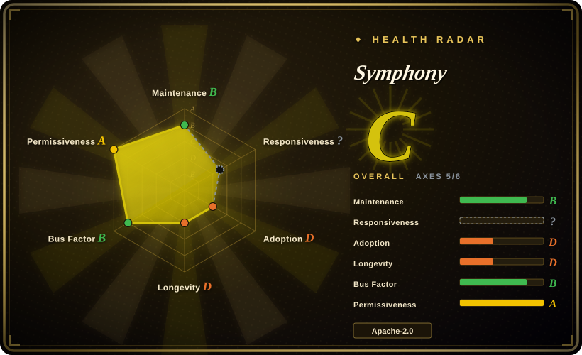
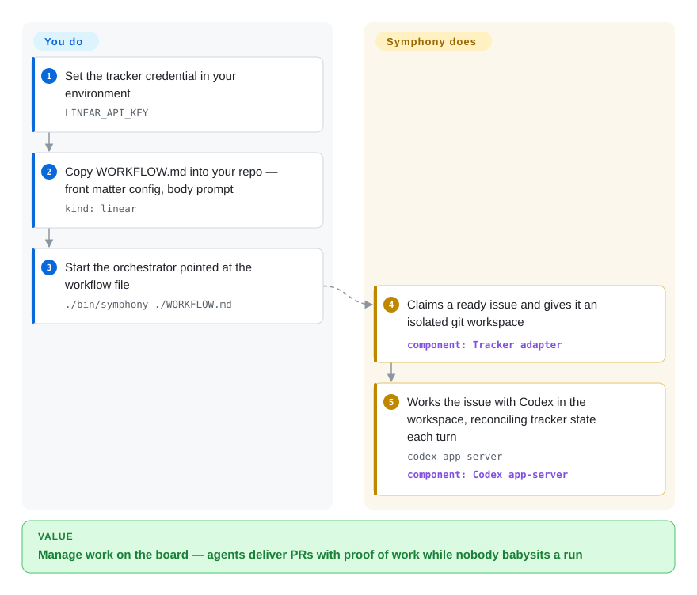

# Symphony

A long-running orchestrator from OpenAI that polls your issue tracker (Linear, GitHub Issues, Jira, Asana, or GitLab), spins up an isolated workspace per issue, and drives a coding-agent session (Codex) to completion — so you manage *work* instead of babysitting agents.

## When to use

You're an engineering lead on a team that already runs a Codex-based coding agent, and your bottleneck has shifted: the agent can implement tasks, but a human still has to babysit each run — kick it off, watch the turns, shepherd it to a PR, and start the next one. Your backlog lives in Linear and you want the queue itself to be the interface: an issue moves into a "ready" state, something picks it up, gives it a clean isolated workspace, runs the agent against it, and reports back. Symphony is built for exactly this loop. It's a polling orchestrator: it reads work from your Linear board, renders a prompt from the issue context, launches a Codex `app-server` subprocess inside a per-issue workspace, streams the turns, and reconciles tracker state after each turn — retrying or cleaning up based on the outcome.

Because the orchestration contract is published as a language-agnostic spec ("Draft v1", still current as of 2026-09) with Elixir as the *reference* implementation, it also fits if you want to study or fork the dispatch/reconciliation model rather than adopt the binary as-is. The isolation-per-issue design (one workspace per ticket, preserved after success for reuse) is the part you reach for when you're trying to run several autonomous attempts in parallel without them stepping on each other's working trees.

## How it works

Symphony runs as one long-lived service on a trusted machine, configured through a `WORKFLOW.md` file: YAML front matter holds the wiring (which tracker, which project, workspace root, Codex sandbox settings) and the Markdown body becomes the prompt given to every agent session. On boot it enters a polling loop — ask the tracker for issues in a "ready" state, claim one, and create a **workspace** for it: a fresh, isolated git checkout of your repo under a per-issue directory, so parallel runs never touch each other's files. Inside that workspace Symphony launches a `codex app-server` subprocess — Codex's machine-facing mode, where a program drives the agent over stdio instead of a human typing in a terminal — streams the turns, and **reconciles** after each one: it writes progress back to the tracker (comments, state moves like "Human Review"/"Merging"), stops and cleans up if the issue goes terminal, or marks the issue blocked in memory if the agent needs approval. What Symphony does for you: dispatch, isolation, prompt rendering, tracker bookkeeping. What stays yours: the Codex install and its credentials, the tracker adapter choice, and all durability — the scheduler state is intentionally in-memory, so a restart re-derives everything from tracker state.

<!-- flow-steps:begin (generated from flows/symphony.json by tools/flow_card.py — do not edit) -->

Text version of the flow

1. **You**: Set the tracker credential in your environment — `LINEAR_API_KEY`
2. **You**: Copy WORKFLOW.md into your repo — front matter config, body prompt — `kind: linear`
3. **You**: Start the orchestrator pointed at the workflow file — `./bin/symphony ./WORKFLOW.md`
4. **Symphony**: Claims a ready issue and gives it an isolated git workspace — component: `Tracker adapter`
5. **Symphony**: Works the issue with Codex in the workspace, reconciling tracker state each turn — `codex app-server` — component: `Codex app-server`

**Value**: Manage work on the board — agents deliver PRs with proof of work while nobody babysits a run

<!-- flow-steps:end -->

## When NOT to use

- **Your tracker is not one of the five bundled adapters.** As of 2026-09 the Elixir implementation ships adapters for **Linear, GitHub Issues, Jira Cloud, Asana, and GitLab** (`tracker.kind` selects one) — a big change from the June "Linear only" spec. Anything else (Trello, Shortcut, an internal system) still means writing your own adapter against the SPEC.md contract, and the reference `WORKFLOW.md` example additionally depends on non-standard Linear statuses ("Rework", "Human Review", "Merging") you must set up in Team Settings.
- **You don't use Codex.** The agent session is a `codex app-server` subprocess; sandbox policy and model selection are Codex's. The spec's one requirement is "a coding-agent executable that supports the targeted Codex app-server mode" — there's still no first-class adapter for Claude Code, Aider, or other CLIs; swapping the agent means rewriting the session layer. [推断]
- **You need production-grade durability.** State is a single **in-memory** state machine — the spec says "Current design is intentionally in-memory for scheduler state" and "Blocked entries are in memory only; restarting the orchestrator clears that blocked map." There's no Postgres/Redis backing store, so a crash or restart loses dispatch/retry/blocked state and re-derives work from the tracker. This is a coordinator for trusted runs, not an HA job system.
- **You want a stable, versioned product.** Releases now exist — v0.0.1 → v0.0.3 (2026-09-15), shipped as self-contained Burrito binaries for macOS/Linux plus a rolling `nightly` prerelease — but the README still warns this is a **"low-key engineering preview for testing in trusted environments"**, and it is v0.0.x: spec sections and config keys can move under you, and issues are disabled on the repo, so you are the QA.
- **You want strong multi-tenant security boundaries.** Isolation is filesystem-level (a workspace per issue) plus whatever the Codex sandbox enforces — the spec defers `thread_sandbox` / `turn_sandbox_policy` values to the targeted Codex app-server version rather than enumerating them. It is not VM/container-per-run isolation by default, and Codex's full-access tier exists — running untrusted issues this way is a real risk.
- **You want a heavy multi-agent framework (planner/critic/tools graph).** Symphony orchestrates *runs* of one agent against tracker issues; it is not a role-based agent graph like AutoGen/CrewAI.

## Comparison

| Alternative | In index | Our verdict | Tradeoff |
|---|---|---|---|
| [openfang](openfang.md) | ✅ | Choose Symphony when the work queue *is* the interface — issues in, isolated Codex runs out, PRs with proof of work; pick OpenFang when you want a self-hosted "agent OS" running scheduled autonomous agents that report over chat channels. | Symphony is a narrow tracker→workspace→Codex orchestrator (preview-stage, in-memory state); OpenFang is a general multi-provider runtime with its own scheduler, ~40 channel adapters, and a WASM tool sandbox. |
| [claude-octopus](../../coding-agents/orchestration-and-review/claude-octopus.md) | ✅ | Choose claude-octopus when you need multiple Claude Code agents running in parallel. | Orchestrates multiple Claude Code agents in parallel; Symphony is Codex-centric and tracker-driven (Linear), so the choice often follows which agent CLI you've standardized on. |
| [AgentScope](../agent-sdks/agentscope.md) | ✅ | Choose AgentScope when you need a general multi-agent runtime/framework for building agent apps. | General multi-agent runtime/framework for building agent apps; Symphony is narrower — a queue→workspace→agent-run orchestrator, not a framework to compose agents. |
| [DSPy](../../workflow-builders/dspy.md) | ✅ | Choose DSPy when you need to program/optimize LLM pipelines rather than schedule whole implementation runs. | Programs/optimizes LLM pipelines; orthogonal problem — DSPy builds the agent's reasoning, Symphony schedules and isolates whole implementation runs. |
| Devin / Cognition (hosted) | 未收录 | Choose Devin/Cognition when hosted autonomous-engineer SaaS is acceptable. | Hosted "autonomous engineer" SaaS covering a similar manage-the-work pitch; closed, no self-host, no fork. Symphony is OSS and self-hosted but preview-stage. |
| GitHub Actions + agent CLI (DIY) | 未收录 | Choose GitHub Actions plus an agent CLI when you want roll-your-own issue-triggered agent runs. | Roll-your-own: CI triggers an agent on issues. More control and durable infra (CI runners), but you build the dispatch/reconciliation/isolation that Symphony gives you. |

## Tech stack

- **Language:** Elixir (~97% of repo bytes per the GitHub languages API, 2026-09; small Python/CSS/Shell/Dockerfile/Makefile tail).
- **Runtime/observability:** Elixir/OTP application; an optional Phoenix LiveView dashboard plus a JSON runtime-state API, enabled with `--port` (default: off).
- **Toolchain:** `mise` for version management; `mix` for build/run (`mix setup`, `mix build`, `./bin/symphony ./WORKFLOW.md`). Ships as self-contained **Burrito** binaries (macOS/Linux, arm64/x86_64) that embed Erlang/OTP + Elixir + Symphony.
- **Agent backend:** OpenAI Codex via `codex app-server`, configured by `codex.command`, `codex.thread_sandbox`, and `codex.turn_sandbox_policy` (allowed values defined by the targeted Codex version).
- **Work source:** tracker adapters for **Linear (`linear`), GitHub Issues, Jira Cloud, Asana, GitLab** — `tracker.kind` selects one; each adapter advertises a provider-native tool (e.g. `linear_graphql`, `github_api`) that Symphony executes with host-side auth, stripping tracker tokens from the Codex child process.
- **Config:** a `WORKFLOW.md` workflow file plus per-issue workspace hooks (e.g. `hooks.after_create` running `git clone`).

## Dependencies

- **Runtime:** Elixir/OTP for source runs (versions managed via `mise install`, no stated floor); Burrito binaries embed the runtime but still expect `codex`, `git`, and tracker credentials on the machine. [未验证] exact version floor.
- **Agent:** a working Codex install/CLI reachable as `codex app-server` (you supply OpenAI credentials/model access to Codex).
- **Tracker:** one supported tracker (Linear / GitHub Issues / Jira Cloud / Asana / GitLab) plus its API credential, e.g. `LINEAR_API_KEY`.
- **Git:** git available for per-issue workspace `git clone` in workspace hooks.
- **No database/cache required:** orchestrator state is in-memory only (so no Postgres/Redis to operate, but also no durability).
- **Optional:** Docker (`docker compose`) only for SSH-worker testing; Phoenix observability dashboard via `--port`.

## Ops difficulty

**Medium.** The dependency surface is modest — no database to run, a single Elixir service plus an external Codex CLI and a tracker key — and a small team comfortable with the BEAM toolchain (`mise` + `mix`) can stand it up from the Elixir README; Burrito binaries remove even the runtime install. The difficulty is operational rather than installational: because state is in-memory, you own restart/recovery semantics, and because it's a v0.0.x preview (first tags landed 2026-07/09), expect to read source and track `main` or `nightly` rather than pin a long-support version. Running real implementation runs safely (sandbox policy, what full-access is allowed to touch, secret handling for Codex/tracker) is where the actual ops burden lives.

## Health & viability

- **Responsiveness**: Cannot be scored — issues_disabled.
- **Maintenance — active, preview-stage (as of 2026-09).** Last commit to `main` 2026-09-15; not archived. Releases now exist — v0.0.1, v0.0.2 (2026-07-24), v0.0.3 (2026-09-15), with a rolling `nightly` Burrito prerelease built from every push to `main` — but there is still no semver promise: it remains a self-described "low-key engineering preview," so you track `main`/`nightly` rather than a long-support line, and config keys can change without notice. GitHub issues are disabled on the repo, so external demand signals (and support expectations) are thin.
- **Governance & backing — strong vendor (OpenAI), weak product commitment.** Owned by `openai`, so the backing org's resources and longevity are not in doubt — but a "low-key preview" carries no product/SLA commitment, and large vendors do shelve experiments. Backing strength does not equal roadmap guarantee here.
- **Age & Lindy — young, unproven.** Created 2026-02, ~7 months old (as of 2026-09). Still no track record and preview-stage; strong-backer but young-and-unproven — the OpenAI name raises the floor, but Lindy does not yet apply.
- **Adoption — visible hype, thin verifiable usage.** ~27.4k stars (GitHub API, 2026-09-27) within seven months of creation signals strong interest, but with issues disabled and v0.0.x releases there is little public evidence of settled production use. [推断]
- **Risk flags — no durability, preview API.** Apache-2.0 (no relicense risk), but in-memory-only state (a restart loses dispatch/blocked state), Codex + specific-tracker coupling, and v0.0.x churn mean the risk is product-maturity, not licensing.

## Caveats (unverified)

- [未验证] Star count ~27.4k as of 2026-09 — GitHub stars in this ecosystem are unreliable and date-sensitive; treat as indicative only.
- [未验证] No "settled production use" evidence was found because GitHub issues are disabled on the repo; community adoption beyond stars/forks is not observable from outside.
- [推断] No first-class adapter for non-Codex agents (Claude Code, Aider, etc.) — inferred from the spec/README describing only the Codex `app-server` session; not explicitly confirmed as unsupported.
- [推断] Isolation is filesystem-workspace + Codex sandbox policy, not container/VM-per-run by default — inferred from the workspace description; verify the threat boundary before running untrusted issues.
- [未验证] Elixir/OTP/Phoenix version floors are not stated in the docs read; `mise` resolves them from project config not quoted here. Burrito binaries still require `codex`, `git`, and tracker credentials on the target machine per the Elixir README.
