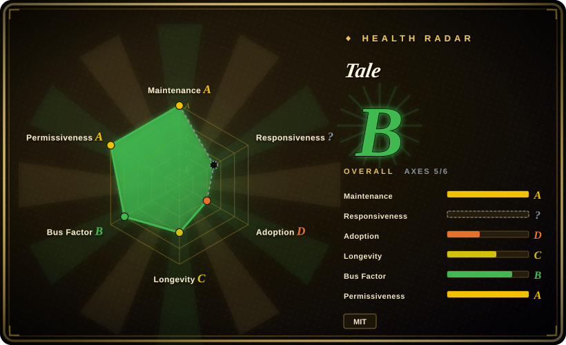
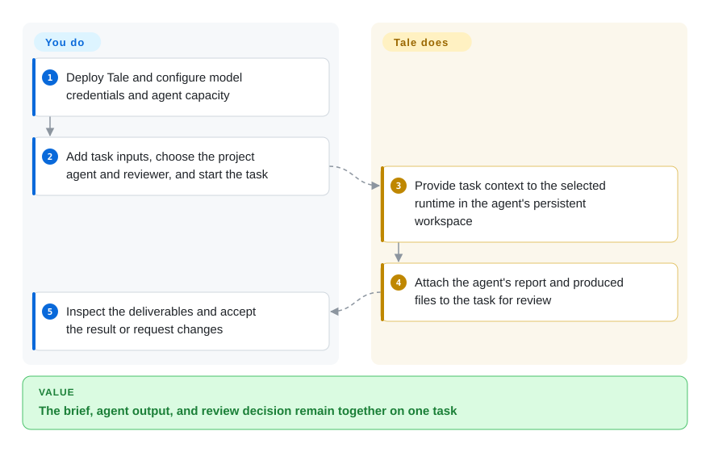

# Tale

A teammate has the brief, an agent has the working files, and the reviewer cannot find the final report. Tale puts those handoffs on a shared task board, with persistent agent workspaces and deliverables attached to the task.

## When to use

You coordinate a small team preparing a launch: one person owns the brief, another must check the source documents, and a coding agent builds the landing page. The report arrives in a chat while the revised files remain inside an agent session. You want one project to hold the task, input files, discussion, assignment, and review result, and you can operate the supporting services. Tale lets you choose an agent's runtime and model, start assigned work, and review the resulting report and files on the same task.

The deciding tradeoff is adopting a team project workspace around existing coding runtimes. Choose it when that shared task-and-review record matters more than keeping an external issue tracker as the sole work queue or publishing a standalone LLM application. It also has chat, knowledge retrieval, and automations, but those do not remove the need to configure credentials, execution capacity, and reviewers.

## How it works

An operator deploys the containers and configures model access and sandbox capacity—the machines and containers where agent programs run. A project editor creates an agent, choosing its instructions and coding runtime, then assigns and explicitly starts a task. Tale supplies the task context and retains the agent's workspace; the selected runtime executes the work. The agent returns a report and produced files for review. A reviewer accepts the result or requests changes; requesting changes does not itself restart execution. The [task guide](https://docs.tale.dev/platform/projects/task-automation) and [runtime guide](https://docs.tale.dev/platform/agents/harnesses) document this boundary.

<!-- flow-steps:begin (generated from flows/tale.json by tools/flow_card.py — do not edit) -->

Text version of the flow

1. **You**: Deploy Tale and configure model credentials and agent capacity
2. **You**: Add task inputs, choose the project agent and reviewer, and start the task
3. **Tale**: Provide task context to the selected runtime in the agent's persistent workspace
4. **Tale**: Attach the agent's report and produced files to the task for review
5. **You**: Inspect the deliverables and accept the result or request changes

**Value**: The brief, agent output, and review decision remain together on one task

<!-- flow-steps:end -->

## When NOT to use

- **Your existing tracker must remain the dispatch interface.** Consider [Symphony](symphony.md) for tracker-driven coding runs instead of moving the work into Tale's project board. Symphony is itself an engineering preview; that is a workflow choice, not a maturity guarantee.
- **You mainly want to start coding-agent conversations across several machines.** Consider [OpenHands Agent Canvas](../../coding-agents/orchestration-and-review/openhands.md), whose primary interface manages agent backends and conversations. Tale adds a project/task/reviewer model that you would otherwise have to maintain.
- **You are building an LLM application to expose to another product.** Consider [Dify](../../workflow-builders/dify.md) when the main artifact is a visual AI workflow or app with an API. Tale's project deliverables and teammate coordination may be unnecessary for that job; compare the projects' different licenses before embedding either.
- **You cannot operate persistent services or keep a rolling release current.** Evaluate managed [Tale](https://tale.dev/pricing) or managed Dify instead of self-hosting this repository. Tale's [security policy](https://github.com/tale-project/tale/blob/main/.github/SECURITY.md) supports the latest release only, with no backports to earlier versions.

## Comparison

These are source-based selection judgments, not benchmark results. The upstream [Symphony](https://github.com/openai/symphony), [OpenHands](https://github.com/OpenHands/OpenHands), and [Dify](https://github.com/langgenius/dify) READMEs were checked on 2026-10-08.

| Alternative | In index | Our verdict | Tradeoff |
| --- | --- | --- | --- |
| [Symphony](symphony.md) | ✅ | Choose Symphony when tracker issues should launch coding runs; choose Tale when teammates need to share briefs, files, and review decisions inside the work queue. | Symphony centers the external tracker and implementation run; Tale introduces its own project UI and persistent data services. |
| [OpenHands Agent Canvas](../../coding-agents/orchestration-and-review/openhands.md) | ✅ | Choose OpenHands for a console over local, remote, and cloud agent backends; choose Tale when task ownership and deliverable review are the organizing record. | Both can use several coding agents; Tale adds team project records, while Agent Canvas emphasizes agent conversations and backend selection. |
| [Dify](../../workflow-builders/dify.md) | ✅ | Choose Dify for publishing model-backed apps and visual workflows; choose Tale when the output is work that a teammate must inspect and accept. | Both have knowledge and automation surfaces; Dify emphasizes app/API delivery, while Tale combines them with assigned project tasks. |

## Tech stack

The public [platform manifest](https://github.com/tale-project/tale/blob/main/services/platform/package.json) contains TypeScript, React/TanStack UI dependencies, Hono, and the PostgreSQL client. The repository uses Bun workspaces for development; its backend start command runs Node.js. Published containers avoid requiring that source toolchain on an end user's machine.

## Dependencies

- Docker with Compose and persistent storage for the packaged installation; the [quickstart](https://docs.tale.dev/self-hosted/install/quickstart) notes several GB of initial images and an amd64-emulation requirement for the bundled object store on ARM64.
- PostgreSQL application and knowledge databases plus object storage. The packaged stack puts both databases in one Postgres service; [external knowledge storage](https://docs.tale.dev/self-hosted/configuration/data-residency) needs `vector`, with `pg_search` enabling the keyword-search component.
- A supported model credential and runtime-compatible configuration for agent work. Knowledge indexing additionally needs an embedding provider. Model subscriptions and API keys have different supported paths and accounting behavior.
- Sandbox execution services and available capacity. Production also needs DNS/TLS, backups, access controls, and an operator for upgrades; an available web page alone does not verify that agent execution works.

## Ops difficulty

**Medium to high, depending on deployment [推断].** The CLI packages local startup, but this is a multi-service application with databases, object storage, workers, and an execution plane. The operator still owns restore procedures, provider credentials, capacity, and upgrades. Self-hosting does not by itself keep data local: model providers, connectors, and external tools can process requests elsewhere. Read the [service map](https://docs.tale.dev/self-hosted/operate/container-architecture) and storage/provider settings before selecting a deployment boundary.

## Health & viability

- **Active but young (2026-10-08).** The repository was created on 2025-11-30, has current commits, and published v0.5.73 through v0.5.77 between October 5 and 7. Frequent releases show maintenance, not a long stability record.
- **Vendor-backed, with multiple public contributors.** Tale is published by Ruler GmbH; GitHub shows several non-bot contributors. Commit counts do not establish who holds operational authority or guarantees future support.
- **Responsiveness measurement is unknown.** The catalog scorer returned `no_window_signal`: its latest 60 issues and 30 PRs all fall after the sampled window ending September 29. The public query succeeded; this is a coverage limit, not a verdict about support speed.
- **Small observable audience.** The dated GitHub snapshot has 32 stars and 5 forks. Those counts do not establish production adoption; customer deployment scale and workload benchmarks were not independently verified.
- **Permissive code, ongoing operation required.** The actual LICENSE is MIT, copyright Tale. Community and Enterprise have the same product features according to the public README; Enterprise adds professional operation and support. The latest-release-only security policy makes staying current an explicit maintenance obligation.

Affiliation: this page was prepared by an AI assistant on behalf of Tale's owner. The catalog's maintainers retain editorial judgment; the generated health measurements are separate from these product-selection judgments.

## Caveats (unverified)

- [未验证] This entry was researched from public code, manifests, documentation, releases, and repository metadata; no independent end-to-end Tale deployment or comparative workload benchmark was run for it.
- [未验证] Production adoption, restore reliability under a real incident, and the organization's internal governance cannot be established from stars, contributors, or documentation alone.
- [推断] The operational difficulty and alternative-selection judgments follow the documented service layout and user workflows; actual costs depend on runtime, providers, workload, and operator experience.
