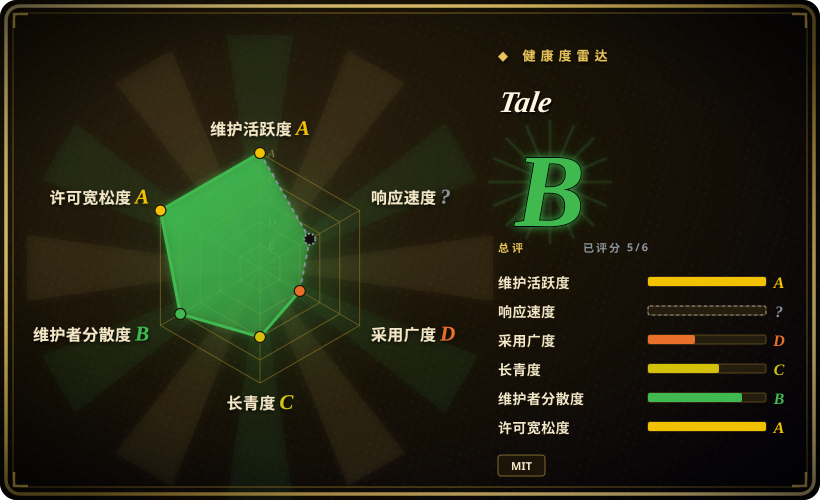
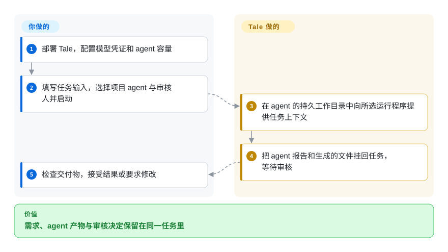

# Tale

需求在同事手里，文件留在 agent 的运行目录，审核人却找不到最终报告。Tale 把这些交接放到同一任务看板上，保留 agent 的工作目录，并把交付物挂回任务。

## 何时使用

你负责一个小团队的发布准备：一人整理需求，另一人核对原始文档，编码 agent 制作落地页。报告发到了聊天里，修改后的文件却还在 agent 会话中。你希望任务、输入文件、讨论、负责人和审核结果有一个共同归属，也愿意维护支撑这些功能的服务。Tale 让你选择 agent 的运行程序和模型，明确启动已分配的工作，再在同一任务里检查报告和文件。

选择它的关键是：你需要在已有编码运行程序外面加一层团队项目工作区。相比把外部 issue 跟踪器保留为唯一队列，或发布独立的 LLM 应用，你更重视共同的任务与审核记录。它也提供聊天、知识检索和自动化，但这些功能不能替你配置凭证、执行容量和审核人。

## 怎么用起来

运维人员部署容器，配置模型访问和沙箱容量，也就是 agent 程序实际运行的机器与容器。项目编辑者创建 agent，选择指令和编码运行程序，然后分配并明确启动任务。Tale 提供任务上下文并保留 agent 的工作目录，具体工作由所选运行程序执行。agent 返回报告与生成的文件，交给审核人处理。审核人可以接受结果或要求修改；要求修改本身不会重新启动执行。[任务指南](https://docs.tale.dev/platform/projects/task-automation)和[运行程序指南](https://docs.tale.dev/platform/agents/harnesses)说明了这条职责边界。

<!-- flow-steps:begin (generated from flows/tale.json by tools/flow_card.py — do not edit) -->

流程文字版

1. **你**：部署 Tale，配置模型凭证和 agent 容量
2. **你**：填写任务输入，选择项目 agent 与审核人并启动
3. **Tale**：在 agent 的持久工作目录中向所选运行程序提供任务上下文
4. **Tale**：把 agent 报告和生成的文件挂回任务，等待审核
5. **你**：检查交付物，接受结果或要求修改

**价值**：需求、agent 产物与审核决定保留在同一任务里

<!-- flow-steps:end -->

## 何时不用

- **现有跟踪器必须继续作为派工入口。** 可以考虑由 issue 驱动编码运行的 [Symphony](symphony.zh.md)，不必把工作搬进 Tale 看板。Symphony 本身仍是工程预览，因此这是流程选择，不是成熟度保证。
- **你主要想在多台机器上启动编码 agent 对话。** 可以考虑 [OpenHands Agent Canvas](../../coding-agents/orchestration-and-review/openhands.zh.md)，它的主要界面围绕 agent 后端和对话组织。Tale 额外带来的项目、任务与审核人模型也需要维护。
- **你要构建供其他产品调用的 LLM 应用。** 当核心产物是带 API 的可视化 AI 工作流或应用时，可以考虑 [Dify](../../workflow-builders/dify.zh.md)。Tale 的项目交付与团队协调可能不是这项工作的必需部分；嵌入产品前应分别检查两者许可证。
- **你无法维护持久服务或跟进滚动更新。** 应评估托管版 [Tale](https://tale.dev/pricing)或托管版 Dify，而不是自行部署本仓库。Tale 的[安全政策](https://github.com/tale-project/tale/blob/main/.github/SECURITY.md)只支持最新版，不为旧版本回移修复。

## 横向对比

下面是基于来源的选型判断，不是性能测试结果。已于 2026-10-08 核对上游 [Symphony](https://github.com/openai/symphony)、[OpenHands](https://github.com/OpenHands/OpenHands) 和 [Dify](https://github.com/langgenius/dify) 的 README。

| 替代品 | 是否收录 | 我们的评价 | 取舍 |
| --- | --- | --- | --- |
| [Symphony](symphony.zh.md) | ✅ | issue 应直接启动编码运行时选 Symphony；团队需要在工作队列内共享需求、文件和审核决定时选 Tale。 | Symphony 以外部跟踪器和实现过程为中心；Tale 引入自己的项目界面与持久数据服务。 |
| [OpenHands Agent Canvas](../../coding-agents/orchestration-and-review/openhands.zh.md) | ✅ | 需要统一操作本地、远程和云端 agent 后端时选 OpenHands；需要按任务负责人和交付审核组织工作时选 Tale。 | 两者都能使用多种编码 agent；Tale 增加团队项目记录，Agent Canvas 更侧重对话与后端选择。 |
| [Dify](../../workflow-builders/dify.zh.md) | ✅ | 发布模型应用和可视化工作流时选 Dify；产物需要由同事检查并验收时选 Tale。 | 两者都有知识与自动化功能；Dify 强调应用和 API 交付，Tale 把这些功能与已分配的项目任务放在一起。 |

## 技术栈

公开的[平台清单](https://github.com/tale-project/tale/blob/main/services/platform/package.json)包含 TypeScript、React/TanStack 界面依赖、Hono 和 PostgreSQL 客户端。仓库使用 Bun workspaces 开发，后端启动命令运行 Node.js。使用发布的容器时，最终用户机器不需要这套源码构建工具链。

## 依赖

- 打包安装需要 Docker、Compose 和持久存储。[快速入门](https://docs.tale.dev/self-hosted/install/quickstart)提示首次下载数 GB 镜像；ARM64 上的内置对象存储还需要 amd64 模拟。
- PostgreSQL 应用数据库、知识数据库及对象存储。打包方案把两个数据库放在一个 Postgres 服务中；[外部知识存储](https://docs.tale.dev/self-hosted/configuration/data-residency)需要 `vector`，`pg_search` 则启用关键词检索部分。
- agent 工作需要受支持的模型凭证和兼容的运行程序配置。知识索引还需要嵌入模型服务。模型订阅与 API 密钥的支持路径、计费记录方式并不相同。
- 沙箱执行服务及可用容量。生产环境还要配置 DNS/TLS、备份、访问控制和升级责任人；网页能打开，不等于 agent 执行链路正常。

## 运维难度

**中到高，取决于部署方式 [推断]。** CLI 打包了本地启动流程，但系统仍包含数据库、对象存储、worker 和执行服务。恢复流程、模型凭证、容量与升级仍由运维人员负责。自托管本身不保证数据只在本地处理：模型服务商、连接器和外部工具可以处理传出的请求。选择部署边界前，应阅读[服务分工](https://docs.tale.dev/self-hosted/operate/container-architecture)以及存储与模型设置。

## 健康度与可持续性

- **活跃但年轻（2026-10-08）。** 仓库创建于 2025-11-30，目前仍有提交，10 月 5 日至 7 日发布了 v0.5.73 到 v0.5.77。频繁发布能说明维护活动，不能证明长期稳定性。
- **由厂商支持，公开贡献者不止一人。** Tale 由 Ruler GmbH 发布，GitHub 可见多名非 bot 贡献者。提交数量不能说明实际运营权归属，也不能保证未来支持。
- **响应速度测量未知。** 目录评分器返回 `no_window_signal`：采样的最新 60 个 issue 和 30 个 PR 全部晚于 9 月 29 日结束的测量窗口。公开查询成功，这表示采样覆盖不足，不是对支持速度的评价。
- **可观察的受众较小。** 本次 GitHub 快照有 32 个 star 和 5 个 fork。这些数字不能证明生产采用情况；客户部署规模和工作负载性能没有经过独立验证。
- **代码许可宽松，但需要持续运维。** 实际 LICENSE 是 MIT，版权归 Tale。公开 README 表示 Community 与 Enterprise 产品功能相同，Enterprise 增加专业运维和支持。安全政策只支持最新版，因此保持更新是明确的维护义务。

关系披露：本页由 AI 助手代表 Tale 所有者准备。目录维护者保留编辑判断权；自动生成的健康度测量与本页产品选型判断分开看待。

## 存疑（未验证）

- [未验证] 本页依据公开代码、依赖清单、文档、发布记录和仓库元数据撰写，没有为本页独立完成 Tale 端到端部署或比较工作负载测试。
- [未验证] star、贡献者和文档不足以确定生产采用情况、真实事故中的恢复可靠性，或组织内部的治理方式。
- [推断] 运维难度和替代方案判断来自文档描述的服务布局与用户流程；实际成本取决于运行程序、模型服务、负载及运维经验。
