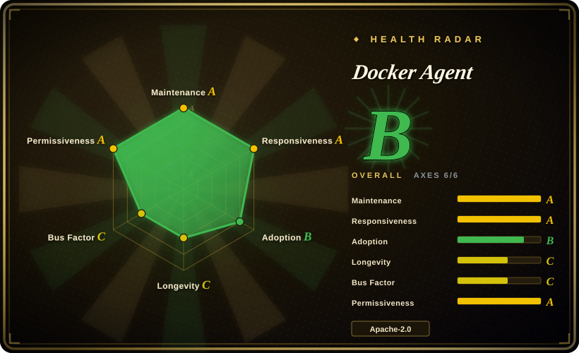
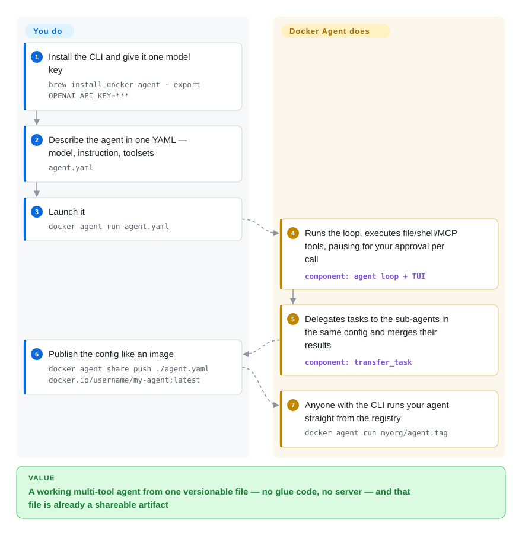

# Docker Agent

You ask for a small agent that greps logs and files the findings, and the frameworks answer with a project: install Python, wire the loop, implement the tools. Docker Agent takes the container route instead — an agent is one YAML file, `docker agent run` launches it like an image, and the same file can be pushed to and pulled from any OCI registry.

## When to use

You are a platform or backend developer and the agent you need is an operator, not a product: a repo-review team (coordinator + developer + reviewer, cheap model for the reviewer), a triage bot that reads a log directory and opens issues, a docs researcher. What you resent is the shape of code-first frameworks — a service or notebook just to run a loop that calls three tools, with your own scaffolding crashing on a malformed tool call while nobody debugs the agent's reasoning. Docker Agent exists for the case where the deliverable is a **config file, not a program**: `agent.yaml` names the model, the instruction, the toolsets, and the teammates, and `docker agent run agent.yaml` executes it in a terminal UI.

Pick it over [LangGraph](agent-sdks/langgraph.md) or [Pydantic AI](agent-sdks/pydantic-ai.md) when the loop, tool approvals, sessions, and delegation should be pre-built and the artifact you version, review, and share is YAML (HCL also works). Pick it over [Dify](../workflow-builders/dify.md) when you do not want a web-platform server to operate — this is a local CLI you script in CI. And it pays a dividend specific to Docker shops: Docker-hosted MCP servers from a catalog (`ref: docker:duckduckgo`), local models through Docker Model Runner without API keys, and `--sandbox` to confine tool execution inside a container. The deciding tradeoff: you give up in-process control over the agent loop to gain zero-code assembly and registry-native sharing.

## How it works

Docker Agent is a single Go binary — usable standalone or as a `docker` CLI plugin (`docker agent`). You declare agents in one file: a `root` agent with a `model` (a `provider/model` string like `anthropic/claude-sonnet-4-5`, or a named `models:` block with per-agent fallbacks via `first_available`), an `instruction` (the system prompt), and `toolsets` — built-ins like `filesystem`, `shell`, `think`, `todo`, `memory`, `fetch`, `rag`, `api`, plus any MCP server (the protocol that lets an agent call external tool servers) run locally, remotely, or from Docker's own catalog. What it does for you: the model loop and every tool call (shell commands ask for your confirmation one by one unless you pass `--yolo`), the streaming TUI, session persistence, context compaction, and hooks you can script around tool use. The multi-agent patterns are declarative too: `sub_agents` for hierarchical delegation (the parent calls the always-auto-approved `transfer_task`, waits, and merges the result) and `handoffs` for peer routing (the active agent switches, conversation stays in one session). Other surfaces of the same binary: `--exec` for one-shot runs, an HTTP API server, an MCP mode that exposes your agent as a tool server, A2A/ACP endpoints for other agents and editors, and `docker agent share push` to publish the config as an OCI artifact others run by reference. What stays yours: model credentials, the allow/deny lists and safety modes that bound the tools, and — for heavy coding loops you'd rather not reinvent — `harness` agents that delegate work to external coding CLIs (Claude Code, Codex, opencode, pi) while this config layer keeps orchestration, permissions, and distribution.

<!-- flow-steps:begin (generated from flows/docker-agent.json by tools/flow_card.py — do not edit) -->

Text version of the flow

1. **You**: Install the CLI and give it one model key — `brew install docker-agent · export OPENAI_API_KEY=***`
2. **You**: Describe the agent in one YAML — model, instruction, toolsets — `agent.yaml`
3. **You**: Launch it — `docker agent run agent.yaml`
4. **Docker Agent**: Runs the loop, executes file/shell/MCP tools, pausing for your approval per call — component: `agent loop + TUI`
5. **Docker Agent**: Delegates tasks to the sub-agents in the same config and merges their results — component: `transfer_task`
6. **You**: Publish the config like an image — `docker agent share push ./agent.yaml docker.io/username/my-agent:latest`
7. **Docker Agent**: Anyone with the CLI runs your agent straight from the registry — `docker agent run myorg/agent:tag`

**Value**: A working multi-tool agent from one versionable file — no glue code, no server — and that file is already a shareable artifact

<!-- flow-steps:end -->

## When NOT to use

- **You want the agent inside your application, not beside it.** There is no in-process API — the surfaces are the CLI, its TUI, and the HTTP/MCP endpoints one session exposes; embedding means spawning a separate process and talking to it. Use [LangGraph](agent-sdks/langgraph.md) or [Pydantic AI](agent-sdks/pydantic-ai.md) instead, because there your program keeps the call stack and custom tools are plain functions, not a config block.
- **The team needs a platform, not a per-session CLI** — web console, accounts, shared workspaces, an always-on hosted endpoint. Use [Dify](../workflow-builders/dify.md) or [Langflow](../workflow-builders/langflow.md), because they buy that central surface with a server you operate; docker-agent deliberately stays a binary.
- **Untrusted input drives the agent.** `filesystem` and `shell` tools execute as you on the host by default; the guard rails (per-call approval, four safety modes, allow/deny lists) are on-by-default prompts, while real confinement needs the opt-in `--sandbox` or a `deferred` runtime. If isolation is the load-bearing feature, pick a runtime with sandboxes in the default path (see [AgentScope](agent-sdks/agentscope.md)) or a micro-VM layer from the sandboxing category.
- **You wanted a ready assistant, not an agent factory.** `docker agent run` with no config is a generic default agent; packaged assistants like [OpenClaw](personal-assistants/openclaw.md) ship channel integrations (messaging platforms) you would otherwise author yourself.
- **You cannot run anything with default settings.** Telemetry is enabled by default, and command positional arguments — which can include prompts, file paths, and registry refs — are part of what it collects; plus ~daily minor releases mean a pinned config can chase schema drift. Both are opt-outable/ manageable, but a compliance-reviewed environment should know it is buying that churn first.

## Comparison

| Alternative | In index | Our verdict | Tradeoff |
|---|---|---|---|
| [LangGraph](agent-sdks/langgraph.md) | ✅ | Choose Docker Agent when the loop, approvals, delegation, and distribution should already exist and your deliverable is a shareable YAML; choose LangGraph when the control-flow graph itself must be typed, tested, versioned code inside your app. | Config-first buys zero glue code and OCI-native sharing; code-first buys in-process custom tools and deterministic graphs you can review as diagrams, at the cost of writing and owning the harness yourself. |
| [Dify](../workflow-builders/dify.md) | ✅ | Choose Dify when non-coders on the team must build and watch flows in a browser and you are willing to operate its server; choose Docker Agent for local/CI agents where the config diff is the review surface. | Dify centralizes datasets, apps, and API keys behind a self-hosted web platform; Docker Agent keeps every agent as a file on your machine — nothing to keep up, but no central console. |
| [CrewAI](agent-sdks/crewai.md) | ✅ | Choose CrewAI when the role-and-process team abstractions must be callable from Python inside your product; choose Docker Agent for the same coordinator-plus-specialists idea expressed declaratively, with a different model pinned per agent in plain YAML. | CrewAI is an in-process Python framework with an ecosystem of extensions; Docker Agent delegates teams through config and the `transfer_task` tool, so team topology is reviewable and shareable but not importable. |
| [OpenClaw](personal-assistants/openclaw.md) | ✅ | Choose OpenClaw when you want one personal assistant that already lives in 20+ messaging channels and manages its own memory; choose Docker Agent when the output is N purpose-built agents your team authors, runs, and distributes. | OpenClaw is an end-user product with its channel glue done for you; Docker Agent is a builder/runtime with no bundled channels, but arbitrary agent teams and an OCI distribution story. |
| [OpenAI Agents SDK](agent-sdks/openai-agents-sdk.md) | ✅ | Choose the OpenAI Agents SDK when you are writing handoffs and guardrails as code in Python/TypeScript and the vendor's model line is your default; choose Docker Agent when approvals, sessions, sandboxing, and registry sharing should come pre-built around a provider-agnostic `provider/model` string. | The SDK stays minimal and stays inside your program; Docker Agent is a bigger opinionated runtime — more defaults to learn, but a working multi-tool agent from one file. |

## Tech stack

- **Go 1.27** single binary; CLI also shipped as a `docker` CLI plugin (verified from `go.mod` and README, 2026-09-28).
- **TUI on the Charm stack** — bubbletea/bubbles/glamour/lipgloss v2 (from `go.mod`).
- **Model layer**: provider SDKs including `anthropic-sdk-go` and `aws-sdk-go-v2/bedrockruntime`; ~20 built-in provider aliases (OpenAI, Anthropic, Google, Bedrock, Mistral, xAI, Groq, DeepSeek, Together, Ollama/vLLM/OpenAI-compatible, Docker Model Runner, …) listed in the providers docs.
- **Protocols**: MCP via `modelcontextprotocol/go-sdk`; A2A via `a2aproject/a2a-go`; ACP (agent client protocol for editors) via `coder/acp-go-sdk`; HTTP server on `labstack/echo`.
- **Config & distribution**: `goccy/go-yaml` + `hashicorp/hcl` (YAML and HCL dialects), OCI push/pull via `google/go-containerregistry`; `go-git` for the git tools; memory toolset SQLite-backed (examples docs); `99designs/keyring` for credentials.

## Dependencies

- **Model credentials on the host** — one of the provider env-var keys (`OPENAI_API_KEY`, `ANTHROPIC_API_KEY`, …), or any OpenAI-compatible local endpoint (Ollama/vLLM), or Docker Model Runner.
- **Docker engine only for the Docker-flavored features**: Model Runner models, the `docker:`-catalog MCP servers, and `--sandbox` tool confinement. The CLI itself runs without a daemon.
- **Nothing to operate**: no database, queue, or service — sessions, memory, and artifacts are local files/registry pushes; `harness` agents additionally need the external CLI (`claude`, `codex`, `opencode`, `pi`) on PATH.

## Ops difficulty

**Low.** Install once (Homebrew core, Docker Desktop 4.63+, or a release binary); run per session with `docker agent run`; state stays local. The burden is not servers but churn: minor releases land roughly every 2–3 days (v1.141.0–v1.145.0 between 2026-09-16 and 2026-09-28), so pinning a config to a version and reading the CHANGELOG on upgrade is the day-2 task. Sharing agents is an `oci push` away.

## Health & viability

- **Maintenance:** pushed and released the same day as this check — v1.145.0 on 2026-09-28 — with v1.141.0→v1.145.0 landing in the preceding twelve days; the CHANGELOG records 148 releases in the repo's ~13 months. That is an industrial cadence, not a hobby.
- **Backing & governance:** owned by the `docker` GitHub organization with CODEOWNERS pointing at `@docker/ai-agent-team`, Docker's standard SECURITY.md (72h acknowledgment, published disclosure policy), docs on docker.github.io with canonical mirrors at docs.docker.com, a Homebrew core formula, and a companion GitHub Action (`docker/docker-agent-action`). [推断: Desktop pre-install + official docs mirror + a dedicated team read as a product-line bet, not an experiment; internal plans unread]
- **Bus factor:** 86 maintainers active over the last 12 months, but head-heavy — one account holds about 62% of that window's contributions and the top three together about 79% (measured values in the `health:` block, 2026-09-28); CODEOWNERS and multiple Docker-side names mitigate this, not eliminate it.
- **Age / Lindy:** the repo was created 2025-09-01 — barely over a year, no age advantage. Docker has already moved in this space: the earlier `agentic-blueprint` repo is archived (org search, 2026-09-28), and `docker/ai-docker-agent` — recalled from model memory as this project's Python predecessor, see Caveats — returns 404 today.
- **Adoption:** 3,357 stars / 466 forks (2026-09-28); the Homebrew formula (`docker-agent`, renamed from `cagent`) and pre-install in Docker Desktop 4.63+ put its real install base plausibly above its star count, but no production-user evidence was found either way.
- **Risk flags:** telemetry enabled by default, and its own docs warn that command positional arguments (prompts, file paths) and error text can carry secrets into events; the config schema evolves at ~daily-release speed under v1 minor bumps; watch for open-core/hosted-platform gating, since Docker has historically monetized exactly this surface.

## Caveats (unverified)

- [未验证] No explicit backward-compatibility promise for the YAML/HCL config schema was found in the docs read; only v1 semver labels were observed.
- [未验证] The "Docker Desktop 4.63+ pre-installed plugin" claim is from the README; Desktop itself was not inspected.
- [未验证] Whether top contributors (dgageot, rumpl, aheritier) are Docker employees — inferred from the README's "by Docker Engineering" and the CODEOWNERS team, not from profile or corporate data.
- [推断: the repo name `docker/ai-docker-agent` is recalled from model memory; only the current 404 was measured] The predecessor Python project at `docker/ai-docker-agent` (HTTP 404 as of 2026-09-28) was the same effort in Python; no migration announcement was located.
- [未验证] Production users, named dependents, or adoption beyond stars/forks and registry presence.
- [未验证] Telemetry endpoint and exact event payloads were read from docs prose only; no network capture was performed.
- [未验证] A CLA/DCO requirement: the contributing docs page was listed but not read end-to-end.
- [未验证] End-to-end offline operation (local model + no egress) was not reproduced; docs describe the capability.
