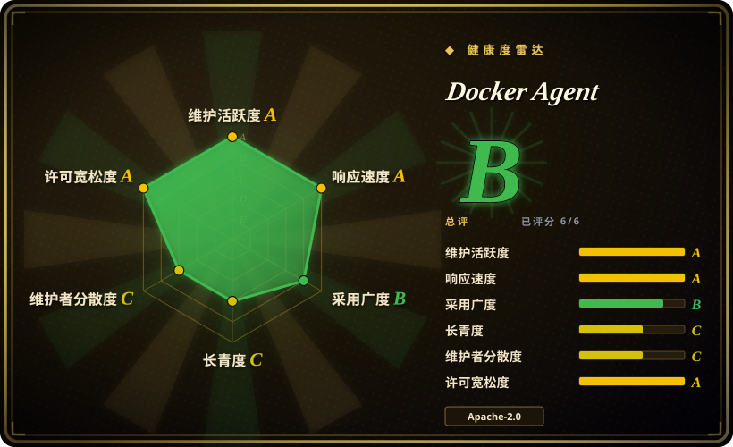
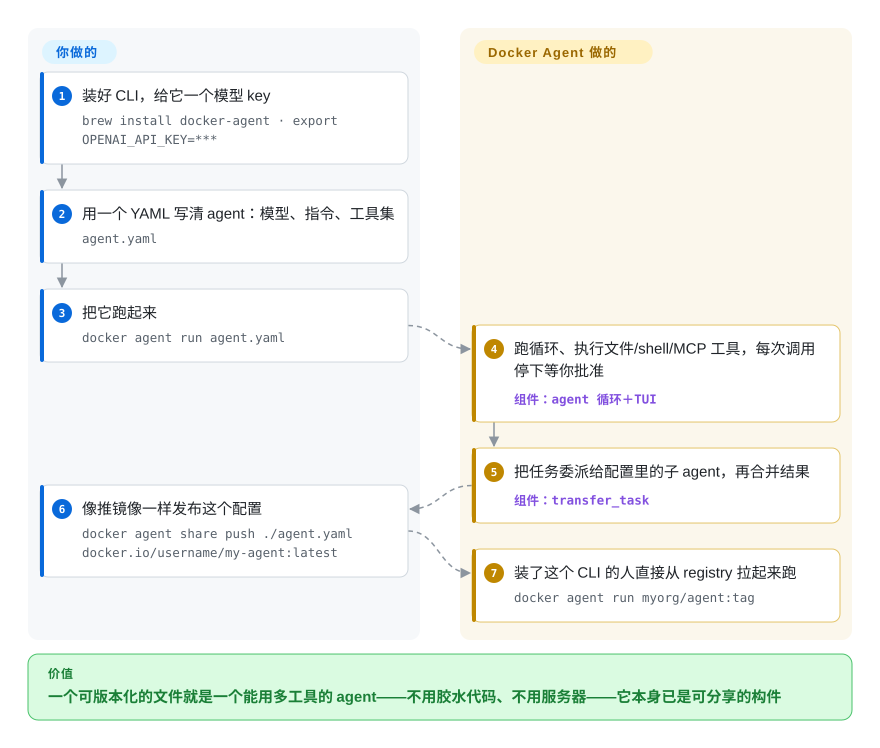

# Docker Agent

你只想让 agent 替你翻日志、顺手把问题登记成工单，框架却先递来一个工程：装环境、接循环、写工具。Docker Agent 走的是容器那条路：agent 是一个 YAML 文件，`docker agent run` 像跑镜像一样把它跑起来，同一个文件还能推进 OCI registry，别人拉下来直接用。

## 何时使用

你是一个平台或后端开发者，你要的 agent 是运维操作员而不是产品：一个仓库评审小组（协调者＋开发者＋评审者，评审者挂便宜模型）、一个读日志目录并开工单的分诊 bot、一个文档研究员。你真正反感的是代码优先框架的形态——只为跑一个调用三个工具的循环，就得养一个服务或笔记本，而脚手架自己先崩在一次畸形的工具调用上，没人去调 agent 的推理。Docker Agent 是为“交付物是配置文件而不是程序”这一场景存在的：`agent.yaml` 里写明模型、指令和工具集，外加队友清单，`docker agent run agent.yaml` 就在终端 UI 里跑起来。

如果循环、工具审批、会话和委派应该是现成的，而你版本化、评审、分享的载体是 YAML（也支持 HCL），选它而不是 [LangGraph](agent-sdks/langgraph.zh.md) 或 [Pydantic AI](agent-sdks/pydantic-ai.zh.md)。如果你不想运维一个 Web 平台服务器，它是个能在 CI 里脚本化的本地 CLI，选它而不是 [Dify](../workflow-builders/dify.zh.md)。对 Docker 技术栈的团队它还有三项专属红利：目录化的 Docker 托管 MCP server（`ref: docker:duckduckgo`）、无需 API key 的 Docker Model Runner 本地模型、以及把工具执行关进容器的 `--sandbox`。决定性的取舍：你把 agent 循环的进程内控制权交出去，换来零胶水代码的组装和 registry 原生的分享。

## 怎么用起来

Docker Agent 是一个单 Go 二进制，可独立使用，也可作为 `docker` CLI 插件（`docker agent`）。你在一个文件里声明 agent：`root` 指定 `model`（形如 `anthropic/claude-sonnet-4-5` 的 provider/model 串，或命名 `models:` 块、用 `first_available` 做逐个回退）、`instruction`（系统提示词）和 `toolsets`——内置的 `filesystem`、`shell`、`think`、`todo`、`memory`、`fetch`、`rag`、`api`，外加任意 MCP server（让 agent 调用外部工具服务器的协议），本地跑、远程连、或从 Docker 官方目录里取。它替你做的事：模型循环和每次工具调用（shell 命令默认逐条要你确认，除非 `--yolo`）、流式 TUI、会话持久化、上下文压缩，以及在工具调用前后插脚本的 hooks。多 agent 模式也是声明式的：`sub_agents` 做层级委派（父 agent 调用永远自动批准的 `transfer_task`，等子 agent 跑完并合并结果），`handoffs` 做平级转接（活跃 agent 切换，对话留在同一个会话）。同一个二进制的其他入口：`--exec` 一次性执行、HTTP API server、把你的 agent 当工具服务器暴露的 MCP 模式、面向其他 agent 与编辑器的 A2A/ACP 端点，以及 `docker agent share push`——把配置发布成 OCI 构件，别人按引用就能跑。留在你手里的：模型凭据、约束工具的 allow/deny 清单与四档安全模式；如果某些重型编码循环你不想重写，`harness` agent 可以把工作委托给外部编码 CLI（Claude Code、Codex、opencode、pi），而编排、权限与分发仍由这层配置管着。

<!-- flow-steps:begin (generated from flows/docker-agent.json by tools/flow_card.py — do not edit) -->

流程文字版

1. **你**：装好 CLI，给它一个模型 key — `brew install docker-agent · export OPENAI_API_KEY=***`
2. **你**：用一个 YAML 写清 agent：模型、指令、工具集 — `agent.yaml`
3. **你**：把它跑起来 — `docker agent run agent.yaml`
4. **Docker Agent**：跑循环、执行文件/shell/MCP 工具，每次调用停下等你批准 — 组件：`agent 循环＋TUI`
5. **Docker Agent**：把任务委派给配置里的子 agent，再合并结果 — 组件：`transfer_task`
6. **你**：像推镜像一样发布这个配置 — `docker agent share push ./agent.yaml docker.io/username/my-agent:latest`
7. **Docker Agent**：装了这个 CLI 的人直接从 registry 拉起来跑 — `docker agent run myorg/agent:tag`

**价值**：一个可版本化的文件就是一个能用多工具的 agent——不用胶水代码、不用服务器——它本身已是可分享的构件

<!-- flow-steps:end -->

## 何时不用

- **你要把 agent 嵌进自己的应用，而不是放在旁边。** 它没有进程内 API——入口只有 CLI、TUI 和单次会话暴露的 HTTP/MCP 端点；嵌入意味着起一个独立进程再对话。要程序自己握着调用栈、自定义工具就是普通函数时，用 [LangGraph](agent-sdks/langgraph.zh.md) 或 [Pydantic AI](agent-sdks/pydantic-ai.zh.md)。
- **团队要的是平台，不是逐次会话的 CLI**——Web 控制台、账号体系、共享工作区、常驻托管端点。用 [Dify](../workflow-builders/dify.zh.md) 或 [Langflow](../workflow-builders/langflow.zh.md)：它们用一台你要运维的服务器换来这些中心能力，而 docker-agent 刻意保持为一个二进制。
- **不可信输入在驱动 agent。** `filesystem` 与 `shell` 工具默认以你的身份在宿主机上执行；逐条审批、四档安全模式、allow/deny 清单这些护栏是默认开启的“提示”，真正的隔离要靠显式的 `--sandbox` 或 `deferred` 运行时。如果隔离是承重特性，选默认路径就带沙箱的运行时（见 [AgentScope](agent-sdks/agentscope.zh.md)），或沙箱化类目里的 micro-VM 层。
- **你想要的是成品助手，不是 agent 工厂。** 不带配置执行 `docker agent run` 得到的是通用默认 agent；[OpenClaw](personal-assistants/openclaw.zh.md) 这类打包助手已经做好了 20 多个消息渠道的接入，用 docker-agent 这些都得自己写配置。
- **你的环境不允许“默认设置直接跑”。** 遥测默认开启，且官方文档明说命令位置参数（可能含提示词、文件路径）和错误文本都在采集范围；再加上大约每 2–3 天一个 minor 版本，钉住版本的配置要追着 schema 走。两者都能关、能管，但需要合规评审的环境最好先知道自己买的是什么。

## 横向对比

| 替代品 | 是否收录 | 我们的评价 | 取舍 |
|---|---|---|---|
| [LangGraph](agent-sdks/langgraph.zh.md) | ✅ | 循环、审批、委派、分发都想要现成的、交付物是可分享的 YAML 时选 Docker Agent；控制流图本身必须是类型化、可测试、随应用版本化的代码时选 LangGraph。 | 配置优先换来零胶水代码和 OCI 原生分享；代码优先换来进程内自定义工具和可当图评审的确定性控制流，代价是 harness 要自己写、自己养。 |
| [Dify](../workflow-builders/dify.zh.md) | ✅ | 团队里不写代码的人要在浏览器里搭流程、看运行，且你愿意运维它的服务器时选 Dify；本地/CI 场景、以配置 diff 作为评审面时选 Docker Agent。 | Dify 把数据集、应用和 API key 集中进自托管 Web 平台；Docker Agent 让每个 agent 都只是你机器上的一个文件——不用养服务器，但也没有控制台。 |
| [CrewAI](agent-sdks/crewai.zh.md) | ✅ | 角色与流程的团队抽象必须从你产品内的 Python 调用时起作用，选 CrewAI；同一个“协调者＋专家”的思路想以声明式表达、每个 agent 单独钉模型时，选 Docker Agent。 | CrewAI 是进程内 Python 框架，扩展生态大；Docker Agent 用配置和 `transfer_task` 委派团队，团队拓扑可评审、可分享，但不能被 import。 |
| [OpenClaw](personal-assistants/openclaw.zh.md) | ✅ | 要一个已经活在 20 多个消息渠道里、自己管记忆的成品个人助手，选 OpenClaw；产出是 N 个由团队撰写、运行、分发的专用 agent 时，选 Docker Agent。 | OpenClaw 是替你把渠道胶水做完的 to-C 产品；Docker Agent 是不带渠道的 builder/runtime，换来任意 agent 团队和 OCI 分发。 |
| [OpenAI Agents SDK](agent-sdks/openai-agents-sdk.zh.md) | ✅ | 你打算在 Python/TypeScript 里亲手写 handoff 和 guardrail、且默认就是 OpenAI 模型线时选该 SDK；审批、会话、沙箱、registry 分享想要围着 provider 无关的 `provider/model` 串预装好时选 Docker Agent。 | SDK 保持最小、留在你的程序里；Docker Agent 是更重的主见运行时——默认项要多学，但一个文件就有一个能用多工具的 agent。 |

## 技术栈

- **Go 1.27** 单二进制；同时以 `docker` CLI 插件形态发布（2026-09-28 从 `go.mod` 与 README 核实）。
- **TUI 用 Charm 全家桶**——bubbletea/bubbles/glamour/lipgloss v2（`go.mod`）。
- **模型层**：provider SDK 含 `anthropic-sdk-go`、`aws-sdk-go-v2/bedrockruntime`；provider 文档列了约 20 个内置别名（OpenAI、Anthropic、Google、Bedrock、Mistral、xAI、Groq、DeepSeek、Together、Ollama/vLLM/OpenAI 兼容端点、Docker Model Runner 等）。
- **协议**：MCP 用官方 `modelcontextprotocol/go-sdk`；A2A 用 `a2aproject/a2a-go`；面向编辑器的 ACP 用 `coder/acp-go-sdk`；HTTP server 用 `labstack/echo`。
- **配置与分发**：`goccy/go-yaml`＋`hashicorp/hcl`（YAML 与 HCL 两种方言），OCI 推拉用 `google/go-containerregistry`；git 工具用 `go-git`；memory 工具集为 SQLite 支撑（examples 文档）；凭据走 `99designs/keyring`。

## 依赖

- **宿主机上要有模型凭据**——某个 provider 的环境变量 key（`OPENAI_API_KEY`、`ANTHROPIC_API_KEY` 等），或任意 OpenAI 兼容本地端点（Ollama/vLLM），或 Docker Model Runner。
- **Docker 引擎只为 Docker 味的功能所需**：Model Runner 模型、`docker:` 目录里的 MCP server、`--sandbox` 工具隔离。CLI 本身不依赖 daemon。
- **没有要常驻运维的东西**：无数据库、无队列、无服务——会话、记忆、构件都是本地文件加 registry 推送；`harness` agent 额外需要外部 CLI（`claude`、`codex`、`opencode`、`pi`）在 PATH 上。

## 运维难度

**低。** 装一次（Homebrew core、Docker Desktop 4.63＋，或 release 二进制），逐次会话用 `docker agent run` 执行，状态留在本地。负担不在服务器而在版本流：minor 版大约每 2–3 天落地一个（2026-09-16 至 09-28 间从 v1.141.0 走到 v1.145.0），所以“钉住版本、升级时读 CHANGELOG”就是 day-2 工作。分享 agent 只是一次 OCI push。

## 健康度与可持续性

- **维护**：与本次核验同一天既有 push 又有 release——2026-09-28 的 v1.145.0；此前 12 天内从 v1.141.0 走到 v1.145.0；CHANGELOG 在仓库约 13 个月里记录了 148 个版本。这是工业级节奏，不是爱好项目。
- **背书与治理**：归 `docker` GitHub 组织所有，CODEOWNERS 指向 `@docker/ai-agent-team`，SECURITY.md 走 Docker 标准披露政策（72 小时确认），文档在 docker.github.io 且在 docs.docker.com 有官方镜像，进了 Homebrew core，还有配套的 GitHub Action（`docker/docker-agent-action`）。[推断：Desktop 预装＋官方文档镜像＋专职团队表明这是 Docker 的产品线押注而非实验项目，未读内部规划]
- **巴士因子**：近 12 个月有 86 名活跃维护者，但头部很厚——单个账号占该窗口贡献的约 62%，前三名合计约 79%（数字来自 `health:` 块的实测值，2026-09-28）；CODEOWNERS 与多名 Docker 侧维护者能缓解，但消不掉。
- **年龄／Lindy**：仓库创建于 2025-09-01，刚满一岁出头，没有年龄优势。Docker 在这个方向已经挪过一次位置：更早的 `agentic-blueprint` 仓库已归档（2026-09-28 组织内搜索核实），`docker/ai-docker-agent`（模型记忆称其为 Python 前身，见存疑账本）如今返回 404。
- **采用**：3,357 stars / 466 forks（2026-09-28）；Homebrew 官方 formula（由 `cagent` 更名而来）加上 Docker Desktop 4.63＋ 预装，让真实安装量很可能高于 star 数，但没有找到任何生产用户证据，正反都没有。
- **风险信号**：遥测默认开启，自家文档明说命令位置参数与错误文本可能把敏感内容带进事件；配置 schema 以大约日更的 v1 minor 节奏演化；要警惕 open-core/托管平台分层——Docker 历史上正是靠这一层变现。

## 存疑（未验证）

- [未验证] YAML/HCL 配置 schema 跨 v1 minor 版本的后兼容承诺：所读文档中未见明文，只观察到 v1 语义化版本号。
- [未验证] “Docker Desktop 4.63＋ 预装插件”来自 README，未实际检查 Desktop。
- [未验证] 头部贡献者（dgageot、rumpl、aheritier）是否为 Docker 雇员——依据是 README 的“by Docker Engineering”与 CODEOWNERS 团队名，非 profile 或企业数据。
- [推断：旧仓库名来自模型记忆，仅“当前 404”为实测] `docker/ai-docker-agent`（2026-09-28 实测 HTTP 404）就是同一项目的 Python 前身——未找到迁移公告。
- [未验证] 生产用户、具名依赖方，或 stars/forks 之外的采用证据。
- [未验证] 遥测端点与事件载荷只读了文档表述，未做网络抓包核实。
- [未验证] 是否存在 CLA/DCO 要求：contributing 文档页只确认存在，未通读。
- [未验证] “本地模型＋零外发”的完全离线运行未实测，文档如此描述。
