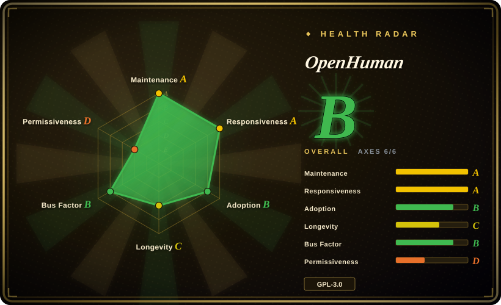
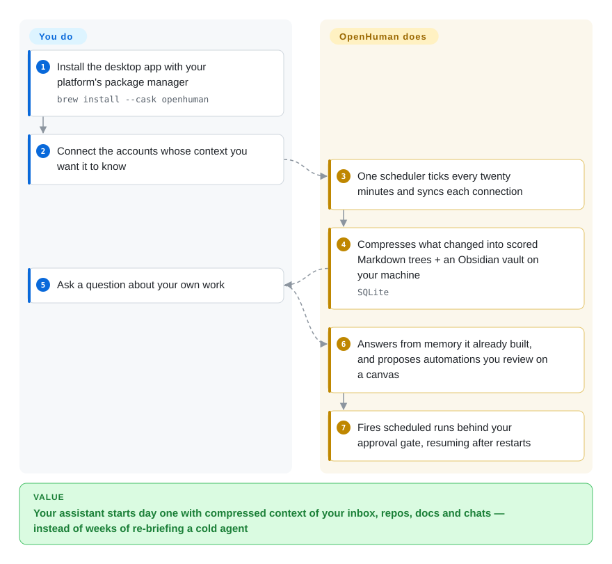

# OpenHuman

A local-first personal AI assistant shipped as a Tauri desktop app over a Rust core: it syncs your connected accounts into scored Markdown memory on your machine every 20 minutes, then answers and proposes approval-gated workflows from that context.

## When to use

You want an assistant that already knows your working life on day one, instead of another chat window you re-brief every morning. You connect Gmail, your calendar, GitHub, Notion and Slack once; a background loop keeps pulling what changed into local memory held as scored Markdown (mirrored as an Obsidian vault you can open and edit), so your first real question lands on context it built while you were away. Pick it over [Hermes Agent](hermes-agent.md) when you want context front-loaded by *ingestion* rather than earned over time by a learning loop; pick it over [OpenClaw](openclaw.md) when the deciding feature is the memory pipeline plus a visual workflow canvas and a GUI in one install, rather than a bring-your-own-everything runtime whose strength is messaging reach.

It is also the unusual one on enforceability: `local_only` is a construction-time refusal in the Rust core — no cloud provider, no network tools, no integrations, no cloud embeddings — so "this stays on my machine" is checkable rather than a promise in a system prompt. The same core speaks JSON-RPC and ships CLI and TUI front-ends, so the desktop window is a surface, not the lock-in.

## How it works

The scheduler, integrations, memory pipeline and approval gate ship with the app; you supply accounts, model choice and intent. One periodic tick walks every connection you authorized and syncs what changed, and the core compresses those items into scored Markdown memory trees in local SQLite, mirrored as an Obsidian vault — so what the agent reasons over is plain text you can read, edit and diff instead of an opaque embedding store. When you ask something, it answers from that tree; when you ask for an automation, it proposes a workflow graph you review on a canvas before saving, and saved runs are durable, trigger-driven and gated on your approval for side effects. Your ongoing job is small: authorize connections, pick which workload runs on which model, and approve the side effects you don't want it taking alone.

<!-- flow-steps:begin (generated from flows/openhuman.json by tools/flow_card.py — do not edit) -->

Text version of the flow

1. **You**: Install the desktop app with your platform's package manager — `brew install --cask openhuman`
2. **You**: Connect the accounts whose context you want it to know
3. **OpenHuman**: One scheduler ticks every twenty minutes and syncs each connection
4. **OpenHuman**: Compresses what changed into scored Markdown trees + an Obsidian vault on your machine — `SQLite`
5. **You**: Ask a question about your own work
6. **OpenHuman**: Answers from memory it already built, and proposes automations you review on a canvas
7. **OpenHuman**: Fires scheduled runs behind your approval gate, resuming after restarts

**Value**: Your assistant starts day one with compressed context of your inbox, repos, docs and chats — instead of weeks of re-briefing a cold agent

<!-- flow-steps:end -->

## When NOT to use

- **You want to embed this machinery in a product you ship.** The Rust workspace declares `GPL-3.0-only` and the engine lives in 16 vendored submodules under the same GPL — copyleft all the way down. If you need app-embedded memory you can license freely, use [Mem0](../../agent-memory/mem0.md) or [Memori](../../agent-memory/memori.md) instead of OpenHuman, because they are permissively licensed libraries with no desktop app attached.
- **You only need memory for your coding agent.** OpenHuman's value comes from the wide-integration ingestion path; if you just want session context to survive `/clear` under Claude Code or Codex, use [claude-mem](../../agent-memory/claude-mem.md) instead, because it hooks the agents you already run and needs no OAuth to your personal accounts.
- **You cannot hand your primary accounts to a months-old beta.** Default routing is the vendor's hosted subscription, and the integrations want read access to mail, calendar and chat. If that trade is unacceptable, use OpenClaw instead (self-hostable, MIT, BYO keys, nothing to sign in to) or claude-mem (captures only what your coding agent does), because both keep the data path under your control without a vendor account.
- **You want a small, inspectable backend runtime.** A multi-crate Rust workspace, a Tauri desktop shell, a pnpm web workspace and 16 git submodules is a lot of surface for "run an agent on a schedule". If you want a backend-shaped thing, use [OpenFang](openfang.md) (single self-hosted Rust binary of scheduled agents) or [eve](eve.md) (one deployable TypeScript service with a durable session runtime) instead, because neither asks you to build a desktop app to get the same job done.
- **You refuse an agent that can move money.** The core ships a non-custodial multi-chain wallet (EVM, Bitcoin, Solana, Tron) behind a prepare→confirm→execute flow, plus a referral/rewards surface that needs a signed-in backend session. If "the agent process holds signing keys" is disqualifying, pick OpenClaw or Hermes Agent instead, because neither ships a wallet in-core.
- **You need a stable dependency or versioned API contract.** 1,000–3,300 commits land per week, the workspace version is 0.63.x, and releases trail the workspace version. Treat it as a fast-moving end-user app to evaluate, not infrastructure to pin; if you need a frozen contract, wrap a permissive framework ([LangGraph](langgraph.md), [OpenAI Agents SDK](openai-agents-sdk.md)) instead.
- **You expect `local_only` to cover everything.** Voice transcription still leaves the device (there is no local STT engine), and `local_only` also refuses CLI delegates such as Claude Code — so using OpenHuman as an orchestrator for your *existing* local agents conflicts with the very mode you enabled. If local-only end-to-end is the requirement, run a locally-hosted stack you assembled yourself; OpenHuman documents voice as an exception.

## Comparison

| Alternative | In index | Our verdict | Tradeoff |
| --- | --- | --- | --- |
| [OpenClaw](openclaw.md) | ✅ | When you want a self-hosted MIT assistant you point at your own models with maximum messaging-channel reach, pick OpenClaw; pick OpenHuman when the feature that decides it is continuously-ingested local memory plus a visual workflow canvas. | OpenClaw wins on license permissiveness, channel count and self-hosted control; OpenHuman pays for its memory pipeline with a vendor account, a much heavier desktop build and no permissive license. |
| [Hermes Agent](hermes-agent.md) | ✅ | When the assistant's value should come from a learning loop that turns experience into skills, pick Hermes; pick OpenHuman when you would rather it read your existing data sources up front than accumulate competence over weeks. | Hermes earns context through self-improvement and runs on a small VPS; OpenHuman buys it by ingesting your mail/chat/repos on a 20-minute loop, which is faster to value but a bigger privacy surface. |
| [claude-mem](../../agent-memory/claude-mem.md) | ✅ | When the memory you actually miss is coding-session context under Claude Code/Codex, pick claude-mem; pick OpenHuman only when you want a general assistant spanning mail, calendar and chat. | claude-mem is a local hook layer with no account and no GUI; OpenHuman is a full assistant with broader reach, more moving parts and more places for your data to pass through. |
| [eve](eve.md) | ✅ | When you need a durable agent backend you deploy as a service with human-in-the-loop approvals, pick eve; pick OpenHuman when a non-technical user should operate it from a desktop window. | eve gives you files, HTTP service and checkpoints on your own infra; OpenHuman gives you a consumer-shaped install plus hosted inference, at the cost of GPL and a heavier toolchain. |
| [OpenFang](openfang.md) | ✅ | When you want scheduled autonomous agents from one Rust binary with no desktop shell, pick OpenFang; pick OpenHuman when the assistant must ingest personal data sources and be steered by a person looking at a GUI. | OpenFang is smaller and easier to self-host; OpenHuman ships the integrations, the GUI and the hosted model routing, which is exactly the weight you may not want. |
| Claude Cowork | 未收录 | Not indexed because it is a closed hosted product, not a repository; choose it when you want vendor-supported desktop assistance with no self-hosting concern at all. | Proprietary and cloud-shaped, with no local-only enforcement you can inspect; OpenHuman is GPL, self-hostable and has a hard local switch — that inspectability is what you would be giving up. |

## Tech stack

- **Rust core** — `crates/openhuman-core` (business domains: agent, memory, tools, security, channels), plus `openhuman-rpc` (JSON-RPC contracts), `openhuman-embed` (library facade), `openhuman-tui`, `openhuman-cli` (the `openhuman-core` binary) and `openhuman-tinyhumans` (backend transport, login/session).
- **Desktop shell** — Tauri v2 (`crates/openhuman-app`, its own Cargo world) over a Vite/React/TypeScript frontend in `app/`; the Rust core owns business rules, persistence, RPC and CLI, and the shell only presents them.
- **Storage** — `rusqlite 0.40.2` (bundled SQLite) for local state; memory is also materialized as Markdown trees plus an Obsidian vault. `tokio` for the async runtime.
- **Build** — a Cargo virtual workspace plus a private pnpm workspace; 16 vendored git submodules (`vendor/tinyagents`, `tinyflows`, `tinymemory`, `tinyskills`, `tinyjuice`, `tinywallet`, …) all pointing at other `tinyhumansai` repositories, wire into the root `[patch]` tables.

## Dependencies

- **Install (users)** — Homebrew Cask (`brew install --cask openhuman`), Debian/Ubuntu `.deb`, AUR `openhuman-bin`, signed Windows `.msi`, or `.dmg`/`.AppImage`; the repo's own `install.sh`/`install.ps1` path is documented as signing-less and explicitly discouraged in `INSTALL.md`.
- **Runtime (default)** — a hosted subscription handles model routing and managed web search; optional BYO provider keys or fully local runtimes (Ollama, LM Studio, MLX, local OpenAI-compatible endpoints) can take over per workload.
- **Build from source** — Node.js 24+, pnpm 10.10.0, Rust 1.96.1 with `rustfmt`/`clippy`, CMake, Ninja, ripgrep, platform desktop build prerequisites, and `git submodule update --init --recursive` before `pnpm install` (the vendored tree is not optional).
- **Self-hosting** — `Dockerfile`, `docker-compose.yml` and `fly.toml` exist alongside a `cloud-deploy` doc, so the core can be run off-desktop; no external database service is required (SQLite is embedded).

## Ops difficulty

**Low for the intended install, high from source.** Installing the packaged desktop app and signing into integrations is a GUI flow with no server to run — that is the design goal. Building or self-hosting is the opposite: a pinned Rust toolchain, a pnpm workspace, 16 recursive submodules and Tauri desktop prerequisites, i.e. a multi-hour first build and ongoing churn from a repo whose default branch moves thousands of commits a week. Day-2 operations for a normal user are keeping integrations authorized, choosing providers per workload, and watching for breaking changes between releases.

## Health & viability

- **Maintenance**: Grade A — commits land daily and all 13 trailing weeks are active; the default branch moved 1,000–3,300 times per week over the last five weeks (measured 2026-09-20). Release cadence is the softer spot: the newest GitHub release is from 2026-08-07 while the workspace version has already reached 0.63.29.
- **Responsiveness**: Grade A on paper — median first-response 0.0h over 44 qualifying issues. Read it as a weak signal: in-window traffic is dominated by the maintainer's own triage, so it measures internal throughput more than outsider support.
- **Adoption**: Grade ? — an `app` with no registry package, so the scorer has no dependency-graph or download signal to use. 39,918 stars against 201 watchers (~0.5%) and 3,942 forks is a launch-shaped profile `[推断]`; do not read it as production adoption.
- **Longevity**: Grade C — created 2026-02-18, i.e. 214 days old at verification. Young-and-thriving fails the Lindy prior by construction: there is no proven survival yet, and age × activity is the honest reading.
- **Governance / bus factor**: Grade B in the scorer's 12-month window (175 active maintainers, top-1 share 45.4%, top-3 85%), but the lifetime API is blunter — the creator holds ~63% of 21,280 commits and issue traffic sits with two accounts, so the roadmap is effectively one person's.
- **Risk flags**: `GPL-3.0-only` grades D on permissiveness (strong network copyleft, no relicense in 36 months) — embedding it in proprietary software is the wrong shape; the core also ships a crypto wallet and a referral/rewards surface inside an agent that reads your mail and chat, and the engine is spread over 16 younger sibling repositories under one organization, so dependency count multiplies rather than diversifies.

## Caveats (unverified)

- [未验证] README marketing claims: "100+ OAuth integrations, 5,000+ MCP servers, 90,000+ Skills", "up to 80% fewer tokens" via TokenJuice, "number one trending repository for nine days", and meeting joins on Meet/Zoom/Teams/Webex. The README is their only source; I read the channels and auto-fetch docs but did not count integrations, skills or MCP servers.
- [未验证] Product behavior as a whole: I did not install or run OpenHuman, so no claim here rests on first-hand use — only on repo metadata, README, `AGENTS.md`, `INSTALL.md`, `.gitmodules`, `Cargo.toml`, and the `gitbooks/features/*` docs I actually fetched.
- [推断] The 39.9k-star / 201-watcher ratio and the "trending" framing suggest launch-driven attention rather than a settled user community; watcher count is only a proxy and I did not sample production users.
- [未验证] The npm package `openhuman` (v0.1.5, ~49 downloads last month, no repository link) appears unrelated to this repo; I found no registry package mapped to it on ecosyste.ms, so no adoption signal is attributed from that package.
- [推断] The other 16 submodules are GPL-3.0 per GitHub license metadata; I did not open each LICENSE file, so a submodule with a different or additional term would not have been caught.
- [未验证] Whether the hosted subscription is required for a practical first-run experience, and what the free/local path costs in friction — the docs describe BYOK and local runtimes, but I did not test how far the app works without signing in.
- [未验证] The `.sdd-progress.md` file committed at the repo root shows an internal spec-driven-development plan with phases 6–7 pending; it is a maintainers' work log, and I did not verify what it implies for release readiness.
