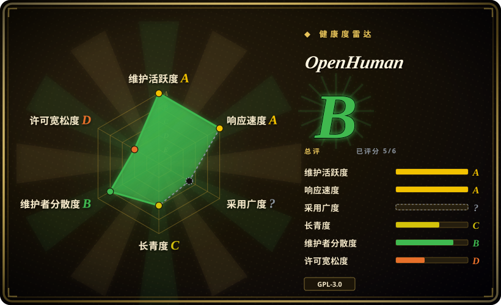
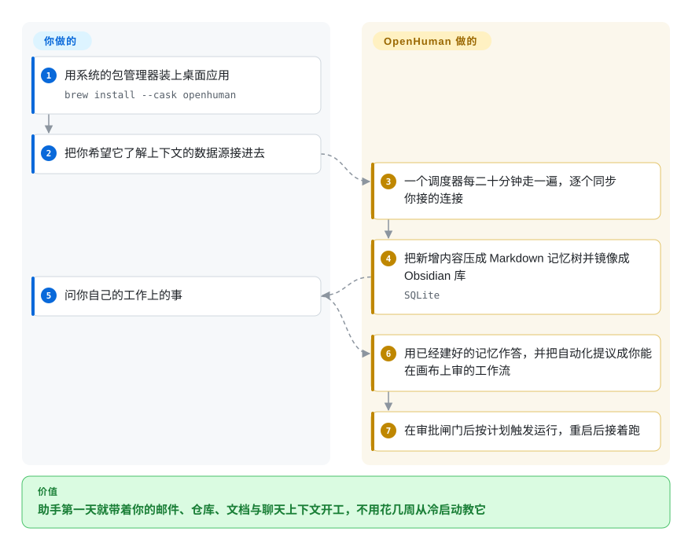

# OpenHuman

一个本地优先的个人 AI 助手：外壳是 Tauri 桌面应用，内核是 Rust 写的 core。它每 20 分钟把你接进来的账号同步成本机的 Markdown 记忆，然后基于这些上下文作答，并把自动化提议成需要你审批的工作流。

## 何时使用

你想让助手第一天就了解你的工作现场，而不是每天早上再给另一个聊天窗口重新交代一遍。你把 Gmail、日历、GitHub、Notion、Slack 接一次，后台循环就把新增内容持续拉进本机记忆——存成打分的 Markdown，并镜像成你能直接打开、编辑的 Obsidian 库——于是你问的第一个真问题，就落在它趁你不在时已经建好的上下文上。比起 [Hermes Agent](hermes-agent.zh.md)，选它的理由是你想要靠“把数据源灌进来”前置上下文，而不是靠学习循环花几周慢慢攒；比起 [OpenClaw](openclaw.zh.md)，选它的理由是决定性的功能是记忆流水线加可视化工作流画布加一个图形界面，而不是一个样样自带、以消息渠道覆盖见长的运行时。

它在“说到做到”这件事上也更少见：`local_only` 是 Rust core 里的构造期拒绝——不建云端 provider、不给网络工具、不给集成、不给云端 embedding——“数据留在我机器上”是可核对的，而不是系统提示里的一句话。同一个 core 还提供 JSON-RPC，并自带 CLI 与 TUI 前端，所以桌面窗口只是一层界面，不是锁定点。

## 怎么用起来

调度器、集成、记忆流水线和审批闸门都随应用一起交付；你提供的是账号、模型选择和意图。一个周期性 tick 会走一遍你授权的每个连接并同步变更，core 再把新增内容压成打分的 Markdown 记忆树写进本机 SQLite，并镜像成 Obsidian 库——所以 agent 推理所依据的是你能读、能改、能 diff 的纯文本，而不是一个不透明的向量库。你问问题时它从这棵树作答；你要自动化时它提议一张工作流图，你在画布上审过再保存，保存后的运行是持久、可触发、副作用必须过你审批的。你后续要做的事很少：授权连接、决定哪类负载跑哪个模型、以及批准那些你不愿它独自做掉的副作用。

<!-- flow-steps:begin (generated from flows/openhuman.json by tools/flow_card.py — do not edit) -->

流程文字版

1. **你**：用系统的包管理器装上桌面应用 — `brew install --cask openhuman`
2. **你**：把你希望它了解上下文的数据源接进去
3. **OpenHuman**：一个调度器每二十分钟走一遍，逐个同步你接的连接
4. **OpenHuman**：把新增内容压成 Markdown 记忆树并镜像成 Obsidian 库 — `SQLite`
5. **你**：问你自己的工作上的事
6. **OpenHuman**：用已经建好的记忆作答，并把自动化提议成你能在画布上审的工作流
7. **OpenHuman**：在审批闸门后按计划触发运行，重启后接着跑

**价值**：助手第一天就带着你的邮件、仓库、文档与聊天上下文开工，不用花几周从冷启动教它

<!-- flow-steps:end -->

## 何时不用

- **你想把这套机制嵌进自己要发布的产品。** Rust 工作区声明的是 `GPL-3.0-only`，引擎还散在 16 个同为 GPL 的 vendor 子模块里——从根到叶子都是 copyleft。如果你要的是能自由商用的应用内记忆，别用 OpenHuman，改用 [Mem0](../../agent-memory/mem0.zh.md) 或 [Memori](../../agent-memory/memori.zh.md)，因为它们是宽松许可的库，且不附带桌面应用。
- **你只是想要编码 agent 的记忆。** OpenHuman 的价值来自那套广覆盖集成；如果你只是想让会话上下文在 Claude Code 或 Codex 里扛住 `/clear`，改用 [claude-mem](../../agent-memory/claude-mem.zh.md)，因为它挂在你已经在跑的 agent 生命周期上，不需要你把个人账号 OAuth 出去。
- **你不能把主账号交给一个才几个月大的 beta。** 默认推理走的是厂商的托管订阅，而集成要的是邮件、日历、聊天记录的读权限。如果这个交换你不能接受，改用 OpenClaw（可自托管、MIT、自带 key、无需登录任何厂商账号）或 claude-mem（只抓编码 agent 干过的事），因为这两者的数据路径都不经过厂商账号。
- **你想要一个小而可审查的后端运行时。** 多 crate 的 Rust 工作区、Tauri 桌面外壳、pnpm 前端工作区加 16 个 git 子模块，对“按计划跑个 agent”来说体积很大。如果你要的是后端形态的东西，改用 [OpenFang](openfang.zh.md)（单个自托管 Rust 二进制跑计划任务型 agent）或 [eve](eve.zh.md)（一个可部署的 TypeScript 服务，自带持久会话运行时），因为这两者不逼你先做出一个桌面应用。
- **你不接受会动钱的 agent。** core 里内置了非托管多链钱包（EVM、Bitcoin、Solana、Tron），走 prepare→confirm→execute 流程；另有一块需要登录后端会话的邀请返利与积分界面。如果“agent 进程持有签名密钥”对你是否决项，改用 OpenClaw 或 Hermes Agent，因为它们的 core 里都没有钱包。
- **你需要稳定的依赖或冻结的 API 契约。** 这个仓库每周落 1000–3300 个提交，工作区版本号是 0.63.x，发布还落后于工作区版本。把它当成一个快速迭代的终端用户应用来评估，而不是可以锁版本的基座；如果你要冻结契约，改用宽松许可的框架层（[LangGraph](langgraph.zh.md)、[OpenAI Agents SDK](openai-agents-sdk.zh.md)）把行为包起来。
- **你以为 `local_only` 覆盖一切。** 语音转写仍会离开设备（没有本地 STT 引擎），而且 `local_only` 会连 Claude Code 这类 CLI delegate 一起拒掉——所以你想拿它编排自己现有的本地 agent，会和你刚打开的模式直接冲突。如果硬要求端到端本地，就别用它，自己搭一套本地栈；OpenHuman 自己把语音写成了例外。

## 横向对比

| 替代品 | 是否收录 | 我们的评价 | 取舍 |
| --- | --- | --- | --- |
| [OpenClaw](openclaw.zh.md) | ✅ | 如果你要的是把模型指向自己后端的自托管 MIT 助手、并且消息渠道覆盖最广，选 OpenClaw；如果决定性功能是持续灌入的本地记忆加可视化工作流画布，就选 OpenHuman。 | OpenClaw 赢在许可宽松、渠道数量和自托管控制权；OpenHuman 为记忆流水线付出的代价是必须有厂商账号、桌面构建重得多，而且没有宽松许可。 |
| [Hermes Agent](hermes-agent.zh.md) | ✅ | 如果助手的价值应该来自把经验变成技能的学习循环，选 Hermes；如果你宁可让它一上来就读你已有的数据源、而不是攒几周能力，就选 OpenHuman。 | Hermes 靠自我改进挣来上下文、一台小 VPS 就能跑；OpenHuman 靠每 20 分钟灌入你的邮件聊天和仓库来买上下文，见效更快但隐私面更大。 |
| [claude-mem](../../agent-memory/claude-mem.zh.md) | ✅ | 如果你真正缺的是 Claude Code／Codex 下的编码会话上下文，选 claude-mem；只有当你要的是横跨邮件、日历、聊天的通用助手时才选 OpenHuman。 | claude-mem 是一个本地钩子层，不要账号也不要图形界面；OpenHuman 是完整助手，覆盖面更广、活动部件更多、数据经过的环节也更多。 |
| [eve](eve.zh.md) | ✅ | 如果你要的是部署成服务、带人工审批的持久 agent 后端，选 eve；如果你要的是让非技术用户从桌面窗口直接操作，就选 OpenHuman。 | eve 给你文件、HTTP 服务和检查点，跑在你自己的基础设施上；OpenHuman 给你一个消费级安装形态加托管推理，代价是 GPL 和更重的工具链。 |
| [OpenFang](openfang.zh.md) | ✅ | 如果你要的是单个 Rust 二进制跑计划任务型自治 agent、不要桌面外壳，选 OpenFang；如果助手必须吃进个人数据源、并由人看着图形界面来掌舵，就选 OpenHuman。 | OpenFang 更小、更好自托管；OpenHuman 自带集成、图形界面和托管模型路由，而这恰好可能是你不想背的重量。 |
| Claude Cowork | 未收录 | 未收录，因为它不是仓库而是闭源托管产品；如果你要的是厂商支持、完全不用操心自托管的桌面助手，选它。 | 闭源且云形态，没有任何你能审查的本地模式强制；OpenHuman 是 GPL、可自托管、有一个硬开关——你放弃的正是这份可审查性。 |

## 技术栈

- **Rust core** — `crates/openhuman-core`（业务域：agent、memory、tools、security、channels），另有 `openhuman-rpc`（JSON-RPC 契约）、`openhuman-embed`（库门面）、`openhuman-tui`、`openhuman-cli`（即 `openhuman-core` 二进制）和 `openhuman-tinyhumans`（后端传输与登录会话）。
- **桌面外壳** — Tauri v2（`crates/openhuman-app`，独立的 Cargo 世界）套一个 Vite／React／TypeScript 前端（`app/`）；业务规则、持久化、RPC 与 CLI 都归 Rust core，外壳只负责呈现。
- **存储** — `rusqlite 0.40.2`（bundled SQLite）存本地状态；记忆另外物化成 Markdown 树与 Obsidian 库。异步运行时是 `tokio`。
- **构建** — Cargo 虚拟工作区加一个私有 pnpm 工作区；16 个 vendor git 子模块（`vendor/tinyagents`、`tinyflows`、`tinymemory`、`tinyskills`、`tinyjuice`、`tinywallet` 等）全部指向 `tinyhumansai` 名下的其他仓库，并通过根 `[patch]` 表接进来。

## 依赖

- **安装（普通用户）** — Homebrew Cask（`brew install --cask openhuman`）、Debian／Ubuntu `.deb`、AUR 的 `openhuman-bin`、签名的 Windows `.msi`，或 `.dmg`／`.AppImage`；仓库自带的 `install.sh`／`install.ps1` 路径在 `INSTALL.md` 里被明确写成无签名并劝退使用。
- **运行时（默认）** — 托管订阅负责模型路由与托管网页搜索；可以按负载改成自带 provider key，或完全走本地运行时（Ollama、LM Studio、MLX、本地 OpenAI 兼容端点）。
- **从源码构建** — Node.js 24+、pnpm 10.10.0、Rust 1.96.1 加 `rustfmt`／`clippy`、CMake、Ninja、ripgrep、平台桌面构建前置依赖，并且在 `pnpm install` 前必须 `git submodule update --init --recursive`（vendor 树不是可选项）。
- **自托管** — 仓库里有 `Dockerfile`、`docker-compose.yml`、`fly.toml` 和一份 `cloud-deploy` 文档，core 可以脱离桌面端运行；不需要外部数据库服务，SQLite 是内嵌的。

## 运维难度

**按预期安装路径算低，从源码构建算高。** 装打包好的桌面应用并登录集成是一套图形界面流程，没有需要你运行的服务器——这是它的设计目标。构建或自托管则相反：锁定的 Rust 工具链、pnpm 工作区、16 个递归子模块、Tauri 桌面前置依赖，意味着首次构建就要几小时，而且默认分支每周动几千个提交，后续还会持续折腾。对普通用户的日常运维只剩三件事：维持集成的授权、按负载选 provider、留意版本之间的破坏性变更。

## 健康度与可持续性

- **维护活跃度**：A —— 每天都有提交，最近 13 周每周都活跃；近 5 周默认分支每周落 1000–3300 个提交（2026-09-20 度量）。发布节奏是较弱的一环：最新的 GitHub release 停在 2026-08-07，而工作区版本号已经到 0.63.29。
- **响应速度**：名义上是 A —— 44 条合格 issue 的中位首次响应 0.0 小时。但要当成弱信号读：窗口内的流量主要由维护者自己分诊，它度量的是内部吞吐，不是外部求助被接住的速度。
- **采用广度**：? —— 这是 `app` 类型且没有 registry 包，评分器拿不到依赖图或下载量信号。39,918 star 对 201 watcher（约 0.5%）、3,942 fork 是典型的发布期形态 `[推断]`，不要把它读成生产采用。
- **长青度**：C —— 仓库建于 2026-02-18，核验时只有 214 天。年轻且活跃在定义上就不满足 Lindy 先验：尚无被验证的存活记录，诚实的读法是看“年龄 × 活跃度”。
- **维护者分散度**：评分器按近 12 个月窗口给 B（175 位活跃维护者，top-1 占 45.4%、top-3 占 85%），但全生命周期口径更直白——创始人握有 21,280 个提交中的约 63%，issue 流量集中在两个账号，路线图实际上取决于一个人。
- **风险标记**：`GPL-3.0-only` 在许可宽松度上是 D（强网络 copyleft，36 个月内无改许可）——嵌进闭源软件是错的形态；core 里还内置了加密钱包和邀请返利界面，而这个 agent 同时会读你的邮件与聊天；引擎散在 16 个更年轻的同门仓库里，依赖数量是在放大而不是在分散。

## 存疑（未验证）

- [未验证] README 的营销口径：“100+ OAuth 集成、5000+ MCP server、90000+ Skills”、TokenJuice“最多省 80% token”、“连续九天 trending 第一”、以及能参加 Meet／Zoom／Teams／Webex 会议。这些只有 README 一个来源；我读了 channels 和 auto-fetch 两页文档，但没有去数集成、技能或 MCP server 的实际数量。
- [未验证] 产品整体行为：我没有安装或运行 OpenHuman，所以本页没有任何结论建立在一手使用上——只建立在仓库元数据、README、`AGENTS.md`、`INSTALL.md`、`.gitmodules`、`Cargo.toml` 和我实际抓取的 `gitbooks/features/*` 文档上。
- [推断] 39.9k star 对 201 watcher 的比例，加上“trending”叙事，指向发布期热度而非沉淀下来的用户社区；watcher 数只是代理指标，我也没有抽样过生产使用者。
- [未验证] npm 上的 `openhuman` 包（v0.1.5，上月约 49 次下载，没有仓库链接）看起来与本仓库无关；ecosyste.ms 上没有映射到本仓库的 registry 包，所以采用广度没有从这个包取任何信号。
- [推断] 另外 16 个子模块按 GitHub 的许可元数据都是 GPL-3.0；我没有逐个打开 LICENSE 文件，所以某个子模块若有不同或附加条款，本页不会发现。
- [未验证] 托管订阅对一次可用的首次体验是否必需，以及走本地或自带 key 路径要付出多少摩擦——文档描述了自带 key 与本地运行时，但我没有实测不登录能用多远。
- [未验证] 仓库根目录提交了一份 `.sdd-progress.md`，记录内部 SDD 计划且 Phase 6–7 仍 pending；那是维护者自己的工作日志，我没有核实它对可发布程度意味着什么。
