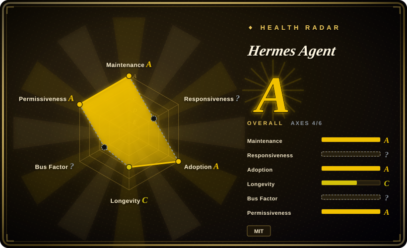
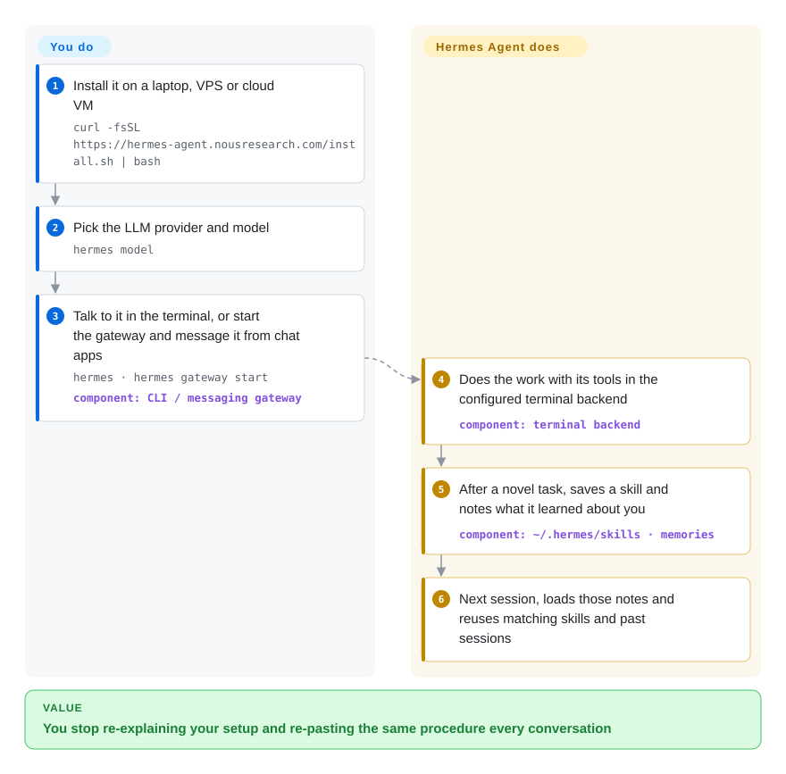

# Hermes Agent

Every chat with an AI assistant starts from zero: you re-explain that the project is a Rust service on Ubuntu, re-paste the same deploy checklist, and the procedure it worked out yesterday is gone. Hermes Agent is an assistant you run on your own machine or server that keeps short notes about you and your environment, saves the procedures it works out as reusable skill files, and searches its past conversations — and you can reach it from the terminal or from Telegram, Slack, Discord and other chat apps.

## When to use

You're a developer or a small team lead who wants one long-lived assistant on a $5 VPS or a spare cloud VM: it should run shell commands, check on a nightly job, send you a report on Telegram every morning, and remember that "deploy" means your specific three-step script. With ChatGPT-style apps you paste that context in every new conversation; with a coding agent like OpenCode you get great file editing but nothing that lives on a server, answers your phone, or runs a cron job. You reach for Hermes because persistence is the point: a bounded memory file about you, a growing folder of skills it writes after solving something new (pruned by a background curator so it does not fill up with near-duplicates), full-text search over old sessions, and a built-in scheduler — all under your control and with any model provider you choose.

Pick it over [OpenClaw](openclaw.md) when you care more about the agent accumulating procedures and memory on a server than about the broadest set of chat channels and companion apps; OpenClaw is the wider-reach assistant, and Hermes even ships `hermes claw migrate` for moving an OpenClaw setup across.

## How it works

Hermes is a Python application you install with one script; it provisions its own Python 3.14 environment and tools. **You** choose a model provider (`hermes model`), decide where its tools run — locally, in Docker, over SSH, or in a serverless sandbox such as Modal or Daytona that sleeps when idle — and talk to it through the terminal UI or through the *gateway*, one background process that connects it to your chat apps. **It** does the rest of the loop on its own: it calls tools to do the task, writes what it learned about you into two small capped files (`MEMORY.md` and `USER.md`, a few hundred tokens each, loaded into every new session), saves a reusable skill — a Markdown instruction file in `~/.hermes/skills/` — after solving something new, and indexes every session so later conversations can search them. Think of it as an assistant that keeps a notebook and a recipe box, rather than one with a better memory: what it "learns" is text you can open, edit, pin or delete.

<!-- flow-steps:begin (generated from flows/hermes-agent.json by tools/flow_card.py — do not edit) -->

Text version of the flow

1. **You**: Install it on a laptop, VPS or cloud VM — `curl -fsSL https://hermes-agent.nousresearch.com/install.sh | bash`
2. **You**: Pick the LLM provider and model — `hermes model`
3. **You**: Talk to it in the terminal, or start the gateway and message it from chat apps — `hermes · hermes gateway start` — component: `CLI / messaging gateway`
4. **Hermes Agent**: Does the work with its tools in the configured terminal backend — component: `terminal backend`
5. **Hermes Agent**: After a novel task, saves a skill and notes what it learned about you — component: `~/.hermes/skills · memories`
6. **Hermes Agent**: Next session, loads those notes and reuses matching skills and past sessions

**Value**: You stop re-explaining your setup and re-pasting the same procedure every conversation

<!-- flow-steps:end -->

## When NOT to use

- **You need deterministic, repeatable automation.** Skills and memory change as the agent works, so the same request can take a different path next week. For fixed workflows use [n8n](../../../workflow-orchestration/n8n.md) or plain scripts instead, because they do exactly what you wrote every time.
- **You want an embeddable library, not an app.** Hermes is a whole assistant with its own CLI, gateway and state directory; to put an agent loop inside your own Python service, use [Pydantic AI](../agent-sdks/pydantic-ai.md) or [LangChain](../../workflow-builders/langchain.md) instead.
- **You need enterprise governance.** There is command approval and DM pairing, but no SSO, RBAC or audit trail, and memory is scoped to one profile ("one agent per Hermes home"). For organisation-wide agents with access control, use [Dify](../../workflow-builders/dify.md) instead.
- **Your job is mainly writing code in a repository.** Hermes can edit files and run shells, but purpose-built coding agents such as [OpenCode](../../coding-agents/terminal-agents/opencode.md) are better at repo-scale editing, diffs and review loops.
- **You need designed multi-agent teams.** Hermes delegates to subagents for parallel work, but the unit is still one assistant; for explicit role-based teams use [CrewAI](../agent-sdks/crewai.md) instead.
- **You cannot run Python 3.14 or tolerate a moving target.** The project now supports only Python 3.14 (older interpreters are allowed just long enough to self-update), ships date-versioned releases every few days, and carries a very large open issue and PR backlog; if you need a stable, slow-changing assistant, pin a release and test upgrades, or prefer [OpenClaw](openclaw.md), which is governed by a foundation with a signed-release process.

## Comparison

| Alternative | In index | Our verdict | Tradeoff |
| --- | --- | --- | --- |
| [OpenClaw](openclaw.md) | ✅ | Pick OpenClaw when you want the assistant on the most chat channels and devices with companion apps and team mode; pick Hermes when a server-side agent that accumulates skills and memory matters more. | Both keep Markdown memory files; OpenClaw adds wider reach and foundation governance, Hermes adds skills the agent writes itself (pruned by a curator), many terminal backends, and an optional single subscription (Nous Portal) for models and tools. |
| [AutoGPT](../../workflow-builders/autogpt.md) | ✅ | Pick AutoGPT when you want to build and deploy autonomous agent workflows as blocks in a web UI; pick Hermes when you want one conversational assistant that you talk to and that remembers you. | AutoGPT is a platform for many workflow agents with a builder UI; Hermes is a single personal agent with chat and terminal front ends. |
| [OpenCode](../../coding-agents/terminal-agents/opencode.md) | ✅ | Pick OpenCode for coding sessions inside a repository; pick Hermes for an always-on general assistant that also runs shell tasks and scheduled jobs. | OpenCode is tuned for editing code with tight review loops; Hermes trades that depth for persistence, messaging and cron. |
| [LangChain](../../workflow-builders/langchain.md) | ✅ | Pick LangChain when you are building your own agent product and want components; pick Hermes when you want a finished assistant you install and use today. | LangChain gives full control and you own every piece; Hermes is opinionated and ready, but its behaviour is the project's, not yours. |
| [CrewAI](../agent-sdks/crewai.md) | ✅ | Pick CrewAI to script a team of role-based agents for a business process; pick Hermes for one personal agent that learns your environment. | CrewAI is a framework for orchestrated multi-agent runs; Hermes is an end-user agent with memory and skills, not an orchestration library. |

## Tech stack

- **Python 3.14** application (`requires-python >=3.11,<3.15`, but only 3.14 is supported); direct dependencies are exact-pinned as a supply-chain defence.
- **Interfaces:** terminal UI (`hermes`), messaging gateway (`hermes gateway`) for Telegram, Discord, Slack, WhatsApp, Signal, email and Home Assistant, Hermes Desktop, an Android/Termux package.
- **Terminal backends:** local, Docker, SSH, Singularity, Modal, Daytona, Vercel Sandbox.
- **State:** Markdown memory and skill files under `~/.hermes/`, SQLite FTS5 full-text search over sessions; optional Honcho user modelling and external memory providers; MCP client.

## Dependencies

- A machine to host it (laptop, VPS, GPU box) running Linux, macOS, WSL2, native Windows or Termux; the installer brings Python 3.14, Node.js, ripgrep and FFmpeg via its package manager.
- At least one LLM provider: OpenRouter, OpenAI, Anthropic, your own OpenAI-compatible endpoint, or the paid Nous Portal subscription, which also bundles web search, image generation, TTS and a cloud browser.
- Bot credentials for each chat platform you connect; accounts with Modal/Daytona if you use those sandboxes.

## Ops difficulty

**Medium.** Installing is one script and `hermes setup`, and `hermes doctor` diagnoses problems. The ongoing work is what makes it different: you are running an agent with shell access that strangers could message, so you must configure command approval, DM pairing and a sandboxed backend; you should review the skills and memory it writes; and you need to keep up with frequent releases (`hermes update`). Running one gateway per profile and not sharing a Hermes home between two processes avoids corrupted memory.

## Health & viability

- **Maintenance (2026-10-08):** extremely active — commits daily and date-versioned releases every few days (v2026.9.24 is the latest stable as of today).
- **Governance:** backed by Nous Research, an AI lab, under MIT. The radar's governance axis is `?` this time (the scorer could not attribute commits); the contributor list is dominated by one maintainer (`teknium1`, roughly four times the next contributor's commits), so treat the bus factor as concentrated even though hundreds of people contribute.
- **Responsiveness:** not scored (`?`, no usable signal); with roughly 14.6k open issues and 33k open PRs as of 2026-10-08, assume your bug report may not get a quick answer.
- **Age / Lindy:** about 15 months old (442 days; created 2025-07), longevity C — too young for the Lindy prior to help.
- **Adoption:** ~252k stars and over 54k forks; adoption grade A from PyPI (162,501 monthly downloads), Homebrew and release downloads. Overall radar grade A.
- **Risk flags:** MIT with no relicense history; an optional paid service (Nous Portal) is promoted in the README but not required.

## Caveats (unverified)

- [推断] Star and fork counts this high for a 15-month-old repo likely reflect hype and AI-assisted contribution volume as much as production use.
- [推断] The open-PR count (≈33k) suggests many automated or low-effort submissions; how much of it maintainers actually review was not checked.
- [未验证] Quality of agent-written skills over months of use was not tested; the curator prunes unused skills but its optional LLM consolidation pass is off by default.
- [未验证] The "$5 VPS" claim covers the agent process with remote model APIs; local models or heavy browser tools need far more.
- [推断] Bus-factor concentration is inferred from the GitHub contributors API, which counts commits on the default branch only.
