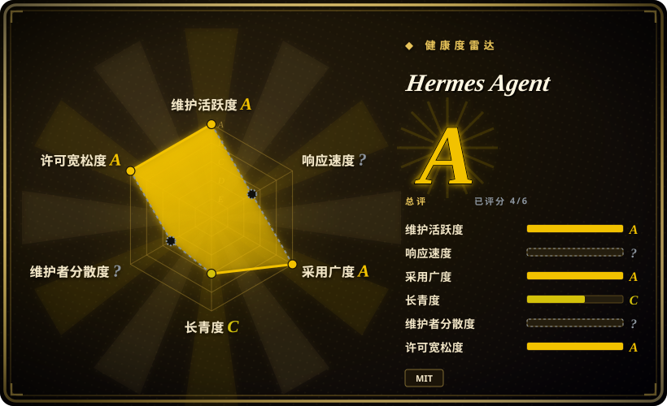
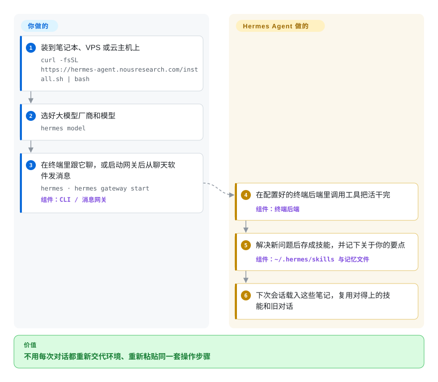

# Hermes Agent

每次和 AI 助手聊天都从零开始：你又得解释一遍“项目是跑在 Ubuntu 上的 Rust 服务”，又得粘贴同一份部署清单，它昨天摸索出来的做法今天全忘了。Hermes Agent 是一个跑在你自己机器或服务器上的助手：它给你和你的环境记简短笔记，把摸索出来的做法存成可复用的技能文件，还能搜索过去的对话——你可以在终端里找它，也可以在 Telegram、Slack、Discord 等聊天软件里找它。

## 何时使用

你是开发者或小团队负责人，想在一台 5 美元的 VPS 或闲置云主机上养一个长期在线的助手：它要能跑 shell 命令、盯一下夜间任务、每天早上在 Telegram 上给你发报告，还要记得你说的“部署”就是那三步专用脚本。用 ChatGPT 这类应用，每开一个新对话都得重新粘贴这些背景；用 OpenCode 这类编码智能体，改文件很强，但它不住在服务器上，不会回你手机消息，也不跑定时任务。你选 Hermes，是因为“持续存在”正是它的重点：一份有容量上限的关于你的记忆文件，一个它解决新问题后不断往里写技能的文件夹（后台有个整理器负责清理，免得堆满近似重复的技能），对旧会话的全文搜索，再加一个内置定时器——全部在你掌控之下，模型厂商随你选。

和 [OpenClaw](openclaw.zh.md) 比，当你更在意智能体在服务器上积累做法和记忆，而不是覆盖最多的聊天渠道和配套 App 时选 Hermes；OpenClaw 是触达面更广的助手，Hermes 甚至自带 `hermes claw migrate`，用来把 OpenClaw 的配置搬过来。

## 怎么用起来

Hermes 是一个用一条脚本安装的 Python 应用，它会自己准备 Python 3.14 环境和配套工具。**你**负责选模型厂商（`hermes model`），决定它的工具在哪里执行——本机、Docker、SSH，或者 Modal、Daytona 这类空闲时会休眠的无服务器沙箱——然后在终端界面里跟它聊，或者通过“网关”跟它聊（网关是一个后台进程，负责把它接到你的聊天软件上）。**它**自己跑完剩下的循环：调用工具把活干完；把了解到的关于你的信息写进两个有容量上限的小文件（`MEMORY.md` 和 `USER.md`，各几百个 token，每次新会话开始时载入）；解决新问题后存一个可复用的技能——放在 `~/.hermes/skills/` 里的一份 Markdown 操作说明；并给每次会话建索引，方便以后搜索。与其说它记性更好，不如说它随身带着一本笔记本和一盒菜谱：它“学到”的东西都是文本，你可以打开、修改、钉住或删除。

<!-- flow-steps:begin (generated from flows/hermes-agent.json by tools/flow_card.py — do not edit) -->

流程文字版

1. **你**：装到笔记本、VPS 或云主机上 — `curl -fsSL https://hermes-agent.nousresearch.com/install.sh | bash`
2. **你**：选好大模型厂商和模型 — `hermes model`
3. **你**：在终端里跟它聊，或启动网关后从聊天软件发消息 — `hermes · hermes gateway start` — 组件：`CLI / 消息网关`
4. **Hermes Agent**：在配置好的终端后端里调用工具把活干完 — 组件：`终端后端`
5. **Hermes Agent**：解决新问题后存成技能，并记下关于你的要点 — 组件：`~/.hermes/skills 与记忆文件`
6. **Hermes Agent**：下次会话载入这些笔记，复用对得上的技能和旧对话

**价值**：不用每次对话都重新交代环境、重新粘贴同一套操作步骤

<!-- flow-steps:end -->

## 何时不用

- **你需要确定、可重复的自动化。** 技能和记忆会随着它干活而变化，同一个请求下周可能走另一条路。固定流程请改用 [n8n](../../../workflow-orchestration/n8n.zh.md) 或普通脚本，因为它们每次都严格照你写的执行。
- **你要的是能嵌入的库，而不是应用。** Hermes 是一整个助手，有自己的 CLI、网关和状态目录；要把智能体循环放进你自己的 Python 服务，改用 [Pydantic AI](../agent-sdks/pydantic-ai.zh.md) 或 [LangChain](../../workflow-builders/langchain.zh.md)。
- **你需要企业级治理。** 它有命令审批和私信配对，但没有 SSO、RBAC 或审计日志，记忆按单个 profile 隔离（“一个 Hermes 目录只配一个智能体”）。要做带权限控制的组织级智能体，改用 [Dify](../../workflow-builders/dify.zh.md)。
- **你的活主要是在代码仓库里写代码。** Hermes 能改文件、跑 shell，但 [OpenCode](../../coding-agents/terminal-agents/opencode.zh.md) 这类专门的编码智能体在仓库级改动、diff 和审查循环上更强。
- **你需要精心设计的多智能体团队。** Hermes 会把并行工作委派给子智能体，但单位始终是一个助手；要显式的按角色分工的团队，改用 [CrewAI](../agent-sdks/crewai.zh.md)。
- **你用不了 Python 3.14，或受不了目标一直在动。** 项目现在只支持 Python 3.14（旧解释器只允许撑到完成自我更新），按日期编号的版本几天一发，未处理的 issue 和 PR 积压非常大；如果你需要稳定、变化慢的助手，就锁定版本、测试后再升级，或者选由基金会治理、发布有签名流程的 [OpenClaw](openclaw.zh.md)。

## 横向对比

| 替代品 | 是否收录 | 我们的评价 | 取舍 |
| --- | --- | --- | --- |
| [OpenClaw](openclaw.zh.md) | ✅ | 想让助手出现在最多的聊天渠道和设备上，还要配套 App 和团队模式，选 OpenClaw；更看重一个在服务器上积累技能和记忆的智能体，选 Hermes。 | 两者都用 Markdown 文件做记忆；OpenClaw 多的是更广的触达面和基金会治理，Hermes 多的是智能体自己写技能（由整理器清理）、更多终端后端，以及一个打包模型和工具的可选订阅（Nous Portal）。 |
| [AutoGPT](../../workflow-builders/autogpt.zh.md) | ✅ | 想在网页里用积木搭建并部署自主工作流智能体，选 AutoGPT；想要一个能对话、记得你的助手，选 Hermes。 | AutoGPT 是承载多个工作流智能体、带搭建界面的平台；Hermes 是一个单独的个人智能体，入口是聊天和终端。 |
| [OpenCode](../../coding-agents/terminal-agents/opencode.zh.md) | ✅ | 在代码仓库里写代码选 OpenCode；要一个常驻、还能跑 shell 任务和定时任务的通用助手选 Hermes。 | OpenCode 为改代码和紧凑的审查循环调优；Hermes 拿这份深度换来持续存在、消息触达和定时任务。 |
| [LangChain](../../workflow-builders/langchain.zh.md) | ✅ | 你在做自己的智能体产品、想要组件，选 LangChain；想要今天装上就能用的成品助手，选 Hermes。 | LangChain 给你完全的控制，每一块都归你；Hermes 有主见、开箱即用，但行为由项目决定而不是由你决定。 |
| [CrewAI](../agent-sdks/crewai.zh.md) | ✅ | 要为一个业务流程编排一组按角色分工的智能体，选 CrewAI；要一个熟悉你环境的个人智能体，选 Hermes。 | CrewAI 是编排多智能体运行的框架；Hermes 是带记忆和技能的终端用户智能体，不是编排库。 |

## 技术栈

- **Python 3.14** 应用（`requires-python >=3.11,<3.15`，但实际只支持 3.14）；直接依赖全部精确锁定版本，用来防供应链攻击。
- **入口：** 终端界面（`hermes`）、消息网关（`hermes gateway`，支持 Telegram、Discord、Slack、WhatsApp、Signal、邮件和 Home Assistant）、Hermes Desktop、Android/Termux 安装包。
- **终端后端：** 本机、Docker、SSH、Singularity、Modal、Daytona、Vercel Sandbox。
- **状态：** `~/.hermes/` 下的 Markdown 记忆和技能文件，基于 SQLite FTS5 的会话全文搜索；可选 Honcho 用户建模和外部记忆服务；MCP 客户端。

## 依赖

- 一台托管它的机器（笔记本、VPS、GPU 服务器），系统可以是 Linux、macOS、WSL2、原生 Windows 或 Termux；安装器会通过自带的包管理器装好 Python 3.14、Node.js、ripgrep 和 FFmpeg。
- 至少一个大模型来源：OpenRouter、OpenAI、Anthropic、你自己的 OpenAI 兼容端点，或付费的 Nous Portal 订阅（还打包了网页搜索、图像生成、语音合成和云浏览器）。
- 每个接入的聊天平台各自的机器人凭证；用 Modal/Daytona 沙箱的话还要有对应账号。

## 运维难度

**中等。** 安装就是一条脚本加 `hermes setup`，出问题有 `hermes doctor` 诊断。真正的持续工作恰恰来自它的特点：你在运行一个有 shell 权限、陌生人也可能给它发消息的智能体，所以必须配置命令审批、私信配对和沙箱后端；它写下的技能和记忆你要定期过目；版本更新频繁，要跟上（`hermes update`）。每个 profile 只跑一个网关、不要让两个进程共用同一个 Hermes 目录，可以避免记忆被写乱。

## 健康度与可持续性

- **维护（2026-10-08）：** 极其活跃——每天都有提交，按日期编号的版本几天一发（截至今天最新稳定版是 v2026.9.24）。
- **治理：** 由 AI 实验室 Nous Research 支持，MIT 许可。这次雷达的治理集中度一轴是 `?`（评分器没法把提交归属到人）；贡献者列表由一位维护者主导（`teknium1` 的提交数约是第二名的四倍），所以尽管有几百人参与，巴士因子仍应视为高度集中。
- **响应速度：** 未评分（`?`，没有可用信号）；截至 2026-10-08 约有 1.46 万个未关闭 issue 和 3.3 万个未合并 PR，提了 bug 别指望很快有人回。
- **年龄 / Lindy：** 约 15 个月（442 天，2025-07 创建），长青度 C——太年轻，Lindy 先验帮不上忙。
- **采用：** 约 25.2 万 star、5.4 万多 fork；按 PyPI（月下载 162,501）、Homebrew 和发布包下载计，采用广度 A。雷达总评 A。
- **风险信号：** MIT，无改许可历史；README 推广一个可选的付费服务（Nous Portal），但不是必需。

## 存疑（未验证）

- [推断] 一个 15 个月大的仓库有这么高的 star 和 fork 数，很可能既反映真实使用，也反映热度和 AI 辅助提交的数量。
- [推断] 约 3.3 万个未合并 PR 说明有大量自动化或低质量提交；维护者实际审阅了多少没有核实。
- [未验证] 没有测试智能体写出的技能经过几个月使用后的质量；整理器会清理不用的技能，但可选的 LLM 合并整理默认关闭。
- [未验证] “5 美元 VPS”指的是用远程模型 API 时的智能体进程；跑本地模型或重度浏览器工具需要多得多的资源。
- [推断] 巴士因子集中是根据 GitHub contributors API 推断的，它只统计默认分支上的提交。
