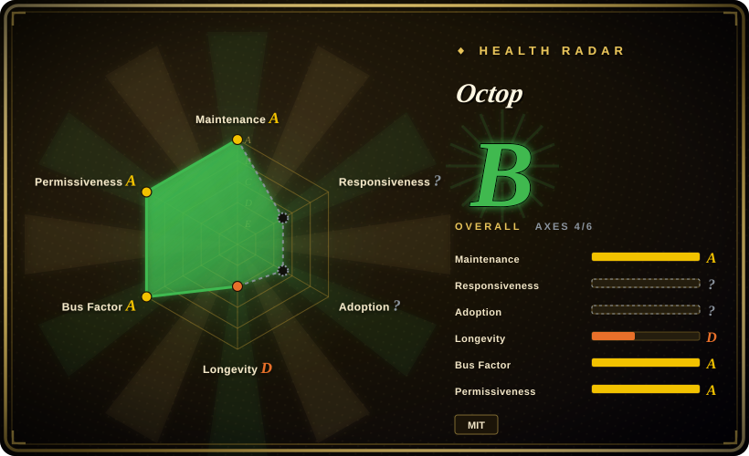
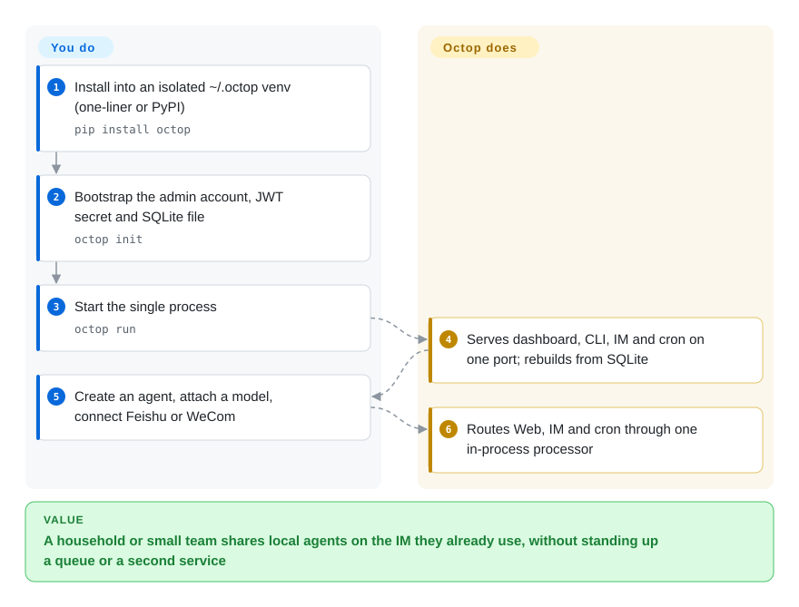

# Octop

You want a household or small team to share one AI assistant over Feishu or WeCom, with chats staying on a disk you control. Octop is a single Python process that gives each user their own agents, a web console, and IM channels, with state under `~/.octop/`.

## When to use

You are standing up a local assistant for more than one person — a household, a tiny ops group — and the deal-breaker is that conversations, workspaces and bot tokens must not leave your machine. Cloud office agents (Doubao Work and the like) already write the slides and fill the sheets; you are not shopping for that. You also looked at [OpenClaw](openclaw.md), which is the better personal pager across WhatsApp and Telegram, but it is shaped as one user with no JWT isolation. You pick Octop when the deciding feature is a **self-hosted multi-user control plane** that already speaks Feishu / DingTalk / WeCom / QQ / Discord, not channel count and not a learning loop.

You bring your own model (OpenAI-compatible, DashScope, Ollama). One `octop run` then serves the dashboard, the CLI, IM and cron. That is the whole product: glue, not a finished worker.

## How it works

Octop is the box; four `harness-*` libraries are the motor. You install, create an admin, and start uvicorn. It opens a SQLite file (PostgreSQL optional), scans a bundled expert-prompt library, and rebuilds every agent runtime from rows in that database — there is no Redis and no worker process (ADR 001). Each user owns agents; each agent owns a workspace (local disk, or COS/S3) and optional IM credentials. Incoming chat — browser WebSocket, Feishu, a cron tick — hits one in-process processor, which runs a LangGraph agent from `orcakit-harness-agent`. You still have to supply the model, the channel apps, and any skill worth using; MBTI templates and the expert library are prompt packs, not trained specialists.

<!-- flow-steps:begin (generated from flows/octop.json by tools/flow_card.py — do not edit) -->

Text version of the flow

1. **You**: Install into an isolated ~/.octop venv (one-liner or PyPI) — `pip install octop`
2. **You**: Bootstrap the admin account, JWT secret and SQLite file — `octop init`
3. **You**: Start the single process — `octop run`
4. **Octop**: Serves dashboard, CLI, IM and cron on one port; rebuilds from SQLite
5. **You**: Create an agent, attach a model, connect Feishu or WeCom
6. **Octop**: Routes Web, IM and cron through one in-process processor

**Value**: A household or small team shares local agents on the IM they already use, without standing up a queue or a second service

<!-- flow-steps:end -->

## When NOT to use

- **You want an office agent that already ships slides, sheets and scheduled research.** Use Doubao Work (hosted ByteDance product, not a repository) instead of Octop, because Octop ships a control plane and bundled expert prompt packs, not a library of finished work skills.
- **You are one person and the job is "answer me on WhatsApp / Telegram / iMessage".** Use [OpenClaw](openclaw.md) instead of Octop, because OpenClaw's value is channel reach; Octop's extra surface is JWT multi-user, a dashboard, and Tencent IM/COS glue you will operate.
- **You want the assistant to get better by turning experience into skills.** Use [Hermes Agent](hermes-agent.md) instead of Octop, because Octop's "self-evolution" item is still unchecked on the public roadmap.
- **You only need a chat window over Ollama or an OpenAI-compatible API.** Use [Open WebUI](../../../llm-chat-ui/open-webui.md) instead of Octop, because you then skip Playwright-as-a-core-dependency, IM bot credentials, and a remote-desktop extra.
- **You need a visual workflow builder with inspectable RAG graphs.** Use [Dify](../../workflow-builders/dify.md) instead of Octop, because Octop is a single-process assistant, not a workflow IDE.
- **You need to scale past one machine.** Octop's accepted ADR is no queue and no workers; CPU-heavy work blocks the event loop. Use a service-shaped runtime such as [eve](../agent-services/eve.md) if the agent must live as infrastructure.
- **You need the agent runtime itself to be a public repository.** `orcakit-harness-agent`, `harness-gateway`, `harness-memory` and `harness-browser` are on PyPI and advertised as TencentCloud GitHub repos; those four GitHub URLs 404 as of 2026-09-22. Use OpenClaw or Open WebUI instead if "I can read the core" is a constraint.
- **You meant the Claude Code review plugin.** That is [Claude Octopus](../../coding-agents/orchestration-and-review/claude-octopus.md), a different project; do not install this TencentCloud app for multi-model review.

## Comparison

| Alternative | In index | Our verdict | Tradeoff |
| --- | --- | --- | --- |
| [OpenClaw](openclaw.md) | ✅ | When you want one personal assistant on many consumer messengers, pick OpenClaw; pick Octop when several people must share isolated agents on Feishu/WeCom with a local admin console. | OpenClaw wins on channel count and a single public TypeScript tree; Octop wins on JWT multi-user and Tencent IM, and you operate a heavier Python process whose LangGraph core is a wheel. |
| [Hermes Agent](hermes-agent.md) | ✅ | When the value should come from a learning loop that writes skills, pick Hermes; pick Octop when you need a packaged multi-user dashboard and IM today, and will live with a static expert library. | Hermes is a framework that claims to improve; Octop is an app that claims to isolate users. Neither substitutes for the other's premise. |
| [Open WebUI](../../../llm-chat-ui/open-webui.md) | ✅ | When you want a polished chat UI over local or remote models, pick Open WebUI; pick Octop only if agents, IM bots and cron in one process are the actual requirement. | Open WebUI is a chat front-end with years of age; Octop is a younger agent control plane with a much larger default attack surface (browser, shell, remote desktop). |
| [Dify](../../workflow-builders/dify.md) | ✅ | When you are building inspectable agentic workflows with a visual IDE, pick Dify; pick Octop when the users will only chat and you refuse a workflow platform's ops. | Dify is a productized builder (license needs a commercial read); Octop is MIT glue with no graph editor and a single-process ceiling. |
| Doubao Work | 非仓库 | Hosted ByteDance office agent, not a git repository; choose it when the job is delivering documents and browser work today, not self-hosting a control plane. | You get finished skills and zero install, and you give up local data and model choice; Octop is the opposite trade. |

## Tech stack

- **Python 3.12+** — `src/octop/` (FastAPI + uvicorn, Click CLI, APScheduler)
- **React 18 + TypeScript + Vite + Ant Design** — `dashboard/`, shipped inside the wheel
- **LangGraph via `orcakit-harness-agent`** — agent runtime (model routing, tools, checkpoints)
- **`harness-gateway` / `harness-memory` / `harness-browser`** — IM bridge, hierarchical recall, CDP browser
- **SQLite WAL** (default) or **PostgreSQL** — control-plane database under `~/.octop/`
- **Playwright** — core dependency, not an extra; `mcp`, `boto3`, `psycopg` also core

## Dependencies

- An LLM provider (OpenAI-compatible API, DashScope, or Ollama). Octop does not ship a model.
- A machine that can run Python 3.12. The COS one-liner (`curl …/install.sh | bash`) provisions an isolated venv via uv under `~/.octop/`; `pip install octop` is the registry path.
- IM channels need the usual bot credentials (Feishu App ID/Secret, WeCom Corp ID/Secret, and so on).
- Optional: Docker Compose (`docker/docker-compose.yml`), PostgreSQL, `octop[desktop]` (`mss`/`pynput`) for remote desktop, `octop[local-embedding]` for ONNX embeddings.
- The four `harness-*` wheels above. They are runtime dependencies; their GitHub repos were not public as of 2026-09-22.

## Ops difficulty

**Medium for a laptop demo, high if you actually share it.** `octop init` && `octop run` is one process on port 8088, and Docker exists. Day-2 is the cost: Playwright/Chromium, IM app review, JWT and tool-guard rules under `~/.octop/security/tool_guard/`, a recommended `curl | bash` installer hosted on Tencent COS, and an optional remote-desktop extra. ADR 001 is explicit — vertical scale only; there is no worker tier to add when the event loop blocks. Restart recovery is "rebuild from SQLite", which is simple until that file is the only copy.

## Health & viability

- **Maintenance**: Grade A — 11/13 active weeks in trailing 13; last commit 4 days ago.
- **Responsiveness**: Grade ? (`no_window_signal`) — issue traffic exists, but the sampled window had no qualifying first-response. Do not read Maintenance=A as support speed.
- **Adoption**: Grade D (`releases`) — the scorer falls back to release downloads for `type: app`. A PyPI project named `octop` 1.0.1 exists; monthly download counts were not retrieved (pypistats 429, ecosyste.ms 403). Stars are not a substitute: 4,593 stars / 45 watchers / 530 forks on 2026-09-22 is launch-shaped.
- **Longevity**: Grade D — 76 days old.
- **Governance**: Grade A on the 12-month contributor window (30 active humans, top-1 share 27.9%, top-3 64.3%). Lifetime top-10 still clusters on `jubaoliang` / `jubaoliang-tencent` (144 and 129). Vendor org (TencentCloud) plus a young internal team, not a foundation.
- **Risk / License**: Grade A — MIT license.

## Caveats (unverified)

- [未验证] Product behavior as a whole: this page is from repo metadata, README, `docs/architecture.md`, ADR 001, `pyproject.toml` and GitHub/PyPI API. I did not install or run Octop.
- [未验证] JWT isolation, tool-guard, PII redaction and remote-desktop safety were not exercised. Treat README security claims as untested.
- [推断] 4.6k stars in ~76 days with 45 watchers is consistent with launch/trending attention rather than a settled operator community; watcher count is only a proxy.
- [未验证] Whether the bundled expert library and MBTI templates change task quality versus a blank system prompt — they are prompt files scanned at boot, not evaluated here.
- [未验证] PyPI install volume for `octop` (pypistats returned 429; ecosyste.ms returned 403 on this run).
- [未验证] Whether `harness-*` sources exist in a private GitHub org or only as wheels; public `https://github.com/TencentCloud/harness-{agent,memory,gateway,browser}` all 404'd.
