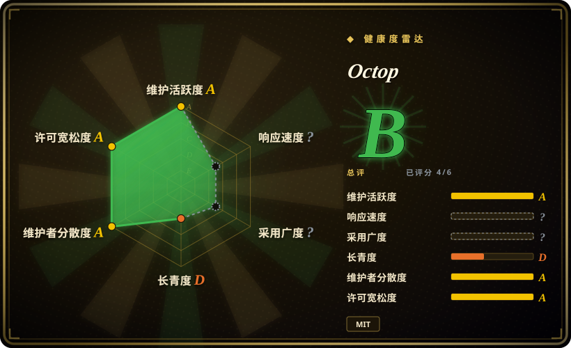
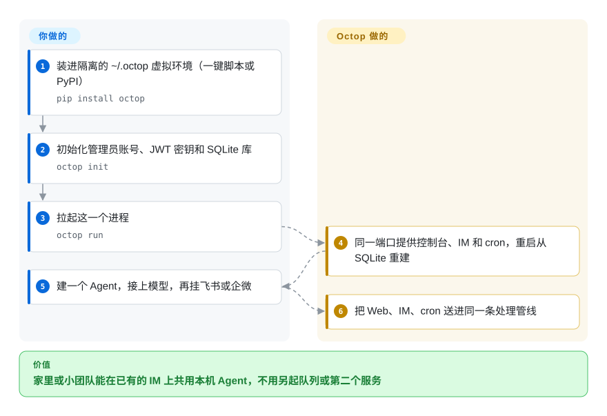

# Octop

你要家里或小团队共用一个 AI 助手，入口是飞书或企微，对话得留在自己能管的磁盘上。Octop 是一个 Python 单进程：给每个用户各自的 Agent、一个 Web 控制台和 IM 通道，状态写在 `~/.octop/`。

## 何时使用

你要给不止一个人装本机助手——家里、或一个很小的运维组——硬条件是对话、工作区和 bot token 不能离开这台机器。云端办公 Agent（豆包工作这类）已经会做 PPT、填表；你不是在买那个。你也看过 [OpenClaw](openclaw.zh.md)，它在 WhatsApp / Telegram 上当个人传呼机更合适，但形状是单用户、没有 JWT 隔离。选 Octop 的决定性能力是**自托管的多用户控制面**，并且已经接飞书 / 钉钉 / 企微 / QQ / Discord——不是渠道数量，也不是学习循环。

模型自己带（OpenAI 兼容、DashScope、Ollama）。一条 `octop run` 同时提供控制台、CLI、IM 和定时任务。这就是整个产品：胶水，不是已经能交差的工人。

## 怎么用起来

Octop 是盒子；四套 `harness-*` 库是马达。你安装、建管理员、启动 uvicorn。它打开一个 SQLite 文件（可改 PostgreSQL），扫描内置专家提示词库，再从数据库行重建每个 Agent 运行时——没有 Redis，也没有 worker 进程（ADR 001）。每个用户拥有若干 Agent；每个 Agent 拥有工作区（本地磁盘，或 COS/S3）和可选的 IM 凭证。进来的对话——浏览器 WebSocket、飞书、一次 cron 触发——都打进进程内的同一条处理管线，跑的是 `orcakit-harness-agent` 里的 LangGraph Agent。模型、通道应用、以及任何真正有用的技能，还是你自己接；MBTI 模板和专家库是提示词包，不是训练过的专家。

<!-- flow-steps:begin (generated from flows/octop.json by tools/flow_card.py — do not edit) -->

流程文字版

1. **你**：装进隔离的 ~/.octop 虚拟环境（一键脚本或 PyPI） — `pip install octop`
2. **你**：初始化管理员账号、JWT 密钥和 SQLite 库 — `octop init`
3. **你**：拉起这一个进程 — `octop run`
4. **Octop**：同一端口提供控制台、IM 和 cron，重启从 SQLite 重建
5. **你**：建一个 Agent，接上模型，再挂飞书或企微
6. **Octop**：把 Web、IM、cron 送进同一条处理管线

**价值**：家里或小团队能在已有的 IM 上共用本机 Agent，不用另起队列或第二个服务

<!-- flow-steps:end -->

## 何时不用

- **你要的是已经会出 PPT、表格和定时调研的办公 Agent。** 用豆包工作（字节托管产品，不是仓库）代替 Octop，因为 Octop 交出的是控制面和内置专家提示词包，不是一套能交差的工作技能。
- **你是一个人，任务是“在 WhatsApp / Telegram / iMessage 上答我”。** 用 [OpenClaw](openclaw.zh.md) 代替 Octop，因为 OpenClaw 的价值是渠道覆盖；Octop 多出来的是 JWT 多用户、控制台，以及你要运维的腾讯 IM/COS 胶水。
- **你希望助手把经验沉淀成技能、越用越好。** 用 [Hermes Agent](hermes-agent.zh.md) 代替 Octop，因为 Octop 公开路线图上的“自进化”还没勾。
- **你只需要一个罩在 Ollama 或 OpenAI 兼容 API 上的聊天窗口。** 用 [Open WebUI](../../../llm-chat-ui/open-webui.zh.md) 代替 Octop，这样就不用把 Playwright 当核心依赖、不用申请 IM 机器人、也不用上远程桌面 extra。
- **你需要可视化工作流构建器和可审查的 RAG 图。** 用 [Dify](../../workflow-builders/dify.zh.md) 代替 Octop，因为 Octop 是单进程助手，不是工作流 IDE。
- **你需要扩到一台机器以外。** Octop 已接受的 ADR 是无队列、无 worker；CPU 重活会堵事件循环。若 Agent 必须以基础设施形态活着，用 [eve](../agent-services/eve.zh.md) 这类服务型运行时。
- **你需要 Agent 运行时本身也是公开仓库。** `orcakit-harness-agent`、`harness-gateway`、`harness-memory`、`harness-browser` 在 PyPI 上，文档写成 TencentCloud 的 GitHub 仓；这四个 GitHub URL 在 2026-09-22 全部 404。若“我能读到内核”是硬条件，改用 OpenClaw 或 Open WebUI。
- **你其实要的是 Claude Code 的多模型评审插件。** 那是 [Claude Octopus](../../coding-agents/orchestration-and-review/claude-octopus.zh.md)，另一个项目；不要为这个目的去装腾讯云这个应用。

## 横向对比

| 替代品 | 是否收录 | 我们的评价 | 取舍 |
| --- | --- | --- | --- |
| [OpenClaw](openclaw.zh.md) | ✅ | 你要一个人在许多消费级即时通讯上被应答，选 OpenClaw；几个人必须在飞书/企微上共用隔离 Agent、还要本机管理控制台，选 Octop。 | OpenClaw 赢在渠道数量和一整棵公开的 TypeScript 树；Octop 赢在 JWT 多用户和腾讯 IM，代价是更重的 Python 进程，LangGraph 内核是 wheel。 |
| [Hermes Agent](hermes-agent.zh.md) | ✅ | 价值应该来自把经验写成技能的学习循环，选 Hermes；你今天就要包装好的多用户控制台和 IM、能接受静态专家库，选 Octop。 | Hermes 是声称会变好的框架；Octop 是声称能隔离用户的应用。彼此替不了对方的前提。 |
| [Open WebUI](../../../llm-chat-ui/open-webui.zh.md) | ✅ | 你要罩在本地或远程模型上的成熟聊天 UI，选 Open WebUI；只有 Agent、IM 机器人和 cron 必须挤在一个进程里时，才选 Octop。 | Open WebUI 是有年头的聊天前端；Octop 是更年轻的 Agent 控制面，默认攻击面大得多（浏览器、shell、远程桌面）。 |
| [Dify](../../workflow-builders/dify.zh.md) | ✅ | 你在搭可审查的 agentic 工作流、需要可视化 IDE，选 Dify；用户只会聊天、你拒绝工作流平台的运维，选 Octop。 | Dify 是产品化的构建器（商用前要读许可）；Octop 是 MIT 胶水，没有图编辑器，天花板是单进程。 |
| 豆包工作 | 非仓库 | 字节托管的办公 Agent，不是 git 仓库；任务是今天就交出文档和浏览器操作、而不是自托管控制面时选它。 | 你拿到现成技能和零安装，交出本地数据和换模型的自由；Octop 是相反的买卖。 |

## 技术栈

- **Python 3.12+** — `src/octop/`（FastAPI + uvicorn、Click CLI、APScheduler）
- **React 18 + TypeScript + Vite + Ant Design** — `dashboard/`，打进 wheel
- **LangGraph，经 `orcakit-harness-agent`** — Agent 运行时（模型路由、工具、检查点）
- **`harness-gateway` / `harness-memory` / `harness-browser`** — IM 桥、分层记忆、CDP 浏览器
- **SQLite WAL**（默认）或 **PostgreSQL** — 控制面数据库，在 `~/.octop/`
- **Playwright** — 核心依赖，不是 extra；`mcp`、`boto3`、`psycopg` 同样是核心

## 依赖

- LLM 提供商（OpenAI 兼容 API、DashScope 或 Ollama）。Octop 不附带模型。
- 能跑 Python 3.12 的机器。COS 一键脚本（`curl …/install.sh | bash`）用 uv 在 `~/.octop/` 下建隔离 venv；`pip install octop` 是注册表路径。
- IM 通道需要常规机器人凭证（飞书 App ID/Secret、企微 Corp ID/Secret 等）。
- 可选：Docker Compose（`docker/docker-compose.yml`）、PostgreSQL、`octop[desktop]`（`mss`/`pynput`）做远程桌面、`octop[local-embedding]` 做 ONNX embedding。
- 上面四个 `harness-*` wheel。它们是运行时依赖；其 GitHub 仓在 2026-09-22 尚未公开。

## 运维难度

**笔记本演示中等，真拿来共用就高。** `octop init` 再 `octop run` 是 8088 端口上的一个进程，也有 Docker。第二天的成本才是正账：Playwright/Chromium、IM 应用审核、JWT 和 `~/.octop/security/tool_guard/` 下的命令护栏、推荐安装路径是腾讯云 COS 上的 `curl | bash`、再加上可选的远程桌面 extra。ADR 001 写死了——只能垂直扩展；事件循环堵住时没有 worker 层可加。重启恢复是“从 SQLite 重建”，简单，直到那份文件是唯一副本。

## 健康度与可持续性

- **维护活跃度**：Grade A——最近 13 周中 11 周有提交；最后提交距今 4 天。
- **响应速度**：Grade ?（`no_window_signal`）——有 issue 流量，但抽样窗口里没有合格的首次响应。不要把维护活跃度 A 读成支持速度。
- **采用广度**：Grade ?（`no_package_structural`）——评分器对 `type: app` 跳过下载图谱。PyPI 上确实有名为 `octop` 的 1.0.1；月下载量未取到（pypistats 429，ecosyste.ms 403）。star 不能替代：2026-09-22 为 4,593 star / 45 watcher / 530 fork，是上线形态。
- **长青度**：Grade D——仓库已创建 76 天。
- **治理**：12 个月贡献窗口 Grade A（30 个活跃人类作者，top-1 占比 27.9%，top-3 占比 64.3%）。终身 top-10 仍集中在 `jubaoliang` / `jubaoliang-tencent`（144 和 129）。TencentCloud 厂商组织加一支年轻内部团队，不是基金会。
- **许可风险**：Grade A——SPDX MIT，36 个月内无重新授权。与该档位分开的事实：四个 `harness-*` GitHub URL 404、推荐安装是 COS 上的 `curl | bash`、76 天大的仓有 364 个未关 issue。英文 README 徽章 1.0.1，2026-09-22 抓到的中文 README 徽章仍是 0.9.33。

## 存疑（未验证）

- [未验证] 产品行为整体：本页来自仓库元数据、README、`docs/architecture.md`、ADR 001、`pyproject.toml` 以及 GitHub/PyPI API。没有安装或运行过 Octop。
- [未验证] JWT 隔离、tool-guard、PII 脱敏和远程桌面安全性未实测。把 README 的安全宣称当作未测试。
- [推断] 约 76 天拿到 4.6k star、只有 45 个 watcher，更像上线/热榜注意力，而不是稳定的运维社区；watcher 数只是代理指标。
- [未验证] 内置专家库和 MBTI 模板相对空白系统提示是否改变任务质量——它们是启动时扫描的提示词文件，此处未评测。
- [未验证] `octop` 的 PyPI 安装量（本次 pypistats 返回 429；ecosyste.ms 返回 403）。
- [未验证] `harness-*` 源码是在私有 GitHub 组织里，还是只有 wheel；公开地址 `https://github.com/TencentCloud/harness-{agent,memory,gateway,browser}` 全部 404。
