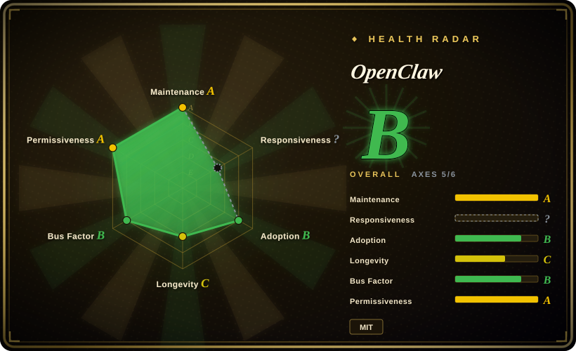
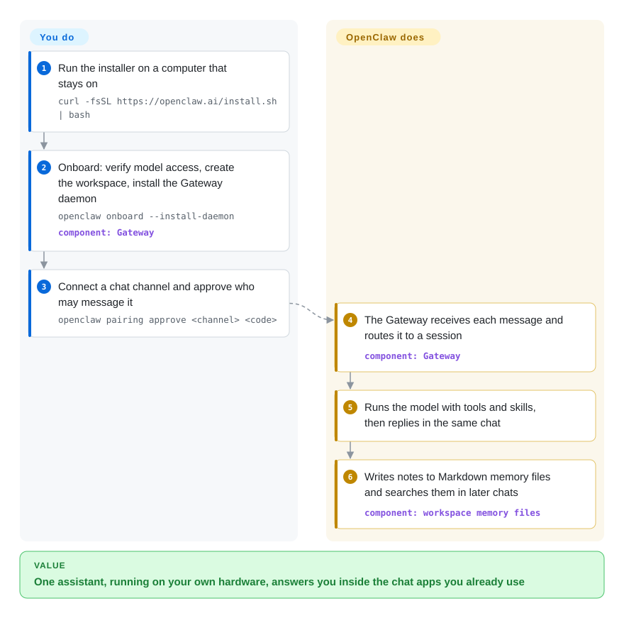

# OpenClaw

Your AI assistant lives in a browser tab on someone else's servers, so it can't answer you on WhatsApp, can't touch the files on your Mac, and forgets the context the moment you switch apps. OpenClaw runs the assistant on your own computer as an always-on background service and plugs it into the chat apps you already use — Discord, iMessage, Slack, Teams, Telegram, WhatsApp and 20+ more — plus companion apps on your phone and desktop.

## When to use

You want a personal assistant you can message the way you message a friend: from WhatsApp on your phone during a commute, from Slack at work, from iMessage at home — and it should be the *same* assistant, with the same memory, able to read files and run tools on the Mac Mini under your desk. Hosted assistants keep your conversations on their servers and live in their own app; wiring a bot into each chat platform yourself means one integration per channel. You reach for OpenClaw because a single Gateway process on your machine owns all of that: it connects the channels, keeps sessions and Markdown memory on your disk, and talks to whichever hosted or local model you configure.

Pick it over [Hermes Agent](hermes-agent.md) when breadth of channels, native companion apps (voice, camera, screen on macOS/iOS/Android) and a foundation-governed project matter more than an agent that writes its own skills; pick it over [OpenCode](../../coding-agents/terminal-agents/opencode.md) or other coding agents because those are built for working inside a repository, not for being reachable from your phone. The same Gateway also scales to a small trusted team: with identity-backed sign-in and named operator roles, colleagues can mention a shared bot in allowlisted channels.

## How it works

OpenClaw is a TypeScript application that runs on Node.js; the installer provisions a supported Node version and then starts an onboarding wizard. **You** do three things: run onboarding (it checks that your model key works, creates a workspace folder, and installs the Gateway as a background service), connect the chat channels you want, and approve who may talk to it — unknown senders are held for *pairing*, a one-time code you approve from the command line. **It** does the rest: the Gateway — the always-on local control plane — receives each message, routes it to a session, runs the model with its tools, skills and plugins, and replies in the same chat; it keeps long-term facts and daily notes as plain Markdown files in the workspace and searches them in later conversations. Tools run directly on the host by default, like giving the assistant your keyboard, unless you configure a sandbox — so the security settings are part of setup, not an afterthought.

<!-- flow-steps:begin (generated from flows/openclaw.json by tools/flow_card.py — do not edit) -->

Text version of the flow

1. **You**: Run the installer on a computer that stays on — `curl -fsSL https://openclaw.ai/install.sh | bash`
2. **You**: Onboard: verify model access, create the workspace, install the Gateway daemon — `openclaw onboard --install-daemon` — component: `Gateway`
3. **You**: Connect a chat channel and approve who may message it — `openclaw pairing approve <channel> <code>`
4. **OpenClaw**: The Gateway receives each message and routes it to a session — component: `Gateway`
5. **OpenClaw**: Runs the model with tools and skills, then replies in the same chat
6. **OpenClaw**: Writes notes to Markdown memory files and searches them in later chats — component: `workspace memory files`

**Value**: One assistant, running on your own hardware, answers you inside the chat apps you already use

<!-- flow-steps:end -->

## When NOT to use

- **Users who don't trust each other share one deployment.** The docs state that one Gateway is one trust domain: anyone who can message a tool-enabled agent shares its tool authority, and roles are collaboration guardrails, not isolation. For many teams or tenants with separate secrets and permissions, use [OpenClaw Enterprise](../../kubernetes-agents/openclaw-enterprise.md) (one isolated agent per tenant on Kubernetes) instead.
- **You need SSO, audit logs or formal compliance.** Team mode has operator roles and identity via Tailscale, a trusted proxy or GitHub, but no audit log or SSO product. Use [Dify](../../workflow-builders/dify.md) or [OpenClaw Enterprise](../../kubernetes-agents/openclaw-enterprise.md) instead, because they put agents behind managed access control.
- **You want zero setup.** There is no managed cloud offering; you need a host that stays on (a VPS or an office Mac) and per-channel credentials. If that is too much, a hosted assistant such as the ChatGPT or Claude apps (not repos) is simpler, at the cost of keeping data on their servers.
- **You cannot invest in hardening.** Inbound messages are untrusted input and tools run on the host unless sandboxed; exposing the Gateway without reading the security, exposure and sandboxing guides is risky. If you only need a coding helper on your own machine, use [OpenCode](../../coding-agents/terminal-agents/opencode.md) instead, which is not reachable from public chat channels.
- **Your work is mainly coding in a repository.** OpenClaw is a general assistant; [OpenCode](../../coding-agents/terminal-agents/opencode.md) and similar coding agents are purpose-built for file editing, diffs and test loops.
- **You want the agent to write and curate its own procedures.** OpenClaw keeps Markdown memory, but [Hermes Agent](hermes-agent.md) is built around agent-authored skills with a background curator; pick Hermes if that loop is the point.

## Comparison

| Alternative | In index | Our verdict | Tradeoff |
| --- | --- | --- | --- |
| [Hermes Agent](hermes-agent.md) | ✅ | Pick Hermes when you want a server-side agent that writes and curates its own skills; pick OpenClaw when the widest channel coverage, companion apps and foundation governance matter more. | Hermes has more terminal backends and agent-written skills; OpenClaw has more channels, native apps, team mode and a signed-release process, and Hermes can import an OpenClaw setup. |
| [OpenClaw Enterprise](../../kubernetes-agents/openclaw-enterprise.md) | ✅ | Pick OpenClaw Enterprise when an organisation runs many agents for different teams that must not share secrets or permissions; pick OpenClaw for one person or one trusted team. | Enterprise adds PostgreSQL-backed tenants, secrets and audited Kubernetes rollouts; plain OpenClaw is one process on one machine with far less to operate. |
| [AutoGPT](../../workflow-builders/autogpt.md) | ✅ | Pick AutoGPT to build and deploy autonomous workflow agents in a block-based builder; pick OpenClaw for a conversational assistant you message from chat apps. | AutoGPT targets automating multi-step business tasks; OpenClaw targets personal reach across devices and channels. |
| [OpenCode](../../coding-agents/terminal-agents/opencode.md) | ✅ | Pick OpenCode for software engineering inside a repository; pick OpenClaw for an always-on general assistant reachable from your phone. | OpenCode is tuned for code editing in a terminal; OpenClaw trades that depth for channels, memory and device actions. |
| ChatGPT / Claude apps | not a repo | Pick a hosted app when you want zero setup and accept vendor-held data; pick OpenClaw when self-hosting and channel reach matter. | Closed hosted products with no install burden; OpenClaw is MIT, runs on your hardware and works with many model providers, but you operate and secure it. |

## Tech stack

- **TypeScript on Node.js** (`>=24.16 <25` or `>=26.1`; Node 26 recommended); the repository is a pnpm workspace.
- **Gateway** — the local control plane for sessions, tools, events and channel connections, with a web Control UI, CLI and TUI.
- **Companion apps / nodes** for macOS, iOS, Android, Windows and Linux (voice, Canvas, camera, screen, device-local actions).
- **Extensibility:** tools, skills and plugins (plugin SDK, shared via ClawHub); memory as Markdown files with hybrid semantic + keyword search.

## Dependencies

- A host that stays on (laptop, office Mac, small VPS) running macOS, Linux or Windows; the installer brings Node.js if needed. Docker and Nix deployment paths are documented.
- At least one hosted or local model provider and its credentials.
- Credentials or bridges for each chat channel you connect (some, such as iMessage, depend on platform-specific setup).
- Optional: Tailscale Serve, a trusted proxy (e.g. Cloudflare Access) or GitHub sign-in for team identity; a container runtime for sandboxing.

## Ops difficulty

**Medium.** Installing and onboarding is a wizard, and `openclaw gateway status` / `openclaw dashboard` show whether it is running. The continuing work is security and upkeep: approving pairings, deciding which tools run on the host versus in a sandbox, keeping the Gateway off the public internet unless you follow the exposure runbook (`openclaw security audit` helps), maintaining per-channel credentials, and following a fast release train with stable and beta channels.

## Health & viability

- **Maintenance (2026-10-08):** extremely active — daily commits, date-versioned stable releases several times a week (v2026.9.8 on 2026-10-03) and a beta channel (2026.10.1 betas).
- **Governance:** developed by the OpenClaw Foundation, an independent 501(c)(3) that employs the core team and signs releases; donors include OpenAI, Amazon, Red Hat and others, none of which own the project. The governance grade is B: the creator, Peter Steinberger, still authors about 56% of the commits (top-3 share 74.6% across 486 active maintainers in the trailing 12 months).
- **Age / Lindy:** about 10½ months old (318 days; created 2025-11), longevity C — the foundation structure is a stronger longevity signal than the repo's age.
- **Adoption:** ~392k stars and ~82k forks. The radar's adoption grade is A: since the 2026-10-09 re-score it measures the main `openclaw` npm package (15,774,646 monthly downloads). The earlier B came from the `@openclaw/codex` plugin package, picked while the scorer read only the first 100 package candidates.
- **Risk / license:** MIT (copyright OpenClaw Foundation), now parsed correctly as grade A; incorporated third-party code is listed in `THIRD_PARTY_NOTICES.md`.
- **Overall:** radar grade B; responsiveness is not scored (`?`).

## Caveats (unverified)

- [推断] A star count near 392k for a repo under a year old is driven by hype as much as by production use.
- [未验证] Some of the 20+ channels (e.g. WeChat, QQ, iMessage) rely on unofficial or platform-specific bridges whose stability was not tested.
- [未验证] Whether OpenClaw's agent creates or rewrites skills on its own (as Hermes does) was not confirmed from the docs read; the memory docs describe only Markdown memory, memory search and "dreaming" consolidation.
- [推断] The foundation's independence from its largest donor (OpenAI) is stated by the project itself; no external governance documents were reviewed.
- [未验证] Team-mode details (roles, identity providers, no audit log) come from the docs page as read on 2026-10-08 and may change quickly.
