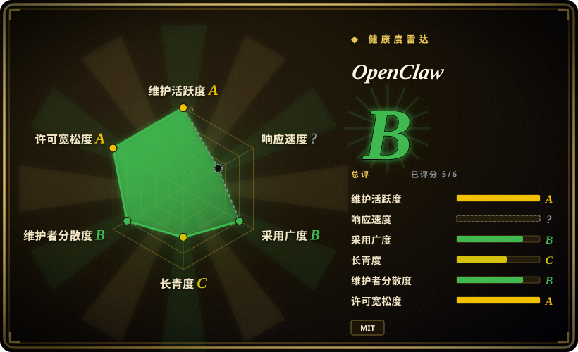
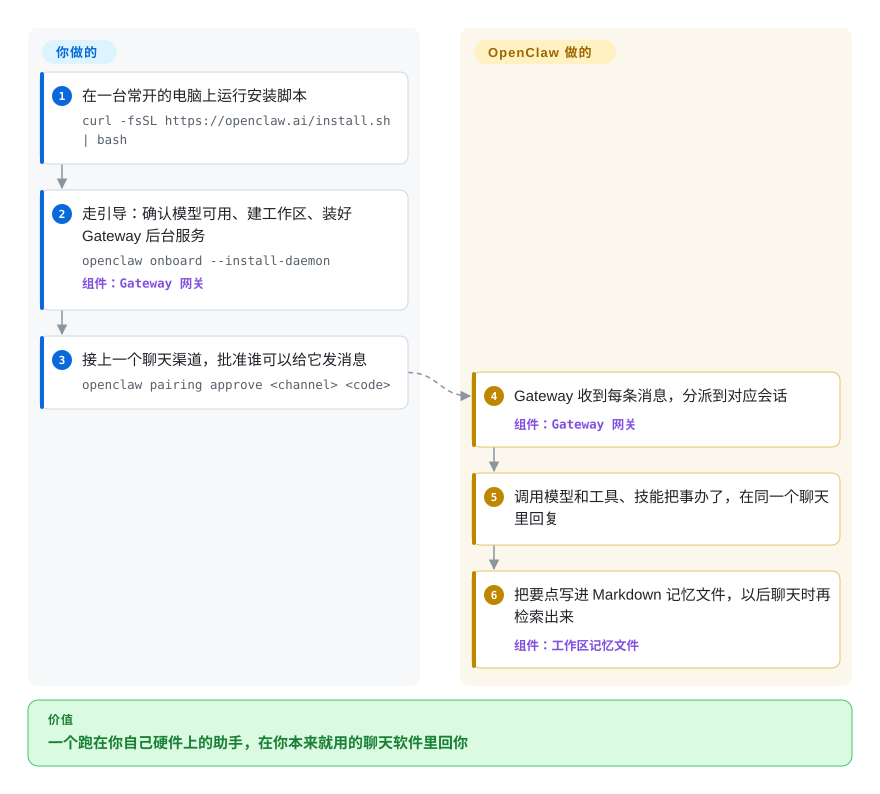

# OpenClaw

你的 AI 助手住在别人服务器上的一个浏览器标签页里：它没法在 WhatsApp 上回你，碰不到你 Mac 上的文件，你一换应用上下文就断了。OpenClaw 把助手作为常驻后台服务跑在你自己的电脑上，接进你本来就在用的聊天软件——Discord、iMessage、Slack、Teams、Telegram、WhatsApp 等 20 多个渠道——手机和桌面上还有配套 App。

## 何时使用

你想要一个能像给朋友发消息那样使唤的个人助手：通勤时在手机 WhatsApp 上找它，上班时在 Slack 上找它，回家后在 iMessage 上找它——而且必须是**同一个**助手，记忆相同，还能读写你桌下那台 Mac Mini 上的文件、调用工具。托管助手把对话存在它们的服务器上，只活在自家 App 里；自己给每个聊天平台接机器人，就得一个渠道写一套集成。你选 OpenClaw，是因为你机器上的一个 Gateway 进程把这些全包了：它连接各个渠道，把会话和 Markdown 记忆存在你的硬盘上，对接你配置的任意托管或本地模型。

和 [Hermes Agent](hermes-agent.zh.md) 比，当渠道覆盖面、原生配套 App（macOS/iOS/Android 上的语音、摄像头、屏幕）和基金会治理比“智能体自己写技能”更重要时选 OpenClaw；和 [OpenCode](../../coding-agents/terminal-agents/opencode.zh.md) 等编码智能体比，它们是为在代码仓库里干活而造的，不是为了让你从手机上找到它。同一个 Gateway 也能扩展到一个互相信任的小团队：配上基于身份的登录和具名的操作员角色，同事可以在白名单频道里 @ 一个共享机器人。

## 怎么用起来

OpenClaw 是跑在 Node.js 上的 TypeScript 应用；安装脚本会准备合适版本的 Node，然后启动引导向导。**你**要做三件事：走完引导（它会确认你的模型 key 能用、创建一个工作区文件夹、把 Gateway 装成后台服务），接上你想用的聊天渠道，批准谁可以跟它说话——陌生发送者会被挡在“配对”环节，你在命令行里批准一个一次性验证码才放行。**它**负责其余部分：Gateway——常驻的本地控制中枢——收到每条消息，分派到对应会话，调用模型及其工具、技能和插件，再在同一个聊天里回复；长期事实和每日笔记以普通 Markdown 文件存在工作区里，之后的对话会检索它们。默认情况下工具直接在宿主机上执行，相当于把你的键盘交给助手，除非你配置了沙箱——所以安全设置是安装的一部分，不是事后补的。

<!-- flow-steps:begin (generated from flows/openclaw.json by tools/flow_card.py — do not edit) -->

流程文字版

1. **你**：在一台常开的电脑上运行安装脚本 — `curl -fsSL https://openclaw.ai/install.sh | bash`
2. **你**：走引导：确认模型可用、建工作区、装好 Gateway 后台服务 — `openclaw onboard --install-daemon` — 组件：`Gateway 网关`
3. **你**：接上一个聊天渠道，批准谁可以给它发消息 — `openclaw pairing approve <channel> <code>`
4. **OpenClaw**：Gateway 收到每条消息，分派到对应会话 — 组件：`Gateway 网关`
5. **OpenClaw**：调用模型和工具、技能把事办了，在同一个聊天里回复
6. **OpenClaw**：把要点写进 Markdown 记忆文件，以后聊天时再检索出来 — 组件：`工作区记忆文件`

**价值**：一个跑在你自己硬件上的助手，在你本来就用的聊天软件里回你

<!-- flow-steps:end -->

## 何时不用

- **互不信任的用户共用一套部署。** 文档明说一个 Gateway 就是一个信任域：谁能给带工具的智能体发消息，谁就共享它的工具权限，角色只是协作护栏，不是隔离。多个团队或租户需要各自的密钥和权限时，改用 [OpenClaw Enterprise](../../kubernetes-agents/openclaw-enterprise.zh.md)（在 Kubernetes 上为每个租户跑一个隔离的智能体）。
- **你需要 SSO、审计日志或正式合规。** 团队模式有操作员角色，身份来自 Tailscale、可信代理或 GitHub，但没有审计日志，也没有 SSO 产品。改用 [Dify](../../workflow-builders/dify.zh.md) 或 [OpenClaw Enterprise](../../kubernetes-agents/openclaw-enterprise.zh.md)，因为它们把智能体放在受管的访问控制之后。
- **你想零配置。** 没有托管云版本；你需要一台常开的主机（VPS 或办公室里的 Mac）和每个渠道的凭证。嫌麻烦的话，ChatGPT 或 Claude 这类托管应用（非仓库）更省事，代价是数据留在它们的服务器上。
- **你没精力做安全加固。** 入站消息是不可信输入，不配沙箱时工具直接在宿主机上跑；不读安全、暴露和沙箱这几份指南就把 Gateway 暴露出去是有风险的。如果你只是要一个本机上的编码助手，改用 [OpenCode](../../coding-agents/terminal-agents/opencode.zh.md)，它不会被公开聊天渠道访问到。
- **你的活主要是在代码仓库里写代码。** OpenClaw 是通用助手；[OpenCode](../../coding-agents/terminal-agents/opencode.zh.md) 这类编码智能体专门为改文件、看 diff、跑测试循环而造。
- **你希望智能体自己编写、整理操作步骤。** OpenClaw 有 Markdown 记忆，但 [Hermes Agent](hermes-agent.zh.md) 是围绕“智能体自己写技能、后台整理器定期清理”构建的；如果你要的正是这个循环，选 Hermes。

## 横向对比

| 替代品 | 是否收录 | 我们的评价 | 取舍 |
| --- | --- | --- | --- |
| [Hermes Agent](hermes-agent.zh.md) | ✅ | 想要一个在服务器上自己写技能、自己整理技能的智能体，选 Hermes；更看重最广的渠道覆盖、配套 App 和基金会治理，选 OpenClaw。 | Hermes 终端后端更多，还有智能体自写的技能；OpenClaw 渠道更多，有原生 App、团队模式和签名发布流程，而且 Hermes 能导入 OpenClaw 的配置。 |
| [OpenClaw Enterprise](../../kubernetes-agents/openclaw-enterprise.zh.md) | ✅ | 一个组织要为不同团队跑很多智能体、彼此不能共享密钥和权限，选 OpenClaw Enterprise；一个人或一个互信的小团队，选 OpenClaw。 | Enterprise 多了基于 PostgreSQL 的租户、密钥管理和可审计的 Kubernetes 发布；普通 OpenClaw 是一台机器上的一个进程，要运维的东西少得多。 |
| [AutoGPT](../../workflow-builders/autogpt.zh.md) | ✅ | 想用积木式搭建器构建并部署自主工作流智能体，选 AutoGPT；想要一个能从聊天软件里找到的对话助手，选 OpenClaw。 | AutoGPT 面向自动化多步骤业务任务；OpenClaw 面向跨设备、跨渠道的个人触达。 |
| [OpenCode](../../coding-agents/terminal-agents/opencode.zh.md) | ✅ | 在代码仓库里做软件工程选 OpenCode；要一个常驻、能从手机上找到的通用助手选 OpenClaw。 | OpenCode 为终端里改代码调优；OpenClaw 拿这份深度换来渠道、记忆和设备操作。 |
| ChatGPT / Claude 应用 | 非仓库 | 想零配置、接受数据由厂商保管，选托管应用；看重自托管和渠道触达，选 OpenClaw。 | 闭源托管产品，没有安装负担；OpenClaw 是 MIT 许可、跑在你的硬件上、支持多家模型，但运维和安全要你自己扛。 |

## 技术栈

- **TypeScript + Node.js**（`>=24.16 <25` 或 `>=26.1`，推荐 Node 26）；仓库是 pnpm workspace。
- **Gateway**——负责会话、工具、事件和渠道连接的本地控制中枢，配有网页版 Control UI、CLI 和 TUI。
- **配套 App / 节点**：macOS、iOS、Android、Windows 和 Linux（语音、Canvas、摄像头、屏幕、设备本地操作）。
- **扩展：** 工具、技能和插件（插件 SDK，通过 ClawHub 分享）；记忆是 Markdown 文件，用语义加关键词的混合检索。

## 依赖

- 一台常开的主机（笔记本、办公室的 Mac、小 VPS），系统为 macOS、Linux 或 Windows；需要时安装脚本会自带 Node.js。文档还给出了 Docker 和 Nix 部署方式。
- 至少一个托管或本地模型来源及其凭证。
- 每个接入渠道的凭证或桥接（有些渠道，比如 iMessage，依赖特定平台的配置）。
- 可选：团队身份用 Tailscale Serve、可信代理（如 Cloudflare Access）或 GitHub 登录；沙箱需要容器运行时。

## 运维难度

**中等。** 安装和引导是向导式的，`openclaw gateway status` / `openclaw dashboard` 能看它是否在跑。持续的工作在安全和维护上：批准配对，决定哪些工具在宿主机上跑、哪些进沙箱，除非照着暴露手册操作，否则别把 Gateway 放到公网（`openclaw security audit` 能帮忙检查），维护各渠道凭证，并跟上分稳定版和测试版两条通道的快速发布节奏。

## 健康度与可持续性

- **维护（2026-10-08）：** 极其活跃——每天都有提交，按日期编号的稳定版一周好几个（v2026.9.8 发布于 2026-10-03），另有测试通道（2026.10.1 的 beta）。
- **治理：** 由 OpenClaw 基金会开发，这是一家独立的 501(c)(3) 非营利机构，雇佣核心团队并签署发布；捐助方包括 OpenAI、Amazon、Red Hat 等，都不拥有项目。治理集中度 B：创始人 Peter Steinberger 仍贡献了约 56% 的提交（过去 12 个月 486 位活跃维护者中，前三贡献者占比 74.6%）。
- **年龄 / Lindy：** 约 10 个半月（318 天，2025-11 创建），长青度 C——基金会架构比仓库年龄更能说明它能活多久。
- **采用：** 约 39.2 万 star、8.2 万 fork。雷达的采用广度是 A：2026-10-09 重算后，评分器测的是主包 `openclaw`（npm 月下载 15,774,646）。之前的 B 来自 `@openclaw/codex` 插件包，那时评分器只读前 100 个候选包。
- **许可风险：** MIT（版权归 OpenClaw 基金会），这次已被正确识别为 A；收编的第三方代码列在 `THIRD_PARTY_NOTICES.md` 里。
- **总评：** 雷达总评 B；响应速度未评分（`?`）。

## 存疑（未验证）

- [推断] 一个不到一年的仓库有近 39.2 万 star，推动它的既有生产使用，也有同等分量的热度。
- [未验证] 20 多个渠道里有些（如 WeChat、QQ、iMessage）依赖非官方或特定平台的桥接，稳定性没有测试。
- [未验证] OpenClaw 的智能体会不会像 Hermes 那样自己创建或改写技能，从读到的文档里没能确认；记忆文档只描述了 Markdown 记忆、记忆检索和“做梦”式整理。
- [推断] 基金会独立于最大捐助方（OpenAI）是项目自己的说法；没有查看外部治理文件。
- [未验证] 团队模式的细节（角色、身份来源、没有审计日志）来自 2026-10-08 读到的文档页面，可能很快变化。
