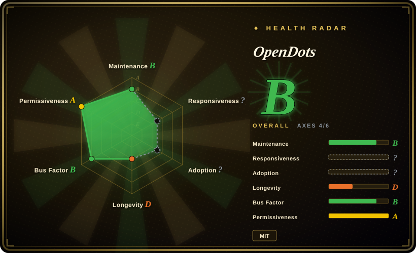
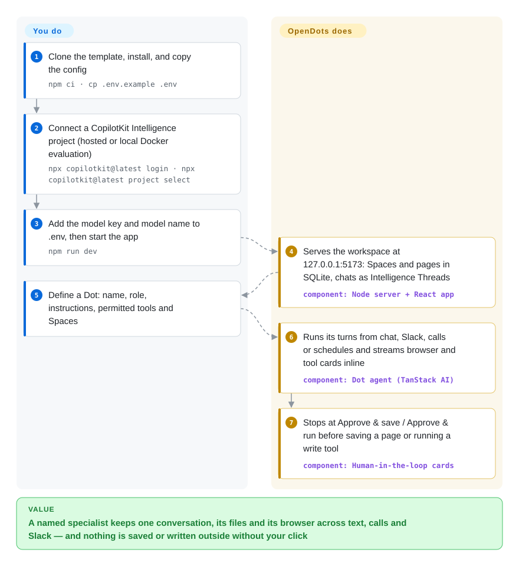

# OpenDots

Your "AI assistant" is a chat tab: the researcher and the writer are the same blank bot, it forgets the browser login by tomorrow, it cannot be reached from the Slack thread where the question came up, and you only find out what it wrote after it wrote it. OpenDots is a clone-and-edit template for running a few named AI coworkers ("Dots") yourself — each with its own role, permitted tools, document Spaces and optional container computer, reachable by text, voice call or Slack, and stopping for your click before it saves a page or runs a write tool.

> **A template that boots without the cloud, but cannot chat without it.** The MIT server starts into a setup screen and lets you edit pages offline, but every conversation is a CopilotKit Intelligence Thread — hosted by CopilotKit, or a macOS-only Docker evaluation with a renewable 30-day license (`docs/SETUP.md`, read 2026-10-08). SDK telemetry and Parallel web search are on by default. See When NOT to use.

## When to use

You are a developer or a one-person team lead who wants several standing AI specialists rather than one assistant — "Scout" researches, "Quill" drafts, a third watches a page on a schedule — and you want them in a workspace you host and can edit: their output lands as pages in a Notion-like document library, you approve each save, and the same specialist answers when you mention it in a Slack thread or call it by voice while it keeps working in the background. You pick OpenDots over its sibling [OpenMuse](openmuse.md) (same vendor, same AG-UI core) when the deciding shape is **multiple role-scoped specialists plus a document workspace, Slack and calls**, rather than OpenMuse's one errand-runner with a phone app, Google mail/calendar and a network-less terminal. You pick it over [Rakazo](rakazo.md) when you want per-tool approval on MCP write actions and a starting codebase you will rewrite, and you accept a CopilotKit service in the chat path; pick Rakazo when nothing hosted may be required. It is a template, so the real trigger is "I want to build my own agent workspace product and would rather fork a working one than assemble the CopilotKit SDK, a model loop, a computer service and a document editor myself."

Not to be confused with `Anil-matcha/open-dots`, a separate Python project by another author with a similar name and pitch.

## How it works

OpenDots is one Node server (Hono plus the CopilotKit runtime) and one React app. Pages, Spaces, Dot settings, schedules and the mapping from each page or chat to its conversation live in a local SQLite file; the conversations themselves — messages, tool calls, run events — live in CopilotKit Intelligence as "Threads", so backing up the SQLite file alone loses chat history. When a Dot takes a turn, the server sends the conversation to one OpenAI-compatible chat-completions endpoint through TanStack AI (a model-calling library), with a 90-second limit per turn, and streams the result to the browser over AG-UI — CopilotKit's event protocol for messages, tool calls and agent state — so tool activity appears inline as cards. Tools are what you grant per Dot: page read/write in its Spaces, public-web research (sent to Parallel by default), MCP servers you connect, and, if you build and run the pinned OpenBot supervisor, a Docker container per Dot with a persistent browser profile, files and an optional shell. Think of it as a small office: the template supplies the desks, the filing cabinet and the sign-off stamp; you hire the specialists, decide what each may touch, and stamp what they hand in. Slack goes through a channel managed inside Intelligence (no webhook server of your own), and voice calls pair OpenAI's Realtime speech with a separate compute turn in the same conversation.

<!-- flow-steps:begin (generated from flows/opendots.json by tools/flow_card.py — do not edit) -->

Text version of the flow

1. **You**: Clone the template, install, and copy the config — `npm ci · cp .env.example .env`
2. **You**: Connect a CopilotKit Intelligence project (hosted or local Docker evaluation) — `npx copilotkit@latest login · npx copilotkit@latest project select`
3. **You**: Add the model key and model name to .env, then start the app — `npm run dev`
4. **OpenDots**: Serves the workspace at 127.0.0.1:5173: Spaces and pages in SQLite, chats as Intelligence Threads — component: `Node server + React app`
5. **You**: Define a Dot: name, role, instructions, permitted tools and Spaces
6. **OpenDots**: Runs its turns from chat, Slack, calls or schedules and streams browser and tool cards inline — component: `Dot agent (TanStack AI)`
7. **OpenDots**: Stops at Approve & save / Approve & run before saving a page or running a write tool — component: `Human-in-the-loop cards`

**Value**: A named specialist keeps one conversation, its files and its browser across text, calls and Slack — and nothing is saved or written outside without your click

<!-- flow-steps:end -->

## When NOT to use

- **You need conversations to stay off CopilotKit's infrastructure, or to run offline.** Chat is impossible without an Intelligence key: `src/server/platform.ts` answers `Setup required … Conversations require CopilotKit Intelligence` (read 2026-10-08). The non-hosted options are a local evaluation that needs macOS + Docker Desktop, 4 CPU / 12 GiB, a CopilotKit sign-in and internet to install or renew, and is "not a production installation", or a *licensed* self-hosted deployment. Issues #74 and #87 asking for a local store are open; a collaborator answered "OpenDots still requires Intelligence". Use [Rakazo](rakazo.md) (nothing hosted needed to boot or chat) or [OpenClaw](openclaw.md).
- **You want a non-OpenAI-API or local model as a first-class option.** The agent uses a single `openaiCompatibleText` adapter pinned to `chat-completions`; Gemini/Ollama support is an open question (#118), and a reasoning model with tools fails every turn on that endpoint (#58, fix still in draft PR #104 waiting on a CopilotKit runtime release). Voice is OpenAI Realtime only. Use [Hermes Agent](hermes-agent.md) or [OpenWorker](openworker.md) when provider choice is the requirement.
- **Your tools need OAuth, or approvals must happen in Slack.** MCP connections take a Streamable HTTP endpoint with a bearer token only — "OAuth-only servers are not supported yet" — and approval cards exist only in the web app; from Slack or a schedule, an Ask-first tool just tells you to continue in the browser (`docs/CONNECTIONS.md`). For Google mail/calendar wired through OAuth with reviewed sends, use [OpenMuse](openmuse.md).
- **Several people will use it.** The README calls it "a single-owner starting point": no identity, no Space membership, no shared editing; permitted Slack users are all mapped to the one owner and replies are visible to the whole Slack thread. Use [OpenBot](../agent-services/openbot.md) — same vendor — for SSO, admin grants and a policy gateway.
- **You want a dependency you upgrade, not a fork you own.** It is `"private": true`, has no releases or tags, and says "Clone this template and customize it"; 53 commits in its first 9 days went straight to `main`. If you need a stable API boundary, build on the CopilotKit SDK (`CopilotKit/CopilotKit`) or a framework such as [LangChain](../../workflow-builders/langchain.md).
- **The Dot's shell is your security boundary.** Computers use plain Docker isolation sharing the host kernel, with no egress policy; the supervisor mounts the Docker socket; gVisor is optional and not installed (`docs/COMPUTERS.md`). Shell access can read that Dot's own browser profile. If commands must run without network or root, [OpenMuse](openmuse.md)'s nonroot, read-only, network-less terminal is stricter.
- **Telemetry and third-party egress are unacceptable by default.** CopilotKit SDK telemetry is on at sample rate 1 and tied to your Intelligence account via `CPK_TELEMETRY_ID`; the repo even ships the vendor's PostHog funnel queries. Research queries go to Parallel unless you set `WEB_SEARCH_PROVIDER=disabled`. Opt-outs exist (`DO_NOT_TRACK=1`), but if the default must be silent, use [OpenHuman](openhuman.md), which can be forced local-only.
- **You only want a chat window over models.** Use [Open WebUI](../../../llm-chat-ui/open-webui.md); OpenDots brings a document workspace, an Intelligence project and optional Docker computers for a surface one container could give you.
- **You want the assistant inside many messengers.** Slack is the only channel here. Use [OpenClaw](openclaw.md) for WhatsApp, Telegram, iMessage and the rest.

## Comparison

| Alternative | In index | Our verdict | Tradeoff |
| --- | --- | --- | --- |
| [OpenMuse](openmuse.md) | ✅ | For one owner delegating errands from a phone app with Google mail/calendar and a sandboxed terminal, pick OpenMuse; pick OpenDots when you want several role-scoped specialists, a page workspace, Slack and voice calls. | Same vendor, same Intelligence dependency; OpenMuse refuses to start without the key but has a durable task engine and network-less terminal, OpenDots boots into setup state and reuses OpenBot's container computers with plain Docker isolation. |
| [OpenBot](../agent-services/openbot.md) | ✅ | When a company rolls agents out to many staff with SSO, admin grants and a deny-first policy audit, pick OpenBot; pick OpenDots for one owner's coworkers where per-tool approval cards are enough governance. | OpenDots borrows OpenBot's computer and supervisor (pinned revision, one credential patch) but drops multi-user auth and the policy gateway; much lighter to run, but no tenant boundary. |
| [Rakazo](rakazo.md) | ✅ | When no hosted service may sit in the chat path and any model must work, pick Rakazo; pick OpenDots when you want MCP write tools gated by approval and a CopilotKit/AG-UI codebase to fork. | Rakazo needs Postgres and Docker but nothing hosted, and lets bots act freely inside their computer; OpenDots needs Intelligence but asks before page saves and non-read-only MCP calls. |
| [OpenClaw](openclaw.md) | ✅ | When the assistant must answer you across WhatsApp, Telegram, iMessage and a dozen other channels, pick OpenClaw; pick OpenDots when specialists, a document workspace and approval cards matter more than channel reach. | OpenClaw is messaging-first with a much larger community and no required vendor service; OpenDots offers Slack only, plus voice and pages, behind a vendor-managed conversation store. |
| CopilotKit (`CopilotKit/CopilotKit`) | not indexed | When you are building your own agent product and want a library with a versioned API, use the CopilotKit SDK directly; pick OpenDots when a complete reference workspace to fork saves you more than an upgrade path would. | The SDK is a published dependency you upgrade; OpenDots is an app you own after cloning, built on that SDK, with no release line. Not added in this tab batch. |

## Tech stack

- **TypeScript** (strict), Node.js ≥ 24, npm; Vite 8 + React 19 front end, Hono server via `@hono/node-server`
- **Agent layer** — `@copilotkit/runtime` / `react-core` 1.75.x, AG-UI client/core 0.0.59, `@tanstack/ai` + `@tanstack/ai-openai` (OpenAI-compatible chat-completions), `@modelcontextprotocol/sdk` for MCP connections, `@copilotkit/channels` for Slack
- **Editor** — Tiptap 3 (Markdown, tables, task lists, slash commands)
- **Storage** — SQLite file (`DATABASE_PATH`) for pages and workspace metadata; conversation history in CopilotKit Intelligence
- **Optional services** — Playwright read-only public-page browser; OpenBot computer + supervisor images built from a pinned Git revision; OpenAI Realtime over WebRTC for calls; Parallel Search MCP for research
- **Tests** — Vitest (about 50 test files using service fixtures), ESLint, Prettier, GitHub Actions CI

## Dependencies

- **CopilotKit Intelligence** — required for any conversation: hosted (CopilotKit cloud), local evaluation (macOS Docker Desktop, renewable 30-day license, sign-in and internet for install/renew), or a licensed self-hosted deployment.
- **An OpenAI-compatible model endpoint** — `OPENAI_API_KEY`, `OPENAI_MODEL`, optional `OPENAI_BASE_URL`.
- **Node.js 24** host that stays up — schedules and background turns only run while the server runs.
- Optional: Docker Engine with Compose v2/BuildKit for per-Dot computers; Chromium via Playwright for the browser reader; an OpenAI Realtime key and HTTPS for calls; a public HTTPS address plus a Slack app created through the CopilotKit CLI for Slack; a Parallel API key for production research limits.

## Ops difficulty

**Medium, rising to high with computers.** The basic loop is `npm ci`, `.env`, two CLI commands and `npm run dev`, and `docker compose up` gives a loopback-bound app container. Each add-on is its own setup: two 24+-character secrets and a supervisor with the Docker socket for computers, a managed Slack channel with workspace/user allowlists, a speech key and HTTPS for calls, an HTTPS reverse proxy and `APP_ORIGIN` for remote hosting. Back up two stores (SQLite and the Intelligence project), and keep `COMPUTER_NAMESPACE` stable or Dots lose their volumes. Day 2 means merging upstream `main` into your fork — there is no release train — and following the Intelligence evaluation license if you use the local mode.

## Health & viability

- **Maintenance (2026-10-08)**: launch burst — repo created 2026-09-29, 53 commits in 9 days, last push 2026-10-06, 47 open issues + PRs (25 of them PRs, 43 merged), no releases or tags, `package.json` at 0.1.0 and a self-declared Alpha badge.
- **Governance / bus factor**: CopilotKit (vendor organization). 19 contributors already, but the template was laid down by one person (`jerelvelarde`, 18 commits) and a few staff merge community fixes; roadmap control is entirely the vendor's.
- **Backing & longevity**: backed by the company behind the CopilotKit SDK and AG-UI; the README funnels builders to "Meet with the CopilotKit team", and the setup path signs you into its Intelligence product and tracks that signup. Age 9 days: no Lindy signal. Third CopilotKit "Open*" app in about two months (OpenBot, OpenMuse, OpenDots) — [推断] these are reference apps whose upkeep depends on how well they sell Intelligence.
- **Adoption**: 4,314 stars / 613 forks / 11 watchers on 2026-10-08 — a launch-promotion shape (Trendshift badge, vendor audience), not an operator community. Issues are a mix of real bug reports from early users and spam.
- **Risk flags**: open-core shape — MIT app, required proprietary conversation service with separate licensing; default-on telemetry with signup attribution; single model adapter; Slack and spoken delegation still listed by the README as needing connected-service verification.

## Caveats (unverified)

- [未验证] Product behavior overall: this page is built from the README, `docs/SETUP.md`, `docs/COMPUTERS.md`, `docs/TELEMETRY.md`, `SECURITY.md`, `.env.example`, `package.json`, `deployment/computers/README.md`, targeted reads of `src/server/{index,platform,platform-config,dot-agent,connections}.ts`, and the issue tracker — OpenDots was not installed or run.
- [未验证] CopilotKit Intelligence pricing, free-tier limits and the terms of a "licensed self-hosted deployment" — not stated in the repo; only the local evaluation's 30-day renewable license is documented.
- [推断] Pointing `OPENAI_BASE_URL` at another OpenAI-compatible server (Ollama, vLLM, OpenRouter) may work for plain chat, given the adapter; untested here, and tool calling with reasoning models already fails on OpenAI itself (#58).
- [未验证] The README's "Available on Web and Mobile": the tree has no native mobile app; this likely means the responsive web UI.
- [推断] The star/fork counts reflect launch promotion to CopilotKit's audience rather than production use.
- [未验证] Whether issue #54 (POSIX-only `npm run dev` on Windows) is fully resolved by the merged Windows fix (#35); #54 was still open on 2026-10-08.
