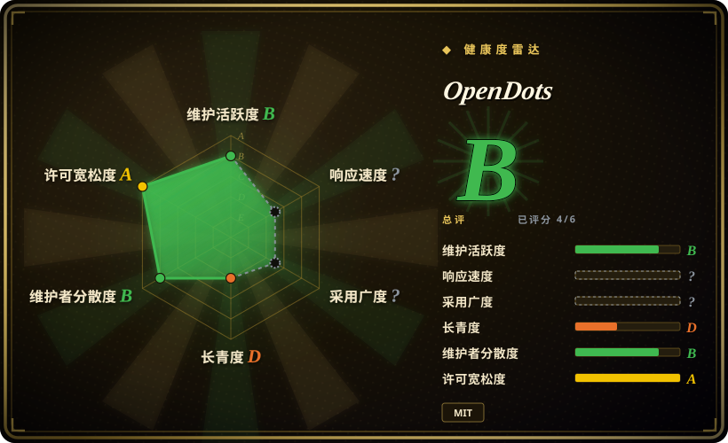
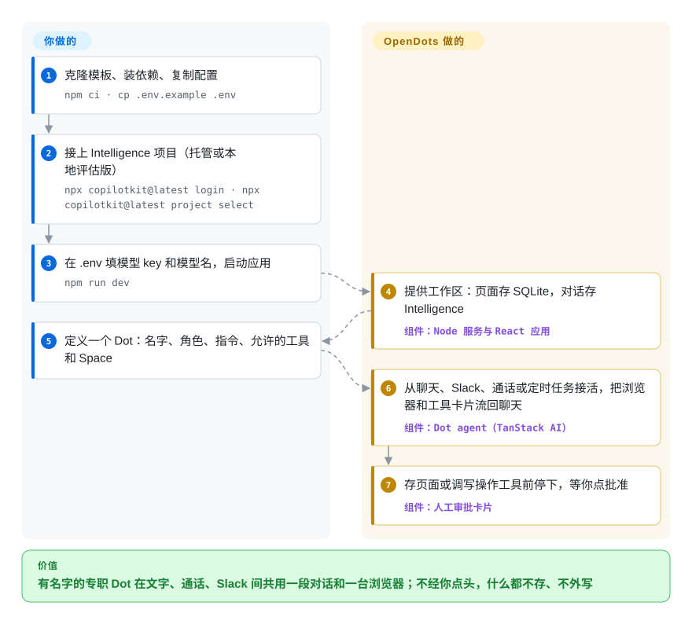

# OpenDots

你的“AI 助理”只是一个聊天标签页：查资料的和写稿的是同一个空白机器人，昨天登录好的网站今天又要重登，Slack 里有人提问时它不在场，它写了什么你要等写完才知道。OpenDots 是一个拿来改的模板，让你自己跑几个有名字的 AI 同事（叫 Dot）：每个有自己的角色、允许的工具、文档空间和可选的一台容器电脑，能打字、打电话或在 Slack 里找到它；存页面、调写操作工具之前都会停下来等你点头。

> **不连云也能启动，但不连云就聊不了天。** MIT 的服务端没有密钥也能起来，进入配置页，页面可以离线编辑；但每一段对话都是 CopilotKit Intelligence 里的一个 Thread——要么托管在 CopilotKit，要么用只支持 macOS 的 Docker 评估版，许可 30 天、可续期（`docs/SETUP.md`，2026-10-08 读）。SDK 遥测和 Parallel 网页搜索默认开启。详见“何时不用”。

## 何时使用

你是开发者，或者一个人带小团队，想要的不是一个助理，而是几个常驻的专职 AI：“Scout”查资料，“Quill”写草稿，第三个按计划盯某个页面。你希望它们待在你自己托管、能随便改的工作区里：产出落成类似 Notion 的文档库里的页面，每次保存你来批；有人在 Slack 线程里 @ 它、或你打电话给它时，答话的还是同一个专职 Dot，长任务在后台接着跑。和同厂的 [OpenMuse](openmuse.zh.md)（同一家公司、同一套 AG-UI 内核）相比，当你要的是**多个按角色划权限的专职 Dot，加文档工作区、Slack 和语音通话**，选 OpenDots；OpenMuse 是一个跑腿的助理，配手机 App、Google 邮件日历和断网终端。和 [Rakazo](rakazo.zh.md) 相比，当你想让 MCP 写操作逐个过审批、又想要一份打算自己重写的起步代码，并且能接受对话链路里有一个 CopilotKit 服务时，选 OpenDots；如果不允许依赖任何托管服务，选 Rakazo。它是模板，所以真正的触发点是：“我想做自己的 agent 工作区产品，宁可 fork 一个能跑的，也不想自己把 CopilotKit SDK、模型循环、电脑服务和文档编辑器拼起来。”

别和 `Anil-matcha/open-dots` 混淆：那是另一位作者的 Python 项目，名字和定位相近，但不是同一个东西。

## 怎么用起来

OpenDots 就是一个 Node 服务（Hono 加 CopilotKit runtime）和一个 React 前端。页面、Space、Dot 配置、定时任务，以及“哪个页面或聊天对应哪段对话”的映射，都存在本地一个 SQLite 文件里；对话本身——消息、工具调用、运行事件——存在 CopilotKit Intelligence 里，叫 Thread，所以只备份 SQLite 会丢掉聊天记录。Dot 每接一轮，服务端通过 TanStack AI（一个调用模型的库）把对话发给一个兼容 OpenAI 的 chat-completions 接口，每轮最多 90 秒，再通过 AG-UI（CopilotKit 定义的事件协议，用来传消息、工具调用和 agent 状态）流回浏览器，工具动作就以卡片形式出现在聊天里。工具由你按 Dot 授权：它所属 Space 里的页面读写、公开网页调研（默认发给 Parallel）、你接入的 MCP 服务，以及——如果你构建并启动了固定版本的 OpenBot supervisor——每个 Dot 一台 Docker 容器，带保留下来的浏览器配置、文件和可选的 shell。可以把它想成一间小办公室：模板提供工位、文件柜和签字章；你来招人、规定每个人能碰什么、在他们交上来的东西上盖章。Slack 走的是 Intelligence 里托管的频道（你不用自建 webhook 服务），语音通话则把 OpenAI Realtime 语音和同一段对话里的另一轮计算配对。

<!-- flow-steps:begin (generated from flows/opendots.json by tools/flow_card.py — do not edit) -->

流程文字版

1. **你**：克隆模板、装依赖、复制配置 — `npm ci · cp .env.example .env`
2. **你**：接上 Intelligence 项目（托管或本地评估版） — `npx copilotkit@latest login · npx copilotkit@latest project select`
3. **你**：在 .env 填模型 key 和模型名，启动应用 — `npm run dev`
4. **OpenDots**：提供工作区：页面存 SQLite，对话存 Intelligence — 组件：`Node 服务与 React 应用`
5. **你**：定义一个 Dot：名字、角色、指令、允许的工具和 Space
6. **OpenDots**：从聊天、Slack、通话或定时任务接活，把浏览器和工具卡片流回聊天 — 组件：`Dot agent（TanStack AI）`
7. **OpenDots**：存页面或调写操作工具前停下，等你点批准 — 组件：`人工审批卡片`

**价值**：有名字的专职 Dot 在文字、通话、Slack 间共用一段对话和一台浏览器；不经你点头，什么都不存、不外写

<!-- flow-steps:end -->

## 何时不用

- **对话不能经过 CopilotKit 的基础设施，或者要离线跑。** 没有 Intelligence 密钥就聊不了：`src/server/platform.ts` 直接返回 `Setup required … Conversations require CopilotKit Intelligence`（2026-10-08 读）。不走托管的选项只有两个：本地评估版，要 macOS + Docker Desktop、4 核 12 GiB、登录 CopilotKit 账号、安装和续期都要联网，官方写明“不是生产安装”；或者一个*需要许可*的自托管部署。要求本地存储的 #74、#87 仍开着，协作者的回复是“OpenDots still requires Intelligence”。改用 [Rakazo](rakazo.zh.md)（启动和聊天都不需要托管服务）或 [OpenClaw](openclaw.zh.md)。
- **你要非 OpenAI 接口或本地模型作为一等选项。** agent 只用了一个 `openaiCompatibleText` 适配器，并固定走 `chat-completions`；支不支持 Gemini、Ollama 还是个开着的问题（#118），推理模型带工具时每轮都失败（#58，修复还在草稿 PR #104 里，等 CopilotKit runtime 发版）。语音只支持 OpenAI Realtime。模型选择是硬需求时，用 [Hermes Agent](hermes-agent.zh.md) 或 [OpenWorker](openworker.zh.md)。
- **你的工具要走 OAuth，或者要在 Slack 里审批。** MCP 连接只接受带 bearer token 的 Streamable HTTP 地址——“OAuth-only servers are not supported yet”；审批卡片只在网页里出现，从 Slack 或定时任务触发的需审批工具只会让你回浏览器继续（`docs/CONNECTIONS.md`）。要通过 OAuth 接 Google 邮件和日历、发信前过审批，用 [OpenMuse](openmuse.zh.md)。
- **会有多个人用。** README 自称“单 owner 的起点”：没有身份体系、没有 Space 成员、没有协同编辑；Slack 里被放行的用户全部映射成那一个 owner，回复整条 Slack 线程都看得见。要 SSO、管理员授权和策略网关，用同厂的 [OpenBot](../agent-services/openbot.zh.md)。
- **你要的是能升级的依赖，而不是自己维护的 fork。** 它是 `"private": true`，没有 release、没有 tag，README 写的是“Clone this template and customize it”；头 9 天 53 个提交都直接进 `main`。要稳定的 API 边界，就基于 CopilotKit SDK（`CopilotKit/CopilotKit`）或 [LangChain](../../workflow-builders/langchain.zh.md) 这类框架去做。
- **你把 Dot 的 shell 当安全边界。** 电脑只用普通 Docker 隔离，和宿主共享内核，没有出网策略；supervisor 挂载了 Docker socket；gVisor 是可选项、不会替你装（`docs/COMPUTERS.md`）。有 shell 权限就能读到这个 Dot 自己的浏览器配置。如果命令必须在无网络、非 root 环境里跑，[OpenMuse](openmuse.zh.md) 那个非 root、只读、断网的终端更严格。
- **默认就不允许遥测和第三方外发。** CopilotKit SDK 遥测默认开、采样率 1，并通过 `CPK_TELEMETRY_ID` 关联到你的 Intelligence 账号；仓库里甚至放着厂商自己的 PostHog 漏斗查询。调研请求默认发给 Parallel，除非设 `WEB_SEARCH_PROVIDER=disabled`。可以关（`DO_NOT_TRACK=1`），但如果要求默认就静默，用可强制纯本地的 [OpenHuman](openhuman.zh.md)。
- **你只想要一个对接模型的聊天窗口。** 用 [Open WebUI](../../../llm-chat-ui/open-webui.zh.md)；OpenDots 要你带上文档工作区、Intelligence 项目和可选的 Docker 电脑，换来的界面一个容器就能给你。
- **你想让助理出现在很多聊天软件里。** 这里只有 Slack。要 WhatsApp、Telegram、iMessage 等，用 [OpenClaw](openclaw.zh.md)。

## 横向对比

| 替代品 | 是否收录 | 我们的评价 | 取舍 |
| --- | --- | --- | --- |
| [OpenMuse](openmuse.zh.md) | ✅ | 一个人从手机 App 派活、要接 Google 邮件日历和隔离终端时选 OpenMuse；要多个按角色划权限的专职 Dot、页面工作区、Slack 和语音通话时选 OpenDots。 | 同一家公司、同样依赖 Intelligence；OpenMuse 没密钥就拒绝启动，但有持久任务引擎和断网终端；OpenDots 没密钥能进配置页，电脑复用 OpenBot 的容器，只有普通 Docker 隔离。 |
| [OpenBot](../agent-services/openbot.zh.md) | ✅ | 公司要给大量员工铺 agent、需要 SSO、管理员授权和默认拒绝的策略审计时选 OpenBot；一个人的几个 AI 同事、逐工具审批卡片就够用时选 OpenDots。 | OpenDots 借用了 OpenBot 的电脑和 supervisor（固定版本，加一处凭据补丁），但去掉了多用户认证和策略网关；运维轻得多，代价是没有租户边界。 |
| [Rakazo](rakazo.zh.md) | ✅ | 对话链路里不允许任何托管服务、且必须能换任意模型时选 Rakazo；想让 MCP 写操作过审批、又想要一份 CopilotKit/AG-UI 代码去 fork 时选 OpenDots。 | Rakazo 要 Postgres 和 Docker，但不依赖托管服务，bot 在自己电脑里动作不经审批；OpenDots 依赖 Intelligence，但存页面和调非只读 MCP 之前会先问你。 |
| [OpenClaw](openclaw.zh.md) | ✅ | 助理必须在 WhatsApp、Telegram、iMessage 等十几个渠道里回你时选 OpenClaw；专职角色、文档工作区和审批卡片比渠道覆盖更重要时选 OpenDots。 | OpenClaw 以消息渠道为主，社区大得多，也不强制依赖厂商服务；OpenDots 只有 Slack，外加语音和页面，对话存储由厂商托管。 |
| CopilotKit（`CopilotKit/CopilotKit`） | 未收录 | 在做自己的 agent 产品、想要一个有版本号 API 的库时，直接用 CopilotKit SDK；fork 一个完整的参考工作区比拥有升级路径更省事时选 OpenDots。 | SDK 是发布出来、可以升级的依赖；OpenDots 是克隆后归你所有的应用，基于这个 SDK，没有发版线。本批次未收录。 |

## 技术栈

- **TypeScript**（strict），Node.js ≥ 24，npm；前端 Vite 8 + React 19，服务端 Hono（`@hono/node-server`）
- **Agent 层**——`@copilotkit/runtime`／`react-core` 1.75.x，AG-UI client/core 0.0.59，`@tanstack/ai` + `@tanstack/ai-openai`（兼容 OpenAI 的 chat-completions），`@modelcontextprotocol/sdk` 接 MCP，`@copilotkit/channels` 接 Slack
- **编辑器**——Tiptap 3（Markdown、表格、任务列表、斜杠命令）
- **存储**——SQLite 文件（`DATABASE_PATH`）存页面和工作区元数据；对话历史存在 CopilotKit Intelligence
- **可选服务**——Playwright 只读公开网页浏览器；从固定 Git 版本构建的 OpenBot 电脑与 supervisor 镜像；通话用基于 WebRTC 的 OpenAI Realtime；调研用 Parallel Search MCP
- **测试**——Vitest（约 50 个测试文件，用服务替身），ESLint，Prettier，GitHub Actions CI

## 依赖

- **CopilotKit Intelligence**——任何对话都需要：托管版（CopilotKit 云）、本地评估版（macOS Docker Desktop，30 天可续期许可，安装和续期要登录、联网），或需要许可的自托管部署。
- **一个兼容 OpenAI 的模型接口**——`OPENAI_API_KEY`、`OPENAI_MODEL`，可选 `OPENAI_BASE_URL`。
- **一台常驻的 Node.js 24 主机**——定时任务和后台轮次只在服务运行时推进。
- 可选：带 Compose v2／BuildKit 的 Docker Engine（每个 Dot 一台电脑）；Playwright 装的 Chromium（网页阅读器）；OpenAI Realtime 密钥和 HTTPS（通话）；公网 HTTPS 地址加用 CopilotKit CLI 创建的 Slack 应用（Slack）；Parallel API key（生产级调研额度）。

## 运维难度

**中等，接上电脑后偏高。** 最基本的路径是 `npm ci`、配 `.env`、两条 CLI 命令再 `npm run dev`；`docker compose up` 能起一个只绑回环地址的应用容器。每个附加能力都是单独一套配置：电脑要两个 24 位以上的密钥和一个挂 Docker socket 的 supervisor；Slack 要托管频道加工作区／用户白名单；通话要语音密钥和 HTTPS；远程部署要 HTTPS 反向代理和 `APP_ORIGIN`。要备份两处存储（SQLite 和 Intelligence 项目），`COMPUTER_NAMESPACE` 要保持不变，否则 Dot 会找不回自己的卷。日常维护就是把上游 `main` 合进你的 fork——没有发版节奏可跟——用本地模式的话还要盯着 Intelligence 评估许可续期。

## 健康度与可持续性

- **维护（2026-10-08）**：发布期的爆发——仓库 2026-09-29 创建，9 天 53 个提交，最后推送 2026-10-06，47 个未关闭的 issue + PR（其中 25 个 PR，已合并 43 个），没有 release 或 tag，`package.json` 是 0.1.0，自标 Alpha。
- **治理／巴士系数**：CopilotKit（厂商组织）。已有 19 位贡献者，但模板主体是一个人搭的（`jerelvelarde`，18 个提交），几位员工在合并社区修复；路线图完全由厂商决定。
- **背书与长期性**：背后是做 CopilotKit SDK 和 AG-UI 的公司；README 把开发者引向“Meet with the CopilotKit team”，配置流程会让你登录它的 Intelligence 产品并追踪这次注册。仓库才 9 天：没有任何 Lindy 信号。这是约两个月内 CopilotKit 第三个“Open*”应用（OpenBot、OpenMuse、OpenDots）——[推断] 它们是参考应用，后续投入多少取决于能带来多少 Intelligence 用户。
- **采用度**：2026-10-08 时 4,314 star／613 fork／11 watch——是发布推广的形状（Trendshift 徽章、厂商自有受众），不是运维社区。issue 里既有早期用户的真实 bug，也有垃圾帖。
- **风险信号**：open-core 结构——应用 MIT，必需的对话服务是厂商闭源产品、另有许可；遥测默认开启并做注册归因；只有一个模型适配器；README 自己写明 Slack 和语音委派还需在真实服务上验证。

## 存疑（未验证）

- [未验证] 整体产品行为：本页依据 README、`docs/SETUP.md`、`docs/COMPUTERS.md`、`docs/TELEMETRY.md`、`SECURITY.md`、`.env.example`、`package.json`、`deployment/computers/README.md`，有针对性地读了 `src/server/{index,platform,platform-config,dot-agent,connections}.ts` 和 issue 区——没有安装或运行 OpenDots。
- [未验证] CopilotKit Intelligence 的价格、免费档限制，以及“需要许可的自托管部署”的条款——仓库里没写；只写了本地评估版是 30 天可续期许可。
- [推断] 把 `OPENAI_BASE_URL` 指向其他兼容 OpenAI 的服务（Ollama、vLLM、OpenRouter），纯聊天可能能用，依据是适配器类型；这里没测过，而且推理模型带工具在 OpenAI 自己的接口上就已经失败（#58）。
- [未验证] README 说“Available on Web and Mobile”：仓库里没有原生移动 App，大概是指响应式网页界面。
- [推断] star 和 fork 数反映的是对 CopilotKit 受众的发布推广，而不是生产使用。
- [未验证] issue #54（Windows 上 `npm run dev` 只支持 POSIX）是否已被合并的 Windows 修复（#35）完全解决；2026-10-08 时 #54 仍开着。
