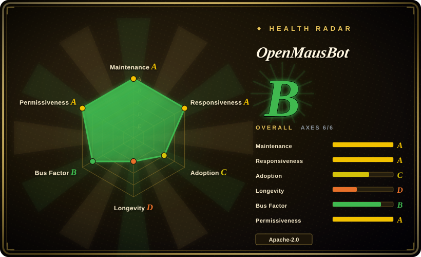
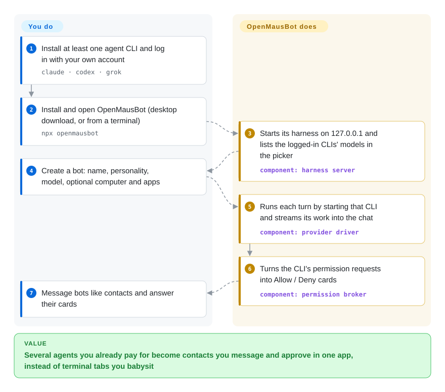

# OpenMausBot

You already pay for Claude Code or Codex, but each one lives in a single terminal window: one conversation at a time, no standing identity, and you have to sit there answering its "may I run this command?" prompts. OpenMausBot turns the agent CLIs you are already logged into into a roster of named bots inside a Telegram-style chat app — each with its own personality, model, computer and connected apps — and brings their permission prompts to you as Allow / Deny cards in the chat.

> **Read before installing.** Usage analytics (PostHog) are on by default and the first-run screen asks for your email; you can switch analytics off in Settings → General. The `enterprise/` folder is source-available, not Apache-2.0. Details in When NOT to use.

## When to use

You are a solo builder or a small team that already uses Claude Code, Codex or the Grok CLI every day, and you have started running several of them at once — a "researcher" in one terminal, an "ops" agent in another, a Codex window for the repo — and the tabs blur together: you cannot tell which one is waiting on `Allow this bash command? (y/n)`, which one is on which model, and none of them can see your Gmail or a desktop of its own. You want the "team of bots you chat with" shape that xAI's Grok Bot sells, but on the subscriptions you already pay for and with transcripts on your own disk. OpenMausBot is that shape built as a desktop app around your existing CLIs: install it, and the CLIs it finds show up in a model picker; each bot becomes a contact you message, put in channels with other bots, give a cloud desktop or your own Mac, and approve from inline cards.

You pick it over [Rakazo](rakazo.md) (the other open Grok Bot alternative) when the deciding factor is *bring your own agent*: OpenMausBot runs the actual `claude` / `codex` / `grok` CLIs under your existing logins, while Rakazo runs its own Pi agent loop against a model key and gives each bot a self-hosted Docker desktop with checkpointing. You pick it over [OpenMuse](openmuse.md) because nothing hosted is required to start — local chat needs no key at all. If the product you are trying to replicate is OpenAI's dots rather than Grok Bot, CopilotKit's OpenDots and Anil-matcha's open-dots target that shape more directly.

## How it works

OpenMausBot is two processes. The app — a React chat window in Electron — holds no agent logic: it sends typed commands over HTTP to a small **harness server** bound to `127.0.0.1` and redraws itself from one live event feed (SSE, a one-way stream the server keeps pushing). The harness owns every agent process: for each bot turn, a per-provider *driver* starts the CLI you already installed (`claude`, `codex`, `grok`, or any CLI that speaks ACP — the Agent Client Protocol), translates that CLI's own output format into one common event stream, and logs it per thread on your disk. When the CLI asks for permission, a *permission broker* turns the request into a card in the chat. OpenMausBot does not judge actions itself — the docs say there is no app-side allowlist or classifier; each approval level is the provider's own permission mode passed through. Think of it as the office building and the intercom, while the CLIs are the employees you already pay. You supply the CLI logins, and any optional keys: Composio for connected apps (Gmail, Slack, GitHub…), Boat for a cloud Linux desktop, or opt-in control of your own Mac through the bundled Cua Driver. Then you message bots and answer their cards.

<!-- flow-steps:begin (generated from flows/openmausbot.json by tools/flow_card.py — do not edit) -->

Text version of the flow

1. **You**: Install at least one agent CLI and log in with your own account — `claude · codex · grok`
2. **You**: Install and open OpenMausBot (desktop download, or from a terminal) — `npx openmausbot`
3. **OpenMausBot**: Starts its harness on 127.0.0.1 and lists the logged-in CLIs' models in the picker — component: `harness server`
4. **You**: Create a bot: name, personality, model, optional computer and apps
5. **OpenMausBot**: Runs each turn by starting that CLI and streams its work into the chat — component: `provider driver`
6. **OpenMausBot**: Turns the CLI's permission requests into Allow / Deny cards — component: `permission broker`
7. **You**: Message bots like contacts and answer their cards

**Value**: Several agents you already pay for become contacts you message and approve in one app, instead of terminal tabs you babysit

<!-- flow-steps:end -->

## When NOT to use

- **You want the app to be the safety layer.** Approval levels are passthrough of each CLI's native modes (Claude `default` … `bypassPermissions`); "Full access" answers residual permission prompts for you and lets a Chief-of-Staff bot's level flow down to the bots it delegates to. If you need an app-owned approval ladder with a per-call audit trail, use [OpenWorker](openworker.md); if you want a terminal that has no network and no root, use [OpenMuse](openmuse.md).
- **You need nothing to leave the machine by default.** `src/lib/analytics.ts` initialises PostHog unless an opt-out flag is already stored, sends `app_first_open` / `app_opened` events, and links an email submitted on the first-run screen to a PostHog person; the opt-out lives in Settings → General. In a no-egress environment, build from source with that module stubbed or block the PostHog host at the network layer before first launch — or pick [Rakazo](rakazo.md), whose computers and data are self-hosted by design (its telemetry not audited here).
- **You do not already have an agent CLI subscription.** The core path assumes `claude`, `codex` or `grok` installed and logged in; API-key providers (OpenRouter, DeepSeek, OpenAI-compatible) are a documented add-on, not the centre. If you just want one chat window over many models, use [Open WebUI](../../../llm-chat-ui/open-webui.md).
- **You want each bot's desktop self-hosted and durable by default.** The headline cloud computer is Boat, a third-party service that is paid after its trial; the local options are a Local VM (a managed container) or your own machine. If a persistent, checkpointed graphical computer per bot on your own Docker host is the point, use [Rakazo](rakazo.md).
- **You plan to ship it as your own branded or multi-tenant product.** White-labelling, SSO, admin, budgets and billing live in `enterprise/` under a source-available license that needs a license key for production and a partner agreement to host for third parties; the OpenMausBot name and mascot are trademarks of Supamaus Software Private Limited. Start from an Apache-only base such as [Rakazo](rakazo.md), or build on an agent SDK.
- **You need a stable release line.** It shipped ~100 point releases in eight weeks (v0.1.93 → v0.1.100 between 2026-10-02 and 10-07) with 300–800 commits a week and an auto-updater; on 2026-10-08 an open issue (#2478) reports a corrupt `routines.json` loading as empty so the next save wipes it. If upgrades must be boring, wait for a stable line, or use [Open WebUI](../../../llm-chat-ui/open-webui.md) for a mature chat surface without the agent team.
- **You are on Linux Wayland or need a signed Windows installer.** Ubuntu is a beta; host control is opt-in on Xorg and disabled on Wayland, and the Windows installer is not code-signed (SmartScreen warning). For computer use on Linux without this app, use [Cua](../../../desktop-automation/cua.md) directly.
- **Your real job is supervising coding agents on branches.** The surface is chat, approvals and computers, not worktrees, diffs and CI; for that, use [Agent Orchestrator](../../../agent-tooling/supervision-surfaces/agent-orchestrator.md) or [CloudCLI](../../../agent-tooling/supervision-surfaces/claudecodeui.md).

## Comparison

| Alternative | In index | Our verdict | Tradeoff |
| --- | --- | --- | --- |
| Grok Bot (xAI) | not a repo | If you want the bot-roster product with zero setup and are fine with Grok models on xAI's shared cloud computer, pay for Grok Bot; pick OpenMausBot when you want any model per bot, your own CLI subscriptions and transcripts on your disk. | Closed hosted product; you trade xAI's managed computer and polish for installing an 8-week-old desktop app and running your own CLIs. |
| [Rakazo](rakazo.md) | ✅ | When the bots should run real Claude Code / Codex CLIs under logins you already have, pick OpenMausBot; pick Rakazo when you want a server with a self-hosted, checkpointed Docker desktop per bot and an Apache-only codebase. | OpenMausBot is desktop-first and BYO-agent with lighter ops, but computers lean on Boat or your own Mac and an open-core layer exists; Rakazo is heavier (Postgres, worker, desktop image) and runs its own agent loop. |
| [OpenMuse](openmuse.md) | ✅ | For one owner delegating errands behind a review gate on a network-less terminal, pick OpenMuse; pick OpenMausBot for several bots in a chat app with no hosted key needed to start. | OpenMuse needs a CopilotKit cloud key but bounds its terminal; OpenMausBot boots locally but delegates action safety to each CLI's own permission modes. |
| [Ekko Studio](../../../agent-tooling/supervision-surfaces/ekko-studio.md) | ✅ | If you want one local console over Hermes plus coding-agent CLIs with a workflow canvas and can accept a non-commercial license, Ekko Studio fits; pick OpenMausBot for a consumer-style bot roster with computers, connected apps and voice under Apache-2.0. | Ekko Studio is BSL-1.1 (non-commercial until 2029) with a workflow canvas; OpenMausBot is Apache-2.0 outside `enterprise/` with a larger contributor base but no workflow canvas. |
| [OpenClaw](openclaw.md) | ✅ | When the assistant must answer you inside WhatsApp, Telegram and other messengers, pick OpenClaw; pick OpenMausBot when you want your own chat app where each contact is a separate CLI agent with its own computer. | OpenClaw meets you in existing channels with a far larger community; OpenMausBot is its own app and multiplies agents rather than channels. |

## Tech stack

- **TypeScript** pnpm monorepo, Node 24+ (server runs with `--experimental-strip-types`), Vitest, oxlint
- **App** — React 19 + Vite + Tailwind CSS; Electron shells for macOS, Windows and Ubuntu (`electron-builder`, `electron-updater`)
- **Harness server** (`server/`) — HTTP + SSE API on `127.0.0.1:8799`, driver registry and event bus, permission broker; drivers for Claude (stream-JSON), Codex (JSON-RPC), Grok Build and other CLIs over ACP, plus OpenAI-/Anthropic-compatible endpoints via config
- **Computers** — Boat API (cloud Linux desktop), Local VM containers, `@trycua/cua-driver` for native control of the host, noVNC viewer, the Electron Chromium driven over CDP for browser use
- **Integrations** — Composio Sessions for connected apps, stdio MCP server for external clients, ElevenLabs / Fish Audio / xAI / Chatterbox voices, PostHog analytics
- **Hosted pieces in the repo** — Cloudflare Workers (`cloudflare/composio-broker`, `cloudflare/control-plane`), a Fly.io `cloud-home` image for the paid OMB Cloud, iOS/Android companion apps

## Dependencies

- At least one agent CLI installed and logged in: `claude`, `codex` or `grok` (or a configured ACP CLI / OpenAI-compatible endpoint) — that subscription or key is what pays for every bot's work.
- macOS (Apple silicon or Intel), Windows x64, or Ubuntu 24.04 x64 (beta) for the desktop app; Node 24+ and pnpm only when running from source or via `npx openmausbot`.
- Optional third-party accounts: a Composio project key for connected apps, a Boat API key for cloud computers (paid after trial), ElevenLabs / Fish Audio keys for hosted voice, a TypeSafe Jev key for auto-routing.
- For an always-on server: Docker + Compose (the repo's `compose.yaml` pairs the server with Caddy), or `npx openmausbot serve` with Tailscale or the project's managed tunnel.

## Ops difficulty

**Low for one person on a desktop, medium as a server.** The signed macOS `.dmg` embeds the harness, so a desktop user installs, opens it, and the logged-in CLIs appear. Running it for phones or other devices means picking a remote-access mode (managed tunnel, Tailscale or your own HTTPS reverse proxy with WebSocket/SSE pass-through) and pairing devices. Day 2 is the release cadence: near-daily versions arrive through the auto-updater, so expect behaviour changes between weeks. Secrets live locally — the desktop encrypts the Composio key with the OS keychain, but the terminal setup stores API keys in a plaintext owner-only config file, which matters on a shared VPS.

## Health & viability

- **Maintenance (2026-10-08)**: extremely active — pushed today; 59 GitHub releases since 2026-09-01 (including an Android companion), about 3,700 commits, and 326–821 commits a week over the last eight weeks; 1,499 merged PRs.
- **Governance / bus factor**: a personal repo (`milind-soni`, a User account). Milind Soni holds 1,842 commits; the next contributors have 345, 298 and 273, and 115 contributors are listed. CODEOWNERS covers the open-core boundary; the roadmap is one person's. The name and mascot are trademarks of Supamaus Software Private Limited.
- **Backing & longevity**: created 2026-08-11, so eight weeks old — no Lindy signal, and its framing tracks the 2026 wave of closed personal-agent products (Grok Bot, Muse, dots, Cue). Funding is GitHub Sponsors plus paid OMB Cloud plans and enterprise license keys, which gives the maintainer a business reason to continue but also an open-core incentive.
- **Adoption**: 4,173 stars, 718 forks and 19 watchers on 2026-10-08; the `openmausbot` npm package had 7,709 downloads in the 30 days to 2026-10-04, and release assets show about 448k downloads in total (health scorer, 2026-10-08); 205 open vs 238 closed issues. Real outside contributors exist, but stars at this age reflect launch attention more than deployments [推断].
- **Risk flags**: relicensed MIT → Apache-2.0 on 2026-08-20 with contributor consent (NOTICE); source-available `enterprise/` added 2026-09-02 with a CLA for that folder only; analytics default-on; renamed from OpenGrokBot; the README warns about crypto tokens using its name that it does not endorse.

## Caveats (unverified)

- [未验证] Product behaviour overall: this page is from the README, LICENSE, LICENSING.md, NOTICE, CLA.md, SECURITY.md, `enterprise/LICENSE` and `FEATURES`, `package.json`, `compose.yaml`, `docs/approval-levels.md`, `docs/composio.md`, `docs/cloud-pro.md`, `docs/computer-use-integration.md`, `docs/self-hosting.md` and `src/lib/analytics.ts` at the default-branch head of 2026-10-08 — I did not install or run OpenMausBot.
- [推断] That the first launch of a fresh install sends `app_first_open` before you can reach the opt-out switch — the module behaves that way when initialised, but I did not trace where the app calls it relative to the first-run screen.
- [未验证] How strong the Local VM isolation is (the self-hosting doc calls it a managed container; I did not read its runtime configuration).
- [未验证] Whether the desktop auto-updater can be disabled or pinned to a version.
- [未验证] Grok Bot, Muse, dots and Cue features and pricing come from OpenMausBot's README and third-party write-ups, not from the vendors' own pages.
- [未验证] Whether driving a consumer Claude / ChatGPT / Grok subscription from always-on bots stays within each provider's usage terms; the project's own Cloud docs only warn that plan limits apply.
- [推断] Star and fork counts at eight weeks reflect launch attention around the Grok Bot category rather than production deployments; I found no public list of operators.
