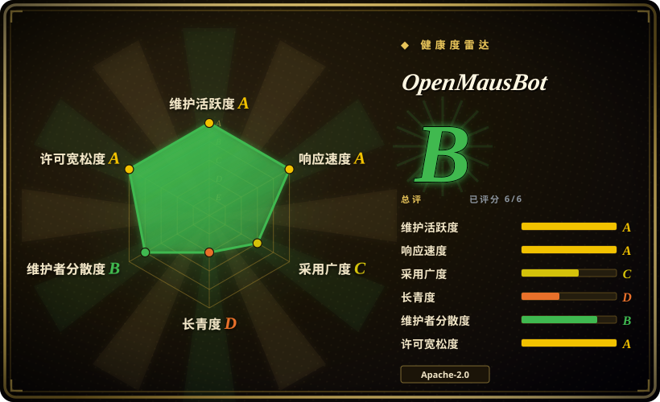
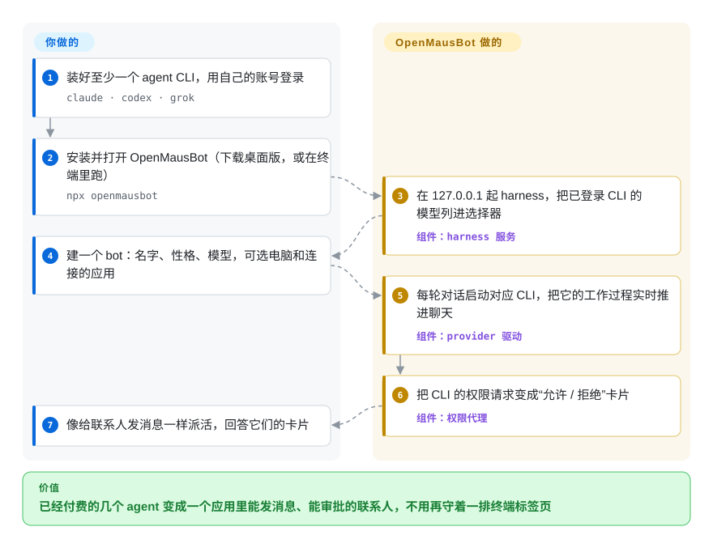

# OpenMausBot

你已经在为 Claude Code 或 Codex 付费，可它们每个都只活在一个终端窗口里：一次一段对话，没有固定身份，还得有人守着回答“可以执行这条命令吗？”。OpenMausBot 把你已经登录好的这些 agent 命令行工具，变成一个类似 Telegram 的聊天应用里的一排 bot——每个都有自己的性格、模型、电脑和连接的应用——它们要权限时，会在聊天里弹出“允许 / 拒绝”卡片给你点。

> **安装前先看这两点。** 使用统计（PostHog）默认开启，首次启动的界面会请你填邮箱；统计可以在 设置 → 通用 里关掉。`enterprise/` 目录是源码可见许可，不是 Apache-2.0。详见“何时不用”。

## 何时使用

你是独立开发者或小团队，每天都在用 Claude Code、Codex 或 Grok CLI，而且已经开始同时跑好几个：一个终端里是“研究员”，另一个是“运维”，还有一个 Codex 窗口在改仓库——标签页混成一团，你分不清哪个正卡在 `Allow this bash command? (y/n)`，哪个用的是哪个模型，而且它们谁也看不到你的 Gmail，也没有一台自己的桌面电脑。你想要 xAI 的 Grok Bot 卖的那种“和一队 bot 聊天”的形态，但要用你已经付费的订阅，聊天记录也要留在自己的硬盘上。OpenMausBot 就是围绕你现有 CLI 做成的这种桌面应用：装上之后，它找到的 CLI 会出现在模型选择器里；每个 bot 是一个你发消息的联系人，可以和别的 bot 一起拉进频道，可以给它一台云桌面或者你自己的 Mac，它要动手时你在卡片上批准。

选它而不是 [Rakazo](rakazo.zh.md)（另一个开源的 Grok Bot 替代品），关键在“自带 agent”：OpenMausBot 用你现有的登录态去跑真正的 `claude` / `codex` / `grok` 命令行，而 Rakazo 用自己的 Pi agent 循环加一个模型 key，并给每个 bot 一台自托管、会备份的 Docker 桌面。选它而不是 [OpenMuse](openmuse.zh.md)，是因为启动时不需要任何托管服务——本地聊天连 key 都不用填。如果你想复刻的是 OpenAI 的 dots 而不是 Grok Bot，CopilotKit 的 OpenDots 和 Anil-matcha 的 open-dots 更直接地对准那种形态。

## 怎么用起来

OpenMausBot 由两个进程组成。应用本身——Electron 里的一个 React 聊天窗口——不含任何 agent 逻辑：它通过 HTTP 把指令发给一个绑定在 `127.0.0.1` 上的小型 **harness 服务**，再根据一条实时事件流（SSE，即服务端单向持续往外推的数据流）刷新界面。harness 管着所有 agent 进程：每个 bot 回合，对应 provider 的“驱动”会启动你已经装好的命令行工具（`claude`、`codex`、`grok`，或任何支持 ACP——即 Agent Client Protocol，一种 agent 与客户端之间的通信协议——的 CLI），把这个 CLI 自己的输出格式翻译成统一的事件流，并按对话存到你的硬盘上。CLI 请求权限时，“权限代理”把请求变成聊天里的一张卡片。OpenMausBot 自己不评判动作——文档写明应用里没有白名单或分类器，每个审批级别都只是把 provider 自己的权限模式原样传过去。可以把它想成办公楼和对讲机，而那些 CLI 是你已经在发工资的员工。你负责提供 CLI 的登录态，以及可选的各种 key：Composio 用来连 Gmail、Slack、GitHub 等应用，Boat 提供云端 Linux 桌面，或者经你明确同意后通过内置的 Cua Driver 操作你自己的 Mac。之后就是给 bot 发消息、回答它们的卡片。

<!-- flow-steps:begin (generated from flows/openmausbot.json by tools/flow_card.py — do not edit) -->

流程文字版

1. **你**：装好至少一个 agent CLI，用自己的账号登录 — `claude · codex · grok`
2. **你**：安装并打开 OpenMausBot（下载桌面版，或在终端里跑） — `npx openmausbot`
3. **OpenMausBot**：在 127.0.0.1 起 harness，把已登录 CLI 的模型列进选择器 — 组件：`harness 服务`
4. **你**：建一个 bot：名字、性格、模型，可选电脑和连接的应用
5. **OpenMausBot**：每轮对话启动对应 CLI，把它的工作过程实时推进聊天 — 组件：`provider 驱动`
6. **OpenMausBot**：把 CLI 的权限请求变成“允许 / 拒绝”卡片 — 组件：`权限代理`
7. **你**：像给联系人发消息一样派活，回答它们的卡片

**价值**：已经付费的几个 agent 变成一个应用里能发消息、能审批的联系人，不用再守着一排终端标签页

<!-- flow-steps:end -->

## 何时不用

- **你希望由应用本身来把安全关。** 审批级别只是把每个 CLI 的原生模式原样传过去（Claude 的 `default` 到 `bypassPermissions`）；“完全访问”会替你回答剩下的权限提示，而且“幕僚长” bot 的级别会传给它委派任务的其他 bot。需要应用自己掌控的分级授权加逐次调用审计，用 [OpenWorker](openworker.zh.md)；想要一个不联网、非 root 的终端，用 [OpenMuse](openmuse.zh.md)。
- **你要求默认什么都不出本机。** `src/lib/analytics.ts` 只要没存过退出标记就会初始化 PostHog，发送 `app_first_open` / `app_opened` 事件，并把首次启动界面里填的邮箱关联到一个 PostHog 用户；退出开关在 设置 → 通用。在不允许出网的环境里，要么从源码构建并把这个模块换成空实现，要么在首次启动前就在网络层屏蔽 PostHog 的地址——或者改用 [Rakazo](rakazo.zh.md)，它的电脑和数据按设计就是自托管的（它的遥测本页没有审计）。
- **你手上没有任何 agent CLI 订阅。** 主路径默认你装好并登录了 `claude`、`codex` 或 `grok`；按 API key 接入的 provider（OpenRouter、DeepSeek、OpenAI 兼容接口）是文档里的附加方式，不是核心。只想要一个能切换很多模型的聊天窗口，用 [Open WebUI](../../../llm-chat-ui/open-webui.zh.md)。
- **你要每个 bot 的桌面默认自托管、长期保留。** README 主推的云电脑是 Boat，一个试用期后收费的第三方服务；本地选项是 Local VM（一个托管的容器）或者你自己的机器。如果重点是在自己的 Docker 主机上给每个 bot 一台持久、会备份的图形电脑，用 [Rakazo](rakazo.zh.md)。
- **你打算把它做成自己品牌或多租户的产品。** 白标、SSO、管理后台、预算和计费都在 `enterprise/` 里，那是源码可见许可：生产环境要许可证 key，替第三方托管要签合作协议；OpenMausBot 名称和吉祥物是 Supamaus Software Private Limited 的商标。从纯 Apache 的底子起步，比如 [Rakazo](rakazo.zh.md)，或者直接基于 agent SDK 来做。
- **你需要一条稳定的发布线。** 八周里发了约 100 个小版本（2026-10-02 到 10-07 之间从 v0.1.93 到 v0.1.100），每周 300–800 个提交，还带自动更新；2026-10-08 新开的 #2478 报告：`routines.json` 损坏时会被当成空文件读入，下一次保存就把它清掉。升级必须平稳的话，等稳定版；只要成熟的聊天界面、不要 agent 团队，用 [Open WebUI](../../../llm-chat-ui/open-webui.zh.md)。
- **你在 Linux Wayland 上，或者需要签名的 Windows 安装包。** Ubuntu 版还是 beta；操作本机在 Xorg 上要手动开启，在 Wayland 上直接禁用；Windows 安装包没有代码签名（SmartScreen 会警告）。不靠这个应用、在 Linux 上做电脑操作，直接用 [Cua](../../../desktop-automation/cua.zh.md)。
- **你真正要做的是监督在分支上干活的编码 agent。** 它的界面是聊天、审批和电脑，不是 worktree、diff 和 CI；那种需求用 [Agent Orchestrator](../../../agent-tooling/supervision-surfaces/agent-orchestrator.zh.md) 或 [CloudCLI](../../../agent-tooling/supervision-surfaces/claudecodeui.zh.md)。

## 横向对比

| 替代品 | 是否收录 | 我们的评价 | 取舍 |
| --- | --- | --- | --- |
| Grok Bot（xAI） | 非仓库 | 想要零配置的 bot 名册产品、接受只用 Grok 模型和 xAI 的共享云电脑，就付费用 Grok Bot；想每个 bot 自选模型、用自己的 CLI 订阅、聊天记录留在本机，选 OpenMausBot。 | 闭源托管产品；你放弃 xAI 托管的电脑和打磨好的体验，换来自己装一个 8 周大的桌面应用、自己跑 CLI。 |
| [Rakazo](rakazo.zh.md) | ✅ | bot 要用你已有登录态去跑真正的 Claude Code / Codex 命令行时，选 OpenMausBot；要一台服务端、每个 bot 一台自托管且会备份的 Docker 桌面、代码全是 Apache 许可时，选 Rakazo。 | OpenMausBot 以桌面为先、自带 agent、运维更轻，但电脑依赖 Boat 或你自己的 Mac，还有一层开源内核外的商业代码；Rakazo 更重（Postgres、worker、桌面镜像），用的是它自己的 agent 循环。 |
| [OpenMuse](openmuse.zh.md) | ✅ | 一个人把跑腿活委派出去、要审批门和不联网的终端，选 OpenMuse；要在聊天应用里跑好几个 bot、启动不需要托管 key，选 OpenMausBot。 | OpenMuse 需要 CopilotKit 云端 key，但给终端设了边界；OpenMausBot 本地就能启动，但动作安全交给了各 CLI 自己的权限模式。 |
| [Ekko Studio](../../../agent-tooling/supervision-surfaces/ekko-studio.zh.md) | ✅ | 想要一个本地控制台同时管 Hermes 和编码 agent CLI、还要工作流画布，并且能接受非商用许可，Ekko Studio 合适；想要消费级的 bot 名册，带电脑、连接应用和语音，并且是 Apache-2.0，选 OpenMausBot。 | Ekko Studio 是 BSL-1.1（2029 年前不可商用）、有工作流画布；OpenMausBot 在 `enterprise/` 之外是 Apache-2.0、贡献者更多，但没有工作流画布。 |
| [OpenClaw](openclaw.zh.md) | ✅ | 助手必须在 WhatsApp、Telegram 等聊天软件里回你，选 OpenClaw；想要一个自己的聊天应用、每个联系人都是一个带电脑的独立 CLI agent，选 OpenMausBot。 | OpenClaw 在你已有的渠道里找你、社区大得多；OpenMausBot 是独立应用，增加的是 agent 数量而不是渠道数量。 |

## 技术栈

- **TypeScript** pnpm 单仓，Node 24+（服务端用 `--experimental-strip-types` 直接跑），Vitest、oxlint
- **应用**：React 19 + Vite + Tailwind CSS；macOS、Windows、Ubuntu 三个 Electron 外壳（`electron-builder`、`electron-updater`）
- **harness 服务**（`server/`）：`127.0.0.1:8799` 上的 HTTP + SSE 接口，驱动注册表和事件总线，权限代理；驱动覆盖 Claude（stream-JSON）、Codex（JSON-RPC）、Grok Build 及其他走 ACP 的 CLI，另可通过配置接 OpenAI / Anthropic 兼容接口
- **电脑**：Boat API（云端 Linux 桌面）、Local VM 容器、`@trycua/cua-driver` 操作本机、noVNC 查看器，浏览器操作用 Electron 自带的 Chromium 经 CDP 驱动
- **集成**：Composio Sessions 连接应用，供外部客户端用的 stdio MCP 服务，ElevenLabs / Fish Audio / xAI / Chatterbox 语音，PostHog 统计
- **仓库里的托管组件**：Cloudflare Workers（`cloudflare/composio-broker`、`cloudflare/control-plane`），付费 OMB Cloud 用的 Fly.io `cloud-home` 镜像，iOS / Android 配套应用

## 依赖

- 至少一个装好并登录的 agent CLI：`claude`、`codex` 或 `grok`（或配置好的 ACP CLI / OpenAI 兼容接口）——每个 bot 干活的花费都记在这份订阅或 key 上。
- 桌面版需要 macOS（Apple 芯片或 Intel）、Windows x64 或 Ubuntu 24.04 x64（beta）；只有从源码跑或用 `npx openmausbot` 时才需要 Node 24+ 和 pnpm。
- 可选的第三方账号：Composio 项目 key（连接应用）、Boat API key（云电脑，试用后收费）、ElevenLabs / Fish Audio key（托管语音）、TypeSafe Jev key（自动分派消息）。
- 想让它常驻服务器：Docker + Compose（仓库的 `compose.yaml` 把服务和 Caddy 配在一起），或者用 `npx openmausbot serve` 加 Tailscale 或项目提供的托管隧道。

## 运维难度

**一个人在桌面上用：低；当服务器跑：中。** 签名过的 macOS `.dmg` 内置 harness，桌面用户装好打开，已登录的 CLI 就出现了。要让手机或其他设备连进来，就得选一种远程访问方式（托管隧道、Tailscale，或者你自己的 HTTPS 反向代理，并放行 WebSocket / SSE），再逐个设备配对。日常的负担在发布节奏：几乎每天一个版本，通过自动更新推下来，所以每周行为都可能变。密钥存在本地——桌面版用系统钥匙串加密 Composio key，但终端安装流程把 API key 以明文存在一个仅属主可读的配置文件里，放在共享 VPS 上要留意。

## 健康度与可持续性

- **维护（2026-10-08）**：极其活跃——今天还有推送；本仓库自 2026-09-01 起有 59 个 GitHub release（含一个 Android 配套应用），总共约 3,700 个提交，最近八周每周 326–821 个提交；已合并 1,499 个 PR。
- **治理与巴士系数**：个人仓库（`milind-soni` 是 User 账号）。Milind Soni 有 1,842 个提交，其后是 345、298、273，共列出 115 位贡献者。CODEOWNERS 覆盖开源与商业代码的分界；路线图由一个人定。名称和吉祥物是 Supamaus Software Private Limited 的商标。
- **背书与长期性**：2026-08-11 创建，只有八周大——谈不上林迪效应，而且它的定位跟着 2026 年这一波闭源个人 agent 产品（Grok Bot、Muse、dots、Cue）走。资金来自 GitHub Sponsors、付费的 OMB Cloud 套餐和企业版许可证 key，这给了维护者继续做下去的商业理由，也带来了把功能往商业层挪的动机。
- **采用度**：2026-10-08 时 4,173 星、718 个 fork、19 个 watcher；npm 包 `openmausbot` 截至 2026-10-04 的 30 天下载 7,709 次，release 附件累计下载约 44.8 万次（健康度评分工具，2026-10-08）；未关闭 issue 205 个、已关闭 238 个。外部贡献者真实存在，但这个年龄的星数更多反映发布热度而不是部署量 [推断]。
- **风险信号**：2026-08-20 经全体贡献者同意从 MIT 改为 Apache-2.0（见 NOTICE）；2026-09-02 加入源码可见的 `enterprise/`，只有该目录需要签 CLA；统计默认开启；曾用名 OpenGrokBot；README 专门声明有人借它的名字发加密货币代币，项目不背书。

## 存疑（未验证）

- [未验证] 产品整体行为：本页依据 2026-10-08 默认分支上的 README、LICENSE、LICENSING.md、NOTICE、CLA.md、SECURITY.md、`enterprise/LICENSE` 和 `FEATURES`、`package.json`、`compose.yaml`、`docs/approval-levels.md`、`docs/composio.md`、`docs/cloud-pro.md`、`docs/computer-use-integration.md`、`docs/self-hosting.md` 以及 `src/lib/analytics.ts`，没有安装或运行 OpenMausBot。
- [推断] 新装的应用首次启动时，会在你够得着退出开关之前就发出 `app_first_open`——模块一初始化就是这样，但我没有追查应用在首次启动界面前后何时调用它。
- [未验证] Local VM 的隔离强度（部署文档称之为托管容器，我没有读它的运行时配置）。
- [未验证] 桌面版的自动更新能否关闭或锁定到某个版本。
- [未验证] Grok Bot、Muse、dots、Cue 的功能和价格来自 OpenMausBot 的 README 和第三方文章，不是厂商自己的页面。
- [未验证] 让常驻 bot 驱动 Claude / ChatGPT / Grok 的个人订阅是否符合各家的使用条款；项目自己的 Cloud 文档只提醒会受套餐额度限制。
- [推断] 八周大时的星数和 fork 数反映的是 Grok Bot 这一类产品带来的发布热度，而不是生产部署量；没找到公开的使用者名单。
