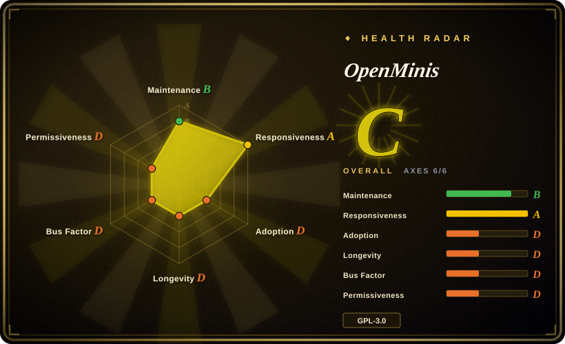
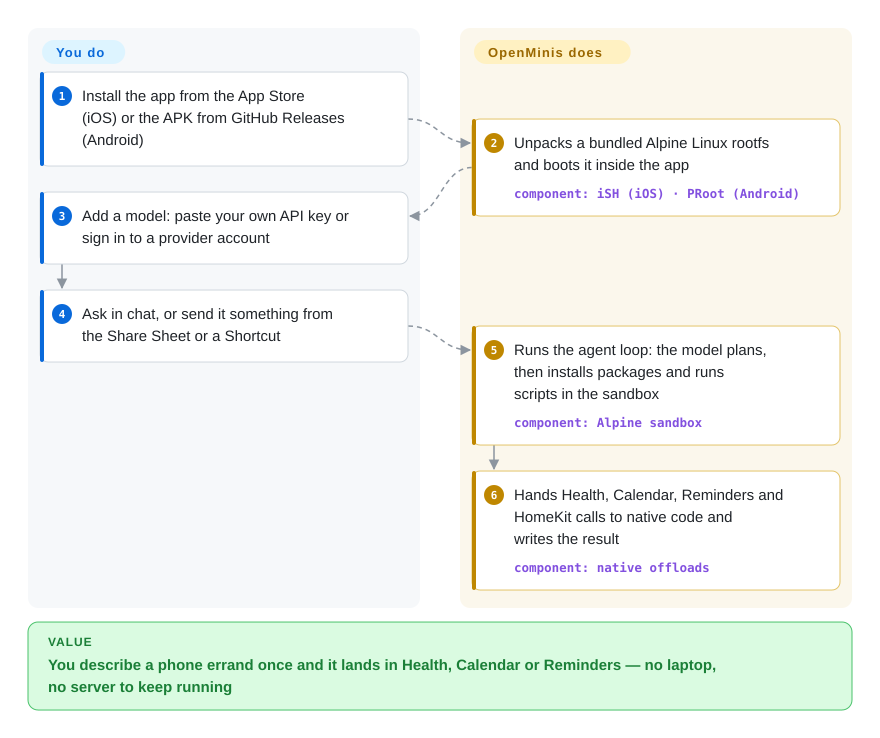

# OpenMinis

You photograph your lunch and want the calories in Apple Health, or want a Telegram group's bug reports turned into Reminders — but the official AI apps on your phone can only talk back, and an agent that can actually run a script lives on a laptop or a server you have to keep up. OpenMinis is a free iOS/Android app that runs a small Linux machine inside the app and hands the phone's Health, Calendar, Reminders and HomeKit to whichever cloud model you bring.

> **"On-device" means the agent's hands, not its brain — and the personal-data tools start unlocked.** Every reasoning step goes to the model provider you configure (or a gateway you host); nothing here runs a model on the phone. The per-tool permission level for Health, Calendar, Photos, Location, HomeKit and Clipboard defaults to `Bypass` on both platforms (`OffloadPermissionManager.swift` / `.kt`, read 2026-10-01); set it to Ask Once yourself.

## When to use

You live on your iPhone (or an arm64 Android phone), you already pay for Claude, GPT or Gemini API access, and you want an assistant that finishes phone-shaped errands instead of describing them: "log this meal", "turn tomorrow's flight email into a calendar event", "summarise my X timeline and play it as my alarm". The official Claude/ChatGPT apps cannot write to HealthKit or run `pip install`, and the self-hosted assistants in this category ([OpenClaw](openclaw.md), [Hermes Agent](hermes-agent.md), [Rakazo](rakazo.md)) put the agent on a server and reach your phone only through a chat channel — they never touch the phone's own Health or HomeKit stores. You pick OpenMinis when the phone itself is the computer: a sandboxed Alpine Linux shell runs inside the app, device frameworks are exposed to the agent as shell commands, skills written for Claude, Codex, OpenClaw or Hermes Agent (`SKILL.md` folders) generally load as-is, and nothing has to stay running on another machine. You pick it over [Operit](https://github.com/AAswordman/Operit) (not indexed) when you need iOS, or when the HealthKit/HomeKit/Shortcuts integration matters more than running a local model.

## How it works

The app ships its own Linux: on iOS a fork of iSH — a program that pretends to be an ARM64 Linux kernel and interprets Linux programs inside an ordinary app — and on Android PRoot, which fakes a root filesystem for normal Android processes; both boot the same Alpine Linux image. When you ask for something, the agent loop in the app sends your request to the model you configured, and the model answers with tool calls: shell commands that run in that sandbox, browser actions, file edits, or "native offload" commands such as `apple-healthkit` or `apple-calendar`, which look like ordinary programs to the shell but are routed out to Swift/Kotlin code that talks to the real phone frameworks. Think of a workshop bolted inside your phone with a hatch to the house: the model decides what to do, the workshop does the messy scripting, and the hatch is how results get into Health or Reminders. You provide the model credential and the request; the app provides the sandbox, the device bridges, memory and skills — and nothing it runs needs a server you operate.

<!-- flow-steps:begin (generated from flows/openminis.json by tools/flow_card.py — do not edit) -->

Text version of the flow

1. **You**: Install the app from the App Store (iOS) or the APK from GitHub Releases (Android)
2. **OpenMinis**: Unpacks a bundled Alpine Linux rootfs and boots it inside the app — component: `iSH (iOS) · PRoot (Android)`
3. **You**: Add a model: paste your own API key or sign in to a provider account
4. **You**: Ask in chat, or send it something from the Share Sheet or a Shortcut
5. **OpenMinis**: Runs the agent loop: the model plans, then installs packages and runs scripts in the sandbox — component: `Alpine sandbox`
6. **OpenMinis**: Hands Health, Calendar, Reminders and HomeKit calls to native code and writes the result — component: `native offloads`

**Value**: You describe a phone errand once and it lands in Health, Calendar or Reminders — no laptop, no server to keep running

<!-- flow-steps:end -->

## When NOT to use

- **You want the model itself to run on the phone, offline.** OpenMinis has no on-device inference; every turn goes to a cloud provider or an OpenAI/Anthropic-compatible endpoint you host (the code mentions Ollama, LM Studio and LiteLLM — on another machine). For local models on the phone, use [Google AI Edge Gallery](../../../on-device-ml/ai-edge-gallery.md) or PocketPal AI; on Android, Operit bundles MNN and llama.cpp local inference next to its agent.
- **You need long unattended or scheduled jobs.** iOS gives a backgrounded app about 30 seconds unless you enable the location-heartbeat or background-audio "enhanced background" legs (`BackgroundKeepAliveManager.swift`), and the iOS sandbox runs **one command at a time across all sessions** with a 10-minute preemption rule (`docs/specs/ios-sandbox-ish-summary.md`). If the agent must keep working while your phone sleeps, run [Hermes Agent](hermes-agent.md), [OpenClaw](openclaw.md) or [Rakazo](rakazo.md) on a server and talk to it from the phone.
- **You need every touch of personal data reviewed.** Privacy tools default to `Bypass`; Ask Once is opt-in per tool and per session. The check matches only the first word of a command — the source comment states that indirection through `sh -c`, `env` or a script is not covered (a related bypass, #242, was closed 2026-08-19). On Android the agent's device-control shell inherits whatever privilege Shizuku was started with, root included, with no ceiling in the app (#389, open). If approval and audit of each action is the requirement, use [OpenWorker](openworker.md) on a desktop instead.
- **You want to contribute code or follow upstream as a fork.** The repository is a release-time mirror of a private tree and explicitly does not accept pull requests; history arrives in large per-release commits. Contribute skills to `OpenMinis/MinisSkills` instead, or pick Operit, which takes contributions on GitHub.
- **You want to embed an agent in your own app or product.** This is a finished app, not an SDK, and the combined work is GPL-3.0 because it links iSH (GPLv3) and PRoot (GPLv2): anything you distribute from it must ship its source under GPLv3. Build on an agent SDK instead (see [Agent SDKs](../agent-sdks/INDEX.md)).
- **You plan to run it on your Claude subscription via OAuth.** That path needs you to supply Claude Code's identifying system-prompt line yourself (`ANTHROPIC_OAUTH_IDENTIFIER_PROMPT`; the repo ships no value), and using a consumer subscription from a third-party client may breach the provider's terms. Use an API key, or the official Claude app if you only need chat.
- **You need heavy compute or x86 binaries in the shell.** The iOS sandbox is an emulator (a threaded-code interpreter, not native execution) and Android builds ship arm64-v8a only. For real builds or x86 tooling, SSH from the phone to a real machine, or use Termux on Android, which runs native binaries.

## Comparison

| Alternative | In index | Our verdict | Tradeoff |
| --- | --- | --- | --- |
| [OpenClaw](openclaw.md) | ✅ | When the agent should live on an always-on box and reach you on WhatsApp, Telegram or iMessage, pick OpenClaw; pick OpenMinis when the work happens on the phone itself — Health, Calendar, HomeKit, Shortcuts — with no server to run. | OpenClaw has a far larger community and keeps running while your phone sleeps; OpenMinis needs no host but is bound by iOS background limits and a one-command-at-a-time sandbox. |
| [Operit](https://github.com/AAswordman/Operit) | not indexed | On Android, pick Operit when you want local models (MNN, llama.cpp), an Ubuntu 24.04 userland and a project that accepts pull requests; pick OpenMinis when you need iOS or one product on both platforms. | Not added in this tab batch. Operit is older (created 2025-03, LGPL-3.0) and Android-only, with an iOS path only in its separate Operit 2 rewrite; OpenMinis has the Apple integrations but a closed development tree. |
| [Termux](https://github.com/termux/termux-app) + a CLI agent | not indexed | If you are comfortable assembling your own stack, Termux on Android plus a terminal coding agent gives native-speed Linux with no app-imposed tool layer; pick OpenMinis when you want device integrations, skills and a chat UI already wired. | Not added in this tab batch. Termux is a mature terminal with native binaries but no agent, no iOS build and no HealthKit-style bridges; you write and maintain the glue. |
| [PocketPal AI](https://github.com/a-ghorbani/pocketpal-ai) | not indexed | When the requirement is a model that runs fully on the phone with no API key, pick PocketPal; pick OpenMinis when the requirement is an agent that acts — shell, browser, device data — with a frontier cloud model. | Not added in this tab batch. PocketPal (MIT) keeps prompts on the device but is a chat app over small local models without tools; OpenMinis sends every turn to a provider in exchange for capability. |
| Claude / ChatGPT official mobile apps | not a repo | If you only need conversation, voice and the vendor's hosted tools, the official apps are simpler; pick OpenMinis when you need the agent to write into Health, Reminders or files, or to switch providers. | Closed vendor apps with their own subscriptions; zero setup and vendor-run safety, but no shell, no BYOK and no device-framework writes. |

## Tech stack

- **iOS app** — Swift 6 / SwiftUI, with share, widget and File Provider extensions; Xcode project targeting the iOS 26.2 SDK; SwiftAnthropic, SwiftMath, swift-cmark, KaTeX, cppjieba.
- **Android app** — Kotlin / Jetpack Compose with JNI native code; Gradle 8.11.1, AGP 8.7.3, Kotlin 2.1.0; compileSdk 36, minSdk 26, arm64-v8a only; OkHttp, Coil, ACRA (crash reports written to a local file only, no HTTP sender), Shizuku API.
- **Sandbox** — iOS: `OpenMinis/ish-arm64` fork of iSH (ARM64 guest, "Asbestos" threaded-code JIT interpreter, SQLite-backed fakefs); Android: `OpenMinis/proot` fork of PRoot with talloc and `.so`-packaged loaders to get past Android 10+ W^X rules; Alpine Linux aarch64 minirootfs.
- **Media / backup** — FFmpeg 6.1.2 (LGPL build), LAME 3.100, rclone (SMB / WebDAV / SFTP / S3 / FTP backup targets).
- **Agent layer** — providers for Anthropic, OpenAI (Chat and Responses, Codex sign-in), Gemini, Antigravity, GitHub Copilot, Kimi, OpenRouter and xAI plus custom base URLs; MCP client with OAuth; skills (`SKILL.md` folders), persistent memory, sub-agents, browser automation, workspaces addressable via `minis://workspace/`.

## Dependencies

- A phone: iOS via the App Store or TestFlight, or an arm64 Android device (Android 8.0 / API 26+) via the GitHub APK.
- A model credential: your own API key for a supported provider, an account sign-in (OpenAI Codex, Copilot, Antigravity and others), or a compatible endpoint you host. You pay the provider; the app is free.
- Network access for the model calls and for `apk add` inside the sandbox.
- Optional: Shizuku (and possibly root) on Android for device control; iCloud for sync; an rclone-reachable target for backups; a Claude Code identifier string if you insist on Claude OAuth.
- Building from source: macOS with Xcode, the Metal Toolchain, Homebrew `ninja llvm libarchive pkg-config`, Meson, Go 1.25+ (iOS); JDK 17, NDK r28+, CMake 3.22.1, Go + gomobile (Android); submodules for the iSH and PRoot forks.

## Ops difficulty

**Low to use, high to build.** Installing the store/APK build is a phone app install plus pasting a key; there is nothing to host. Day-2 is App Store review lag (TestFlight and the APK page get fixes first), release-level sandbox and session-state bugs (open as of 2026-10-01: #409, every `git` command failing in the Android 1.14 sandbox profile; #412, a session stuck on HTTP 400 after an oversized full-page screenshot), and keeping your permission levels deliberate. Building your own copy is a different job: BUILDING.md budgets 30–60 minutes for a first build, five ordered native-dependency scripts per platform (LAME before FFmpeg or MP3 encoding is silently dropped; a missing Metal Toolchain silently drops a filter), device-only native libs for iOS, and an Apple developer team to sign it.

## Health & viability

- **Maintenance (2026-10-01)**: active. Stable releases 1.12 (2026-08-18), 1.13 (2026-09-01), 1.14 (2026-09-29), a 1.15 beta build on 2026-10-01; Android preview APKs since 2026-06-09. Code arrives as large per-release mirror commits, so commit counts understate activity.
- **Governance / bus factor**: the `OpenMinis` organization (created 2026-01-31) fronts it, but GitHub lists a single contributor account (`wsvn53`, 37 commits) and commits are authored by one developer name; development happens in a private tree and pull requests are refused. The roadmap is the maintainers' alone, shaped through issues and a Telegram group. [推断: bus factor of about one, from contributor and commit-author data]
- **Backing & longevity**: no company, foundation or revenue model is named; the app is free and the README says the advantage lies in the user feedback loop, not the code. Repo created 2026-04-25, source opened 2026-07-25 (v1.10), with press coverage of the app from March 2026: months, not years — no Lindy signal.
- **Adoption**: 4,845 stars and 594 forks (2026-10-01); the 1.13 APK was downloaded 8,663 times; reviewed by MacStories (2026-07) and Chinese outlets; 211 open vs 176 closed issues, many of them detailed user-written repro reports. Side repos `MinisSkills` (432 stars, MIT) and `AwesomeMinis` take community contributions.
- **Risk flags**: GPL-3.0 copyleft on the combined work; mirror-only development; permissive default permissions and an Android privilege ceiling that does not exist yet (#389); a Claude OAuth path that depends on mimicking Claude Code's identifier.

## Caveats (unverified)

- [未验证] Overall behavior: this page is built from the README, BUILDING.md, CONTRIBUTING.md, `docs/specs/*`, issues #242/#389/#404/#409/#412, releases and the source files named above at the 1.14 mirror; I did not install or run the app on a device.
- [推断] "Bypass by default" is read from code: iOS falls back to `.bypass` when no level is stored and the Android registry sets `BYPASS` explicitly. iOS system permission prompts (HealthKit, Photos, etc.) still apply once per app; whether onboarding asks users to choose levels was not checked.
- [推断] Bus factor of about one rests on GitHub's contributor list and commit author names; the private tree may have more developers.
- [未验证] Minimum iOS version of the App Store build: the Xcode project mixes 16.0, 16.2 and 26.2 deployment targets across targets; BUILDING.md says the project targets iOS 26.2.
- [推断] Whether using a Claude consumer subscription through this app's OAuth path violates Anthropic's terms — inferred from the requirement to impersonate Claude Code's identifier, not from a ruling.
- [推断] Performance of heavy workloads in the iOS sandbox (emulated, interpreted) — not benchmarked here.
- [未验证] Operit, Termux and PocketPal AI facts in Comparison come from their GitHub metadata and README on 2026-10-01, not from use.
- [未验证] Press quotes and use-case examples are as stated in the README; the linked articles were not opened.
