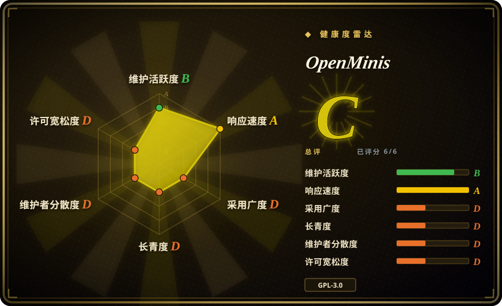
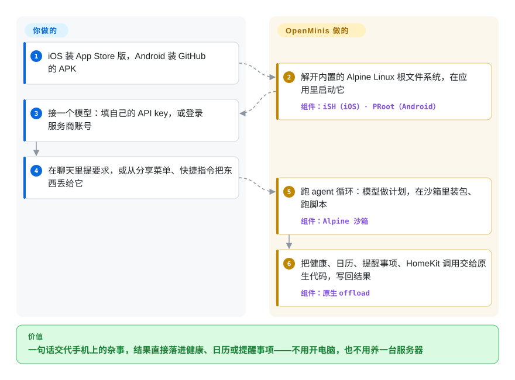

# OpenMinis

你拍了一张午饭，想把热量直接记进 Apple 健康；或者想把 Telegram 群里报的 bug 变成提醒事项——可手机上的官方 AI 应用只会回话，真能跑脚本的 agent 又住在电脑或一台得一直开着的服务器上。OpenMinis 是一个免费的 iOS / Android 应用：在应用里塞进一台小 Linux 机器，再把手机的健康、日历、提醒事项、HomeKit 交给你自带的云端模型去用。

> **“在设备上”说的是 agent 的手，不是它的脑子；而且碰个人数据的工具默认是放开的。** 每一步推理都发给你配置的模型服务商（或你自建的网关），这个应用不在手机上跑模型。健康、日历、照片、位置、HomeKit、剪贴板这几类工具的权限档位在两个平台上默认都是 `Bypass`（`OffloadPermissionManager.swift` / `.kt`，2026-10-01 读过），要自己改成“询问一次”。

## 何时使用

你基本活在 iPhone（或 arm64 的 Android 手机）上，已经在为 Claude、GPT 或 Gemini 的 API 付费，想要一个能把手机上的杂事办完、而不是只告诉你怎么办的助手：“把这顿饭记下来”“把明天航班的邮件变成日程”“总结我的 X 时间线，做成闹钟播给我听”。官方 Claude / ChatGPT 应用写不了 HealthKit，也跑不了 `pip install`；本分类里自托管的助手（[OpenClaw](openclaw.zh.md)、[Hermes Agent](hermes-agent.zh.md)、[Rakazo](rakazo.zh.md)）把 agent 放在服务器上，只通过聊天渠道够到你的手机，碰不到手机自己的健康或 HomeKit 数据。当手机本身就是那台电脑时选 OpenMinis：应用里跑着一个沙箱化的 Alpine Linux shell，系统框架以 shell 命令的形式交给 agent，为 Claude、Codex、OpenClaw 或 Hermes Agent 写的技能（`SKILL.md` 文件夹）一般能直接用，而且不需要另一台机器一直开着。和 [Operit](https://github.com/AAswordman/Operit)（未收录）比，你要 iOS，或者 HealthKit / HomeKit / 快捷指令的集成比跑本地模型更重要时，选 OpenMinis。

## 怎么用起来

这个应用自带一套 Linux：iOS 上是 iSH 的分支——一个假装成 ARM64 Linux 内核、在普通应用里逐条解释执行 Linux 程序的程序；Android 上是 PRoot，它给普通 Android 进程伪造出一个根文件系统；两边启动的是同一份 Alpine Linux 镜像。你提一个要求，应用里的 agent 循环把它发给你配置的模型，模型回一串工具调用：在沙箱里跑的 shell 命令、浏览器操作、文件编辑，或者 `apple-healthkit`、`apple-calendar` 这类“原生 offload”命令——它们在 shell 看来是普通程序，实际上被转给 Swift / Kotlin 代码去调手机真正的系统框架。可以把它想成手机里装了一间带小门的工作间：模型决定做什么，工作间负责脏活累活的脚本，小门负责把结果送进健康或提醒事项。你提供模型凭据和要求；应用提供沙箱、设备桥接、记忆和技能——它跑的东西不需要你维护任何服务器。

<!-- flow-steps:begin (generated from flows/openminis.json by tools/flow_card.py — do not edit) -->

流程文字版

1. **你**：iOS 装 App Store 版，Android 装 GitHub 的 APK
2. **OpenMinis**：解开内置的 Alpine Linux 根文件系统，在应用里启动它 — 组件：`iSH（iOS）· PRoot（Android）`
3. **你**：接一个模型：填自己的 API key，或登录服务商账号
4. **你**：在聊天里提要求，或从分享菜单、快捷指令把东西丢给它
5. **OpenMinis**：跑 agent 循环：模型做计划，在沙箱里装包、跑脚本 — 组件：`Alpine 沙箱`
6. **OpenMinis**：把健康、日历、提醒事项、HomeKit 调用交给原生代码，写回结果 — 组件：`原生 offload`

**价值**：一句话交代手机上的杂事，结果直接落进健康、日历或提醒事项——不用开电脑，也不用养一台服务器

<!-- flow-steps:end -->

## 何时不用

- **你想让模型本身在手机上离线跑。** OpenMinis 没有端侧推理，每一轮都发给云端服务商，或你自己托管的 OpenAI / Anthropic 兼容端点（代码里提到 Ollama、LM Studio、LiteLLM——都在另一台机器上）。要在手机上跑本地模型，用 [Google AI Edge Gallery](../../../on-device-ml/ai-edge-gallery.zh.md) 或 PocketPal AI；在 Android 上，Operit 在 agent 旁边自带了 MNN 和 llama.cpp 本地推理。
- **你需要长时间无人值守或定时跑的任务。** iOS 只给退到后台的应用大约 30 秒，除非你打开“增强后台”里的定位心跳或后台音频（`BackgroundKeepAliveManager.swift`）；iOS 沙箱在**所有会话之间同一时刻只跑一条命令**，还有 10 分钟抢占规则（`docs/specs/ios-sandbox-ish-summary.md`）。如果手机锁屏后 agent 也得继续干活，把 [Hermes Agent](hermes-agent.zh.md)、[OpenClaw](openclaw.zh.md) 或 [Rakazo](rakazo.zh.md) 跑在服务器上，再从手机跟它说话。
- **你要求每一次碰个人数据都经过审核。** 隐私类工具默认 `Bypass`；“询问一次”要按工具、按会话自己打开。检查只看命令的第一个词——源码注释写明，经由 `sh -c`、`env` 或脚本的间接调用不在覆盖范围内（相关绕过 #242 已于 2026-08-19 关闭）。在 Android 上，agent 的设备控制 shell 继承 Shizuku 启动时的权限，包括 root，应用里没有上限（#389，未关闭）。如果每个动作都要审批、留审计，换成桌面上的 [OpenWorker](openworker.zh.md)。
- **你想贡献代码，或作为分支长期跟上游。** 这个仓库是私有开发树在发版时的镜像，明确不收 pull request，历史按版本整批进来。想贡献就去 `OpenMinis/MinisSkills` 写技能，或者选在 GitHub 上收贡献的 Operit。
- **你想把 agent 嵌进自己的应用或产品。** 这是成品应用，不是 SDK；而且因为链接了 iSH（GPLv3）和 PRoot（GPLv2），合并作品是 GPL-3.0：你分发的任何衍生版都得按 GPLv3 公开源码。改用 agent SDK（见 [Agent SDKs](../agent-sdks/INDEX.zh.md)）。
- **你打算用 Claude 订阅走 OAuth。** 这条路要你自己提供 Claude Code 的身份系统提示行（`ANTHROPIC_OAUTH_IDENTIFIER_PROMPT`，仓库不附带这个值），而在第三方客户端里用消费级订阅可能违反服务商条款。用 API key；如果只要聊天，就用官方 Claude 应用。
- **你要在 shell 里跑重计算或 x86 程序。** iOS 沙箱是模拟器（threaded-code 解释执行，不是原生执行），Android 版只发 arm64-v8a。要真编译或用 x86 工具，从手机 SSH 到一台真机器，或者在 Android 上用跑原生二进制的 Termux。

## 横向对比

| 替代品 | 是否收录 | 我们的评价 | 取舍 |
| --- | --- | --- | --- |
| [OpenClaw](openclaw.zh.md) | ✅ | agent 应该住在一台常开的机器上、通过 WhatsApp、Telegram 或 iMessage 找你时，选 OpenClaw；活就在手机本身上——健康、日历、HomeKit、快捷指令——又不想运维服务器时，选 OpenMinis。 | OpenClaw 社区大得多，手机睡了它还在跑；OpenMinis 不要主机，但受 iOS 后台限制和“一次一条命令”的沙箱约束。 |
| [Operit](https://github.com/AAswordman/Operit) | 未收录 | 在 Android 上，要本地模型（MNN、llama.cpp）、Ubuntu 24.04 用户空间和一个收 pull request 的项目时选 Operit；需要 iOS 或两个平台一个产品时选 OpenMinis。 | 本批次未收录。Operit 更老（2025-03 创建，LGPL-3.0），只有 Android，iOS 要等它另起炉灶的 Operit 2；OpenMinis 有 Apple 生态集成，但开发树不公开。 |
| [Termux](https://github.com/termux/termux-app) + 命令行 agent | 未收录 | 如果你愿意自己拼一套，Android 上的 Termux 加一个终端编程 agent 能给你原生速度的 Linux，没有应用强加的工具层；想要设备集成、技能和聊天界面都已接好时选 OpenMinis。 | 本批次未收录。Termux 是成熟终端、跑原生二进制，但没有 agent、没有 iOS 版、没有 HealthKit 这类桥接，胶水代码要你自己写自己养。 |
| [PocketPal AI](https://github.com/a-ghorbani/pocketpal-ai) | 未收录 | 要求模型完全在手机上跑、不要 API key 时选 PocketPal；要求 agent 能动手——shell、浏览器、设备数据——并用前沿云端模型时选 OpenMinis。 | 本批次未收录。PocketPal（MIT）让提示词留在设备上，但它是小型本地模型的聊天应用，没有工具；OpenMinis 每一轮都发给服务商，换来能力。 |
| Claude / ChatGPT 官方手机应用 | 非仓库 | 只要对话、语音和厂商托管的工具时，官方应用更省事；需要 agent 写进健康、提醒事项或文件，或要换服务商时，选 OpenMinis。 | 闭源厂商应用，自带订阅；零配置、安全由厂商兜底，但没有 shell、不能自带 key，也写不了系统框架。 |

## 技术栈

- **iOS 应用**：Swift 6 / SwiftUI，带分享、小组件和 File Provider 扩展；Xcode 工程用 iOS 26.2 SDK；SwiftAnthropic、SwiftMath、swift-cmark、KaTeX、cppjieba。
- **Android 应用**：Kotlin / Jetpack Compose 加 JNI 原生代码；Gradle 8.11.1、AGP 8.7.3、Kotlin 2.1.0；compileSdk 36、minSdk 26，只出 arm64-v8a；OkHttp、Coil、ACRA（崩溃报告只写本地文件，没有 HTTP 发送器）、Shizuku API。
- **沙箱**：iOS 用 iSH 的分支 `OpenMinis/ish-arm64`（ARM64 客体，“Asbestos” threaded-code JIT 解释器，SQLite 支撑的 fakefs）；Android 用 PRoot 的分支 `OpenMinis/proot`，配 talloc，并把 loader 打包成 `.so` 以绕过 Android 10+ 的 W^X 限制；Alpine Linux aarch64 minirootfs。
- **媒体与备份**：FFmpeg 6.1.2（LGPL 构建）、LAME 3.100、rclone（SMB / WebDAV / SFTP / S3 / FTP 备份目标）。
- **Agent 层**：Anthropic、OpenAI（Chat 与 Responses，含 Codex 登录）、Gemini、Antigravity、GitHub Copilot、Kimi、OpenRouter、xAI 等服务商，外加自定义 base URL；带 OAuth 的 MCP 客户端；技能（`SKILL.md` 文件夹）、持久记忆、子 agent、浏览器自动化、可用 `minis://workspace/` 寻址的工作区。

## 依赖

- 一部手机：iOS 走 App Store 或 TestFlight；arm64 的 Android 设备（Android 8.0 / API 26 以上）用 GitHub 上的 APK。
- 一份模型凭据：受支持服务商的 API key、账号登录（OpenAI Codex、Copilot、Antigravity 等），或你自己托管的兼容端点。钱付给服务商，应用本身免费。
- 网络：模型调用和沙箱里的 `apk add` 都要。
- 可选：Android 上做设备控制需要 Shizuku（可能还有 root）；同步用 iCloud；备份要一个 rclone 能连的目标；坚持走 Claude OAuth 的话，还得自备 Claude Code 身份字符串。
- 从源码构建：iOS 需要 macOS + Xcode、Metal Toolchain、Homebrew 的 `ninja llvm libarchive pkg-config`、Meson、Go 1.25+；Android 需要 JDK 17、NDK r28+、CMake 3.22.1、Go + gomobile；还要拉 iSH 和 PRoot 分支两个子模块。

## 运维难度

**用起来低，自己构建高。** 装商店版或 APK 就是装一个手机应用再贴一个 key，没有任何东西要托管。日常要面对的是 App Store 审核滞后（修复先到 TestFlight 和 APK 页面）、版本级的沙箱与会话状态 bug（截至 2026-10-01 未关闭：#409，Android 1.14 沙箱配置让所有 `git` 命令报错；#412，整页截图过大后会话卡在 HTTP 400），以及有意识地管好权限档位。自己构建是另一回事：BUILDING.md 给首次构建预留 30–60 分钟，每个平台五个有先后顺序的原生依赖脚本（LAME 必须先于 FFmpeg，否则 MP3 编码被悄悄丢掉；缺 Metal Toolchain 会悄悄丢掉一个滤镜），iOS 的原生库只编真机架构，签名还要一个 Apple 开发者团队。

## 健康度与可持续性

- **维护（2026-10-01）**：活跃。正式版 1.12（2026-08-18）、1.13（2026-09-01）、1.14（2026-09-29），2026-10-01 出了 1.15 beta；Android 预览版 APK 从 2026-06-09 开始。代码以按版本整批的镜像提交进来，所以提交数会低估真实活跃度。
- **治理 / 巴士因子**：表面上是 `OpenMinis` 组织（2026-01-31 创建），但 GitHub 只列出一个贡献者账号（`wsvn53`，37 次提交），提交作者也只有一个开发者名字；开发在私有树里进行，拒收 pull request。路线图完全由维护者决定，用户通过 issue 和 Telegram 群施加影响。[推断：依据是贡献者列表和提交作者，巴士因子约为 1]
- **背书与寿命**：没有写明公司、基金会或营收模式；应用免费，README 说产品优势在用户反馈回路而不在代码。仓库 2026-04-25 创建，源码 2026-07-25（v1.10）开放，应用本身的媒体报道始于 2026 年 3 月：以月计，不是以年计——没有 Lindy 信号。
- **采用度**：4,845 星、594 个 fork（2026-10-01）；1.13 版 APK 下载 8,663 次；MacStories（2026-07）和几家中文媒体评测过；issue 211 个未关、176 个已关，其中很多是用户写得很细的复现报告。旁边的 `MinisSkills`（432 星，MIT）和 `AwesomeMinis` 收社区贡献。
- **风险信号**：合并作品为 GPL-3.0 copyleft；只有镜像式开发；默认权限宽松，Android 上还没有权限上限（#389）；Claude OAuth 路径依赖模仿 Claude Code 的身份标识。

## 存疑（未验证）

- [未验证] 整体行为：本页依据 README、BUILDING.md、CONTRIBUTING.md、`docs/specs/*`、issue #242 / #389 / #404 / #409 / #412、发版记录和上文点名的源码文件（1.14 镜像）写成；没有在真机上安装运行。
- [推断] “默认 Bypass” 是读代码得出的：iOS 在没存档位时回落到 `.bypass`，Android 的注册表显式写了 `BYPASS`。iOS 系统级权限弹窗（HealthKit、照片等）仍会按应用弹一次；新手引导是否让用户选档位没有核实。
- [推断] 巴士因子约为 1 依据的是 GitHub 贡献者列表和提交作者名；私有开发树里可能有更多开发者。
- [未验证] App Store 版的最低 iOS 版本：Xcode 工程里不同 target 的部署目标混着 16.0、16.2、26.2；BUILDING.md 说工程面向 iOS 26.2。
- [推断] 通过本应用的 OAuth 路径使用 Claude 消费级订阅是否违反 Anthropic 条款——这是从“需要冒充 Claude Code 身份标识”推出来的，不是来自官方裁定。
- [推断] iOS 沙箱里重负载的性能（模拟加解释执行）——本页没有做基准测试。
- [未验证] 横向对比里 Operit、Termux、PocketPal AI 的事实来自它们 2026-10-01 的 GitHub 元数据和 README，没有实际使用。
- [未验证] 媒体引语和用例来自 README 的说法，没有打开原文章核对。
