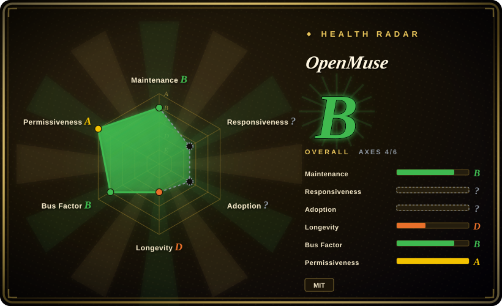
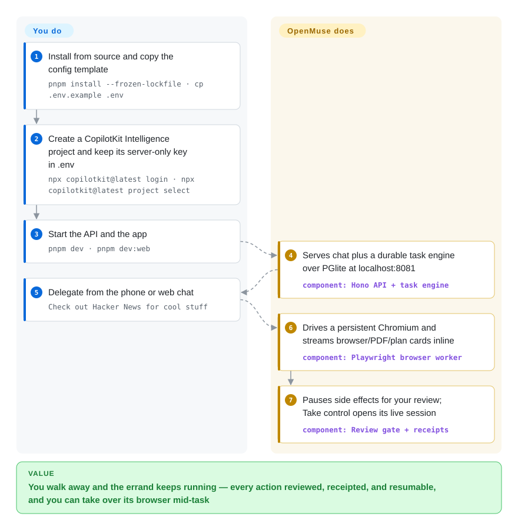

# OpenMuse

You want to hand a real errand to an AI — fill the school-trip form, watch that product page, read the inbox and draft the reply — and walk away, but a cloud chatbot has no machine that keeps working after you close the tab, and agent frameworks make you build the machine yourself. OpenMuse is a self-hosted personal-agent app that ships its own computer: a persistent Chromium you can take over, an optional sandboxed Linux terminal, a durable task engine with human review, and iOS/Android/web chat clients.

> **Requires a CopilotKit Intelligence project key in every mode.** The repo is MIT, but the API refuses to start without a server-only key to CopilotKit's hosted conversation-persistence service — verified at `apps/server/src/config.ts` on 2026-09-27. "Fully self-hosted" here stops at the chat-history layer; see the first bullet of When NOT to use.

## When to use

You are a developer who wants a personal agent you can delegate to from your phone and audit when you're back: a visible plan, reviewable actions, saved receipts, and a browser session you can open and finish yourself ("Take control"). You pick OpenMuse over [OpenClaw](openclaw.md) when the deciding capability is a working computer behind its own app — persistent Chromium with per-thread profiles, an optional nonroot Docker Linux terminal with command receipts, and durable tasks that survive restarts via SQL leases — rather than OpenClaw's strength, answering you on 20+ messaging channels. You pick it over [OpenHuman](openhuman.md) when you want the agent to *do* things in your accounts (search mail, fill a PDF form, prepare a reviewed reply) rather than mainly remember them through an ingestion loop. Models are bring-your-own (OpenAI, Anthropic or Google keys stay server-side) and app data lives on your disk in PGlite/PostgreSQL — the one piece you do not own is conversation persistence, which is CopilotKit's cloud.

## Q&A

**Is the "agent computer" a sandbox?** Half of it. The Linux terminal is strict: nonroot container, read-only root filesystem, networking disabled, no host mounts, and it never sees model keys, Google tokens or the API access key; commands are capped (30 s) and every run leaves a saved receipt. The browser is not a sandbox: it is a persistent, real Chromium with live profiles on the public web — that is the agent's hands, guarded by per-action human review rather than by isolation.

**Does it need CopilotKit's cloud product?** Yes, and not just "pairs well with": API startup fails without a server-side `CPK_INTELLIGENCE_API_KEY` in every mode, including the fictional-data sample mode. The MIT repo owns the agent, the computer and your app data; conversation persistence/replay is the vendor's hosted service, and the open feature request to make it optional (#73) had no maintainer reply as of 2026-09-27.

## How it works

The app, the server, the task engine and both halves of the computer ship together — you supply the model keys, the cloud project key, and any Google OAuth app you want connected. The Hono server runs the CopilotKit runtime and a durable task engine over PGlite (embedded Postgres by default): delegated work becomes a plan of steps you can pause, resume, cancel or retry, and side effects (sending mail, calendar changes) stop at a stored review gate until you approve. When the agent browses, it calls a separate token-protected Playwright worker that keeps one Chromium profile per thread, so a session you took over mid-task is still there tomorrow; when it computes, it runs bounded commands in a disposable nonroot container with a named `/workspace` volume. Your ongoing job is small: delegate, review, and occasionally take the wheel.

<!-- flow-steps:begin (generated from flows/openmuse.json by tools/flow_card.py — do not edit) -->

Text version of the flow

1. **You**: Install from source and copy the config template — `pnpm install --frozen-lockfile · cp .env.example .env`
2. **You**: Create a CopilotKit Intelligence project and keep its server-only key in .env — `npx copilotkit@latest login · npx copilotkit@latest project select`
3. **You**: Start the API and the app — `pnpm dev · pnpm dev:web`
4. **OpenMuse**: Serves chat plus a durable task engine over PGlite at localhost:8081 — component: `Hono API + task engine`
5. **You**: Delegate from the phone or web chat — `Check out Hacker News for cool stuff`
6. **OpenMuse**: Drives a persistent Chromium and streams browser/PDF/plan cards inline — component: `Playwright browser worker`
7. **OpenMuse**: Pauses side effects for your review; Take control opens its live session — component: `Review gate + receipts`

**Value**: You walk away and the errand keeps running — every action reviewed, receipted, and resumable, and you can take over its browser mid-task

<!-- flow-steps:end -->

## When NOT to use

- **You need zero-vendor or offline operation.** The key requirement is not a docs slogan: `apps/server/src/config.ts` calls `required("CPK_INTELLIGENCE_API_KEY", …)` unconditionally (verified 2026-09-27), PR #38 removed the code paths that skipped Intelligence, and issue #73 asking to make it optional is open without a maintainer reply. Use [OpenHuman](openhuman.md) instead, whose Rust core enforces `local_only` at construction time, or [OpenClaw](openclaw.md) for a no-required-SaaS assistant.
- **You want the assistant inside the messenger you already live in.** OpenMuse is its own Expo/React Native app (iOS, Android, web); the repo has no WhatsApp/Telegram/Slack bridge. Use [OpenClaw](openclaw.md) if channel reach is the feature.
- **You only want a chat window over local or remote models.** Use [Open WebUI](../../../llm-chat-ui/open-webui.md) instead, because OpenMuse drags in a task database, a browser worker, encryption keys and a mandatory cloud key for a surface you could get with one container.
- **You are building your own agent product and want a framework.** OpenMuse is a finished single-owner app monorepo with fictional sample data, not an embeddable runtime; use the CopilotKit SDK itself or a framework like [LangChain](../../workflow-builders/langchain.md) instead.
- **You need multi-user or a hardened production deployment.** The README states it plainly: one owner behind a shared access key, "not a multi-tenant authentication system"; multi-user auth and deployment hardening are unchecked roadmap items. Use [Octop](octop.md) for an isolated multi-user assistant you operate.
- **You need to pin a version.** As of 2026-09-27 there are no GitHub releases or tags — only `0.1.0` in `package.json` on main, self-labeled Alpha, with its own `docs/VERIFICATION.md` listing live-model and live-Google acceptance as pending. Expect breaking changes to arrive through main.
- **You expect autonomous booking, checkout, or a graphical desktop.** The browser worker dismisses popups/dialogs and disables WebSockets and service workers; the terminal is non-interactive with a 30-second cap; reservations, purchases and desktop apps are roadmap items. Use [OpenClaw](openclaw.md) or [Hermes Agent](hermes-agent.md) for looser tool loops, or wait.
- **You want the agent to get better with use.** Memory is an editable in-app list, not a learning loop. Use [Hermes Agent](hermes-agent.md) instead.

## Comparison

| Alternative | In index | Our verdict | Tradeoff |
| --- | --- | --- | --- |
| [OpenClaw](openclaw.md) | ✅ | When the assistant must reach you where you already chat (WhatsApp, Telegram, Slack, iMessage), pick OpenClaw; pick OpenMuse when the deciding feature is a delegated errand with a visible browser and terminal you can audit or take over. | OpenClaw is messaging-native with no required vendor cloud; OpenMuse buys a richer working surface and pays a mandatory CopilotKit Intelligence key plus its own app UI. |
| [OpenHuman](openhuman.md) | ✅ | When day-one context from your accounts is the product, pick OpenHuman; pick OpenMuse when acting in those accounts (browse, fill forms, reviewed sends) is the product. | OpenHuman enforces offline at build time and is GPL-3.0; OpenMuse cannot start offline (cloud key) and is MIT-with-SaaS-dependency. |
| [Hermes Agent](hermes-agent.md) | ✅ | When you want an agent that writes its own skills from experience, pick Hermes; pick OpenMuse when you want a packaged app with fixed, reviewable tool surfaces today. | Hermes is a framework-shaped runtime with no mobile app; OpenMuse is an app whose capability set is what the repo ships. |
| [Octop](octop.md) | ✅ | When several people must share one host with isolated agents over Feishu/WeCom, pick Octop; pick OpenMuse for one owner who wants a browser-and-terminal worker, not a team console. | Octop is multi-user but Python-glue with a private wheel core; OpenMuse is single-owner, fully readable TypeScript, but phone-first. |
| [Open WebUI](../../../llm-chat-ui/open-webui.md) | ✅ | When a polished self-hosted chat front-end is enough, pick Open WebUI; pick OpenMuse only if durable delegated tasks with approvals are the actual requirement. | Open WebUI is years-old and optional-cloud; OpenMuse is 12-days-old alpha whose persistence tier is someone else's service. |

## Tech stack

- **TypeScript strict** pnpm monorepo, Node ≥22 (README pins 24 LTS), Biome, tsx
- **`apps/server`** — Hono + `@hono/node-server`, `@copilotkit/runtime` 1.70.x, `@ag-ui/core`/`@ag-ui/client` (AG-UI event streaming), Zod 4, `pdf-lib`
- **Model routing** — `@tanstack/ai` with OpenAI / Anthropic / Gemini provider packages (`AGENT_BACKEND=model`)
- **Storage** — PGlite (embedded Postgres, default `.openmuse/`) or PostgreSQL via `pg` when the task worker is a separate process
- **Clients** — Expo / React Native (`apps/mobile`), iOS + Android + web, CopilotKit headless hooks
- **Browser worker** — Node + Playwright, token-protected HTTP API, persistent Chromium profiles
- **Linux computer** — a Docker image (`apps/computer`), nonroot, read-only rootfs, no network

## Dependencies

- **A CopilotKit Intelligence project key — required in every mode** (API exits at startup without it); Intelligence itself is a hosted service outside the MIT scope.
- An LLM provider key when `AGENT_BACKEND=model` (the sample backend needs none).
- A Google Cloud OAuth client (Gmail/Calendar APIs enabled) for live mail/calendar.
- Docker for the browser worker (`infra/compose.yaml`) and for the optional Linux computer; the API host must be reachable by the Docker engine.
- Node 24 + pnpm 11.19 to run it from source; PostgreSQL if you split the task worker into its own process (PGlite allows a single process).
- A long-running host: background tasks, watches and retries only move while your server is up.

## Ops difficulty

**Medium-high.** `pnpm dev` + `pnpm dev:web` is genuinely two commands for the sample app, but a personal assistant you actually trust runs more: a browser worker with a shared 32-char token, optional Docker computer image, Google OAuth redirect URIs, `OPENMUSE_ACCESS_KEY` + `TOKEN_ENCRYPTION_KEY` for live mode, and a `.openmuse/` directory holding the database, documents and the signing key that you must keep private and back up. Day-2 has no release train to follow — you track main. The security posture is honest but single-owner: short-lived signed URLs for file/browser consoles, credentials encrypted at rest, and the README explicitly rules out multi-tenant use.

## Health & viability

- **Maintenance (2026-09-27)**: a launch burst, not yet a cadence — 54 commits in 12 days, pushed daily through 2026-09-26, 31 open issues/PRs, zero releases or tags.
- **Governance / bus factor**: CopilotKit (vendor Organization, not a foundation). 10 active maintainers in the trailing 12 months, top-1 share 53.3%, top-3 share 75.6%. A funded company's app team, so roadmap control is total — and so is the risk the app is deprioritized.
- **Backing & longevity**: backed by the company behind the CopilotKit SDK and the AG-UI protocol, with an explicit funnel ("Building on OpenMuse? Meet with the CopilotKit team"). Age 12 days: zero Lindy signal; the mandatory Intelligence dependency means the business model runs through the app's core UX.
- **Adoption**: 2,484 stars / 305 forks / 9 watchers (2026-09-27) — watchers-to-stars is launch-promotion shape, [推断] driven by the org's existing audience rather than an operator community.
- **Risk flags**: self-labeled Alpha for self-hosting and building on; open-core split (MIT app + required proprietary persistence service); own verification doc lists live-model, real-Google and cross-device acceptance as pending.

## Caveats (unverified)

- [未验证] Product behavior overall: this page comes from the README, `docs/` (VERIFICATION, COMPUTER, RICH-THREADS, FEATURES), `.env.example`, `package.json`, the worker README, and targeted reads of `apps/server/src/config.ts` — I did not install or run OpenMuse.
- [未验证] CopilotKit Intelligence pricing/free tier, and whether the residual local `/api/conversation` endpoints still function without a key (the issue-#73 author said they did not test; I only confirmed the unconditional startup requirement).
- [推断] The star velocity (~2.5k in 12 days) reflects launch promotion to the CopilotKit audience, not production adoption.
- [未验证] Live model quality, real Google OAuth flows, and native iOS/Android behavior — the project's own `docs/VERIFICATION.md` and `ROADMAP.md` mark these acceptances pending.
- [未验证] Whether the top contributor (`jerelvelarde`) and the ~10-name contributor list are all CopilotKit employees; GitHub org membership was not checked.
