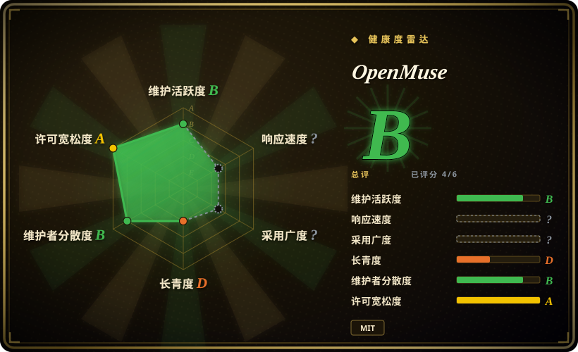
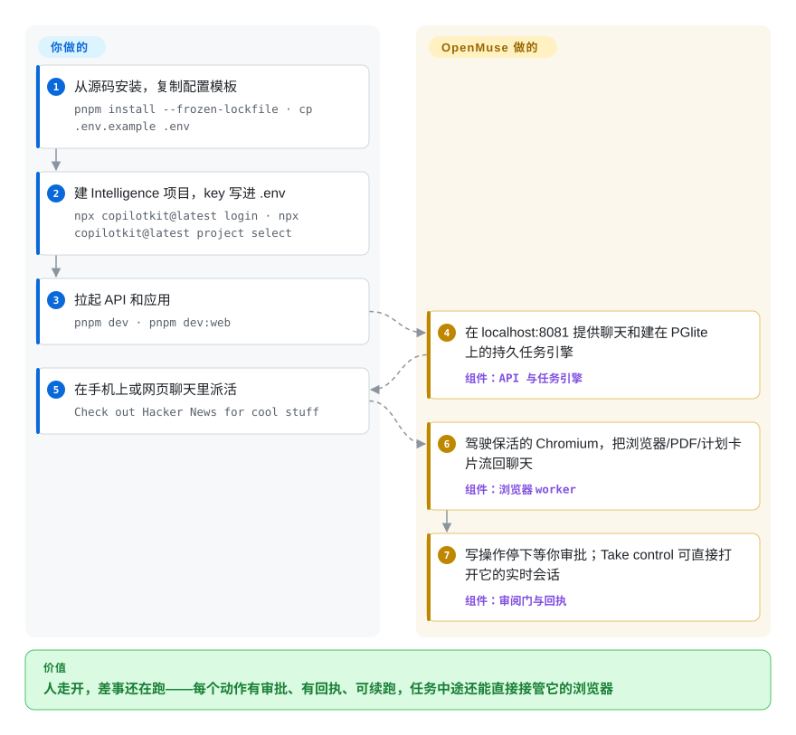

# OpenMuse

你想把一件真实琐事交给 AI——替我填学校郊游的回执表、盯住那个商品页、读完邮件把回复草稿备好——然后人走开；但云端聊天机器人没有一台在你关掉网页后还在干活的机器，agent 框架又要你自己把这台机器搭出来。OpenMuse 是一个自托管的个人助理应用，自带一台「agent 计算机」：一个你可以随时接管的持久 Chromium、一个可选的隔离 Linux 终端、一个带人工审批的可恢复任务引擎，外加 iOS/Android/Web 聊天客户端。

> **每种模式都要求一个 CopilotKit Intelligence 项目 key。** 仓库本身是 MIT，但缺少指向 CopilotKit 托管会话持久化服务的 server-only key 时，API 直接拒绝启动——2026-09-27 已在 `apps/server/src/config.ts` 核实。「完全自托管」在这里止步于聊天记录这一层；详见「何时不用」第一条。

## 何时使用

你是一个开发者，想有一个能从手机上派活、回来后能逐条审计的个人 agent：计划可见、动作要过你的审批、每次执行都留回执、它浏览网页的浏览器你可以直接打开接手（「Take control」）。你在 [OpenClaw](openclaw.zh.md) 之上选 OpenMuse，是因为决定性能力是「自己的 App 背后有一台能干活的计算机」——按线程保活的 Chromium、可选的非 root Docker Linux 终端、靠 SQL 租约扛过重启的持久任务——而不是 OpenClaw 那种在 20+ 个聊天渠道上找到你的触达力。你在 [OpenHuman](openhuman.zh.md) 之上选它，是因为你要 agent 在你的账号里*做事*（搜邮件、填 PDF 表单、备好待审的回复），而不只是通过摄取循环*记住*它们。模型自带（OpenAI、Anthropic 或 Google 的 key 只留在服务端），应用数据在你盘上的 PGlite/PostgreSQL 里——唯独你不拥有的那块是会话持久化，那是 CopilotKit 的云。

## 快问快答

**「agent 计算机」是沙箱吗？** 只有一半是。Linux 终端收得很紧：非 root 容器、只读根文件系统、网络禁用、不挂宿主目录，模型 key、Google token 和 API access key 它一个都摸不到；命令限时 30 秒，每次执行都留回执。浏览器不是沙箱：那是一个带着真实 profile、在公网上跑活的持久 Chromium——它是 agent 的手，靠逐动作人工审批兜底，而不是靠隔离。

**它需要配合 CopilotKit 的云产品吗？** 需要，而且不止「配合得好」：缺少 server-side 的 `CPK_INTELLIGENCE_API_KEY` 时 API 启动即失败，每种模式都是，连跑虚构数据的 sample 模式也不例外。MIT 仓库拥有 agent、计算机和你的应用数据；会话持久化/回放是厂商的托管服务，而要求把它改为可选的 issue #73 截至 2026-09-27 没有维护者回复。

## 怎么用起来

App、服务端、任务引擎和计算机的两半是一起交付的——你提供模型 key、那个云项目 key，以及要接的 Google OAuth 应用。Hono 服务端跑着 CopilotKit runtime 和一个建于 PGlite（默认内嵌 Postgres）之上的持久任务引擎：派出去的活会变成一串可暂停/续跑/取消/重试的步骤计划，写操作（发邮件、改日历）会停在落库的审阅门等你点头。agent 浏览网页时，调的是另一个带 token 保护的 Playwright worker，每条线程保有一个 Chromium profile，所以你在任务中途接管过的那个会话明天还在；它要算东西时，跑在一个一次性非 root 容器里，命令有界，文件留在命名卷 `/workspace` 里。你日常的活儿很少：派活、审批、偶尔上手接管。

<!-- flow-steps:begin (generated from flows/openmuse.json by tools/flow_card.py — do not edit) -->

流程文字版

1. **你**：从源码安装，复制配置模板 — `pnpm install --frozen-lockfile · cp .env.example .env`
2. **你**：建 Intelligence 项目，key 写进 .env — `npx copilotkit@latest login · npx copilotkit@latest project select`
3. **你**：拉起 API 和应用 — `pnpm dev · pnpm dev:web`
4. **OpenMuse**：在 localhost:8081 提供聊天和建在 PGlite 上的持久任务引擎 — 组件：`API 与任务引擎`
5. **你**：在手机上或网页聊天里派活 — `Check out Hacker News for cool stuff`
6. **OpenMuse**：驾驶保活的 Chromium，把浏览器/PDF/计划卡片流回聊天 — 组件：`浏览器 worker`
7. **OpenMuse**：写操作停下等你审批；Take control 可直接打开它的实时会话 — 组件：`审阅门与回执`

**价值**：人走开，差事还在跑——每个动作有审批、有回执、可续跑，任务中途还能直接接管它的浏览器

<!-- flow-steps:end -->

## 何时不用

- **你需要零厂商依赖或离线运行。** key 强制不是文档口号：`apps/server/src/config.ts` 无条件调用 `required("CPK_INTELLIGENCE_API_KEY", …)`（2026-09-27 核实），PR #38 删掉了跳过 Intelligence 的代码路径，请求把它改为可选的 issue #73 开着且无人回应。改用 [OpenHuman](openhuman.zh.md)，它的 Rust core 在构造期就硬性拒绝联网；或者对「没有强制 SaaS」要求没那么苛刻时改用 [OpenClaw](openclaw.zh.md)。
- **你想让助理住在你已有的聊天工具里。** OpenMuse 是自己的 Expo/React Native 应用（iOS、Android、Web），仓库里没有 WhatsApp/Telegram/Slack 桥接。渠道触达就是卖点时，用 [OpenClaw](openclaw.zh.md)。
- **你只想要一个套本地或远端模型的聊天窗口。** 用 [Open WebUI](../../../llm-chat-ui/open-webui.zh.md)，因为 OpenMuse 会为你本可一个容器搞定的界面，额外拖进任务库、浏览器 worker、加密密钥和一个必配的云 key。
- **你在构建自己的 agent 产品，要的是框架。** OpenMuse 是一个完成度的单主人应用 monorepo（附带虚构示例数据），不是可嵌入的 runtime；直接用 CopilotKit SDK 本身，或 [LangChain](../../workflow-builders/langchain.zh.md) 这类框架。
- **你需要多用户或生产级加固部署。** README 明说：一个主人 + 一把共享 access key，「不是多租户认证系统」；多用户认证和部署加固是 roadmap 上未勾选项。要给多人隔离共用，改用 [Octop](octop.zh.md)。
- **你需要钉住一个版本。** 截至 2026-09-27 没有任何 GitHub release 或 tag——只有 main 上 `package.json` 里的 `0.1.0`，自我标注 Alpha，自家 `docs/VERIFICATION.md` 也列明真实模型与真实 Google 账号的验收尚未完成。破坏性变更会随 main 到来。
- **你期待自主订票、自动结账或图形桌面。** 浏览器 worker 会关掉弹窗和对话框、禁用 WebSocket 与 service worker；终端非交互、30 秒限时。预订、购买、桌面应用都是 roadmap 项。要更松的工具循环，改用 [OpenClaw](openclaw.zh.md) 或 [Hermes Agent](hermes-agent.zh.md)，或者再等等。
- **你想让 agent 越用越强。** 记忆是一份可在应用里编辑的清单，不是学习循环。用 [Hermes Agent](hermes-agent.zh.md)。

## 横向对比

| 替代品 | 是否收录 | 我们的评价 | 取舍 |
| --- | --- | --- | --- |
| [OpenClaw](openclaw.zh.md) | ✅ | 助理必须在你已有的聊天软件里找到你时，选 OpenClaw；决定性能力是「派出去的差事有可见的浏览器和终端，能审计能接管」时，选 OpenMuse。 | OpenClaw 消息原生、无强制云；OpenMuse 换来更强的工作面，代价是一个强制的 CopilotKit Intelligence key 加一套自己的 App UI。 |
| [OpenHuman](openhuman.zh.md) | ✅ | 产品价值是第一天就懂你的账号上下文时，选 OpenHuman；是「在你的账号里替你把事办了」（浏览、填表、待审发送）时，选 OpenMuse。 | OpenHuman 构造期强制离线、GPL-3.0；OpenMuse 离线起不来（云 key），是 MIT 应用 + SaaS 依赖的组合。 |
| [Hermes Agent](hermes-agent.zh.md) | ✅ | 你要一个从经验里给自己写技能的 agent 时，选 Hermes；今天就要一个成套、工具面固定且可审阅的 App 时，选 OpenMuse。 | Hermes 是框架形态的 runtime、没有手机应用；OpenMuse 的能力边界就是这个仓库发出来的东西。 |
| [Octop](octop.zh.md) | ✅ | 几个人共用一台机器、各自隔离的 agent 挂在飞书/企微上时，选 Octop；一个人要一台会浏览会跑命令的机器、入口在手机时，选 OpenMuse。 | Octop 多用户但核心是私有 wheel 的 Python 胶水；OpenMuse 单主人、TypeScript 全可读、手机优先。 |
| [Open WebUI](../../../llm-chat-ui/open-webui.zh.md) | ✅ | 一个打磨过的自托管聊天前端就够用时，选 Open WebUI；只有「带审批的可恢复派活」才是真需求时，才值得 OpenMuse。 | Open WebUI 多年沉淀、云可选；OpenMuse 是 12 天的 Alpha，且持久化层握在别人手里。 |

## 技术栈

- **TypeScript strict** pnpm monorepo，Node ≥22（README 钉 24 LTS），Biome、tsx
- **`apps/server`**——Hono + `@hono/node-server`、`@copilotkit/runtime` 1.70.x、`@ag-ui/core`/`@ag-ui/client`（AG-UI 事件流）、Zod 4、`pdf-lib`
- **模型路由**——`@tanstack/ai` 配 OpenAI / Anthropic / Gemini 提供方包（`AGENT_BACKEND=model`）
- **存储**——PGlite（默认内嵌 Postgres，放 `.openmuse/`）；任务 worker 独立成进程时用 PostgreSQL（`pg` 驱动）
- **客户端**——Expo / React Native（`apps/mobile`），iOS + Android + Web，CopilotKit headless hooks
- **浏览器 worker**——Node + Playwright，带 token 的 HTTP API，profile 持久化
- **Linux 计算机**——一个 Docker 镜像（`apps/computer`），非 root、只读根文件系统、无网络

## 依赖

- **一个 CopilotKit Intelligence 项目 key——每种模式都必需**（缺 key 时 API 启动即退出）；Intelligence 本身是 MIT 授权范围之外的托管服务。
- `AGENT_BACKEND=model` 时的 LLM 提供方 key（sample 后端不需要）。
- 接真实邮件/日历时的 Google Cloud OAuth 客户端（需启用 Gmail/Calendar API）。
- 浏览器 worker（`infra/compose.yaml`）和可选 Linux 计算机所需的 Docker；API 宿主必须能访问 Docker 引擎。
- 从源码运行的 Node 24 + pnpm 11.19；把任务 worker 拆成独立进程时的 PostgreSQL（PGlite 只允许单进程）。
- 一台长期开着的宿主：后台任务、页面监控和重试只在你的服务器活着时才推进。

## 运维难度

**中偏高。** 跑 sample 应用确实只要 `pnpm dev` + `pnpm dev:web` 两条命令，但你真信得过的个人助理会拉起更多：一个共享 32 位字符 token 的浏览器 worker、可选的 Docker 计算机镜像、Google OAuth 回调地址、live 模式的 `OPENMUSE_ACCESS_KEY` 和 `TOKEN_ENCRYPTION_KEY`，还有一个装着数据库、文档和签名私钥、必须保密并备份的 `.openmuse/` 目录。Day-2 没有 release 列车可跟——你跟的是 main。安全姿态诚实但限于单主人：文件/浏览器控制台走短时签名 URL、凭据落库加密，README 明确排除多租户场景。

## 健康度与可持续性

- **维护（2026-09-27）**：是发布冲刺，还不是节奏——12 天 54 个 commit，推送到 2026-09-26 仍保持日更，31 个 open issues/PRs，零 release、零 tag。
- **治理 / 巴士系数**：CopilotKit（厂商 Organization，非基金会）。近 12 个月活跃维护者 10 人，top-1 占比 53.3%，top-3 占比 75.6%。一家有融资的公司应用团队：roadmap 控制力是满格，被战略弃坑的风险同样满格。
- **背书与寿命**：背后是 CopilotKit SDK 与 AG-UI 协议的那家公司，导流意图写在明面上（「Building on OpenMuse? Meet with the CopilotKit team」）。12 天历史：Lindy 信号为零；强制 Intelligence 依赖意味着商业模式长在这个 App 的核心体验上。
- **采用度**：2,484 star / 305 fork / 9 watcher（2026-09-27）——watcher 对 star 的比例是发布推广的形状，[推断] 流量来自该组织既有受众而非运维者社区。
- **风险信号**：自我标注 Alpha（供自托管与二次开发）；open-core 切分（MIT 应用 + 强制私有持久化服务）；自家验证文档列明真实模型、真实 Google 与跨设备验收未完成。

## 存疑（未验证）

- [未验证] 产品整体行为：本页来自 README、`docs/`（VERIFICATION、COMPUTER、RICH-THREADS、FEATURES）、`.env.example`、`package.json`、worker README 和对 `apps/server/src/config.ts` 的定向阅读——没有安装或运行过 OpenMuse。
- [未验证] Intelligence 的定价/免费额度，以及残留的本地 `/api/conversation` 端点无 key 时是否还能工作（issue #73 作者自述未测试；本侧只核实了启动期的无条件强制）。
- [推断] 12 天约 2.5k star 的增速，反映的是面向 CopilotKit 受众的发布热度，而非生产采用。
- [未验证] 真实模型质量、真实 Google OAuth 流程和 iOS/Android 原生表现——项目自己的 `docs/VERIFICATION.md` 与 `ROADMAP.md` 把这些验收标为 pending。
- [未验证] 头号贡献者（`jerelvelarde`）及约 10 人的贡献者名单是否都是 CopilotKit 员工；未核对 GitHub org 成员身份。
