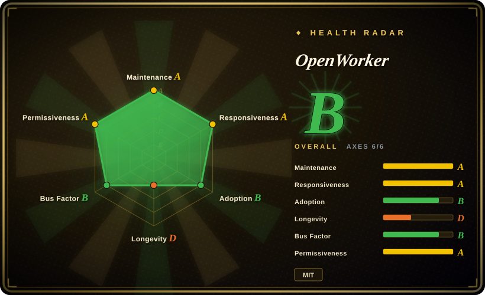
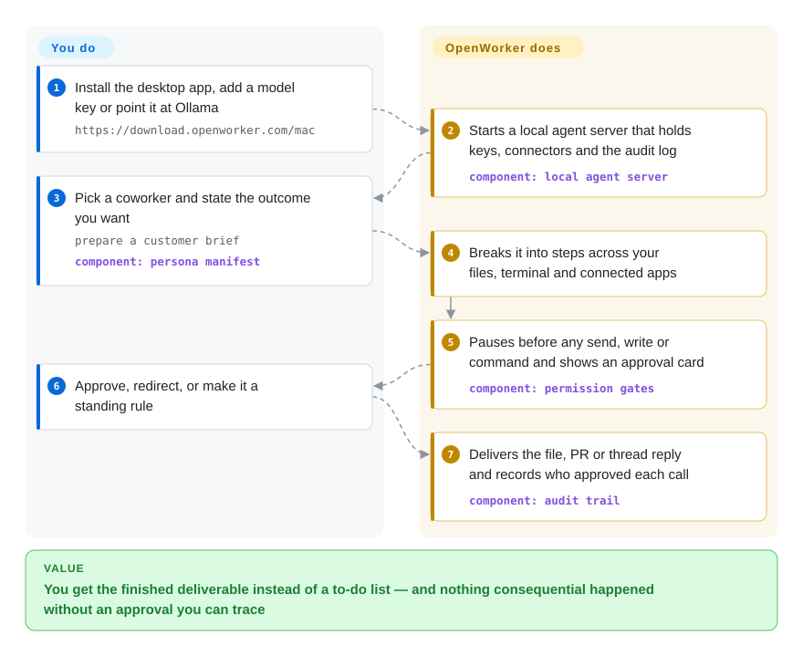

# OpenWorker

You want an AI on your laptop that actually *does* the task — reads the repo and opens the fix PR, answers the Slack thread with the numbers, preps tomorrow's customer call — but a raw agent with your shell and your tokens is one bad prompt away from sending the wrong email or running `rm -rf`. OpenWorker is a desktop app that does the work with your own model key while making every send, write and shell command stop at an approval gate you can see, and logging who approved what.

> **Open beta, 71 days old (created 2026-07-20).** The sandbox that isolates the agent's commands is **off until you turn it on**, managed one-click connectors go through a closed OAuth broker, and 226 of 252 issues were open on 2026-09-29. See When NOT to use.

## When to use

You are the one engineer on a small team without a security person, or an operator who lives in Slack, GitHub, Jira and a calendar, and you keep pasting context into a chatbot and then doing the actual work yourself. You want to say "scan this repo for vulnerabilities and prepare fix PRs" or "brief me on the Acme call from HubSpot and my inbox" and get a file, a PR or a thread reply back — and you want to be able to answer "who ran that command, and did I approve it?" afterwards. You pick OpenWorker over [OpenClaw](openclaw.md) when the deciding thing is governance on a desktop, not messaging reach: approval-gated writes by default, human-only "hard floors" that no auto-approve mode can lower, and a per-call audit trail with the approval source. You pick it over [OpenMuse](openmuse.md) when you will not accept a mandatory vendor cloud key — OpenWorker runs fully signed-out with any of ~15 model providers or local Ollama — and over a general coding agent when the job is packaged by role: the built-in Security coworker ships its instructions, tool list and scanner skills (semgrep, gitleaks) already wired.

## How it works

You install a signed desktop app (macOS, Windows) — a Tauri window that starts and supervises a local Python "agent server" (the process that runs the model loop, tools and connectors). You add a model key or point it at Ollama, optionally connect apps (GitHub, Slack, Gmail… by pasting a token, or by one-click OAuth if you sign in), pick a "coworker" — a persona file that fixes the role's instructions, allowed tools, connectors and skills — and state the outcome you want. The server plans the steps and works across your folders, terminal and connected apps; before anything consequential (sending, changing a calendar, running a command) it pauses on an approval card, like a junior colleague who has to get your signature before anything leaves the building. You can let one-off approvals graduate into standing rules, or turn on an auto-approve mode where a second "reviewer" model waves routine calls through and escalates the rest; either way every tool call is recorded with who approved it. Isolation is your call: switch on the macOS built-in sandbox, a hidden Windows account, or an NVIDIA OpenShell container per agent, and its commands then see only the session's folders and an allow-listed network.

<!-- flow-steps:begin (generated from flows/openworker.json by tools/flow_card.py — do not edit) -->

Text version of the flow

1. **You**: Install the desktop app, add a model key or point it at Ollama — `https://download.openworker.com/mac`
2. **OpenWorker**: Starts a local agent server that holds keys, connectors and the audit log — component: `local agent server`
3. **You**: Pick a coworker and state the outcome you want — `prepare a customer brief` — component: `persona manifest`
4. **OpenWorker**: Breaks it into steps across your files, terminal and connected apps
5. **OpenWorker**: Pauses before any send, write or command and shows an approval card — component: `permission gates`
6. **You**: Approve, redirect, or make it a standing rule
7. **OpenWorker**: Delivers the file, PR or thread reply and records who approved each call — component: `audit trail`

**Value**: You get the finished deliverable instead of a to-do list — and nothing consequential happened without an approval you can trace

<!-- flow-steps:end -->

## When NOT to use

- **You need the agent's commands isolated by default.** The docs say it plainly: "The desktop app runs commands directly, as it always has, until you turn OpenShell on for the machine" (`docs/openshell.md`, read 2026-09-29), and the macOS/Windows sandboxes are likewise opt-in. Approval gates are a human checkpoint, not a wall. If you need isolation without remembering a setting, run a coding agent inside a container runtime such as [OpenHands](../../coding-agents/orchestration-and-review/openhands.md), whose tasks execute in a Docker sandbox from the start.
- **You need a fully open stack, including one-click connectors.** Signed-out mode works with pasted tokens, but managed OAuth goes through an OpenWorker Cloud broker (Auth0 sign-in, `POST /v1/oauth/{provider}/start` in `coworker/cloud.py`) whose source is not public — the `opencoworker-cloud` repo the code cites returns 404. Use [OpenHuman](openhuman.md) if you want a local-first assistant whose Rust core can be forced offline.
- **You want it to answer you inside WhatsApp, Telegram or iMessage.** OpenWorker's chat surface is its desktop app plus Slack mentions; use [OpenClaw](openclaw.md) when channel reach is the requirement.
- **You need a Linux desktop app.** Installers exist only for macOS (Apple Silicon; Intel builds are attached to the release) and Windows 10/11, and the Windows build is not code-signed (SmartScreen warns). Linux runs only the headless server as a "remote machine" controlled from a Mac/PC desktop, or from source. Use [OpenMuse](openmuse.md) or [Hermes Agent](hermes-agent.md) for a Linux-hosted assistant.
- **You want CI-grade, reproducible security scanning.** The Security coworker drives semgrep and gitleaks and then lets a model triage; the triage is a judgment. For a gate that must give the same answer every run, run the scanners directly in CI, and use OpenWorker only for the triage-and-fix-PR step on top.
- **You need an embeddable SDK to build your own agent.** This is a finished app; the README itself points you to aisuite (not indexed) for that, or use an agent SDK such as [LangChain](../../workflow-builders/langchain.md).
- **You need pinned, long-supported versions or a responsive tracker.** SECURITY.md supports "the latest release only" and the app auto-updates; the issue tracker had 226 open vs 26 closed issues on 2026-09-29, most recent reports with zero comments, and the README warns feature PRs off the internal roadmap may be declined. Pin nothing you cannot re-test after an update.
- **You only need scheduled flows between SaaS apps.** Its automations (morning brief, weekly report) are model runs; for deterministic cross-app plumbing use [n8n](../../../workflow-orchestration/n8n.md).

## Comparison

| Alternative | In index | Our verdict | Tradeoff |
| --- | --- | --- | --- |
| [OpenClaw](openclaw.md) | ✅ | When the assistant must reach you where you already chat (WhatsApp, Telegram, iMessage…), pick OpenClaw; pick OpenWorker when approval-gated desktop work with a per-call audit trail is the requirement. | OpenClaw buys channel reach and a large community; OpenWorker buys human-only floors, standing-approval ladders and role personas but lives in one desktop app plus Slack. |
| [OpenMuse](openmuse.md) | ✅ | When you want a persistent browser you can take over from your phone, pick OpenMuse; pick OpenWorker when you will not accept a required vendor key and want desktop files, terminal and 25+ connectors instead. | OpenMuse's API refuses to start without a CopilotKit cloud key; OpenWorker runs signed-out, but only its optional one-click OAuth path depends on a closed broker. |
| [OpenHuman](openhuman.md) | ✅ | When the product is an assistant that already knows your accounts and can be forced offline, pick OpenHuman; pick OpenWorker when you want finished deliverables (PRs, documents, thread replies) with approvals. | OpenHuman is GPL-3.0-only with an enforceable local-only core; OpenWorker is MIT and multi-provider but sends data to whichever model and connectors you choose. |
| Eigent (`eigent-ai/eigent`) | not indexed | When you want a desktop "cowork" built on a multi-agent workforce and Apache-2.0 licensing, evaluate Eigent; pick OpenWorker when governance (floors, audit provenance, sandbox choice) is what you are buying. | Eigent is a year older (2025-07) with a similar desktop shape; not added in this tab-intake batch, so its tradeoffs here are not researched. |
| Goose (`aaif-goose/goose`) | not indexed | When you want an extensible, any-LLM general agent with two years of history (since 2024-08, Apache-2.0), lean Goose; pick OpenWorker when you want role-packaged coworkers and approval provenance out of the box. | Goose has age and ~3× the stars (54.7k on 2026-09-29); OpenWorker is younger but more opinionated about approvals. Not added in this tab-intake batch. |

## Tech stack

- **Backend** — Python ≥3.10 package `coworker/` (`openworker` 0.2.3 in `pyproject.toml`): FastAPI + Uvicorn local server, Textual terminal UI (unlisted), Pydantic, PyYAML persona manifests, SQLite memory store, croniter scheduler.
- **Model layer** — built on aisuite ≥0.2.0 plus native OpenAI, Anthropic, Google GenAI/Vertex providers; optional Bedrock (boto3). Web search defaults to keyless DuckDuckGo (`ddgs`).
- **Connectors** — MCP client (`mcp>=1.28.1,<2`, stdio + streamable HTTP), httpx/websockets senders, optional slack-bolt / python-telegram-bot, optional Playwright browser automation.
- **Desktop** — React 18 + Vite + Tailwind UI in a Tauri 2 (Rust) shell that supervises the server; Auth0 SPA client for optional sign-in; a Rust speech-to-text sidecar (`stt/`).
- **Sandbox** — providers for macOS Seatbelt, a Windows hidden local account, and NVIDIA OpenShell over gRPC (optional `grpcio`).

## Dependencies

- A model: an API key for one of the listed providers (OpenAI, Anthropic, Gemini, DeepSeek, Kimi, Qwen, GLM, Mistral, Grok…) or a local Ollama.
- The desktop app on macOS 12+ or Windows 10/11; from source, Python 3.10+, Node 20+ and a Rust toolchain.
- Optional: Docker Desktop (OpenShell on a Mac), semgrep installed by you (the Security coworker asks for it; gitleaks it can download and pin), connector tokens or an OpenWorker Cloud sign-in for one-click OAuth.
- For "remote machines": a Linux host with Python 3.10+ and a network path *to* your desktop (Tailscale or an SSH reverse tunnel).

## Ops difficulty

**Low to install, medium to run safely.** The desktop path is download, paste a key, ask — and it auto-updates itself. The real work is policy: deciding which actions become standing approvals, whether to enable auto-approve (a model reviewer, which the README calls "judgments, not guarantees"), and turning on and maintaining a sandbox (OpenShell on a Mac needs Docker Desktop with a Landlock-capable kernel, per the 2026-09-29 commits). Auto-update with "latest release only" support means behavior can change under you; model keys and connector tokens sit in the app's local secret store on that machine, so the machine itself is the thing to protect and back up.

## Health & viability

- **Maintenance (2026-09-29)**: very active — last push 2026-09-29 with multiple commits per day, 6 tagged releases from v0.1.4 (2026-07-22) to v0.2.1 (2026-08-25), and main already at 0.2.3; the update feed (`latest.json`) is fetched ~409k times.
- **Governance / bus factor**: repo owned by Andrew Ng's personal account, but the code is written by two people — `rohitprasad15` (320 commits) and `devikaverma` (148), then single digits. A two-person core with an internal roadmap ("we may not approve PRs that … deviate from our vision").
- **Backing & longevity**: a high-profile author and a hosted product site (openworker.com) with a cloud component. Age 71 days: no Lindy signal at all; it moved out of the aisuite repo, whose own history (since 2024-06) is the closest track record.
- **Responsiveness**: mixed. The radar's responsiveness grade comes from a 13-issue window with a 64-hour median first response, but closure is low — 226 open vs 26 closed issues and 289 open vs 77 merged PRs (2026-09-29) — and most of the latest ~25 issues had no comment yet. Expect bug reports to wait.
- **Risk flags**: MIT with no CLA file; closed OAuth broker for managed connectors; Windows builds unsigned; the PyPI name `openworker` is a 0.0.1 placeholder, not this runtime [未验证]. Star velocity (18.3k in 71 days) reflects the author's audience more than production adoption [推断].

## Caveats (unverified)

- [未验证] Product behavior overall: this page comes from the README, `docs/openshell.md`, `docs/remote-machines.md`, `SECURITY.md`, `pyproject.toml`, `surfaces/gui/package.json`, `coworker/cloud.py`, `coworker/cli.py`, `coworker/toolchain.py`, the Security persona manifest, releases and issues — I did not install or run OpenWorker.
- [未验证] Whether the approval "hard floors" hold against prompt injection or malicious MCP tools; SECURITY.md lists such bypasses as in scope, but no audit or CVE history was found.
- [未验证] The OpenWorker Cloud OAuth broker's data handling — the code says connector tokens never touch cloud storage, but its source is not public (`opencoworker-cloud` returns 404), so this cannot be checked.
- [未验证] That the PyPI package `openworker` (0.0.1, homepage openworker.com) is only a name reservation; I saw only its metadata, not its contents.
- [未验证] Model coverage quality: the README says a curated list marks models "verified for tool-calling"; issue #674 (2026-09-19) reports a local OpenAI-compatible server not detected — local-model paths may be rough.
- [推断] Star velocity (~18.3k in 71 days) reflects Andrew Ng's audience and launch coverage, not a production operator base.
- [推断] Whether contributors `rohitprasad15` and `devikaverma` are paid staff behind openworker.com was not checked; the two-person bus factor is inferred from commit counts alone.
- [推断] Eigent and Goose tradeoffs in the Comparison come from their GitHub descriptions and ages only; neither was researched in this tab-intake batch.
