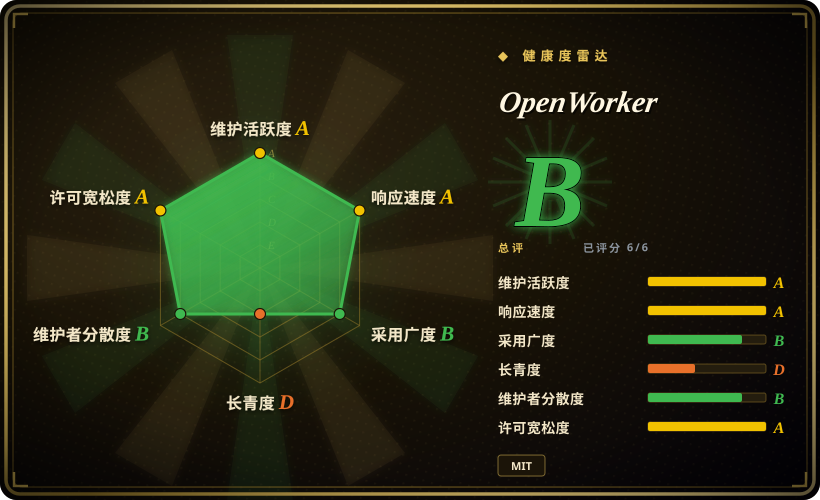
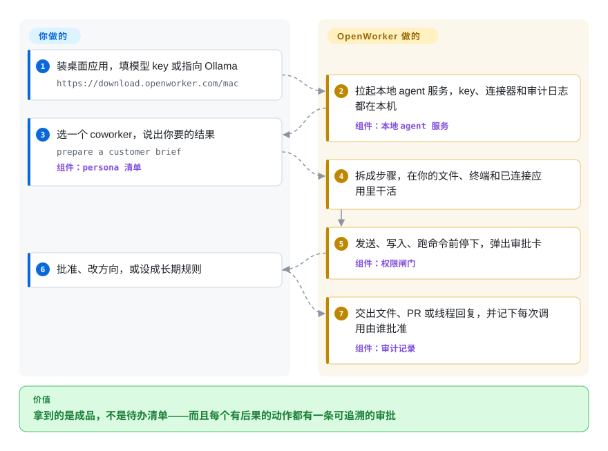

# OpenWorker

你想让电脑上的 AI 真把活干完——读完仓库直接开修复 PR、带着数字回复那条 Slack 线程、把明天的客户会议资料备好——可一个拿着你的终端和你所有 token 的 agent，离发错一封邮件或跑一句 `rm -rf` 只差一条坏提示。OpenWorker 是一个桌面应用：用你自己的模型 key 干活，但每次发送、写入、跑命令都先停在你看得见的审批卡上，并记下是谁批准的。

> **公测版，仅 71 天（2026-07-20 创建）。** 隔离 agent 命令的沙箱**默认关闭、要你手动打开**；一键接入连接器走的是一个未开源的 OAuth 中转服务；2026-09-29 时 252 个 issue 里有 226 个未关闭。详见「何时不用」。

## 何时使用

你是小团队里唯一的工程师、团队里没有安全岗；或者你是整天泡在 Slack、GitHub、Jira 和日历里的运营角色，总是把上下文贴进聊天机器人，然后自己动手干真正的活。你想说一句「扫一遍这个仓库的漏洞，把修复 PR 准备好」或「根据 HubSpot 和我的邮箱，给我准备 Acme 那通电话的简报」，拿回来的是一个文件、一个 PR 或一条线程回复——事后还要能回答「那条命令是谁跑的、我批过没有」。你在 [OpenClaw](openclaw.zh.md) 之上选 OpenWorker，是因为决定性的是桌面上的管控，而不是聊天渠道的触达：写操作默认要审批、有任何自动审批模式都降不下来的「人工底线」、每次工具调用都带审批来源的审计记录。你在 [OpenMuse](openmuse.zh.md) 之上选它，是因为你不接受强制的厂商云 key——OpenWorker 不登录也能完整使用，模型可选约 15 家提供商或本地 Ollama；你在通用编程 agent 之上选它，是因为它按岗位打包：内置的 Security coworker 自带岗位说明、工具清单和扫描器技能（semgrep、gitleaks），开箱即接好。

## 怎么用起来

你装一个签名过的桌面应用（macOS、Windows）——它是一个 Tauri 窗口，负责拉起并看管一个本地 Python「agent 服务」（跑模型循环、工具和连接器的那个进程）。你填一个模型 key 或指向 Ollama，按需连接应用（GitHub、Slack、Gmail 等，可以手动粘 token，登录后也可以一键 OAuth），选一个「coworker」——一份 persona 文件，定死这个岗位的说明、可用工具、连接器和技能——然后说出你要的结果。服务端自己规划步骤，在你的文件夹、终端和已连接的应用里干活；任何有后果的动作（发消息、改日历、跑命令）前都停在一张审批卡上，就像新来的同事，东西出门前必须先拿到你的签字。一次性的批准可以升级成长期规则，也可以打开自动审批模式，让第二个「审阅」模型放行常规调用、把拿不准的交还给你；无论哪种，每次工具调用都会记下由谁批准。隔离要你自己选：打开 macOS 自带沙箱、Windows 隐藏本地账户，或每个 agent 一个 NVIDIA OpenShell 容器，之后它的命令只能看到本次会话的文件夹和白名单里的网络。

<!-- flow-steps:begin (generated from flows/openworker.json by tools/flow_card.py — do not edit) -->

流程文字版

1. **你**：装桌面应用，填模型 key 或指向 Ollama — `https://download.openworker.com/mac`
2. **OpenWorker**：拉起本地 agent 服务，key、连接器和审计日志都在本机 — 组件：`本地 agent 服务`
3. **你**：选一个 coworker，说出你要的结果 — `prepare a customer brief` — 组件：`persona 清单`
4. **OpenWorker**：拆成步骤，在你的文件、终端和已连接应用里干活
5. **OpenWorker**：发送、写入、跑命令前停下，弹出审批卡 — 组件：`权限闸门`
6. **你**：批准、改方向，或设成长期规则
7. **OpenWorker**：交出文件、PR 或线程回复，并记下每次调用由谁批准 — 组件：`审计记录`

**价值**：拿到的是成品，不是待办清单——而且每个有后果的动作都有一条可追溯的审批

<!-- flow-steps:end -->

## 何时不用

- **你需要 agent 的命令默认就被隔离。** 文档写得很直白：「在你为这台机器打开 OpenShell 之前，桌面应用一直直接执行命令」（`docs/openshell.md`，2026-09-29 读），macOS/Windows 沙箱同样要手动开启。审批闸门是人工检查点，不是一堵墙。如果你要不靠记得开设置就有隔离，改用在容器里跑任务的编程 agent，比如 [OpenHands](../../coding-agents/orchestration-and-review/openhands.zh.md)，它的任务一开始就在 Docker 沙箱里执行。
- **你需要整条链路都开源，包括一键连接器。** 不登录时手动粘 token 能用，但托管 OAuth 走 OpenWorker Cloud 中转（Auth0 登录、`coworker/cloud.py` 里的 `POST /v1/oauth/{provider}/start`），其源码不公开——代码里引用的 `opencoworker-cloud` 仓库访问返回 404。想要本地优先、内核能强制断网的助手，改用 [OpenHuman](openhuman.zh.md)。
- **你想让它在 WhatsApp、Telegram 或 iMessage 里回你。** OpenWorker 的对话入口是自己的桌面应用加 Slack 的 @ 提及；渠道触达才是需求时，改用 [OpenClaw](openclaw.zh.md)。
- **你需要 Linux 桌面版。** 安装包只有 macOS（Apple Silicon；release 里也附了 Intel 版）和 Windows 10/11，Windows 版没有代码签名（SmartScreen 会报警）。Linux 上只能跑无界面的服务端，作为「远程机器」由 Mac/PC 桌面端控制，或者从源码跑。要 Linux 上托管的助手，改用 [OpenMuse](openmuse.zh.md) 或 [Hermes Agent](hermes-agent.zh.md)。
- **你要的是 CI 级别、可复现的安全扫描。** Security coworker 调用 semgrep 和 gitleaks，再让模型分诊；分诊是一种判断。要每次都给出同一结论的门禁，直接在 CI 里跑扫描器，只把 OpenWorker 用在上面那层「分诊 + 修复 PR」。
- **你需要一个可嵌入的 SDK 来搭自己的 agent。** 这是一个成品应用；README 自己就把你指向 aisuite（未收录），或者用 [LangChain](../../workflow-builders/langchain.zh.md) 这类 agent SDK。
- **你需要锁定版本、长期支持或响应及时的 issue 区。** SECURITY.md 只支持「最新版本」，应用会自动更新；2026-09-29 时 issue 区 226 个未关闭、26 个已关闭，近期的报告大多零评论，README 还提醒偏离内部路线图的功能 PR 可能被拒。更新后没法重测的东西，别指望它不变。
- **你只需要在 SaaS 之间跑定时流程。** 它的自动化（晨报、周报）本质是模型运行；确定性的跨应用搬运改用 [n8n](../../../workflow-orchestration/n8n.zh.md)。

## 横向对比

| 替代品 | 是否收录 | 我们的评价 | 取舍 |
| --- | --- | --- | --- |
| [OpenClaw](openclaw.zh.md) | ✅ | 助手必须在你已经在用的聊天软件里（WhatsApp、Telegram、iMessage 等）找到你时，选 OpenClaw；要的是桌面上逐项审批、每次调用都能审计的干活方式时，选 OpenWorker。 | OpenClaw 换来渠道触达和大社区；OpenWorker 换来人工底线、长期审批的升级阶梯和岗位 persona，但只活在一个桌面应用加 Slack 里。 |
| [OpenMuse](openmuse.zh.md) | ✅ | 想要一个能在手机上接管的持久浏览器，选 OpenMuse；不接受强制厂商 key、要的是本机文件、终端和 25+ 连接器，选 OpenWorker。 | OpenMuse 缺少 CopilotKit 云 key 时 API 拒绝启动；OpenWorker 不登录也能跑，只有可选的一键 OAuth 依赖闭源中转。 |
| [OpenHuman](openhuman.zh.md) | ✅ | 产品本身就是「早就了解你所有账号、还能强制断网」的助手时，选 OpenHuman；要带审批的成品交付（PR、文档、线程回复）时，选 OpenWorker。 | OpenHuman 是 GPL-3.0-only，内核可强制纯本地；OpenWorker 是 MIT、多模型，但数据会发给你选的模型和连接器。 |
| Eigent（`eigent-ai/eigent`） | 未收录 | 想要基于多 agent 协作、Apache-2.0 许可的桌面「cowork」，去评估 Eigent；你买的就是管控（底线、审计来源、沙箱可选）时，选 OpenWorker。 | Eigent 早一年（2025-07）创建，桌面形态相近；本批 tab 收录未加入，这里没有深入调研它的取舍。 |
| Goose（`aaif-goose/goose`） | 未收录 | 想要一个可扩展、任意模型、已有两年历史（2024-08 起，Apache-2.0）的通用 agent，倾向 Goose；想开箱即得岗位化 coworker 和审批溯源，选 OpenWorker。 | Goose 年头更长、星数约为三倍（2026-09-29 为 54.7k）；OpenWorker 更年轻，但对审批更有主见。本批 tab 收录未加入。 |

## 技术栈

- **后端**——Python ≥3.10 包 `coworker/`（`pyproject.toml` 里为 `openworker` 0.2.3）：FastAPI + Uvicorn 本地服务、Textual 终端界面（未公开入口）、Pydantic、PyYAML 解析 persona 清单、SQLite 记忆库、croniter 调度。
- **模型层**——基于 aisuite ≥0.2.0，外加原生的 OpenAI、Anthropic、Google GenAI/Vertex 提供方；Bedrock（boto3）可选。网页搜索默认用免 key 的 DuckDuckGo（`ddgs`）。
- **连接器**——MCP 客户端（`mcp>=1.28.1,<2`，stdio + streamable HTTP）、httpx/websockets 发送端，可选 slack-bolt / python-telegram-bot，可选 Playwright 浏览器自动化。
- **桌面端**——React 18 + Vite + Tailwind 界面，套在负责看管服务端的 Tauri 2（Rust）外壳里；可选登录用 Auth0 SPA 客户端；Rust 语音转文字 sidecar（`stt/`）。
- **沙箱**——macOS Seatbelt、Windows 隐藏本地账户、经 gRPC 连接的 NVIDIA OpenShell（可选 `grpcio`）三种 provider。

## 依赖

- 一个模型：上面所列任一提供商的 API key（OpenAI、Anthropic、Gemini、DeepSeek、Kimi、Qwen、GLM、Mistral、Grok 等），或本地 Ollama。
- macOS 12+ 或 Windows 10/11 上的桌面应用；从源码跑需要 Python 3.10+、Node 20+ 和 Rust 工具链。
- 可选：Docker Desktop（在 Mac 上用 OpenShell）、自己装的 semgrep（Security coworker 会向你要；gitleaks 它能自己下载并锁版本）、连接器 token，或登录 OpenWorker Cloud 走一键 OAuth。
- 「远程机器」模式：一台装有 Python 3.10+ 的 Linux 主机，外加一条*通向*你桌面端的网络路径（Tailscale 或 SSH 反向隧道）。

## 运维难度

**安装低，安全地用起来中等。** 桌面路径就是下载、填 key、提需求，并且会自动更新。真正的功夫在策略上：哪些动作升级成长期审批、要不要开自动审批（一个模型审阅者，README 自己说它的结论「是判断，不是保证」）、以及打开并维护沙箱（按 2026-09-29 的提交，Mac 上跑 OpenShell 需要 Docker Desktop 且内核支持 Landlock）。自动更新加「只支持最新版本」意味着行为可能在你脚下变化；模型 key 和连接器 token 存在这台机器的应用本地密钥库里，所以要保护、要备份的就是这台机器本身。

## 健康度与可持续性

- **维护（2026-09-29）**：非常活跃——最近推送在 2026-09-29，每天多次提交；从 v0.1.4（2026-07-22）到 v0.2.1（2026-08-25）共 6 个 tag release，main 上已到 0.2.3；更新清单（`latest.json`）被拉取约 40.9 万次。
- **治理与巴士系数**：仓库挂在吴恩达（Andrew Ng）的个人账号下，但代码主要出自两个人——`rohitprasad15`（320 次提交）和 `devikaverma`（148 次），其余都是个位数。两人核心、内部路线图驱动（「偏离我们愿景的 PR 可能不会被批准」）。
- **背书与长期性**：作者知名度很高，有托管产品站（openworker.com）和一个云端组件。仅 71 天：完全没有 Lindy 信号；它从 aisuite 仓库里搬出来，aisuite 自 2024-06 起的历史是最接近的过往记录。
- **响应度**：好坏参半。雷达的响应度档位来自一个 13 个 issue 的窗口，首次回复中位数 64 小时；但关闭率很低——2026-09-29 时 issue 226 开 / 26 关，PR 289 开 / 77 已合并——最新约 25 个 issue 大多还没有评论。报了 bug 要有等的准备。
- **风险信号**：MIT，仓库里没有 CLA 文件；托管连接器的 OAuth 中转闭源；Windows 安装包未签名；PyPI 上的 `openworker` 是一个 0.0.1 的占位包，不是这个运行时 [未验证]。71 天 1.83 万星更多反映作者的受众，而不是生产采用 [推断]。

## 存疑（未验证）

- [未验证] 整体产品行为：本页依据 README、`docs/openshell.md`、`docs/remote-machines.md`、`SECURITY.md`、`pyproject.toml`、`surfaces/gui/package.json`、`coworker/cloud.py`、`coworker/cli.py`、`coworker/toolchain.py`、Security persona 清单、release 与 issue 写成——我没有安装或运行 OpenWorker。
- [未验证] 审批「人工底线」能否挡住提示注入或恶意 MCP 工具；SECURITY.md 把这类绕过列为在范围内，但没找到审计或 CVE 记录。
- [未验证] OpenWorker Cloud OAuth 中转的数据处理——代码注释说连接器 token 从不落到云端存储，但其源码不公开（`opencoworker-cloud` 返回 404），无法核查。
- [未验证] PyPI 包 `openworker`（0.0.1，主页 openworker.com）只是占名；我只看了它的元数据，没看包内容。
- [未验证] 模型覆盖质量：README 说有一份精选列表标注了「已验证可做工具调用」的模型；issue #674（2026-09-19）报告本地 OpenAI 兼容服务无法被识别——本地模型路径可能还不顺。
- [推断] 约 71 天 1.83 万星反映的是吴恩达的受众和发布声量，不是生产运维者群体。
- [推断] 没有核实 `rohitprasad15` 和 `devikaverma` 是否为 openworker.com 背后的受薪员工；两人巴士系数只是由提交数推出来的。
- [推断] 横向对比里 Eigent 和 Goose 的取舍只依据它们的 GitHub 描述和创建时间；本批 tab 收录没有调研这两个项目。
