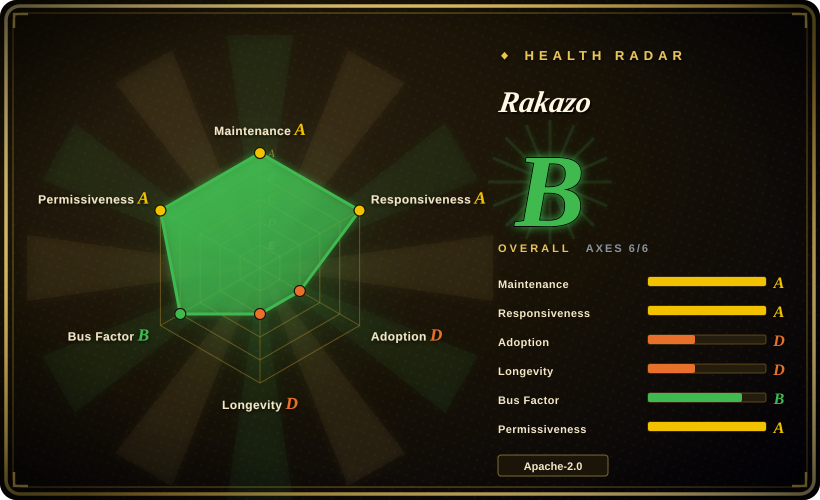
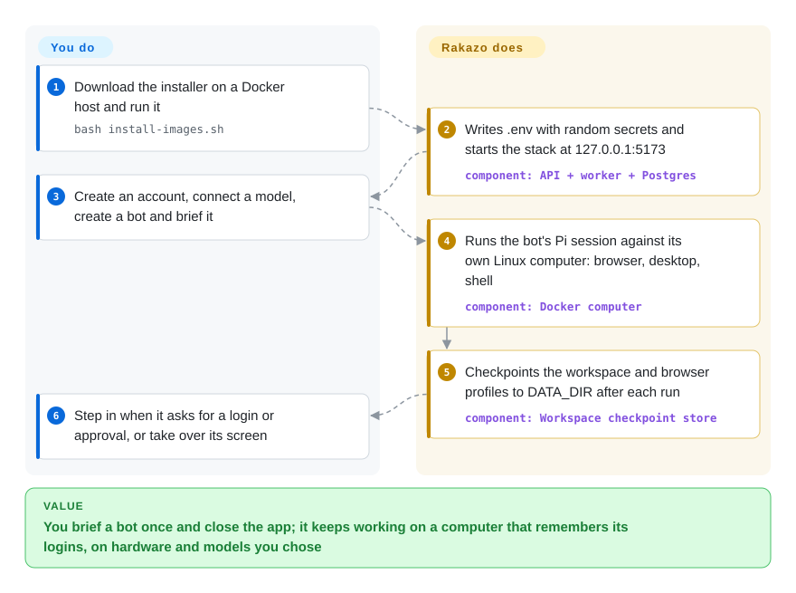

# Rakazo

You give an AI agent a job that takes an afternoon — log into three sites, collect the numbers, drop a spreadsheet in the shared folder — and it dies with the chat tab, forgets the logins by tomorrow, and the hosted products that keep it alive (xAI's Grok Bot) tie you to their subscription and their cloud computer. Rakazo is a self-hosted server that keeps each bot alive for you: one long-lived thread, memory, scheduled routines and a Linux computer with a real browser per bot, running on your Docker host or a sandbox provider you pick, with any model you pick.

> **Beta, and the bot acts freely inside its computer.** Shell, file writes and browser/desktop clicks are exempt from approval by design (`packages/core/src/action-approval.ts`, read 2026-09-30); approval gates only writes to external destinations, secrets, deletions and cloud-agent launches. The container is the security boundary — see When NOT to use.

## When to use

You run a small team (or just yourself) and want the "AI teammate" product shape — a named bot you brief once, that works in the background on its own computer and comes back when it needs a login, a judgment call or approval — but you cannot or will not put that on xAI's Grok Bot: you want to pick the model yourself (a local one included), the computers and data on your own host, or no per-seat subscription. You pick Rakazo over [OpenMuse](openmuse.md) because nothing hosted is required to start (OpenMuse will not boot without a CopilotKit cloud key; Rakazo boots with Postgres and Docker and a model connected in the UI), and because it is built for several bots sharing a Team Computer, each with its own desktop and Chrome profile, rather than one owner's errands. You pick it over [OpenClaw](openclaw.md) or [Hermes Agent](hermes-agent.md) when the deciding feature is the durable graphical computer (screen you can watch and take over, browser logins that survive restarts, a workspace checkpointed off the machine) rather than reaching you across many chat apps or a self-improving skill loop.

## How it works

Rakazo is the part that stays up: an API, a Graphile Worker job runner and Postgres hold every bot's thread, memory, routines and integration credentials, and a web / Electron / Expo client talks to that one API. When a bot runs, one agent session of [Pi](../../coding-agents/terminal-agents/pi.md) — a TypeScript agent loop that calls whatever model you connected — runs inside the API/worker process, not inside the sandbox; its tools reach through a `SandboxProvider` boundary to a computer. By default that computer is a Docker container on your host with a Linux desktop, per-bot Chrome profiles and a terminal; E2B, Daytona, CreateOS or Box can replace it, and Rakazo copies the bot's workspace and browser profiles back to its own `DATA_DIR` at the end of every run so the machine itself is disposable — like a laptop whose home folder is backed up every evening, so a dead laptop costs you nothing but the reinstall. You provide the host, the secrets, a model credential and any integrations (Composio / Pipedream / MCP / OpenAPI); you then brief bots in plain language and step in when one asks for you or you want to take its screen.

<!-- flow-steps:begin (generated from flows/rakazo.json by tools/flow_card.py — do not edit) -->

Text version of the flow

1. **You**: Download the installer on a Docker host and run it — `bash install-images.sh`
2. **Rakazo**: Writes .env with random secrets and starts the stack at 127.0.0.1:5173 — component: `API + worker + Postgres`
3. **You**: Create an account, connect a model, create a bot and brief it
4. **Rakazo**: Runs the bot's Pi session against its own Linux computer: browser, desktop, shell — component: `Docker computer`
5. **Rakazo**: Checkpoints the workspace and browser profiles to DATA_DIR after each run — component: `Workspace checkpoint store`
6. **You**: Step in when it asks for a login or approval, or take over its screen

**Value**: You brief a bot once and close the app; it keeps working on a computer that remembers its logins, on hardware and models you chose

<!-- flow-steps:end -->

## When NOT to use

- **You need the agent's actions inside its computer to be reviewed.** Shell, file writes and browser/desktop actions are on the approval-exempt list; only destination writes, secret handling, deletions and cloud-agent launches stop for approval. Inside a Team Computer, bots share the OS user, workspace and X11 — the docs say folders "are not security boundaries" and to use separate computers for isolation. If each step must be reviewable, use [OpenMuse](openmuse.md) (review gate on side effects, nonroot no-network terminal) or [OpenWorker](openworker.md) (approval ladder with a per-call audit trail).
- **You would enable "This Mac" / the desktop provider on a shared server.** `SANDBOX_PROVIDER=desktop` runs bot commands on the service host as your OS account, and macOS shows no permission dialog; the docs say not to use it on a public or shared service. Keep the Docker default, or put computers on [E2B](../../../sandboxing/e2b.md) for a public multi-user deployment.
- **You want the assistant to live in your messenger.** Rakazo is its own app; Slack, Telegram and WhatsApp DMs can reach a bot, but group chats are iMessage-only and via Sendblue. If channel reach is the product, use [OpenClaw](openclaw.md).
- **You need a pinned, stable release.** Published images default to the `edge` tag built from main; the last tagged release was v0.1.6 on 2026-09-08 while main moves 37–282 commits a week, and the self-host guide says not to assume `latest` exists until a stable release. Open bug #1104 is the desktop app's bundled UI drifting from the server API. If you need upgrade stability, wait, or use [Open WebUI](../../../llm-chat-ui/open-webui.md) for a mature self-hosted chat surface without the computer.
- **You only want to chat with models.** Postgres, a worker, a sandbox supervisor and a desktop image are a lot of machine for a chat window; use [Open WebUI](../../../llm-chat-ui/open-webui.md).
- **You are building your own agent product.** Rakazo is a finished app monorepo with a product vision it defends ("routines remain scheduled prompts rather than becoming a visual workflow language"), not an SDK. Use [Pi](../../coding-agents/terminal-agents/pi.md) directly for the agent loop, or a framework like [LangChain](../../workflow-builders/langchain.md).
- **You want an agent that improves itself from experience.** Memory is stored and recalled; there is no skill-writing learning loop. Use [Hermes Agent](hermes-agent.md).

## Comparison

| Alternative | In index | Our verdict | Tradeoff |
| --- | --- | --- | --- |
| Grok Bot (xAI) | not a repo | If you want the persistent-teammate product with zero ops and are fine with xAI’s subscription and model lineup, pay for Grok Bot; pick Rakazo when model choice or where the computers and data live is the requirement. | Closed hosted product bundled with SuperGrok Heavy / Cursor Ultra; you trade xAI's managed cloud computer (logins shared by all your bots) for running Postgres, Docker and upgrades yourself. |
| [OpenMuse](openmuse.md) | ✅ | For one owner delegating errands behind a review gate, pick OpenMuse; pick Rakazo when you need several bots on a shared computer with a graphical desktop and no hosted dependency to boot. | OpenMuse's terminal is nonroot and network-less but it requires a CopilotKit cloud key; Rakazo needs nothing hosted but lets bots act freely inside their container. |
| [OpenClaw](openclaw.md) | ✅ | When the assistant must answer you inside WhatsApp, Telegram and a dozen other channels, pick OpenClaw; pick Rakazo when the bot's own durable desktop and browser are the point. | OpenClaw is messaging-first with a far larger community; Rakazo is app-first with fewer channels but a checkpointed computer per bot. |
| [OpenWorker](openworker.md) | ✅ | When a single user wants a desktop coworker whose every call is approved and audited, pick OpenWorker; pick Rakazo for a server that keeps multiple bots and routines running after you close the laptop. | OpenWorker is local desktop-first with stronger approval provenance; Rakazo is server-first with web, desktop and mobile clients but coarser approval scope. |
| [Hermes Agent](hermes-agent.md) | ✅ | When you want an agent that writes its own skills and runs on a $5 VPS, pick Hermes; pick Rakazo when you want a graphical computer and a team-facing UI out of the box. | Hermes is light and framework-shaped; Rakazo is heavy (Postgres, worker, desktop image) and product-shaped. |

## Tech stack

- **TypeScript** pnpm/Turborepo monorepo, Node 22.22.2+ / 24 / 26+, Biome, Vitest, Playwright
- **`apps/api`** — Hono + oRPC; Better Auth; Prisma over PostgreSQL 16; **`apps/worker`** — Graphile Worker (Postgres LISTEN/NOTIFY jobs)
- **Agent runtime** — Pi (`@earendil-works/pi-agent-core`, `@earendil-works/pi-ai` 0.87.1) in-process in API/worker
- **Clients** — React 19 + Vite + Tailwind web app, Electron desktop, Expo mobile; Lingui i18n (9 web locales)
- **Computers** — `ghcr.io/elie222/rakazo/computer` Linux desktop image (X display + Chromium per active bot, CDP on container loopback, `uv`, `gh`), a sandbox supervisor; adapters for E2B, Daytona, CreateOS, Box
- **Integrations** — Composio, Pipedream Connect, remote MCP, OpenAPI, Treg; voice via ElevenLabs / OpenAI / Cartesia / Fish Audio

## Dependencies

- Docker Engine 26+ with the Compose plugin, curl and OpenSSL for the published-images install; Node + pnpm 9 only for a source checkout.
- PostgreSQL (bundled in Compose) and a persistent, backed-up `DATA_DIR` volume — it holds every bot's checkpointed workspace and browser profiles.
- A model credential: an OpenRouter key or a provider connected in the UI (the changelog adds ChatGPT, GitHub Copilot and SuperGrok sign-ins).
- Optional paid services: E2B / Daytona / CreateOS / Box for remote computers, Composio or Pipedream for managed app catalogs, Treg (usage-metered), TypeSafe Jev for auto review, a voice provider key, Sendblue for iMessage.
- An always-on host if bots and routines should keep running; HTTPS reverse proxy (Caddy recipe provided) for anything beyond loopback.

## Ops difficulty

**Medium-high.** The installer is one `curl … install-images.sh` and generates secrets, so a laptop demo is quick. Running it for real means a host that stays up, TLS in front of port 5173 with three public origins set consistently, a sandbox supervisor token, an encrypted and off-host-backed `DATA_DIR` (the docs require it), `scripts/backup.sh` for Postgres plus data, and optionally the provided egress-restriction and host-hardening scripts. Day 2 is tracking `edge`: there is no stable release line yet, and a desktop app build can drift from a newer server API (#1104).

## Health & viability

- **Maintenance (2026-09-30)**: very active — pushed today; weekly commit counts over the last seven weeks run 37–282; 727 merged PRs and 172 issues in seven weeks; tagged releases v0.1.0–v0.1.6 came in one burst on 2026-09-03…08 and nothing since, so users follow `edge`.
- **Governance / bus factor**: a personal repo (`elie222`, a User account, not an org). Elie Steinbock holds 465 commits, then `cursoragent` 169 and a long tail (92, 32, 29 …). The roadmap is one person's; a large share of commits is AI-agent-authored.
- **Backing & longevity**: the author also runs Inbox Zero (`elie222/inbox-zero`, 12.4k stars, active since 2023-07), which shows a record of sustaining an open-source product with a hosted offering; rakazo.com points the same way. Age 7 weeks (created 2026-08-13): no Lindy signal, and it was launched as the open alternative two days after xAI's Grok Bot (2026-08-11), so its relevance tracks that product category.
- **Adoption**: 3,131 stars / 544 forks / 21 watchers in seven weeks (2026-09-30); a Discord community; external contributors are real but small.
- **Risk flags**: Apache-2.0, no CLA file found; self-labeled beta; the managed Rakazo service creates an open-core incentive that the repo's `VISION.md` explicitly forbids from becoming a hidden dependency [推断: stated policy, not yet tested over time]; the permissive in-computer action policy is a deliberate design choice, not a bug.

## Caveats (unverified)

- [未验证] Product behavior overall: this page is from the README, `VISION.md`, `CHANGELOG.md`, `docs/computer-runtime.md`, `docs/self-host.md`, `CONTRIBUTING.md`, `SECURITY.md`, `.env.example`, `package.json` and `packages/core/src/action-approval.ts` at commit `6c73181` — I did not install or run Rakazo.
- [未验证] Browser-login sharing: `VISION.md` (last changed 2026-09-04) says Team Computers share a persisted browser identity, while `docs/computer-runtime.md` (2026-09-28) and the Box section of the self-host guide say every bot has its own profile and logins are not shared. This page follows the newer docs; check your version.
- [未验证] How the approval-exempt list interacts with user-defined approval rules (`ActionApprovalRule`) in practice — I read the built-in sets only.
- [未验证] Grok Bot's features and pricing (shared cloud computer, bundling with SuperGrok Heavy / Cursor Ultra, 2026-08-11 launch) are from third-party write-ups found by web search, not from xAI's own pricing page.
- [推断] The star count reflects launch attention around Grok Bot rather than production deployments; I found no public list of operators.
- [未验证] Whether a `latest` image tag exists on GHCR now; the self-host guide says not to assume it, and the compose files default to `edge`.
