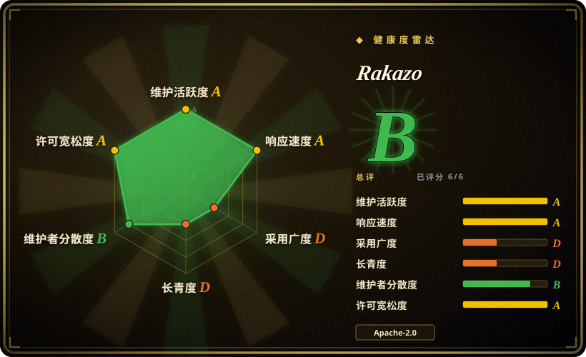
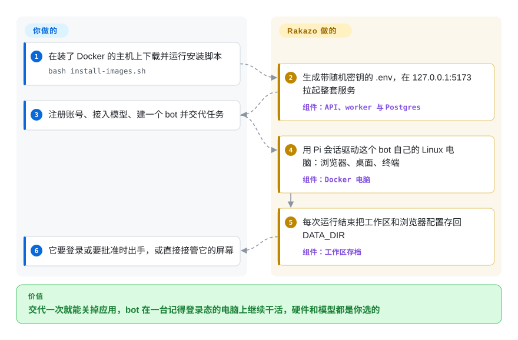

# Rakazo

你交给 AI 一件要干一下午的活——登三个网站、抄下数字、把表格放进共享文件夹——结果聊天页一关它就没了，第二天登录态也丢了；能让它一直活着的托管产品（xAI 的 Grok Bot）又把你绑在它的订阅和它的云电脑上。Rakazo 是一个自己部署的服务端，替你把每个 bot 养着：一条长期对话、记忆、定时任务，外加一台带真浏览器的 Linux 电脑，电脑跑在你的 Docker 主机或你选的沙箱服务上，模型也由你选。

> **还是 beta，而且 bot 在自己电脑里动手不用审批。** 执行命令、写文件、点浏览器和桌面都在免审批清单里（`packages/core/src/action-approval.ts`，2026-09-30 读过）；审批只拦往外部目标写入、处理密钥、删除和启动云端 agent。安全边界是容器本身，见“何时不用”。

## 何时使用

你带一个小团队（或者就你一个人），想要“AI 同事”这种产品形态：给 bot 起个名字、交代一次，它在自己的电脑上后台干活，需要登录、需要拍板或需要批准时再回来找你。但你不能或不愿用 xAI 的 Grok Bot：你想自己挑模型（包括本地模型），想让电脑和数据留在自己的机器上，或者不想按席位付订阅。选 Rakazo 而不是 [OpenMuse](openmuse.zh.md)，是因为它启动时不依赖任何托管服务（OpenMuse 没有 CopilotKit 云端 key 就起不来；Rakazo 有 Postgres 和 Docker、在界面里接一个模型就能跑），而且它是为多个 bot 共用一台团队电脑、各自有独立桌面和 Chrome 配置设计的，不是一个人的跑腿助手。选它而不是 [OpenClaw](openclaw.zh.md) 或 [Hermes Agent](hermes-agent.zh.md)，是当你看重的是那台持久的图形电脑——屏幕能看、能接管，浏览器登录态重启后还在，工作区会备份到机器之外——而不是在一堆聊天软件里找到你，或者自己长技能的学习循环。

## 怎么用起来

Rakazo 是那个一直在线的部分：API、Graphile Worker 任务进程和 Postgres 保存每个 bot 的对话、记忆、定时任务和集成凭据，网页端、Electron 桌面端和 Expo 手机端都连同一个 API。bot 干活时，API/worker 进程里起一个 [Pi](../../coding-agents/terminal-agents/pi.zh.md) 会话——Pi 是一个 TypeScript 写的 agent 循环，调用你接入的任意模型——它不在沙箱里跑，而是通过一层叫 `SandboxProvider` 的接口去操作一台电脑。默认这台电脑是你主机上的一个 Docker 容器，里面有 Linux 桌面、每个 bot 各自的 Chrome 配置和终端；也可以换成 E2B、Daytona、CreateOS 或 Box。每次运行结束，Rakazo 把 bot 的工作区和浏览器配置拷回自己的 `DATA_DIR`，所以机器本身随时可以扔——就像一台每晚都备份了主目录的笔记本，坏了只需要重装。你负责提供主机、密钥、模型凭据和要接的集成（Composio / Pipedream / MCP / OpenAPI）；之后就是用大白话给 bot 派活，它来找你或你想接管它的屏幕时再出手。

<!-- flow-steps:begin (generated from flows/rakazo.json by tools/flow_card.py — do not edit) -->

流程文字版

1. **你**：在装了 Docker 的主机上下载并运行安装脚本 — `bash install-images.sh`
2. **Rakazo**：生成带随机密钥的 .env，在 127.0.0.1:5173 拉起整套服务 — 组件：`API、worker 与 Postgres`
3. **你**：注册账号、接入模型、建一个 bot 并交代任务
4. **Rakazo**：用 Pi 会话驱动这个 bot 自己的 Linux 电脑：浏览器、桌面、终端 — 组件：`Docker 电脑`
5. **Rakazo**：每次运行结束把工作区和浏览器配置存回 DATA_DIR — 组件：`工作区存档`
6. **你**：它要登录或要批准时出手，或直接接管它的屏幕

**价值**：交代一次就能关掉应用，bot 在一台记得登录态的电脑上继续干活，硬件和模型都是你选的

<!-- flow-steps:end -->

## 何时不用

- **你要求 bot 在电脑里的每一步都经过审核。** 执行命令、写文件、浏览器和桌面操作都在免审批清单里；只有往外部目标写入、处理密钥、删除和启动云端 agent 才停下等批准。团队电脑里的 bot 共用同一个系统用户、工作区和 X11，文档原话是这些文件夹“不是安全边界”，要隔离就用不同电脑。每一步都要能审，请用 [OpenMuse](openmuse.zh.md)（副作用有审批门，终端非 root、无网络）或 [OpenWorker](openworker.zh.md)（分级授权加逐次调用审计）。
- **你打算在共享服务器上打开“This Mac”/desktop 模式。** `SANDBOX_PROVIDER=desktop` 会用你的系统账号在服务主机上直接跑 bot 的命令，macOS 也不会弹权限框；文档明确说不要在公开或共享的服务上开。保持默认的 Docker，公开的多用户部署把电脑放到 [E2B](../../../sandboxing/e2b.zh.md) 上。
- **你想让助手住在你的聊天软件里。** Rakazo 是一个独立应用；Slack、Telegram、WhatsApp 私聊可以找到 bot，但群聊只支持 iMessage，而且要走 Sendblue。聊天渠道覆盖面才是重点的话，用 [OpenClaw](openclaw.zh.md)。
- **你需要锁定一个稳定版本。** 官方镜像默认是从 main 构建的 `edge` 标签；最后一个打了 tag 的版本是 2026-09-08 的 v0.1.6，而 main 每周有 37–282 个提交，部署文档也说在稳定版出来前不要假定有 `latest`。还开着的 #1104 就是桌面端内置界面和服务端 API 对不上。要升级稳定，先等等；只要成熟的自托管聊天界面、不需要电脑的话，用 [Open WebUI](../../../llm-chat-ui/open-webui.zh.md)。
- **你只想和模型聊天。** 为了一个聊天窗口起 Postgres、worker、沙箱 supervisor 和桌面镜像太重了，用 [Open WebUI](../../../llm-chat-ui/open-webui.zh.md)。
- **你在做自己的 agent 产品。** Rakazo 是一个成品应用仓库，还带着一份它会坚守的产品愿景（“定时任务就是定时的提示词，不会变成可视化工作流语言”），不是 SDK。agent 循环直接用 [Pi](../../coding-agents/terminal-agents/pi.zh.md)，或用 [LangChain](../../workflow-builders/langchain.zh.md) 这类框架。
- **你想要一个从经验里自我改进的 agent。** 这里的记忆只是存和取，没有自动写技能的学习循环，用 [Hermes Agent](hermes-agent.zh.md)。

## 横向对比

| 替代品 | 是否收录 | 我们的评价 | 取舍 |
| --- | --- | --- | --- |
| Grok Bot（xAI） | 非仓库 | 想要“持久 AI 同事”又完全不想运维、接受 xAI 的订阅和模型阵容，就付费用 Grok Bot；模型要自己选、电脑和数据要放在自己手里时选 Rakazo。 | 闭源托管产品，随 SuperGrok Heavy / Cursor Ultra 提供；你放弃 xAI 托管的云电脑（所有 bot 共用登录态），换来自己运维 Postgres、Docker 和升级。 |
| [OpenMuse](openmuse.zh.md) | ✅ | 一个人把跑腿活委派出去、每个副作用都要审，选 OpenMuse；要多个 bot 共用一台带图形桌面的电脑、启动不依赖任何托管服务，选 Rakazo。 | OpenMuse 的终端非 root、无网络，但必须有 CopilotKit 云端 key；Rakazo 什么托管服务都不需要，但 bot 在容器里可以自由动手。 |
| [OpenClaw](openclaw.zh.md) | ✅ | 助手必须在 WhatsApp、Telegram 等十几个渠道里回你，选 OpenClaw；bot 自己那台持久的桌面和浏览器才是重点时，选 Rakazo。 | OpenClaw 以消息渠道为先、社区大得多；Rakazo 以应用为先、渠道少，但每个 bot 有一台会备份的电脑。 |
| [OpenWorker](openworker.zh.md) | ✅ | 单个用户要一个每次调用都审批、都留审计的桌面同事，选 OpenWorker；要一台合上笔记本后还在跑多个 bot 和定时任务的服务端，选 Rakazo。 | OpenWorker 以本地桌面为先、审批溯源更强；Rakazo 以服务端为先、网页桌面手机三端都有，但审批范围更粗。 |
| [Hermes Agent](hermes-agent.zh.md) | ✅ | 要一个会自己写技能、5 美元 VPS 就能跑的 agent，选 Hermes；要开箱即用的图形电脑和面向团队的界面，选 Rakazo。 | Hermes 轻、偏框架形态；Rakazo 重（Postgres、worker、桌面镜像）、偏产品形态。 |

## 技术栈

- **TypeScript** pnpm/Turborepo 单仓，Node 22.22.2+ / 24 / 26+，Biome、Vitest、Playwright
- **`apps/api`**：Hono + oRPC；Better Auth；Prisma + PostgreSQL 16；**`apps/worker`**：Graphile Worker（基于 Postgres LISTEN/NOTIFY 的任务队列）
- **agent 运行时**：Pi（`@earendil-works/pi-agent-core`、`@earendil-works/pi-ai` 0.87.1），在 API/worker 进程内运行
- **客户端**：React 19 + Vite + Tailwind 网页端、Electron 桌面端、Expo 手机端；Lingui 多语言（网页端 9 种）
- **电脑**：`ghcr.io/elie222/rakazo/computer` Linux 桌面镜像（每个活跃 bot 一个 X display 加 Chromium，CDP 只绑容器回环地址，内置 `uv`、`gh`），外加一个沙箱 supervisor；E2B、Daytona、CreateOS、Box 适配器
- **集成**：Composio、Pipedream Connect、远程 MCP、OpenAPI、Treg；语音接 ElevenLabs / OpenAI / Cartesia / Fish Audio

## 依赖

- 用官方镜像安装需要 Docker Engine 26+ 和 Compose 插件、curl、OpenSSL；只有从源码跑才需要 Node 和 pnpm 9。
- PostgreSQL（Compose 已自带）和一个持久、有备份的 `DATA_DIR` 卷——所有 bot 备份下来的工作区和浏览器配置都在里面。
- 一个模型凭据：OpenRouter key，或在界面里接入的模型服务（更新日志新增了 ChatGPT、GitHub Copilot、SuperGrok 登录）。
- 可选的付费服务：远程电脑用 E2B / Daytona / CreateOS / Box，托管应用目录用 Composio 或 Pipedream，Treg（按量计费），自动审核用 TypeSafe Jev，语音服务 key，iMessage 用 Sendblue。
- 想让 bot 和定时任务一直跑，就要一台常开的主机；对外访问要在前面加 HTTPS 反向代理（文档给了 Caddy 配置）。

## 运维难度

**中高。** 安装只要一条 `curl … install-images.sh`，密钥也自动生成，所以在笔记本上跑个演示很快。真要长期用，就得有一台常开的主机、5173 端口前面加 TLS 且三个公开 origin 配成一致、一个沙箱 supervisor token、一个加密并异地备份的 `DATA_DIR`（文档要求）、用 `scripts/backup.sh` 备份 Postgres 和数据，还可以选用它提供的出网限制和主机加固脚本。日常就是跟着 `edge` 走：还没有稳定版线，桌面端版本也可能和更新过的服务端 API 对不上（#1104）。

## 健康度与可持续性

- **维护（2026-09-30）**：非常活跃——今天还有推送；最近七周每周提交 37–282 个；七周内合并 727 个 PR、172 个 issue；打了 tag 的版本 v0.1.0–v0.1.6 集中在 2026-09-03…08 发出，之后再没有，所以用户实际跟的是 `edge`。
- **治理与巴士系数**：个人仓库（`elie222` 是 User 账号，不是组织）。Elie Steinbock 有 465 个提交，其次是 `cursoragent` 169 个，再往后是长尾（92、32、29……）。路线图由一个人定；相当一部分提交是 AI agent 写的。
- **背书与长期性**：作者还在做 Inbox Zero（`elie222/inbox-zero`，1.24 万星，2023-07 起一直活跃），说明他有持续维护一个带托管版的开源产品的记录；rakazo.com 看起来走的是同一条路。项目年龄 7 周（2026-08-13 创建）：没有林迪效应可言，而且它是在 xAI 发布 Grok Bot（2026-08-11）两天后作为开源替代发布的，热度跟着这个产品类别走。
- **采用度**：七周 3,131 星、544 fork、21 个 watcher（2026-09-30）；有 Discord 社区；外部贡献者真实存在但不多。
- **风险信号**：Apache-2.0，没找到 CLA 文件；自称 beta；托管版 Rakazo 带来开源内核的商业动机，仓库的 `VISION.md` 明确规定它不能变成自托管版的隐藏依赖 [推断：这是写下来的原则，还没经过时间检验]；电脑内操作免审批是有意的设计，不是 bug。

## 存疑（未验证）

- [未验证] 产品整体行为：本页依据 README、`VISION.md`、`CHANGELOG.md`、`docs/computer-runtime.md`、`docs/self-host.md`、`CONTRIBUTING.md`、`SECURITY.md`、`.env.example`、`package.json` 和 `packages/core/src/action-approval.ts`（提交 `6c73181`），没有安装或运行 Rakazo。
- [未验证] 浏览器登录是否共享：`VISION.md`（最后修改 2026-09-04）说团队电脑共享一个持久的浏览器身份，而 `docs/computer-runtime.md`（2026-09-28）和部署文档的 Box 一节都说每个 bot 有自己的配置、登录态不共享。本页按较新的文档写，实际以你部署的版本为准。
- [未验证] 免审批清单和用户自定义审批规则（`ActionApprovalRule`）实际怎么叠加——只读了内置的几组清单。
- [未验证] Grok Bot 的功能和价格（共享云电脑、随 SuperGrok Heavy / Cursor Ultra 提供、2026-08-11 发布）来自网络搜索到的第三方文章，不是 xAI 自己的价格页。
- [推断] 星数反映的是 Grok Bot 前后的发布热度，而不是生产部署量；没找到公开的使用者名单。
- [未验证] GHCR 上现在有没有 `latest` 镜像标签；部署文档说不要假定有，Compose 文件默认用 `edge`。
