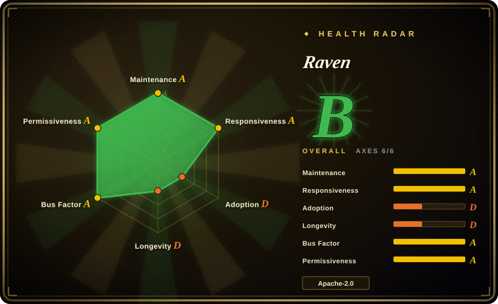
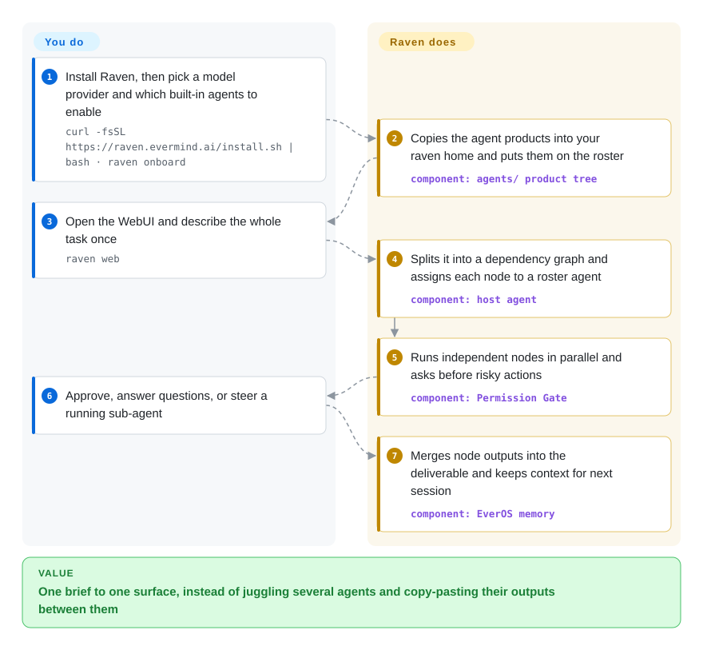

# Raven

A big job — research a topic, build the thing, then make the slides — ends up spread across Claude Code in one terminal, Codex in another and a chatbot in a browser tab, with you copying each one's output into the next. Raven is one assistant you hand the whole brief to: it splits the job into a graph of sub-tasks, sends each to its own built-in agents or to the coding agents you already use, and remembers the context between sessions.

> **Pre-alpha, four months old (repo created 2026-05-21).** The README says interfaces and configuration may change quickly; the command sandbox is off by default and an open issue (#796, 2026-09-25) reports DAG nodes running shell commands on the host even with the sandbox enabled. See When NOT to use.

## When to use

You are a researcher or a one-person product team, and your work is multi-disciplinary: this week it is "survey the literature on X, prototype it, run the overnight experiments, and hand me a deck". You already pay for Claude Code or Codex, and the pain is the glue — you spawn one agent, wait, paste its report into the next one's prompt, and when you come back tomorrow nobody remembers what was decided. You reach for Raven when you want a **host agent**: one surface (WebUI, terminal UI or an IM channel) that turns the brief into a DAG — a task graph in which each node waits only for the nodes it depends on — and dispatches nodes to its shipped specialists (Raven-Research, Raven-Code, Raven-Design, Raven-Oncall) or to 13 preset third-party agents over ACP (the Agent Client Protocol), a CLI, or an OpenAI-compatible API.

You pick it over [Hermes Agent](hermes-agent.md) or [OpenClaw](openclaw.md) when the deciding need is **orchestrating other agents and domain specialists** rather than being one chat assistant that lives in your messaging apps; over [oh-my-claudecode](../../coding-agents/orchestration-and-review/oh-my-claudecode.md) when the work is not only code (research reports, `.pptx` decks, unattended experiment runs); and over [AgentScope](../agent-sdks/agentscope.md) when you want a finished app to talk to, not a library to program a multi-agent system in.

## How it works

Raven is a Python host process — forked from nanobot's agent runtime, with a terminal UI taken from Hermes Agent — that you install with a one-line script and drive from a local web page. You do three things: pick a model provider, choose which of the shipped agent products to enable (each can run on the model it was tuned for with its own key, or borrow the host's), and describe the work. Raven does the rest: its model decides whether to answer directly, `spawn` one sub-agent, or submit a DAG; it checks the graph, runs independent nodes at the same time and pipes each node's output into the nodes that depend on it — like a site foreman who hands the plumber and the electrician their jobs and only calls the painter when both are done. Every tool call passes a Permission Gate first: built-in rules deny catastrophic commands, then your rules, then the mode — `ask` you, `smart` (the default: a second model reviews and either allows or escalates to you), or `full`. Memory comes from the bundled EverOS plugin, which recalls user and agent context in later sessions. The "self-evolving" parts are separate: the Evolver (a benchmark-driven loop that tests harness patches against a baseline) and the Curator (rewrites an agent's planning, tools and checks round by round) ship in the repository, not in the installed package, and the Curator is labeled experimental.

<!-- flow-steps:begin (generated from flows/raven.json by tools/flow_card.py — do not edit) -->

Text version of the flow

1. **You**: Install Raven, then pick a model provider and which built-in agents to enable — `curl -fsSL https://raven.evermind.ai/install.sh | bash · raven onboard`
2. **Raven**: Copies the agent products into your raven home and puts them on the roster — component: `agents/ product tree`
3. **You**: Open the WebUI and describe the whole task once — `raven web`
4. **Raven**: Splits it into a dependency graph and assigns each node to a roster agent — component: `host agent`
5. **Raven**: Runs independent nodes in parallel and asks before risky actions — component: `Permission Gate`
6. **You**: Approve, answer questions, or steer a running sub-agent
7. **Raven**: Merges node outputs into the deliverable and keeps context for next session — component: `EverOS memory`

**Value**: One brief to one surface, instead of juggling several agents and copy-pasting their outputs between them

<!-- flow-steps:end -->

## When NOT to use

- **You need commands isolated from your machine by default.** The sandbox (`tools.sandbox.backend`) defaults to `"none"`, which runs shell commands on the host; the Boxlite microVM backend is an optional extra you install and switch on. Worse, open issue #796 (2026-09-25, v0.2.1) reports that DAG nodes build their shell tool on the host executor even when Boxlite is configured — only the `spawn` path gets the VM — and #798 reports the same for `raven playbook run`. Until those close, if isolation is non-negotiable, use [OpenHands](../../coding-agents/orchestration-and-review/openhands.md), whose tasks execute in a Docker sandbox from the start.
- **You need a durable workflow engine.** The docs say it outright: DAG orchestration is "orchestration inside a Raven host, not a durable distributed workflow service", and parallel nodes do not get separate worktrees or file locks. For retried, persisted, cross-machine workflows use [Temporal](../../../workflow-orchestration/temporal.md) and call agents from its activities.
- **You want one assistant that lives in your messaging apps.** Raven has IM channels (Telegram, Slack, Discord, Feishu, WeCom, DingTalk, QQ and more as extras), but its weight is in orchestration, built-in specialists and a WebUI. If a single always-on assistant across chat apps is the job, [OpenClaw](openclaw.md) or [Hermes Agent](hermes-agent.md) is the lighter and larger-community choice.
- **You only orchestrate coding agents on one repo.** Raven's research, design and on-call products and its memory layer are overhead there; a Claude Code orchestration layer like [oh-my-claudecode](../../coding-agents/orchestration-and-review/oh-my-claudecode.md) stays inside the tool you already run.
- **You want to build your own multi-agent system in code.** Raven is an app whose extension points are agent folders, plugins and playbooks. For a library with message passing and pipelines you program against, use [AgentScope](../agent-sdks/agentscope.md) or [AutoGen](../agent-sdks/autogen.md).
- **You want the "self-evolving" feature as a stable, supported product.** The Curator is experimental and not in the installed wheel, and the Evolver README (read 2026-09-29) says its tree's retirement "is planned" pending partner sign-off. Treat self-improvement as a research preview; if you need tuning you control, run your own evaluation loop.
- **You need a stable interface to build on.** The README calls Raven pre-alpha, 19 releases shipped in three months (v0.1.0 on 2026-06-30 to v0.2.3 on 2026-09-27), and SECURITY.md says security fixes target the default branch first. Pin a version and re-test each upgrade, or wait.
- **You expect `pip install raven` to work.** The PyPI name `raven` is the old Sentry client (6.10.0); this Raven ships as a wheel on GitHub Releases installed by `install.sh` via `uv tool`. Use the installer or a source checkout, never the PyPI name.

## Comparison

| Alternative | In index | Our verdict | Tradeoff |
| --- | --- | --- | --- |
| [Hermes Agent](hermes-agent.md) | ✅ | When you want one self-improving assistant that runs cheaply on a VPS and answers across chat apps, pick Hermes Agent; pick Raven when the brief needs several specialist agents and third-party coding agents coordinated as a graph. | Hermes buys a larger community and a simpler single-agent shape; Raven buys DAG orchestration and shipped research/design/on-call agents, at the cost of a heavier, pre-alpha stack (Raven's TUI is vendored from Hermes). |
| [OpenClaw](openclaw.md) | ✅ | When channel reach and an always-on personal assistant are the requirement, pick OpenClaw; pick Raven when you want to delegate to Claude Code, Codex and its own specialists from one surface. | OpenClaw has far more users and channels; Raven integrates OpenClaw as one of its 13 third-party presets rather than competing on messaging. |
| [oh-my-claudecode](../../coding-agents/orchestration-and-review/oh-my-claudecode.md) | ✅ | When the work is code and you already live in Claude Code, pick oh-my-claudecode; pick Raven when the same job also needs research reports, decks or overnight experiment runs. | oh-my-claudecode adds staged multi-agent teams inside one CLI with no new host; Raven is a separate host app with its own model provider, memory and permission model to operate. |
| [AgentScope](../agent-sdks/agentscope.md) | ✅ | When you are building a multi-agent application in Python code, pick AgentScope; pick Raven when you want a finished app that already orchestrates agents for you. | AgentScope gives programmable message passing and a longer track record; Raven gives a ready UI, built-in agents and memory, but its internals change release to release. |
| nanobot (`HKUDS/nanobot`) | not indexed | When you want a small, readable personal-assistant runtime to study or extend, pick nanobot; pick Raven when you want its runtime already extended with orchestration, specialists and memory. | Raven forked nanobot at v0.1.5.post3 and modified it throughout (NOTICES.md); nanobot (MIT, 48.6k stars on 2026-09-29) is the leaner upstream. Not added in this tab-intake batch. |

## Tech stack

- **Host** — Python ≥3.12 package `raven` 0.2.3 (`pyproject.toml`): Typer CLI, LiteLLM for model providers, Pydantic settings, httpx/aiohttp, `mcp` client, `a2a-sdk` + protobuf for agent-to-agent calls, croniter for scheduled proactivity, LanceDB + NumPy for an embedded knowledge base and a KNN model router.
- **Lineage** — agent runtime forked from nanobot (MIT); `ui-tui/` vendored from hermes-agent including its `@hermes/ink` fork of Ink (MIT); three knowledge modules rewritten from AgentScope (Apache-2.0), all per `NOTICES.md`.
- **UIs** — a TypeScript web UI (`ui-web/`) served by `raven web`, a TypeScript terminal UI, and optional IM channel extras (Telegram, Slack, Discord, WhatsApp, Matrix, Feishu, WeCom, QQ, DingTalk, WeChat, email).
- **Agents and plugins** — `agents/` product folders (raven-code, raven-research, raven-design, raven-oncall, hidden raven-ppt) each launched over `raven acp`; `plugins-dist/` for the EverOS memory backend (pins `everos[multimodal]==1.4.1`), a design engine and a PPT engine.
- **Isolation** — optional Boxlite microVM executor (`boxlite==0.9.5`, `sandbox` extra).

## Dependencies

- Linux, macOS, WSL2 or Windows; the installer sets up `uv` and a managed Python 3.12 environment. From source: Python 3.12, `uv`, Node.js and npm. Docker Compose is an alternative (nothing on the host but Git and Docker).
- A model provider key (any LiteLLM-supported provider, or OAuth to a subscription such as Codex). Built-in agent products may ask for their own keys — Raven-Research needs its research profile credentials, and the design/PPT lanes check for image-generation and search keys.
- Optional: the third-party agents you want to orchestrate (Claude Code, Codex, OpenCode… installed and authenticated separately), IM bot credentials for channels, and the Boxlite extra for a sandbox.
- Local disk under `RAVEN_HOME` (`~/.raven`) for configuration, sessions, workspace files, logs and memory.

## Ops difficulty

**Low to install, high to run safely.** Install is one script plus `raven onboard`, and updates can be applied from the page. The real burden is everything a multi-agent host multiplies: a model key per product lane, third-party agents to install and keep authenticated, a permission mode to choose (`smart` means a model decides what you are not asked about), and a sandbox you must enable yourself — and then verify, given the open issues where DAG and playbook paths skip it. Parallel nodes can write the same files, so you have to partition work yourself. With releases every few days and pre-alpha interfaces, expect to re-check configuration after upgrades; back up `~/.raven`, which holds conversations and memory.

## Health & viability

- **Maintenance (2026-09-29)**: very active — last push the same day, 19 GitHub releases since v0.1.0 (2026-06-30), four in the last week (v0.2.0–v0.2.3), and 100–330 commits a week over the last seven weeks. 569 merged PRs and a steady stream of detailed bug reports (many filed by maintainers against themselves).
- **Governance / bus factor**: owned by the EverMind-AI organization with a spread of contributors (top: 0xKT 643 commits, arelchan 256, LivXue 204, gloryfromca 159, Handsome-wzw 121). Roadmap belongs to EverMind; no foundation, and design discussion happens in GitHub Discussions.
- **Backing & longevity**: backed by EverMind, which ships a surrounding stack (EverOS memory, 13.3k stars, created 2025-10; SkillCorpus; benchmarks). Four months old: **no Lindy signal** — it depends on one company's continued investment [推断].
- **Adoption**: 4.4k stars and 109 forks in four months, but release-asset downloads totalled ~5.2k across all releases on 2026-09-29, so actual installs are modest. The benchmark charts (SWE-bench, DataAgentBench, PresentBench, AI4AI) are self-reported by the vendor.
- **Risk flags**: Apache-2.0 with MIT-licensed fork lineage (nanobot, hermes-agent) retained in `LICENSES/`; no CLA seen. Pre-alpha interface churn; sandbox default-off and open sandbox-bypass issues (#796, #798); a PyPI name collision with Sentry's `raven`; the self-evolution Evolver tree is slated for retirement.

## Caveats (unverified)

- [未验证] Product behavior overall: this page comes from the README, `docs-site/docs/` (quick-start, orchestration, permissions, sandbox, self-hosting, agent-integrations), `agents/README.md`, `evolver/README.md`, `NOTICES.md`, `pyproject.toml`, `plugins-dist/everos-memory/pyproject.toml`, `install.sh`, `SECURITY.md`, releases, issues and the GitHub API — Raven was not installed or run.
- [未验证] Benchmark claims (SOTA on DataAgentBench, PresentBench, coding and research benchmarks; "outperforms Claude Code" on AI4AI/AI4S) are vendor charts; the AI4S benchmark is internal and none were reproduced here.
- [未验证] Showcase claims (a 4-day autonomous Godot game, 172 nanochat training runs "without a single crash") come from the README and could not be checked without rerunning them.
- [未验证] Whether issues #796 and #798 (DAG / playbook nodes bypassing the sandbox) are fixed after 2026-09-29; both were open when read.
- [未验证] How much of the EverOS memory stays local: EverOS describes itself as local-first, but its model/embedding calls and data paths were not traced.
- [推断] Long-term viability depends on EverMind's commercial priorities; the company's funding and roadmap were not checked.
- [推断] ~5.2k release-asset downloads across all 19 releases (each upgrade re-downloads a wheel) suggests an installed base in the low thousands at most, smaller than the star count implies; source checkouts and Docker installs are not counted in that number.
- [推断] nanobot's tradeoffs in the Comparison come from `NOTICES.md` and its GitHub metadata only; it was not researched in this tab-intake batch.
