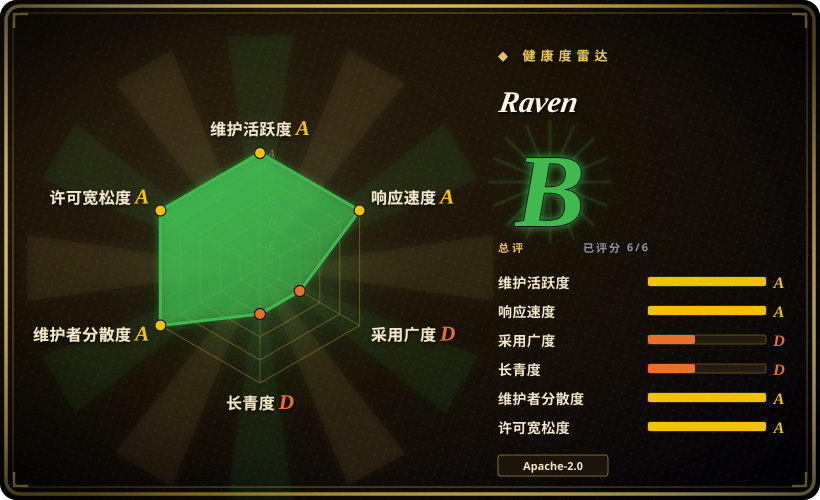
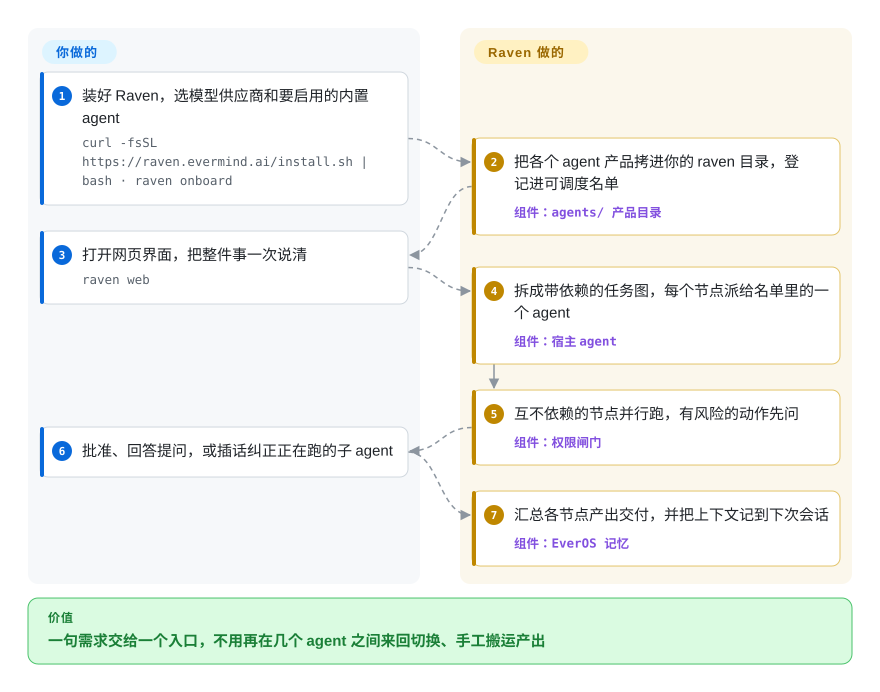

# Raven

一件大活——先调研，再做出东西，最后出一套幻灯片——往往被拆在一个终端里的 Claude Code、另一个终端里的 Codex 和浏览器里的聊天机器人之间，你负责把上一个的产出复制粘贴给下一个。Raven 是一个能接下整份需求的助手：它把活拆成一张子任务图，分给自带的专项 agent 或你已经在用的编程 agent，并在会话之间记住上下文。

> **预览前版本（pre-alpha），仓库才四个月大（2026-05-21 创建）。** README 明说接口和配置可能快速变化；命令沙箱默认关闭，且未关闭的 issue #796（2026-09-25）报告：即使开了沙箱，任务图节点里的 shell 命令仍直接在宿主机上执行。详见“何时不用”。

## 何时使用

你是研究者或一人产品团队，手上的活跨好几个领域：这周是“调研一下 X 的文献，做个原型，跑一晚上实验，再给我一套汇报幻灯片”。你已经在付 Claude Code 或 Codex 的钱，痛点在衔接：开一个 agent、等它、把它的报告贴进下一个的提示词；第二天回来，谁也不记得昨天定了什么。这时你要的是一个**宿主 agent**：一个入口（网页界面、终端界面或 IM 频道），把需求变成一张 DAG——任务依赖图，每个节点只等它依赖的那几个节点——再把节点派给自带的专项 agent（Raven-Research、Raven-Code、Raven-Design、Raven-Oncall），或者通过 ACP（Agent Client Protocol，agent 客户端协议）、命令行、OpenAI 兼容接口派给 13 个预置的第三方 agent。

决定性的取舍是：如果你要的是**调度别的 agent 和领域专项 agent**，而不是一个住在聊天软件里的单体助手，选它而不选 [Hermes Agent](hermes-agent.zh.md) 或 [OpenClaw](openclaw.zh.md)；如果活不只是写代码（调研报告、`.pptx` 幻灯片、无人值守的实验），选它而不选 [oh-my-claudecode](../../coding-agents/orchestration-and-review/oh-my-claudecode.zh.md)；如果你要的是一个拿来就能对话的成品应用，而不是一个自己编程搭多 agent 系统的库，选它而不选 [AgentScope](../agent-sdks/agentscope.zh.md)。

## 怎么用起来

Raven 是一个 Python 宿主进程——agent 运行时从 nanobot 分叉而来，终端界面取自 Hermes Agent——用一行脚本安装，在本机网页里操作。你只做三件事：选模型供应商；决定启用哪些自带的 agent 产品（每个产品可以用它调优过的模型配自己的 key，也可以借用宿主的模型）；描述要做的事。剩下的归 Raven：它的模型决定是直接回答、`spawn` 一个子 agent，还是提交一张 DAG；它校验这张图，让互不依赖的节点同时跑，再把每个节点的产出喂给依赖它的节点——像工地的工头，先把水管工和电工派出去，两边都完工了才叫油漆工进场。每次工具调用先过权限闸门（Permission Gate）：内置规则拦掉灾难级命令，然后是你的规则，最后看模式——`ask` 问你、`smart`（默认：另一个模型审核，放行或升级给你）、`full` 直接执行。记忆来自捆绑的 EverOS 插件，在之后的会话里召回用户和 agent 的上下文。“自我进化”那部分是分开的：Evolver（一个按基准测试检验框架补丁、跟基线比较的循环）和 Curator（一轮轮改写某个 agent 的规划、工具和检查）都只在仓库里，不在安装包里，Curator 还标着实验性。

<!-- flow-steps:begin (generated from flows/raven.json by tools/flow_card.py — do not edit) -->

流程文字版

1. **你**：装好 Raven，选模型供应商和要启用的内置 agent — `curl -fsSL https://raven.evermind.ai/install.sh | bash · raven onboard`
2. **Raven**：把各个 agent 产品拷进你的 raven 目录，登记进可调度名单 — 组件：`agents/ 产品目录`
3. **你**：打开网页界面，把整件事一次说清 — `raven web`
4. **Raven**：拆成带依赖的任务图，每个节点派给名单里的一个 agent — 组件：`宿主 agent`
5. **Raven**：互不依赖的节点并行跑，有风险的动作先问 — 组件：`权限闸门`
6. **你**：批准、回答提问，或插话纠正正在跑的子 agent
7. **Raven**：汇总各节点产出交付，并把上下文记到下次会话 — 组件：`EverOS 记忆`

**价值**：一句需求交给一个入口，不用再在几个 agent 之间来回切换、手工搬运产出

<!-- flow-steps:end -->

## 何时不用

- **你要求命令默认就与本机隔离。** 沙箱配置 `tools.sandbox.backend` 默认是 `"none"`，即 shell 命令直接在宿主机上跑；Boxlite 微虚拟机后端是要你另装、另开的可选项。更糟的是，未关闭的 issue #796（2026-09-25，v0.2.1）报告：即使配置了 Boxlite，DAG 节点的 shell 工具仍用宿主机执行器——只有 `spawn` 路径进了虚拟机；#798 报告 `raven playbook run` 也一样。在这两个问题关闭前，如果隔离是硬要求，用 [OpenHands](../../coding-agents/orchestration-and-review/openhands.zh.md)，它的任务从一开始就在 Docker 沙箱里执行。
- **你需要持久化的工作流引擎。** 文档原话：DAG 编排是“Raven 宿主内部的编排，不是持久化的分布式工作流服务”，并行节点也不会各自拿到独立的 worktree 或文件锁。要可重试、可持久、跨机器的工作流，用 [Temporal](../../../workflow-orchestration/temporal.zh.md)，在它的 activity 里调用 agent。
- **你只想要一个住在聊天软件里的助手。** Raven 有 IM 频道（Telegram、Slack、Discord、飞书、企业微信、钉钉、QQ 等，都是可选扩展），但它的重心在编排、自带专项 agent 和网页界面。如果要的就是一个跨聊天软件、常驻的单体助手，[OpenClaw](openclaw.zh.md) 或 [Hermes Agent](hermes-agent.zh.md) 更轻、社区也更大。
- **你只在一个仓库里调度编程 agent。** 这时 Raven 的调研、设计、值守产品和记忆层都是负担；Claude Code 上的编排层如 [oh-my-claudecode](../../coding-agents/orchestration-and-review/oh-my-claudecode.zh.md) 就待在你已经在用的工具里。
- **你要在代码里搭自己的多 agent 系统。** Raven 是一个应用，扩展点是 agent 目录、插件和 playbook。要一个可编程的消息传递、流水线库，用 [AgentScope](../agent-sdks/agentscope.zh.md) 或 [AutoGen](../agent-sdks/autogen.zh.md)。
- **你把“自我进化”当成稳定、有支持的功能。** Curator 是实验性的，不在安装包里；Evolver 的 README（2026-09-29 读）写明这棵目录树“计划退役”，只待合作方签字确认。把自我改进当研究预览看；要可控的调优，自己跑评测循环。
- **你需要一个可以在上面长期构建的稳定接口。** README 自称 pre-alpha，三个月发了 19 个版本（v0.1.0 于 2026-06-30，到 v0.2.3 于 2026-09-27），SECURITY.md 说安全修复优先落到默认分支。锁定版本、每次升级重测，或者再等等。
- **你以为 `pip install raven` 能装上。** PyPI 上的 `raven` 是 Sentry 的老客户端（6.10.0）；这个 Raven 以 GitHub Releases 上的 wheel 分发，由 `install.sh` 通过 `uv tool` 安装。用官方安装脚本或源码检出，别用 PyPI 上的同名包。

## 横向对比

| 替代品 | 是否收录 | 我们的评价 | 取舍 |
| --- | --- | --- | --- |
| [Hermes Agent](hermes-agent.zh.md) | ✅ | 如果你要一个能在廉价 VPS 上跑、跨聊天软件应答的自我改进型单体助手，选 Hermes Agent；如果需求要几个专项 agent 加第三方编程 agent 按任务图协同，选 Raven。 | Hermes 换来更大的社区和更简单的单 agent 形态；Raven 换来 DAG 编排和自带的调研、设计、值守 agent，代价是更重、仍在 pre-alpha 的技术栈（Raven 的终端界面就是从 Hermes 移植的）。 |
| [OpenClaw](openclaw.zh.md) | ✅ | 如果硬要求是频道覆盖和常驻的个人助手，选 OpenClaw；如果你要从一个入口把活分给 Claude Code、Codex 和自带专项 agent，选 Raven。 | OpenClaw 的用户和频道都多得多；Raven 把 OpenClaw 当作 13 个第三方预置之一接进来，而不是在消息渠道上跟它竞争。 |
| [oh-my-claudecode](../../coding-agents/orchestration-and-review/oh-my-claudecode.zh.md) | ✅ | 如果活就是写代码、你本来就住在 Claude Code 里，选 oh-my-claudecode；如果同一件活还要调研报告、幻灯片或通宵实验，选 Raven。 | oh-my-claudecode 在一个 CLI 里加分阶段的多 agent 团队，不引入新宿主；Raven 是独立的宿主应用，要另外维护自己的模型供应商、记忆和权限模型。 |
| [AgentScope](../agent-sdks/agentscope.zh.md) | ✅ | 如果你在用 Python 代码搭多 agent 应用，选 AgentScope；如果你要一个已经替你调度 agent 的成品应用，选 Raven。 | AgentScope 给你可编程的消息传递和更长的历史；Raven 给你现成界面、自带 agent 和记忆，但内部实现每个版本都在变。 |
| nanobot（`HKUDS/nanobot`） | 未收录 | 如果你想要一个小而易读、便于研究和扩展的个人助手运行时，选 nanobot；如果你要的是已经加上编排、专项 agent 和记忆的版本，选 Raven。 | Raven 在 v0.1.5.post3 分叉了 nanobot 并通篇改写（见 NOTICES.md）；nanobot（MIT，2026-09-29 时 4.86 万星）是更精简的上游。本批次（tab-intake）未收录。 |

## 技术栈

- **宿主**：Python ≥3.12 包 `raven` 0.2.3（`pyproject.toml`）：Typer 命令行、LiteLLM 接模型供应商、Pydantic 配置、httpx/aiohttp、`mcp` 客户端、`a2a-sdk` + protobuf 做 agent 间调用、croniter 做定时主动任务、LanceDB + NumPy 做内嵌知识库和 KNN 模型路由。
- **血缘**：agent 运行时分叉自 nanobot（MIT）；`ui-tui/` 移植自 hermes-agent，连同它对 Ink 的分叉 `@hermes/ink`（MIT）；三个知识库模块改写自 AgentScope（Apache-2.0），均见 `NOTICES.md`。
- **界面**：`raven web` 提供的 TypeScript 网页界面（`ui-web/`）、TypeScript 终端界面，以及可选的 IM 频道扩展（Telegram、Slack、Discord、WhatsApp、Matrix、飞书、企业微信、QQ、钉钉、微信、邮件）。
- **agent 与插件**：`agents/` 下的产品目录（raven-code、raven-research、raven-design、raven-oncall、隐藏的 raven-ppt），各自通过 `raven acp` 启动；`plugins-dist/` 里是 EverOS 记忆后端（锁定 `everos[multimodal]==1.4.1`）、设计引擎和 PPT 引擎。
- **隔离**：可选的 Boxlite 微虚拟机执行器（`boxlite==0.9.5`，`sandbox` 扩展）。

## 依赖

- Linux、macOS、WSL2 或 Windows；安装脚本会装好 `uv` 和托管的 Python 3.12 环境。从源码跑：Python 3.12、`uv`、Node.js 和 npm。也可以用 Docker Compose（宿主机上只需 Git 和 Docker）。
- 一个模型供应商的 key（LiteLLM 支持的任意供应商，或用 OAuth 接 Codex 这类订阅）。自带 agent 产品可能要求各自的 key——Raven-Research 需要它的调研配置凭据，设计/PPT 通道会检查图片生成和搜索 key。
- 可选：你想调度的第三方 agent（Claude Code、Codex、OpenCode……需另行安装并登录）、IM 机器人凭据、以及沙箱用的 Boxlite 扩展。
- `RAVEN_HOME`（`~/.raven`）下的本地磁盘，存配置、会话、工作区文件、日志和记忆。

## 运维难度

**装起来低，安全地跑起来高。** 安装就是一个脚本加 `raven onboard`，更新可以在网页里点。真正的负担来自多 agent 宿主把一切成倍放大：每个产品通道一份模型 key，第三方 agent 要装好并保持登录，要选权限模式（`smart` 意味着没问你的那些由一个模型替你决定），沙箱要自己开——开了还得验证，因为有未关闭的 issue 说 DAG 和 playbook 路径会绕过它。并行节点可能写同一批文件，得你自己划分。版本几天一发、接口还在 pre-alpha，升级后要重查配置；`~/.raven` 里有会话和记忆，记得备份。

## 健康度与可持续性

- **维护（2026-09-29）**：非常活跃——当天仍有推送；自 v0.1.0（2026-06-30）起共 19 个 GitHub Release，最近一周就发了四个（v0.2.0–v0.2.3）；过去七周每周 100–330 次提交。已合并 569 个 PR，bug 报告写得很细（不少是维护者自己提的）。
- **治理 / 巴士因子**：归属 EverMind-AI 组织，贡献者分布较散（前几位：0xKT 643 次提交、arelchan 256、LivXue 204、gloryfromca 159、Handsome-wzw 121）。路线图由 EverMind 掌握；没有基金会，设计讨论在 GitHub Discussions。
- **背书与寿命**：EverMind 在周边还维护一整套栈（EverOS 记忆，1.33 万星，2025-10 创建；SkillCorpus；若干基准）。项目四个月大：**没有 Lindy 信号**——它的存续取决于一家公司是否持续投入 [推断]。
- **采用度**：四个月 4.4k 星、109 个 fork，但 2026-09-29 时所有 Release 附件下载合计约 5.2k 次，真实安装量有限。基准图表（SWE-bench、DataAgentBench、PresentBench、AI4AI）都是厂商自报。
- **风险信号**：Apache-2.0，保留了 MIT 许可的分叉血缘（nanobot、hermes-agent）于 `LICENSES/`；未见 CLA。pre-alpha 接口频繁变动；沙箱默认关闭且有绕过沙箱的未关闭 issue（#796、#798）；PyPI 名称与 Sentry 的 `raven` 撞名；自我进化的 Evolver 目录计划退役。

## 存疑（未验证）

- [未验证] 产品行为总体：本页依据 README、`docs-site/docs/`（quick-start、orchestration、permissions、sandbox、self-hosting、agent-integrations）、`agents/README.md`、`evolver/README.md`、`NOTICES.md`、`pyproject.toml`、`plugins-dist/everos-memory/pyproject.toml`、`install.sh`、`SECURITY.md`、Release、issue 和 GitHub API——没有安装或运行 Raven。
- [未验证] 基准声明（DataAgentBench、PresentBench、编程与调研基准上 SOTA；AI4AI/AI4S 上“优于 Claude Code”）都是厂商图表；AI4S 是内部基准，这里一个都没复现。
- [未验证] 案例声明（4 天自主做完一个 Godot 游戏、172 次 nanochat 训练“一次都没崩”）来自 README，不重跑无法核实。
- [未验证] issue #796 和 #798（DAG / playbook 节点绕过沙箱）在 2026-09-29 之后是否已修复；读取时两者都未关闭。
- [未验证] EverOS 记忆有多少数据留在本地：EverOS 自称本地优先，但它的模型/向量调用和数据路径没有追查。
- [推断] 长期可持续性取决于 EverMind 的商业优先级；公司融资和路线图没有核查。
- [推断] 19 个 Release 的附件下载合计约 5.2k 次（每次升级都会重新下载 wheel），推测实际安装量最多在几千量级，比星数给人的印象小；源码检出和 Docker 安装不计入这个数字。
- [推断] 横向对比中 nanobot 的取舍只来自 `NOTICES.md` 和它的 GitHub 元数据；本批次没有调研它。
