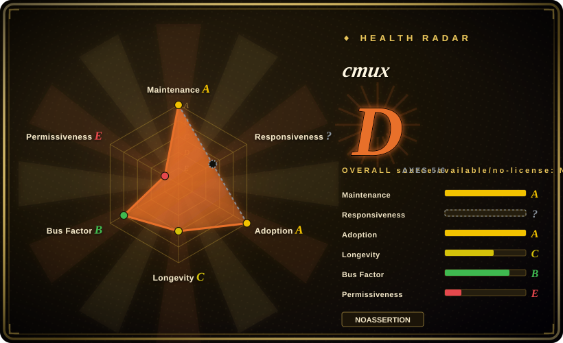
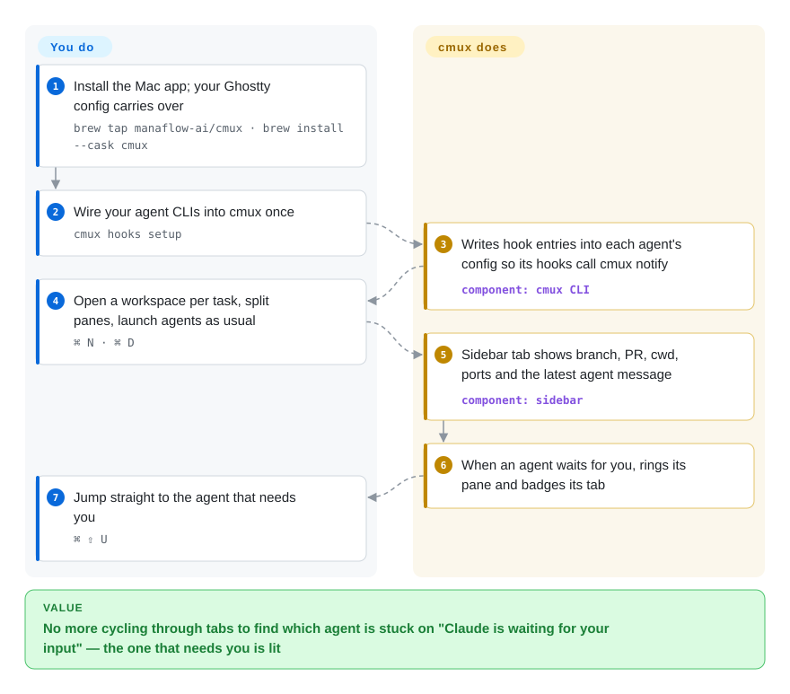

# cmux

You have six Claude Code and Codex sessions open in split panes, and every macOS notification says the same thing — "Claude is waiting for your input" — so you cycle through tabs reading scrollback to find which one stopped. cmux is a native macOS terminal (Ghostty's rendering engine inside a Swift app) whose sidebar shows each workspace's branch, PR and latest agent message, and which lights up the exact pane whose agent is waiting for you.

## When to use

You're a developer on a Mac running several CLI coding agents in parallel — Claude Code on a refactor, Codex on tests, OpenCode on the frontend — each in its own Ghostty or iTerm split. The pain is not starting them but noticing them: the native notification body carries no context, the tab titles truncate to nothing past eight tabs, and an agent that has been sitting on a permission prompt for twenty minutes looks exactly like one that is still working. You reach for cmux because it replaces the terminal app itself rather than adding a layer inside it: one `cmux hooks setup` wires your agents' hook systems to its notification CLI, after which a waiting agent gets a blue ring around its pane, an unread badge in a vertical tab that also shows git branch, linked PR number, cwd and listening ports, and `⌘ ⇧ U` jumps to it. Next to the terminal you can split a real browser pane that the agent itself can drive (snapshot, click, fill, eval) to check its own web changes.

The deciding tradeoff is **GUI-native terminal vs. in-terminal multiplexer vs. orchestrator**. Against [herdr](herdr.md) or [TUIOS](tuios.md) — multiplexers that run inside whatever terminal you already have, on Linux and over SSH too — cmux gives you a mouse-driven Mac app with a built-in browser and system notifications, and pays for it by being macOS-only. Against desktop orchestrators like [Agent Orchestrator](../../../agent-tooling/supervision-surfaces/agent-orchestrator.md), cmux deliberately does not decide how work is split: its own README calls it "a primitive, not a solution" — panes, notifications and a CLI/socket you script yourself.

## How it works

cmux is a Swift/AppKit application that embeds libghostty — the rendering library of the Ghostty terminal, used here the way an app embeds WebKit (cmux carries a small patched fork of it) — and reads your existing `~/.config/ghostty/config` for fonts, themes and keybindings. Notifications reach it two ways: standard terminal escape sequences (OSC 9/99/777, the codes a program prints to ask the terminal to raise an alert), or the agents' own hook systems, which `cmux hooks setup` edits for you — writing entries into files such as `~/.codex/hooks.json` or `~/.gemini/settings.json`, while Claude Code goes through a cmux wrapper — so each hook calls `cmux notify` and records the agent's session ID under `~/.cmuxterm/`. You keep launching agents exactly as before; cmux owns the window, the sidebar and the alert routing, and on relaunch it rebuilds the layout and runs each supported agent's own `--resume <id>` command. It does **not** keep processes alive across a quit — that is opt-in through `cmux local-tmux`, which starts a tmux server underneath. Everything visible is also scriptable through the `cmux` CLI and a Unix socket (create workspaces, split panes, send keys, read the screen, drive the browser), which is how agents spawn teammates as visible panes.

<!-- flow-steps:begin (generated from flows/cmux.json by tools/flow_card.py — do not edit) -->

Text version of the flow

1. **You**: Install the Mac app; your Ghostty config carries over — `brew tap manaflow-ai/cmux · brew install --cask cmux`
2. **You**: Wire your agent CLIs into cmux once — `cmux hooks setup`
3. **cmux**: Writes hook entries into each agent's config so its hooks call cmux notify — component: `cmux CLI`
4. **You**: Open a workspace per task, split panes, launch agents as usual — `⌘ N · ⌘ D`
5. **cmux**: Sidebar tab shows branch, PR, cwd, ports and the latest agent message — component: `sidebar`
6. **cmux**: When an agent waits for you, rings its pane and badges its tab
7. **You**: Jump straight to the agent that needs you — `⌘ ⇧ U`

**Value**: No more cycling through tabs to find which agent is stuck on "Claude is waiting for your input" — the one that needs you is lit

<!-- flow-steps:end -->

## When NOT to use

- **You are not on macOS.** The app is Swift + AppKit and the README FAQ says "macOS only, for now". A separate Rust `cmux-tui` multiplexer lives in the repo, but an open issue (#17040, 2026-10-02) records a Linux user calling it "basically unusable". On Linux or over plain SSH use [herdr](herdr.md) or [TUIOS](tuios.md), which run inside any terminal, or [tmux](../../../terminal-ui/tmux.md) if agent awareness isn't the point.
- **Your agents run on a remote box and the terminal must survive your laptop.** cmux restores layout and agent sessions after a relaunch but does not keep arbitrary processes alive; live persistence means opting into `cmux local-tmux` (dies with logout/restart) or `cmux ssh-tmux` / `mosh-tmux`. If "agents keep running while my Mac is closed" is the requirement, run [tmux](../../../terminal-ui/tmux.md) or [herdr](herdr.md) on the server and treat any local terminal as a viewer.
- **You want the tool to plan and fan out the work.** cmux will not create worktrees per task, route CI failures back to an agent, or merge results — it shows you agents, it doesn't manage them. Pick [Agent Orchestrator](../../../agent-tooling/supervision-surfaces/agent-orchestrator.md) for worktree-isolated fan-out with feedback routing, or a harness-level pipeline like [oh-my-claudecode](../orchestration-and-review/oh-my-claudecode.md).
- **You need a stable, boring terminal for a team fleet.** v0.x since January 2026, ~6.6k commits in the 30 days before 2026-10-09, and 1,655 open issues including multi-GB memory-growth reports (#2962, #11627). If the terminal is infrastructure you can't let churn, stay on Ghostty itself or [Alacritty](../../../terminal-ui/alacritty.md) + [tmux](../../../terminal-ui/tmux.md) and add notifications through your agents' hooks.
- **You can't accept default-on telemetry or an app that types into your agents.** `app.sendAnonymousTelemetry` defaults to `true` (opt-out in Settings, or MDM `DisableTelemetry`); `automation.agentAutoResume` defaults to `true` and sends `continue` to a cmux-launched agent after a retryable upstream error; resume on reopen re-runs agent commands automatically. All three are switchable, but a locked-down or audited environment must turn them off deliberately — or use [tmux](../../../terminal-ui/tmux.md), which does none of this.
- **You plan to self-host or resell the server side.** The app, CLI and `cmux-tui` are GPL-3.0-or-later, but `web/`, the Cloudflare workers and relay services are BUSL-1.1 with no additional use grant — production use or self-hosting needs a commercial license from Manaflow — and contributions require signing a CLA. For a permissively licensed agent multiplexer you can embed or fork into a product, pick [herdr](herdr.md) (Apache-2.0) or [TUIOS](tuios.md) (MIT).
- **You want an AI terminal where the agent is built in.** cmux hosts whatever CLI agent you run; it has no agent of its own in the open-source app (its "cmux AI" is a Founder's Edition early-access item). If you want the terminal to *be* the agent, look at [Warp](../../../terminal-ui/warp.md) — knowing that Warp's agent runs on its proprietary servers.

## Comparison

| Alternative | In index | Our verdict | Tradeoff |
|---|---|---|---|
| [herdr](herdr.md) | ✅ | If you supervise agents from a Mac and want a GUI with a browser pane and system notifications, pick cmux; pick herdr when the agents live on Linux servers or over SSH and must survive detaching, because herdr's server keeps processes alive and runs in any terminal. | cmux: native Mac app, embedded browser, mouse-first, macOS only. herdr: one Rust binary, cross-platform, `agent wait` API for agent-to-agent control, Apache-2.0, but a TUI with no browser. |
| [tmux](../../../terminal-ui/tmux.md) | ✅ | For long-lived shells on shared servers, pick tmux; pick cmux only when the bottleneck is spotting which local agent needs you, since tmux knows nothing about agents. | tmux: ~20 years of stable behavior, any OS, process persistence built in. cmux: agent rings, sidebar metadata and resume integrations, but persistence is opt-in and it is 8 months old. |
| Ghostty | not indexed | If you just want a fast, native, GPU terminal and don't run many agents at once, pick Ghostty; pick cmux when you need per-agent alerts and a sidebar on top of the same renderer. | Real repo (ghostty-org/ghostty, MIT, ~62k stars, 2026-10); cmux reads the same config and embeds its library through a patched fork, adding agent features plus GPL/BUSL licensing and much faster churn. Not added in this tab batch. |
| [Warp](../../../terminal-ui/warp.md) | ✅ | If you want an agent built into the terminal on macOS, Linux and Windows, pick Warp; pick cmux when you want to keep your own CLI agents (Claude Code, Codex…) and only need the terminal to show which one is waiting. | Warp: block-structured output and a built-in agent, but the agent and sync run on proprietary servers. cmux: no built-in agent, hosts any CLI agent, macOS only. |
| [Agent Orchestrator](../../../agent-tooling/supervision-surfaces/agent-orchestrator.md) | ✅ | If you want the tool to fan tasks out to many agents in isolated worktrees and route CI and review feedback back, pick Agent Orchestrator; pick cmux when you want to keep that workflow in your own scripts and only need a better place to watch the agents. | Orchestrator: an opinionated control plane that owns task routing. cmux: unopinionated primitives (panes, notifications, CLI/socket), and every workflow decision stays yours. |

## Tech stack

- **Swift + AppKit** native macOS app (not Electron); Xcode 26 is the pinned toolchain per `CONTRIBUTING.md` (read 2026-10-09).
- **libghostty** (Zig) for terminal rendering via the `manaflow-ai/ghostty` fork submodule; a checksum-pinned prebuilt `GhosttyKit.xcframework` is fetched by `scripts/setup.sh`, else built from source with Zig.
- **Rust** for the bundled `cmux-cua` computer-use engine and the separate `cmux-tui` multiplexer; **Go** for the `cmuxd-remote` daemon used by SSH workspaces (`daemon/remote/go.mod`).
- **TypeScript / bun** for webviews and the `web/` site/backend (Vercel, Cloudflare workers); **Sparkle** for in-app auto-update.
- GitHub languages API (2026-10-09): Swift ~104 MB of source, then Rust, TypeScript and Python — a large, polyglot monorepo, not a small app.

## Dependencies

- **macOS** (contributors need macOS 14+); install via DMG or `brew tap manaflow-ai/cmux` + `brew install --cask cmux`.
- **Your agent CLIs** installed separately (claude, codex, opencode, gemini…); `cmux hooks setup` only configures the ones it finds on `PATH`.
- **Optional:** tmux (for `cmux local-tmux` / remote tmux attach), zellij (`cmux local-zellij`), OpenSSH for `cmux ssh` workspaces (a remote `cmuxd-remote` binary is shipped per release).
- **Network:** Sparkle update checks; anonymous telemetry unless turned off; the paid Cloud VM / iOS features talk to Manaflow's BUSL-licensed server side.

## Ops difficulty

**Low for one developer, with some config surface to own.** Install is a DMG or Homebrew cask and it auto-updates; your Ghostty config carries over. What you take on: `cmux hooks setup` writes into several agents' global config files (`~/.codex/hooks.json`, `~/.gemini/settings.json`, OpenCode plugins…), so those edits need tracking if you manage dotfiles, and `cmux hooks uninstall <agent>` exists to back them out. The socket defaults to `cmuxOnly` (only the bundled CLI may connect); widening it to `allowAll` is flagged "developer-only" in source. Release cadence is very fast (nightly channel plus frequent v0.6x tags), so expect behavior changes between updates. Managed Macs get MDM policy keys (e.g. `DisableTelemetry`).

## Health & viability

- **Maintenance (2026-10-09).** Extremely active: v0.65.0 on 2026-10-05, prior stables a few days to six weeks apart back to v0.39.0 (2026-02-18), a nightly channel, and ~6.6k commits in the last 30 days (~19.9k since the first commit on 2026-01-22). The commit rate suggests heavy agent-assisted development [推断]; read it as velocity, not as stability.
- **Governance / bus factor.** A company project (Manaflow, Inc.; GitHub org owner). Two maintainers carry most of the work — lawrencecchen ~7.5k and austinywang ~7.3k contributions, then two more above 1.7k (contributors API, 2026-10-09). CLA required for outside contributions (`CLA.md` v2.2), which lets Manaflow offer commercial terms on what it controls.
- **Backing & longevity.** Venture-style funding is implied by the Founder's Edition, Cloud VMs and the BUSL server side, but no funding round was confirmed here. Age is ~8.5 months — no Lindy credit; the project is young and moves fast.
- **Adoption.** ~28.1k stars, ~2.5k forks; `cmux-macos.dmg` for v0.65.0 alone was downloaded ~41k times within four days and its `appcast.xml` fetched ~426k times (release assets API, 2026-10-09). Ecosystem: a `cmux-skills` repo, sidebar plugins under the same org, integrations for ~18 agent CLIs. Issue load is high: 1,655 open issues and 1,531 open PRs against 3,021 closed issues (search API, 2026-10-09).
- **Risk flags.** Split licensing (GPL-3.0-or-later client + BUSL-1.1 server) with a CLA, which is a standard open-core setup; telemetry on by default; macOS-only; open reports of large memory growth with many panes; a monetized edge (Founder's Edition, Cloud VMs, iOS beta) beside the free app. No published GitHub security advisories (2026-10-09).

## Caveats (unverified)

- [推断] "Heavy agent-assisted development" — inferred from ~6.6k commits/30 days with two dominant human authors; not confirmed from the repo's own statements.
- [未验证] Whether Manaflow has outside funding: the README sells a Founder's Edition and Cloud VMs, but no funding announcement was checked.
- [未验证] The Linux story for `cmux-tui` / nightly builds — only issue reports (#17040, #17041, #12897) were read; no Linux build was run.
- [未验证] Memory-growth reports (#2962 "70+ GB", #11627 "7.8GB in 25s") were read as issue titles and bodies only; whether current v0.65.0 still reproduces them was not tested.
- [未验证] What the default-on anonymous telemetry collects — only the setting key and its default (`app.sendAnonymousTelemetry: true`) were read, not the event payloads.
- [推断] Exact semantics of socket mode `cmuxOnly` ("only the bundled cmux CLI may connect") are taken from the source enum's doc comment; how that is enforced (peer process checks vs. a token) was not traced.
- [推断] That the paid Cloud VM / iOS features depend on the BUSL-licensed `web/` and worker code — inferred from the LICENSE listing those directories as "the cmux server software"; the request path was not traced.
- [未验证] Star, fork, commit, download and issue counts are GitHub API outputs dated 2026-10-09; download counts include auto-update traffic.
- [推断] Placement in `orchestration-and-review` next to herdr and TUIOS: cmux is a terminal app first, and a terminal-UI category would also fit; it was placed with its direct agent-supervision peers.
- [推断] The health radar's `risk_license: E` and the D cap come from the scorer reading GitHub's `NOASSERTION` and matching BUSL text in the root LICENSE; the root LICENSE actually grants GPL-3.0-or-later for the app, CLI and `cmux-tui` and confines BUSL-1.1 to the server directories, so the cap overstates the risk for someone who only installs the Mac app. Its `responsiveness: ?` (no_window_signal) was reproduced on two runs with GraphQL quota intact (2026-10-09) — most recent issues are filed by the maintainers themselves, so there are few third-party issues whose first response can be timed. The adoption axis also names npm `cmux` as the canonical package, which was not confirmed to be this project; the grade rests on Homebrew and release downloads instead.
