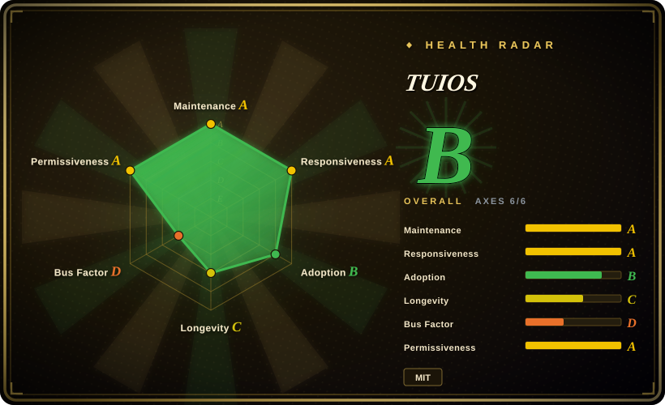
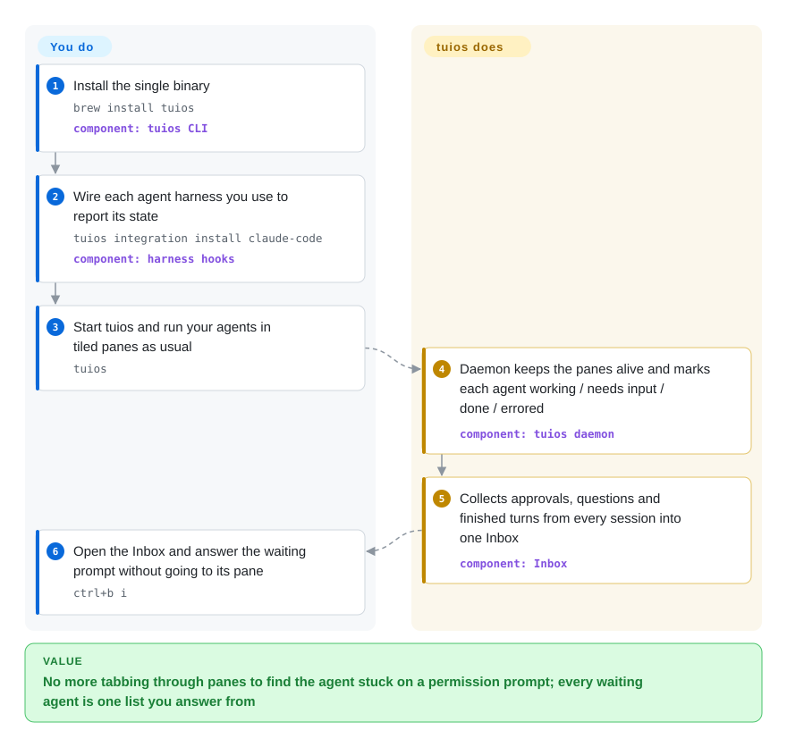

# TUIOS

You have five coding agents in five terminal panes, and the one that has sat on "Allow this command?" for twenty minutes looks exactly like the four that are still working. TUIOS is a tiling terminal window manager whose background daemon learns each pane's agent state from the agents' own hooks and gathers every waiting prompt, from every session and machine, into one Inbox you answer from.

## When to use

You are a developer who runs Claude Code on a refactor, Codex on a test backlog and opencode on a small frontend fix at the same time, some of them on a build box over SSH. The work is fine; the supervision is the problem. Every few minutes you cycle through panes to find the one that printed `Do you want to proceed? 1. Yes 2. No` and has been idle ever since, and when your laptop sleeps the SSH session and everything in it goes with it. You reach for TUIOS when you want the terminal itself to fix that: a daemon holds the panes so a detach costs nothing, `tuios integration install` wires each harness (19 of them, per the docs) to report `working` / `needs_input` / `done` / `errored`, and `ctrl+b i` opens one Inbox where you answer the prompt — for Claude Code, opencode, Kilo and Qwen Code approvals, with a single key — without going to the pane.

The deciding tradeoff against the neighbours: against [tmux](../../../terminal-ui/tmux.md) and [Zellij](../../../terminal-ui/zellij.md), TUIOS trades their maturity for an agent layer they do not have. Against [herdr](herdr.md), the closest match (TUIOS's own docs credit herdr for several integration designs), TUIOS is the one to pick when you also want a full tiling window manager (BSP, master-stack and niri-style scrolling layouts, nine workspaces, kitty graphics, vim copy mode) and the fleet tooling around it — `tuios fan` to start one prompt in N agents in separate git worktrees and `fan compare` / `fan verify` / `fan keep` to pick a winner, per-pane permission grants, an MCP server, and a tmux shim so Claude Code agent teams open their teammates as TUIOS panes. herdr is the one to pick when adoption and backing weigh more than features: it has a funded company and far more installs behind it, while TUIOS is one person's MIT project.

## How it works

TUIOS is a client/server terminal multiplexer written in Go on Charm's Bubble Tea. A daemon — a background process that outlives the terminal window — owns the shells (each in a PTY, the pseudo-terminal a shell believes is a real screen) and runs its own terminal emulator for each one; the `tuios` you type is only a viewer that draws what the daemon holds and sends your keys back, so closing the window or dropping SSH changes nothing. On top of the panes sits the agent layer. TUIOS installs a small hook into each harness's own config (for Claude Code, the `hooks` in `~/.claude/settings.json`), and that hook reports the agent's state and conversation id to the daemon; for agents with no hook it falls back to guessing from the process name and what is on screen. Everything that needs a person — an approval, an `ask-human` question from an agent, mail between agents, an error, a finished turn — becomes a row in the Inbox. Think of it as a switchboard operator who watches every line and only rings you when one of them is waiting. What you still do: install the integrations, start your agents the normal way, and answer. What it does not do is keep processes alive through a daemon restart or a reboot: it restores the layout and each pane's working directory in fresh shells, and offers to resume agent conversations via each harness's own `--resume`.

<!-- flow-steps:begin (generated from flows/tuios.json by tools/flow_card.py — do not edit) -->

Text version of the flow

1. **You**: Install the single binary — `brew install tuios` — component: `tuios CLI`
2. **You**: Wire each agent harness you use to report its state — `tuios integration install claude-code` — component: `harness hooks`
3. **You**: Start tuios and run your agents in tiled panes as usual — `tuios`
4. **TUIOS**: Daemon keeps the panes alive and marks each agent working / needs input / done / errored — component: `tuios daemon`
5. **TUIOS**: Collects approvals, questions and finished turns from every session into one Inbox — component: `Inbox`
6. **You**: Open the Inbox and answer the waiting prompt without going to its pane — `ctrl+b i`

**Value**: No more tabbing through panes to find the agent stuck on a permission prompt; every waiting agent is one list you answer from

<!-- flow-steps:end -->

## When NOT to use

- **The multiplexer is shared team infrastructure you cannot churn.** TUIOS is 13 months old, `SECURITY.md` still says "there is no stable release yet", and v0.8.0 (2026-09-27) changed the daemon protocol so a v0.7 daemon had to be killed and its sessions lost. For a box many people SSH into, use [tmux](../../../terminal-ui/tmux.md); for a human-first workspace that is older and more widely used, [Zellij](../../../terminal-ui/zellij.md).
- **You need to bet on the project outliving its author's free time.** One account wrote about 2,887 of 3,011 commits, the project has no company or foundation, and `SECURITY.md` says it is "maintained in personal free time" with "no guaranteed response times". If the agent layer is what you want but bus factor decides, [herdr](herdr.md) has a funded company behind it.
- **You expect programs to survive a restart.** Only a detach keeps processes, screens and scrollback. A daemon restart, crash or reboot brings back the layout and each shell's directory — in *fresh* shells; your `vim`, build and scrollback are gone, and agents come back only as a resumed conversation. On Windows and the BSDs even the directory is not captured (the docs' Limitations section). No multiplexer keeps processes across a reboot; if you need long jobs to survive one, run them under a service manager or a CI runner, not in a pane.
- **You will not configure pane permissions.** The default `[agents.permissions]` mode is `open`, where every pane holds `admin`: any process in any pane can drive every session through the daemon — type into other panes, kill sessions, run commands. Running untrusted agents that way is a real exposure; set `mode = "strict"` with explicit grants, or keep agents in an isolated sandbox and supervise them from plain [tmux](../../../terminal-ui/tmux.md).
- **You do not want a tool writing into your agents' config.** `tuios integration install` edits `~/.claude/settings.json`, `~/.codex/hooks.json`, opencode/Kilo plugin dirs and more. If those files are managed elsewhere (a dotfiles repo, a policy), skip the integrations — state then falls back to screen and process detection, which is weaker — or use tmux, which touches nothing.
- **Windows is your daily driver.** Release archives exist for Windows, but the docs note that working-directory capture and peer-pid checks do not work there; [Pebrel](../../../terminal-ui/pebrel.md) is built Windows-first for the same "which AI CLI is waiting" problem.
- **Your input path is exotic.** TUIOS runs its own VT emulator and the kitty keyboard protocol, and that is where its bugs cluster: CJK punctuation typed into Claude Code (#255, fixed the same day, 2026-09-29) and empty lines after detach/attach (#123, open since 2026-08-16). If your IME or terminal is unusual and a garbled keystroke is costly, tmux's decades of input handling are the safer choice.
- **What you want is task routing, not supervision.** For staged plan→exec→verify pipelines with model routing, [oh-my-claudecode](../orchestration-and-review/oh-my-claudecode.md); for a desktop app that fans issues out to agents with CI feedback, [Agent Orchestrator](../../../agent-tooling/supervision-surfaces/agent-orchestrator.md). TUIOS gives you panes, state and an Inbox; the workflow is still yours.

## Comparison

| Alternative | In index | Our verdict | Tradeoff |
|---|---|---|---|
| [herdr](herdr.md) | ✅ | If you supervise several coding agents and want state badges plus agents driving agents, both fit; pick herdr when backing and install base decide, pick TUIOS when you also want a full tiling WM, Inbox approvals and worktree fan-out with compare/verify/keep. | herdr: Rust, Apache-2.0, a funded company and ~50k Homebrew installs/90d, but 6 months old. TUIOS: Go, MIT, more agent-fleet features, one maintainer and ~700 Homebrew installs/90d (2026-09). |
| [tmux](../../../terminal-ui/tmux.md) | ✅ | For long-running shells on shared servers, pick tmux; pick TUIOS only when knowing which agent is waiting on you is the actual bottleneck. | tmux: two decades of stable behavior everywhere, zero agent awareness. TUIOS: agent state and Inbox, pre-1.0 protocol churn and its own young emulator. |
| [Zellij](../../../terminal-ui/zellij.md) | ✅ | For a discoverable, plugin-extensible multiplexer for human work, pick Zellij; pick TUIOS when coding agents are most of what runs in the panes. | Zellij: WASM plugins, web client, larger community, no agent layer. TUIOS: agent layer and tiling layouts, one person's roadmap. |
| [Pebrel](../../../terminal-ui/pebrel.md) | ✅ | On Windows with a GUI terminal and SSH/SFTP in the same app, pick Pebrel; on Linux/macOS inside the terminal you already use, pick TUIOS. | Pebrel: a GPU terminal emulator, GPL-3.0, Windows-first, 3 months old. TUIOS: runs inside any truecolor terminal, MIT, weaker on Windows. |
| claude-squad | not indexed | If you only want a small TUI that starts agents in separate worktrees and lets you flip between them, claude-squad is the lighter tool; pick TUIOS when you also want a daemon, an Inbox and a window manager. | Real repo (smtg-ai/claude-squad, Go, AGPL-3.0, ~8.6k stars, 2026-09) built on tmux sessions; not added in this tab batch. |

## Tech stack

- **Go** (module needs Go 1.26.6+), one `tuios` binary plus a separate `tuios-web` binary for browser access (kept apart "for security isolation", per its `AGENTS.md`).
- **TUI:** Charm's Bubble Tea v2 and Lipgloss v2, event-driven rendering (PTY readers signal the render loop; no fixed tick).
- **Terminal emulation:** an in-tree VT emulator (`internal/vt`: scrollback, kitty/sixel graphics, kitty keyboard protocol, OSC 133), or optionally libghostty-vt in the `tuios-ghostty_*` builds.
- **Daemon and remote:** JSON verb protocol over a Unix socket (`docs/protocol.md`), Charm `wish`/`ssh` for SSH server mode, `coder/websocket` for the web mode, ssh links for `tuios hosts`.
- **Agent surface:** hook/plugin installers for 19 harnesses, `tuios mcp` MCP server, a tmux-compatible shim, and an agent skill embedded in the binary (`tuios --skill`).
- **Also a library:** `pkg/tuios` embeds the window manager in your own Bubble Tea app (`docs/LIBRARY.md`).
- **Distribution:** Homebrew (homebrew-core), AUR, nixpkgs and a Nix flake, install script with checksum check, `go install`, Docker image, release archives for Linux, macOS, Windows, FreeBSD and OpenBSD.

## Dependencies

- **Nothing to run beyond the binary.** The daemon is started on first `tuios`; session state is JSON files under the XDG state directory.
- **A truecolor terminal**; kitty graphics or sixel support (Ghostty, Kitty, WezTerm) is recommended for images.
- **The agents themselves** (Claude Code, Codex, opencode…) are separate installs; TUIOS only hosts their terminals and reads their hooks.
- **OpenSSH** for `tuios hosts` and remote sessions; Tailscale only if you use `tuios hosts tailnet`; **git** for `worktree` and `fan`.
- **Zig** only if you build the libghostty backend from source.

## Ops difficulty

**Low to start, with upgrade and permission chores.** Install, run `tuios`, done — the daemon starts itself and sessions persist without setup. The standing costs: minor releases can change the daemon protocol (v0.8.0 required `tuios kill-server`, which ended every running session), so upgrades need a moment when nothing important is running; integrations live in each harness's config and need `tuios integration status` / `tuios doctor agents` after harness or TUIOS upgrades; and the default-open pane permissions should be tightened to `strict` before you run agents you do not fully trust. There is no database and no network port by default; remote access goes over SSH or the separate web binary.

## Health & viability

- **Maintenance (2026-09-30).** Extremely active: v0.8.1 on 2026-09-29, two days after v0.8.0, which its notes describe as about 2,400 commits since v0.7.0 (2026-03-28); 100+ commits in September 2026 alone, and bugs such as #253 and #255 were fixed the day they were filed. The cadence is bursty — six months passed between v0.7.0 and v0.8.0 with no release.
- **Governance / bus factor.** A personal account, not an org: Gaurav-Gosain holds about 2,887 of 3,011 commits (~96%); the next human contributor has 21. `SECURITY.md` promises fixes only on `main`, "no guaranteed response times". Several recent commits carry Claude co-author trailers, so the pace is agent-assisted — which also means the codebase can grow faster than one reviewer can audit it. [推断]
- **Backing & longevity.** No company or foundation; funding is a Ko-fi link. Created 2025-09-06, so about 13 months old: no Lindy credit yet, and "still active" is currently very true.
- **Adoption.** ~4.4k stars and 186 forks (2026-09-30); a homebrew-core formula with 709 installs over 90 days and 2,531 over a year; 15,140 cumulative release-asset downloads; also in nixpkgs and the AUR. Real but modest — an order of magnitude below herdr's Homebrew pull.
- **Risk flags.** MIT with no relicense history. Pre-1.0 with protocol breaks between minors; the open-by-default pane permission model; integrations that write into other tools' config files.

## Caveats (unverified)

- [未验证] "19 harness integrations" and "24 agent CLIs detected" are the docs' counts (`docs/AGENT_STATE.md`, README, 2026-09-30); no harness was installed or tested here.
- [未验证] "Zero CPU at idle" and the other performance claims in the README were not measured.
- [未验证] The permission model (pane grants, same-user Unix socket, verified-human replies) is documented in detail but was not audited or tested for bypasses.
- [未验证] Windows behaviour beyond the documented limitations (cwd capture, peer pid) was not tested; the Windows archives exist, but how much of the agent layer works there is unknown.
- [推断] Adoption comparison with herdr uses Homebrew install counts only (709 vs 50,512 per 90 days); users installing via the script, Nix, AUR or `go install` are not counted.
- [推断] "Agent-assisted development" rests on 9 of the latest 100 commits carrying a Claude co-author trailer (2026-09-30); it says nothing about code quality.
- [未验证] Star, commit and download counts are GitHub API and Homebrew analytics readings dated 2026-09-30.
- [推断] Placement in `orchestration-and-review` follows herdr's precedent (agent-aware multiplexers live here); TUIOS is equally a general tiling terminal multiplexer and would fit `terminal-ui` beside tmux and Zellij.
