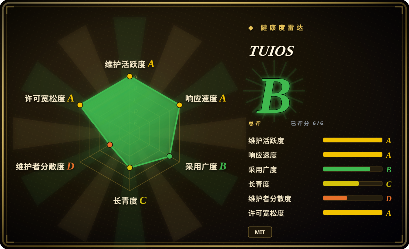
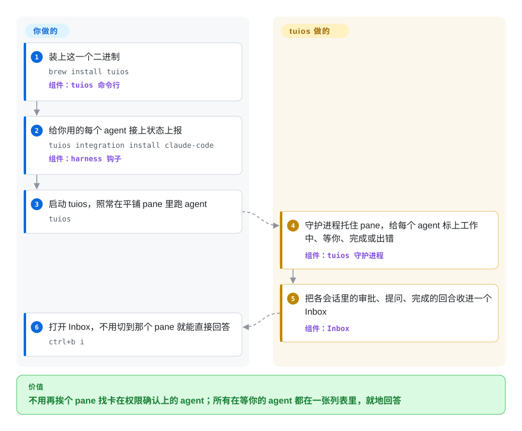

# TUIOS

五个终端 pane 里跑着五个编程 agent，其中一个已经在“是否允许执行这条命令？”上停了二十分钟，看上去却和另外四个还在干活的一模一样。TUIOS 是一个平铺式终端窗口管理器：后台守护进程通过各 agent 自己的钩子得知每个 pane 的状态，把所有会话、所有机器上在等你的提示收进一个 Inbox，你在那里直接回答。

## 何时使用

你同时让 Claude Code 做重构、Codex 补测试、opencode 修一个前端小问题，其中几个还跑在 SSH 连着的构建机上。活本身没问题，问题在盯梢：每隔几分钟你就得挨个翻 pane，找出那个打印了 `Do you want to proceed? 1. Yes 2. No` 之后就一直干等的；笔记本一合盖，SSH 会话连同里面的一切一起没了。你想让终端本身把这件事管起来时，就该想到 TUIOS：守护进程托住所有 pane，断开连接不损失任何东西；`tuios integration install` 给每个 harness 接上状态上报（文档说支持 19 个），报出 `working` / `needs_input` / `done` / `errored`；按 `ctrl+b i` 打开 Inbox，不用切到那个 pane 就能回答——Claude Code、opencode、Kilo 和 Qwen Code 的权限审批按一个键就行。

和邻居们比，决定性的取舍在这里：相对 [tmux](../../../terminal-ui/tmux.zh.md) 和 [Zellij](../../../terminal-ui/zellij.zh.md)，TUIOS 用成熟度换来了它们没有的 agent 层。相对最接近的 [herdr](herdr.zh.md)（TUIOS 自己的文档里好几处集成设计都注明参考了 herdr），如果你还想要一个完整的平铺窗口管理器（BSP、主从、niri 式横向滚动布局，九个工作区，kitty 图形，vim 式复制模式）以及围绕它的“车队”工具，就选 TUIOS——`tuios fan` 把同一个提示词分发给 N 个 agent，各自在独立 git worktree 里跑，再用 `fan compare` / `fan verify` / `fan keep` 挑出胜者；另有按 pane 的权限授予、MCP 服务器，以及一个 tmux 垫片，让 Claude Code agent teams 的队友直接开成 TUIOS 的 pane。如果采用规模和背后支撑比功能更重要，就选 herdr：它背后是拿了融资的公司、装机量也大得多，而 TUIOS 是一个人的 MIT 项目。

## 怎么用起来

TUIOS 是用 Go 写在 Charm 的 Bubble Tea 之上的客户端/服务端终端复用器。守护进程——一个比终端窗口活得更久的后台进程——持有所有 shell（每个都在一个 PTY 里，也就是让 shell 以为自己连着真屏幕的“伪终端”），并为每个 shell 各跑一个终端模拟器；你敲的 `tuios` 只是个查看器，把守护进程手里的画面画出来、再把按键送回去，所以关窗口、断 SSH 都不影响里面的东西。pane 之上是 agent 层。TUIOS 往每个 harness 自己的配置里装一个小钩子（Claude Code 就是 `~/.claude/settings.json` 里的 `hooks`），钩子把 agent 的状态和会话 id 报给守护进程；没有钩子的 agent，它退回到根据进程名和屏幕内容去猜。凡是需要人出手的东西——审批、agent 用 `ask-human` 提的问题、agent 之间的邮件、报错、跑完的一轮——都变成 Inbox 里的一行。可以把它想成一个盯着所有线路的总机接线员，只有某条线在等人时才摇铃叫你。你仍然要做的：装好集成、照常启动 agent、然后回答。它做不到的是让进程熬过守护进程重启或整机重启：它会恢复布局和每个 pane 的工作目录，但里面是全新的 shell，并提议借各 harness 自己的 `--resume` 接回 agent 的对话。

<!-- flow-steps:begin (generated from flows/tuios.json by tools/flow_card.py — do not edit) -->

流程文字版

1. **你**：装上这一个二进制 — `brew install tuios` — 组件：`tuios 命令行`
2. **你**：给你用的每个 agent 接上状态上报 — `tuios integration install claude-code` — 组件：`harness 钩子`
3. **你**：启动 tuios，照常在平铺 pane 里跑 agent — `tuios`
4. **TUIOS**：守护进程托住 pane，给每个 agent 标上工作中、等你、完成或出错 — 组件：`tuios 守护进程`
5. **TUIOS**：把各会话里的审批、提问、完成的回合收进一个 Inbox — 组件：`Inbox`
6. **你**：打开 Inbox，不用切到那个 pane 就能直接回答 — `ctrl+b i`

**价值**：不用再挨个 pane 找卡在权限确认上的 agent；所有在等你的 agent 都在一张列表里，就地回答

<!-- flow-steps:end -->

## 何时不用

- **复用器是团队共用、经不起折腾的基础设施。** TUIOS 只有 13 个月大，`SECURITY.md` 里还写着“还没有稳定版本”，v0.8.0（2026-09-27）改了守护进程协议，升级时必须杀掉 v0.7 的守护进程，里面的会话随之丢失。多人 SSH 上去共用的机器请用 [tmux](../../../terminal-ui/tmux.zh.md)；想要更老、用户更多的“以人为主”的工作区，用 [Zellij](../../../terminal-ui/zellij.zh.md)。
- **你需要押注项目能活得比作者的业余时间更久。** 3,011 个提交里约 2,887 个出自同一个账号，背后没有公司也没有基金会，`SECURITY.md` 明说项目“在个人业余时间维护”“不保证响应时间”。如果你要的是 agent 层、但总线因子是决定项，[herdr](herdr.zh.md) 背后有拿了融资的公司。
- **你指望程序能熬过重启。** 只有断开连接（detach）才保住进程、屏幕和回滚缓冲。守护进程重启、崩溃或整机重启后，回来的只是布局和每个 shell 的目录——而且是*新开*的 shell；你的 `vim`、跑到一半的构建和回滚内容都没了，agent 也只是以“接回对话”的方式回来。在 Windows 和 BSD 上连目录都记不下来（见文档的 Limitations 一节）。没有哪个复用器能让进程熬过整机重启；长任务要扛住重启，就交给服务管理器或 CI runner，别放在 pane 里。
- **你不打算配置 pane 权限。** `[agents.permissions]` 默认是 `open` 模式，每个 pane 都持有 `admin`：任何 pane 里的任何进程都能通过守护进程操控所有会话——往别的 pane 里敲字、杀会话、执行命令。拿这个默认值跑不受信任的 agent 是真实的暴露面；要么设 `mode = "strict"` 并显式授权，要么把 agent 关进隔离沙箱，再用普通的 [tmux](../../../terminal-ui/tmux.zh.md) 盯着。
- **你不希望有工具改写 agent 的配置。** `tuios integration install` 会改 `~/.claude/settings.json`、`~/.codex/hooks.json`、opencode/Kilo 的插件目录等等。如果这些文件另有归属（dotfiles 仓库、公司策略），就别装集成——状态会退回到屏幕和进程识别，准确度更弱——或者用什么都不碰的 tmux。
- **Windows 是你的主力系统。** 虽然有 Windows 的发布包，但文档写明工作目录捕获和对端 pid 校验在那里都不可用；[Pebrel](../../../terminal-ui/pebrel.zh.md) 就是为同一个“哪个 AI CLI 在等我”的问题、以 Windows 优先打造的。
- **你的输入链路比较特殊。** TUIOS 自带 VT 模拟器并实现了 kitty 键盘协议，它的 bug 也集中在这里：在 Claude Code 里输入中文标点出错（#255，2026-09-29 当天修复），detach/attach 之后出现空行（#123，自 2026-08-16 起未关）。如果你的输入法或终端比较少见、一个错乱的按键代价很高，tmux 几十年打磨的输入处理更稳妥。
- **你要的是任务路由，而不是盯梢。** 要分阶段的 plan→exec→verify 流水线加模型路由，用 [oh-my-claudecode](../orchestration-and-review/oh-my-claudecode.zh.md)；要一个把 issue 分发给多个 agent、并回灌 CI 反馈的桌面应用，用 [Agent Orchestrator](../../../agent-tooling/supervision-surfaces/agent-orchestrator.zh.md)。TUIOS 给你的是 pane、状态和 Inbox，工作流仍然要你自己定。

## 横向对比

| 替代品 | 是否收录 | 我们的评价 | 取舍 |
|---|---|---|---|
| [herdr](herdr.zh.md) | ✅ | 同时盯多个编程 agent、想要状态标记和 agent 互相驱动，两者都合适；看重背后支撑和装机量就选 herdr，还想要完整的平铺窗口管理器、Inbox 审批和带 compare/verify/keep 的 worktree 分发就选 TUIOS。 | herdr：Rust、Apache-2.0、有融资公司、Homebrew 90 天约 5 万次安装，但只有 6 个月大。TUIOS：Go、MIT、agent 车队功能更多，一个维护者、Homebrew 90 天约 700 次安装（2026-09）。 |
| [tmux](../../../terminal-ui/tmux.zh.md) | ✅ | 在共享服务器上跑长时间 shell，选 tmux；只有当“哪个 agent 在等我”真的是瓶颈时才选 TUIOS。 | tmux：二十年处处稳定，完全不懂 agent。TUIOS：有 agent 状态和 Inbox，代价是 pre-1.0 的协议变动和一个年轻的自研模拟器。 |
| [Zellij](../../../terminal-ui/zellij.zh.md) | ✅ | 要一个好上手、能用插件扩展、面向人工作的复用器，选 Zellij；pane 里跑的大多是编程 agent 时，选 TUIOS。 | Zellij：WASM 插件、Web 客户端、社区更大，没有 agent 层。TUIOS：agent 层加平铺布局，路线图系于一人。 |
| [Pebrel](../../../terminal-ui/pebrel.zh.md) | ✅ | 在 Windows 上、想要 GUI 终端并在同一个应用里用 SSH/SFTP，选 Pebrel；在 Linux/macOS 上、就用你现有的终端，选 TUIOS。 | Pebrel：GPU 终端模拟器、GPL-3.0、Windows 优先、3 个月大。TUIOS：跑在任何真彩色终端里、MIT、Windows 支持较弱。 |
| claude-squad | 未收录 | 只想要一个小 TUI，在独立 worktree 里启动 agent 并在它们之间切换，claude-squad 更轻；还想要守护进程、Inbox 和窗口管理器时选 TUIOS。 | 真实仓库（smtg-ai/claude-squad，Go，AGPL-3.0，约 8.6k star，2026-09），基于 tmux 会话；本批标签收录未加入。 |

## 技术栈

- **Go**（模块要求 Go 1.26.6+），一个 `tuios` 二进制，外加一个独立的 `tuios-web` 二进制提供浏览器访问（按其 `AGENTS.md` 的说法，分开是“为了安全隔离”）。
- **TUI：** Charm 的 Bubble Tea v2 和 Lipgloss v2，事件驱动渲染（PTY 读取协程通知渲染循环，没有固定频率的刷新）。
- **终端模拟：** 仓库内自研的 VT 模拟器（`internal/vt`：回滚缓冲、kitty/sixel 图形、kitty 键盘协议、OSC 133），`tuios-ghostty_*` 构建则可选用 libghostty-vt。
- **守护进程与远程：** 基于 Unix socket 的 JSON 动词协议（`docs/protocol.md`），SSH 服务模式用 Charm 的 `wish`/`ssh`，Web 模式用 `coder/websocket`，`tuios hosts` 走 ssh 链路。
- **agent 接口：** 面向 19 个 harness 的钩子/插件安装器，`tuios mcp` MCP 服务器，一个兼容 tmux 的垫片，以及内嵌在二进制里的 agent skill（`tuios --skill`）。
- **也能当库用：** `pkg/tuios` 可以把窗口管理器嵌进你自己的 Bubble Tea 应用（`docs/LIBRARY.md`）。
- **分发：** Homebrew（homebrew-core）、AUR、nixpkgs 与 Nix flake、带校验和检查的安装脚本、`go install`、Docker 镜像，以及 Linux、macOS、Windows、FreeBSD、OpenBSD 的发布包。

## 依赖

- **除了二进制本身，不用跑别的。** 第一次执行 `tuios` 时守护进程自己起来；会话状态是 XDG state 目录下的 JSON 文件。
- **一个支持真彩色的终端**；想显示图片，推荐支持 kitty 图形或 sixel 的终端（Ghostty、Kitty、WezTerm）。
- **agent 本身**（Claude Code、Codex、opencode……）需要各自安装；TUIOS 只托管它们的终端、读取它们的钩子。
- **OpenSSH** 用于 `tuios hosts` 和远程会话；只有用 `tuios hosts tailnet` 时才需要 Tailscale；`worktree` 和 `fan` 需要 **git**。
- 只有从源码构建 libghostty 后端时才需要 **Zig**。

## 运维难度

**上手低，但有升级和权限两项杂活。** 装好、执行 `tuios` 就行——守护进程自己启动，会话无需配置就会持久化。长期成本在于：小版本升级可能改守护进程协议（v0.8.0 要求 `tuios kill-server`，所有运行中的会话随之结束），所以升级得挑一个没有要紧活在跑的时候；集成装在各 harness 的配置里，harness 或 TUIOS 升级后要跑 `tuios integration status` / `tuios doctor agents` 检查；跑不完全可信的 agent 之前，应把默认开放的 pane 权限收紧到 `strict`。默认没有数据库、不开网络端口；远程访问走 SSH 或独立的 Web 二进制。

## 健康度与可持续性

- **维护（2026-09-30）。** 极其活跃：v0.8.1 发布于 2026-09-29，距 v0.8.0 仅两天，而 v0.8.0 的发布说明称自 v0.7.0（2026-03-28）以来约有 2,400 个提交；仅 2026 年 9 月就有 100 个以上提交，#253、#255 这类 bug 都在提交当天修复。节奏是爆发式的——v0.7.0 到 v0.8.0 之间整整六个月没有发版。
- **治理 / 总线因子。** 个人账号而非组织：Gaurav-Gosain 占 3,011 个提交中的约 2,887 个（约 96%），第二位人类贡献者只有 21 个。`SECURITY.md` 只承诺在 `main` 上修复，“不保证响应时间”。近期不少提交带有 Claude 的 co-author 标记，说明开发节奏有 agent 辅助——这也意味着代码增长可能快过一个人能审查的速度。[推断]
- **背后支撑与寿命。** 没有公司或基金会，资金来源是一个 Ko-fi 链接。创建于 2025-09-06，约 13 个月大：还谈不上 Lindy 加分，而“仍然活跃”这一条眼下非常成立。
- **采用度。** 约 4.4k star、186 个 fork（2026-09-30）；homebrew-core 有正式 formula，90 天 709 次安装、一年 2,531 次；发布包累计下载 15,140 次；nixpkgs 和 AUR 也有收录。真实但不大——Homebrew 装机量比 herdr 低一个数量级。
- **风险信号。** MIT，没有改许可证的历史。pre-1.0，小版本之间有协议破坏；pane 权限默认全开；集成会写入其他工具的配置文件。

## 存疑（未验证）

- [未验证] “19 个 harness 集成”“识别 24 个 agent CLI”是文档给出的数字（`docs/AGENT_STATE.md`、README，2026-09-30）；本次没有安装或测试任何 harness。
- [未验证] README 里“空闲零 CPU”等性能说法没有实测。
- [未验证] 权限模型（pane 授权、仅同用户可连的 Unix socket、经验证的人类回复）文档写得很细，但没有审计或做绕过测试。
- [未验证] 除文档列出的限制（目录捕获、对端 pid）外，Windows 上的实际表现没有测试；Windows 发布包存在，但 agent 层在那里能用到什么程度未知。
- [推断] 与 herdr 的采用度对比只用了 Homebrew 安装数（90 天 709 对 50,512）；走安装脚本、Nix、AUR 或 `go install` 的用户没有计入。
- [推断] “agent 辅助开发”依据的是最近 100 个提交里有 9 个带 Claude co-author 标记（2026-09-30），它不说明代码质量。
- [未验证] star、提交和下载数是 2026-09-30 读取的 GitHub API 与 Homebrew 统计数据。
- [推断] 归入 `orchestration-and-review` 是沿用 herdr 的先例（懂 agent 的复用器放这里）；TUIOS 同样是一个通用的平铺终端复用器，放在 `terminal-ui` 与 tmux、Zellij 并列也说得通。
