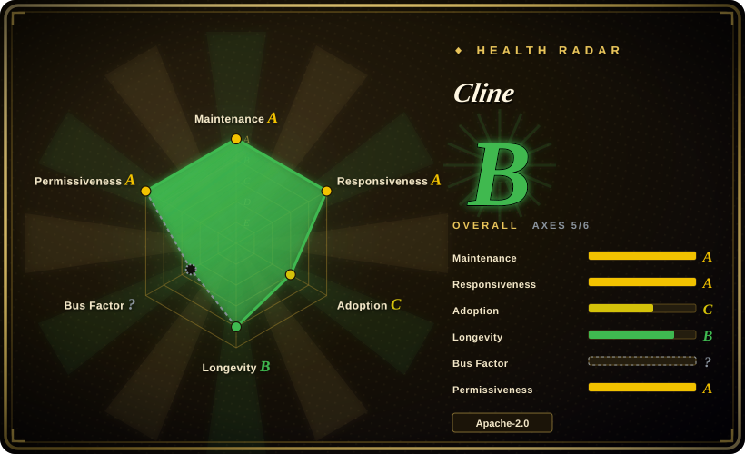
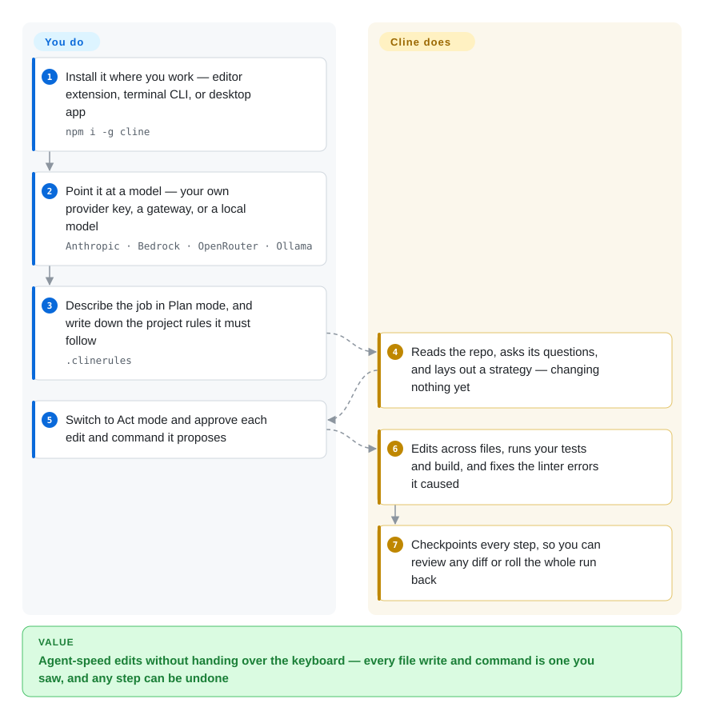

# Cline

An agent left alone on a real repo does not fail politely — it rewrites eight files you never opened, runs a command you did not authorize, and leaves you reconstructing what happened. Cline puts that whole loop inside your editor, terminal, or desktop app, behind per-action approval and per-step checkpoints, so nothing lands that you did not see and any step can be rolled back.

## When to use

You are working in a codebase nobody designed for agents to reason about — a monorepo with three build systems, a service whose generated files must never be hand-edited — and you want the agent to actually operate there: read the call graph, change several files, run the suite, fix the type errors it introduced. You install the Cline extension where you work (VS Code, JetBrains, or the `cline` CLI), point it at the model you already pay for, describe the job in Plan mode, and only then let it Act.

The deciding tradeoff against the closed alternatives is that none of the loop is hidden and none of it is rented: every edit and shell command arrives as a diff you approve (or auto-approve by tool class), each step is checkpointed, and provider choice stays yours — Anthropic, Bedrock, OpenRouter, a local Ollama model, or Cline's own hosted inference. Cursor and GitHub Copilot sell you the opposite bargain: less to configure, but a proprietary editor or hosted service whose agent internals you cannot read or replace. Cline is the pick when "I want an agent doing real work in my repo, and I want to see every move it makes" is the actual requirement.

## How it works

Cline is an agent loop with a toolbelt — read file, write file, run shell command, call an MCP server — and it decides which tool to reach for while working through your request. Two halves of the setup are yours. The **model** is yours to choose: Cline ships no model, so you plug in a provider key (or buy its hosted inference) and whoever serves the tokens bills you. The **rules** are yours to write: `.clinerules` files in the repo are handed to the agent on every task, so "never touch `db/schema.rb`" is written once instead of repeated in every prompt. The loop itself has two gears — **Plan** mode, where it may read and ask but change nothing, and **Act** mode, where it proposes edits and commands; by default each proposal waits for your click, and a checkpoint records the workspace at each step. When the build or linter reports an error, Cline reads that output and folds the repair into the same run.

<!-- flow-steps:begin (generated from flows/cline.json by tools/flow_card.py — do not edit) -->

Text version of the flow

1. **You**: Install it where you work — editor extension, terminal CLI, or desktop app — `npm i -g cline`
2. **You**: Point it at a model — your own provider key, a gateway, or a local model — `Anthropic · Bedrock · OpenRouter · Ollama`
3. **You**: Describe the job in Plan mode, and write down the project rules it must follow — `.clinerules`
4. **Cline**: Reads the repo, asks its questions, and lays out a strategy — changing nothing yet
5. **You**: Switch to Act mode and approve each edit and command it proposes
6. **Cline**: Edits across files, runs your tests and build, and fixes the linter errors it caused
7. **Cline**: Checkpoints every step, so you can review any diff or roll the whole run back

**Value**: Agent-speed edits without handing over the keyboard — every file write and command is one you saw, and any step can be undone

<!-- flow-steps:end -->

## When NOT to use

- **You want one subscription covering model, editor, and billing.** Cline is deliberately the reverse — you bring keys, you watch token spend, you read the diffs. If that ownership is the cost you want removed, take Cursor or GitHub Copilot and accept a closed product.
- **JetBrains support has to be open source.** The JetBrains plugin is not open-sourced in this repo and is bundled with the paid Enterprise tier. If open JetBrains parity is a hard requirement, compare [Kilo Code](kilocode.md)'s open plugin before standardizing on Cline.
- **The task is a one-file patch.** A full plan/approve/checkpoint loop is overhead for renaming a symbol; [Aider](../terminal-agents/aider.md) is the lighter terminal pair programmer for small, surgical edits in a git repo.
- **The agent should run unattended on a server, not on your laptop.** Cline's headless CLI can be scripted, but "triage this issue and open a PR overnight" is the sandboxed server-side case that [OpenHands](../orchestration-and-review/openhands.md) is built for.
- **You are building your own agent product.** `@cline/sdk` is real but young and shaped around Cline's own product surface; for a vendor-neutral runtime to embed, use a framework such as LangGraph rather than an end-user app that grew an SDK. [推断]
- **You need a surface that does not move weekly.** Releases land several times a day. If your constraint is "the tool must not change under me", that churn is a cost no amount of open source removes.

## Comparison

| Alternative | In index | Our verdict | Tradeoff |
|---|---|---|---|
| [Kilo Code](kilocode.md) | ✅ | Pick Cline for the upstream with the largest install base and the widest surface (IDE + CLI + desktop + SDK); pick Kilo Code when you want an active fork with its own mode/orchestrator layer and an open JetBrains plugin. | Both are open-source TypeScript VS Code agents with BYOK. Kilo Code descends from the same lineage and layers modes plus a model marketplace on top; Cline carries more platform integrations (Slack/Telegram/Discord connectors, scheduled agents) and the bigger user base. |
| [Roo Code](roo-code.md) | ✅ | Do not start here — Roo Code was archived 2026-05-15 after its team moved to a cloud product. Read it as the origin of mode-per-role agents and choose Cline or Kilo Code for anything you must maintain. | Its contribution was modes as first-class objects (Code/Architect/Ask/Debug plus custom `.roomodes`); the archive means no security or model-support fixes reach its 2M-install base. |
| [Continue](continue.md) | ✅ | Pick Cline for an agent you will still be updating next year; use Continue only for its config-driven design or to migrate off an existing install. | Continue's bet was one `config.yaml` shared by editor and CLI; the repo went read-only after a final 2.0.0 release (2026-06-19), freezing its 4.2M installs. |
| Cursor | 非仓库 | Pick Cursor for a polished closed editor with the agent fused into the UI and one bill; pick Cline when you need approval on every action and provider choice. | A proprietary VS Code fork: tighter editor integration and zero model setup, paid for with no BYOK-at-cost, no inspectable agent internals, and a subscription rather than metered inference. |
| GitHub Copilot | 非仓库 | Pick Copilot when the requirement is "an agent inside the GitHub/JetBrains tooling we already license, with zero setup"; pick Cline when you need your own tools, MCP servers, and command execution you approve. | A hosted Microsoft product: mature enterprise controls and a huge install base, but no open loop to extend, no checkpoints you own, and pricing set by the vendor rather than the provider you choose. |

## Tech stack

- **Language:** TypeScript (GitHub metadata, 2026-09-22).
- **Surfaces in one repo:** VS Code extension (`saoudrizwan.claude-dev`), CLI (`cline` on npm), desktop app (per the repo index: Tauri shell, Bun sidecar, Next.js UI), and the SDK (`@cline/sdk`).
- **Closed surface:** the JetBrains plugin is a client of the same agent core but is not open-sourced in this repo.
- **Model access:** BYOK across Anthropic, OpenAI, Google, OpenRouter, AWS Bedrock, GCP Vertex, Cerebras/Groq, Ollama/LM Studio and any OpenAI-compatible endpoint; or Cline's hosted providers (pay-as-you-go, plus ClinePass).
- **Extensibility:** MCP servers plus SDK plugins that register tools and lifecycle hooks.

## Dependencies

- **Required:** somewhere to run it — VS Code, a JetBrains IDE, a terminal, or the desktop app — **and a model you can reach**: your own provider key, a gateway, or a Cline account. With no model configured the agent does nothing.
- **CLI/SDK:** Node.js, since the CLI and SDK are npm packages (`cline`, `@cline/sdk`). The minimum Node version was not verified here. [未验证]
- **Optional:** MCP servers for extra tools; a messaging platform account (Slack, Telegram, Discord, Google Chat, WhatsApp, Linear) for the connector mode; a git host for the headless CI flows.
- **Release channel:** VS Code Marketplace, JetBrains Marketplace, npm, and GitHub Releases for the desktop build — there is no self-hosted server component.

## Ops difficulty

**Low to run, medium to govern.** Installing the extension and pasting a key is minutes of work; there is no service, datastore, or cluster to operate. What recurs is governance: BYOK means token spend tracks how freely the agent runs, and auto-approve settings decide how much it can do without asking, so teams end up maintaining `.clinerules` and locked-down approval policies as the real configuration surface. Version churn is the second cost — daily releases are great for model support and noisy if you pin and re-test. Enterprise capabilities (SSO, RBAC, centralized billing, the JetBrains plugin) move the burden from ops to procurement.

## Health & viability

- **Maintenance — very active.** Multiple releases on 2026-09-22 alone (CLI, desktop, SDK); the VS Code extension is at v4.1.19, last updated 2026-09-17; repo not archived.
- **Governance — a company rather than a solo maintainer.** The `cline` organisation (Cline Bot Inc.) owns the roadmap; the health scan counts 57 active maintainers over 12 months, with the top contributor holding roughly a third of commits — a thinner core team than that number suggests, but far from a bus factor of one.
- **Backing & longevity — funded vendor, young project.** The repo dates to July 2024, so age alone is not the reason to trust it; the offsetting fact is a commercial company whose paid products depend on the open agent staying alive. [未验证] Funding details and the enterprise roadmap are not verified here.
- **Adoption — large for its age.** ~69k GitHub stars; ~5.4M VS Code Marketplace installs; npm reports 461,575 downloads last month for `@cline/llms`.
- **Risk flags — open core, not open everything.** Apache-2.0 covers the agent loop, but the JetBrains plugin is explicitly not open-sourced and is sold with the Enterprise tier, and paid inference (Cline provider, ClinePass at $9.99/month) sits beside the free extension. No relicense in the last 36 months per the health scan.

## Caveats (unverified)

- [未验证] Node.js minimum version for the CLI/SDK, and whether the desktop app's bundled runtime removes that dependency entirely — neither is stated in the sources read here.
- [未验证] The multi-agent team mode, scheduled agents, and messaging connectors are described from the README only; their stability and eligibility across tiers were not tested.
- [未验证] Enterprise-tier boundaries (which capabilities are paid) come from the public pricing page, not from a contract; the JetBrains plugin's feature parity with the VS Code extension is likewise unverified.
- [推断] "Open core" is the honest description: the agent loop is Apache-2.0 while a closed plugin and paid hosted inference are sold alongside it — a judgment from the pricing page and README, not a stated company position.
- [未验证] Star count, Marketplace install count, and npm download figure are point-in-time readings from 2026-09-22 and move quickly in this category.
