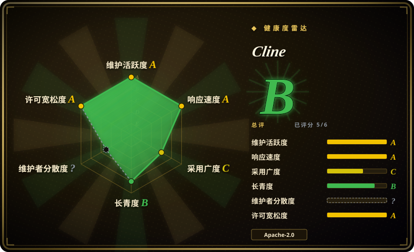
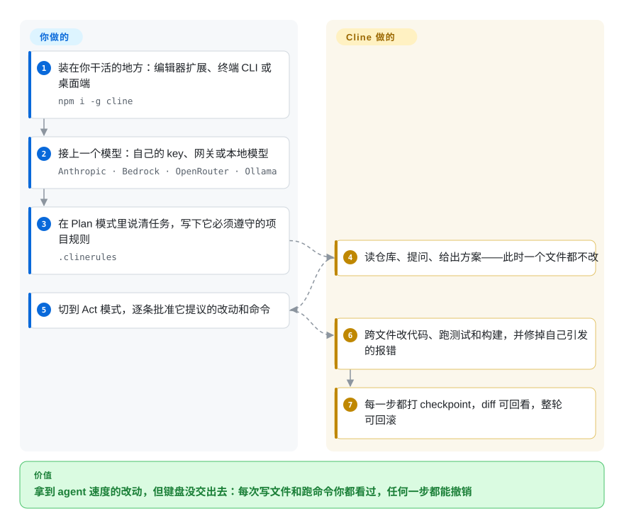

# Cline

把 agent 放进真实仓库，最贵的事故不是答错，而是你没看见的一次文件改写、你没授权的一条命令。Cline 把整个循环装进编辑器、终端或桌面端：每一步改动和命令都要你点头，每一步都留下能回滚的 checkpoint。

## 何时使用

你手上的仓库不是为 agent 设计的：monorepo 里塞了三套构建系统，有些文件是生成物、手改一次就出事。你要 agent 真在里面干活——读懂调用链、一次改好几个文件、跑测试、把它自己弄出来的类型错误修掉。于是你把 Cline 装在你干活的地方（VS Code、JetBrains，或 `cline` 命令行），接上你本来就在付钱的模型，先在 Plan 模式里讲清任务，再让它动手。

相比闭源方案，决定性的取舍是：这个循环既不藏在黑盒里，也不靠订阅租来。每一次改文件和跑命令都变成一份等你批准的 diff（也可以按工具类别开自动批准），每一步都有 checkpoint，模型供应商始终由你选——Anthropic、Bedrock、OpenRouter、本地 Ollama，或 Cline 自家的托管推理。Cursor 和 GitHub Copilot 卖的是相反的账：少配置，但你换来的是一个读不到、也换不掉其 agent 内核的专有编辑器或托管服务。当你的真实要求是「我要 agent 在我仓库里干真活，而且每一步我都要看得见」时，Cline 是那个选项。

## 怎么用起来

Cline 是一个带工具箱的 agent 循环——读文件、写文件、跑 shell 命令、调 MCP server——它自己在推进任务的过程中决定该抓哪个工具。有两半是你负责的。**模型**由你选：Cline 不自带模型，你接自己的 provider key（或买它的托管推理），谁出 token 谁收你的钱。**规则**由你写：仓库里的 `.clinerules` 文件会在每次任务时交给它，所以「`db/schema.rb` 绝对不许碰」写一次就够，不用每轮重复。循环本身有两个挡位——**Plan** 模式只准读和问，一个文件都不改；**Act** 模式才提出改动和命令。默认每个提议都等你点一下，并且每步都会记录 checkpoint。构建或 lint 报错时，Cline 读到那段输出，把修复并进同一轮任务里。

<!-- flow-steps:begin (generated from flows/cline.json by tools/flow_card.py — do not edit) -->

流程文字版

1. **你**：装在你干活的地方：编辑器扩展、终端 CLI 或桌面端 — `npm i -g cline`
2. **你**：接上一个模型：自己的 key、网关或本地模型 — `Anthropic · Bedrock · OpenRouter · Ollama`
3. **你**：在 Plan 模式里说清任务，写下它必须遵守的项目规则 — `.clinerules`
4. **Cline**：读仓库、提问、给出方案——此时一个文件都不改
5. **你**：切到 Act 模式，逐条批准它提议的改动和命令
6. **Cline**：跨文件改代码、跑测试和构建，并修掉自己引发的报错
7. **Cline**：每一步都打 checkpoint，diff 可回看，整轮可回滚

**价值**：拿到 agent 速度的改动，但键盘没交出去：每次写文件和跑命令你都看过，任何一步都能撤销

<!-- flow-steps:end -->

## 何时不用

- **你想用一份订阅把模型、编辑器和账单一起包掉。** Cline 是反着来的：key 你自己带、token 花销你自己盯、diff 你自己读。如果这份操心正是你想省掉的成本，那就选 Cursor 或 GitHub Copilot，代价是接受一个闭源产品。
- **JetBrains 支持必须是开源的。** 这个仓库里 JetBrains 插件并未开源，而是和付费 Enterprise 档绑定。如果「开源的 JetBrains 支持」是硬要求，先去看看 [Kilo Code](kilocode.zh.md) 的开放插件再决定。
- **任务只是改一个文件。** 为了重命名一个符号去走「计划—批准—checkpoint」全套流程太重；在 git 仓库里做小而准的改动，[Aider](../terminal-agents/aider.zh.md) 是更轻的终端结对工具。
- **agent 该在服务器上无人值守地跑，而不是在你笔记本上。** Cline 的无界面 CLI 可以写进脚本，但「夜里自己认领 issue 并开 PR」属于沙箱化的服务端场景，那是 [OpenHands](../orchestration-and-review/openhands.zh.md) 的地盘。
- **你要做自己的 agent 产品。** `@cline/sdk` 是真的，但年轻，而且形态围着 Cline 自己的产品长；要嵌入一个中立的 runtime，用 LangGraph 这类框架，而不是一个后来才长出 SDK 的终端产品。[推断]
- **你需要一个不会每周变动的界面。** 它一天发好几个版本。如果你的约束是「工具不许在我脚下变」，这份 churn 是开源也消不掉的成本。

## 横向对比

| 替代品 | 是否收录 | 我们的评价 | 取舍 |
|---|---|---|---|
| [Kilo Code](kilocode.zh.md) | ✅ | 想要装机量最大、面最宽（IDE + CLI + 桌面 + SDK）的上游，选 Cline；想要一个活跃分叉、自带模式/编排层并且 JetBrains 插件开源，选 Kilo Code。 | 两者都是开源 TypeScript VS Code agent，都走 BYOK。Kilo Code 与之同源，在上一层加了模式和模型市场；Cline 的平台集成更多（Slack/Telegram/Discord 连接器、定时 agent），用户盘子更大。 |
| [Roo Code](roo-code.zh.md) | ✅ | 别从这里开始：Roo Code 在 2026-05-15 归档，团队转去做云端产品了。把它当作「按角色分模式」这一设计的起点来读，要维护的东西选 Cline 或 Kilo Code。 | 它的贡献是把模式做成一等对象（Code/Architect/Ask/Debug 加自定义 `.roomodes`）；归档意味着安全修复和新模型支持都不再到来，200 万装机就此搁浅。 |
| [Continue](continue.zh.md) | ✅ | 要一个明年还在更新的 agent，选 Cline；Continue 只值得为它的配置驱动设计看，或为了迁走存量安装。 | Continue 的赌注是一份编辑器与 CLI 共用的 `config.yaml`；仓库在最终 2.0.0 版本（2026-06-19）之后转为只读，420 万装机冻结在旧代码上。 |
| Cursor | 非仓库 | 想要一个把 agent 焊进界面、一份账单全包的精致闭源编辑器，选 Cursor；需要每次动作都批准、供应商自己挑，选 Cline。 | 它是专有的 VS Code 分叉：编辑器集成更紧、模型零配置，代价是没有按成本 BYOK、agent 内核不可查看，而且付的是订阅而非按量推理。 |
| GitHub Copilot | 非仓库 | 当要求是「在我们已经买了 GitHub 的工具链里零配置地用上 agent」，选 Copilot；需要自己的工具、MCP server 和由你批准的命令执行，选 Cline。 | 微软的托管产品：企业管控成熟、装机巨大，但没有可以自己扩展的开放循环、没有属于你的 checkpoint，价格也由厂商而非你选的供应商决定。 |

## 技术栈

- **语言：** TypeScript（GitHub 元数据，2026-09-22）。
- **同一仓库里的多个入口：** VS Code 扩展（`saoudrizwan.claude-dev`）、CLI（npm 上的 `cline`）、桌面端（按仓库索引：Tauri 外壳、Bun sidecar、Next.js 界面）、以及 SDK（`@cline/sdk`）。
- **闭源部分：** JetBrains 插件调用同一套 agent 内核，但在这个仓库里没有开源。
- **模型接入：** BYOK，覆盖 Anthropic、OpenAI、Google、OpenRouter、AWS Bedrock、GCP Vertex、Cerebras/Groq、Ollama/LM Studio 以及任何 OpenAI 兼容端点；也可以用它自家的托管推理（按量付费，另有 ClinePass）。
- **扩展方式：** MCP server，以及用 SDK 注册工具和生命周期钩子的插件。

## 依赖

- **必需：** 一个运行它的地方——VS Code、JetBrains IDE、终端或桌面端——**以及一个你能调通的模型**：自己的 provider key、网关，或 Cline 账号。没配模型它就什么都不干。
- **CLI/SDK：** 需要 Node.js，因为 CLI 和 SDK 都是 npm 包（`cline`、`@cline/sdk`）。最低 Node 版本本次未核验。[未验证]
- **可选：** 想要更多工具就接 MCP server；要用连接器模式就需要一个消息平台账号（Slack、Telegram、Discord、Google Chat、WhatsApp、Linear）；无界面 CI 流程需要一个 git 托管方。
- **发布渠道：** VS Code Marketplace、JetBrains Marketplace、npm，桌面版走 GitHub Releases——没有需要自托管的服务端组件。

## 运维难度

**装上就能用，治理是中等活。** 装扩展、贴 key，几分钟的事，没有服务、数据库或集群要运维。真正反复出现的是治理：BYOK 意味着 token 花销跟你放手的程度成正比，自动批准设置决定了它不问就做的范围，所以团队最终会拿 `.clinerules` 和收紧的批准策略当作真正的配置面。第二块成本是版本 churn：一天几个版本对模型支持是好事，但如果你要锁版本再回归测试就很吵。企业能力（SSO、RBAC、集中计费、JetBrains 插件）则把负担从运维转到采购。

## 健康度与可持续性

- **维护活跃度——非常活跃。** 仅 2026-09-22 一天就有 CLI、桌面端、SDK 多个版本发布；VS Code 扩展为 v4.1.19，最后更新 2026-09-17；仓库未归档。
- **治理集中度——公司主导，不是个人项目。** 路线图归 `cline` 组织（Cline Bot Inc.）所有；健康度扫描统计到近 12 个月有 57 位活跃维护者，单一最大贡献者约占三分之一提交——核心团队比这个数字看起来的更薄，但远不是单人巴士系数。
- **长青度——有商业背书，但项目年轻。** 仓库始于 2024 年 7 月，单看年龄不足以让人下注；对冲这一点的是公司：它的付费产品依赖这个开源 agent 继续活着。[未验证] 融资细节与企业路线图本次未核验。
- **采用广度——相对年龄算大。** GitHub 约 6.9 万 star；VS Code Marketplace 约 540 万装机；npm 上 `@cline/llms` 上月下载量 461,575。
- **风险——开源核心，而非全部开源。** Apache-2.0 覆盖 agent 循环，但 JetBrains 插件明确不开源、与 Enterprise 档绑定，付费推理（Cline provider、$9.99/月的 ClinePass）与免费扩展并排售卖。健康度扫描未见近 36 个月的重许可事件。

## 存疑（未验证）

- [未验证] CLI/SDK 要求的最低 Node.js 版本，以及桌面端自带的 runtime 是否让这个依赖彻底消失——本次读到的来源都没有写。
- [未验证] 多 agent 团队模式、定时 agent、消息平台连接器都只来自 README 描述，其稳定性与各档位可用性未做实测。
- [未验证] 企业档的边界（哪些能力收费）来自公开定价页而非合同；JetBrains 插件与 VS Code 扩展的功能对等程度同样未核验。
- [推断] 「开源核心」是这里的诚实描述：agent 循环是 Apache-2.0，同时卖了闭源插件和付费托管推理——这是根据定价页和 README 的判断，不是公司明示的立场。
- [未验证] star 数、Marketplace 装机量与 npm 下载量均为 2026-09-22 的时点读数，在这个赛道里变动很快。
