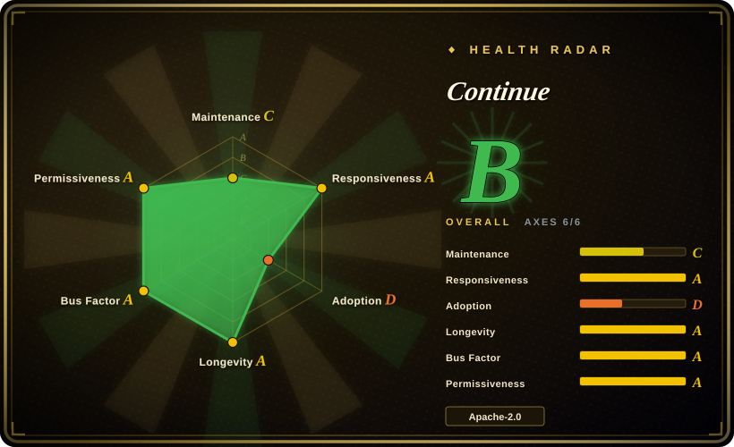
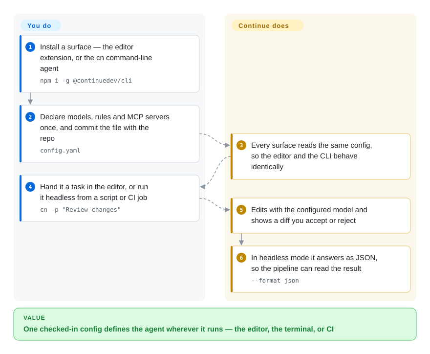

# Continue

If your team pinned its agent's behaviour into one committed `config.yaml` — models, rules, MCP servers — so that the editor and the terminal behave identically, that pattern is Continue's. The repository went read-only after a final 2.0.0 release on 2026-06-19, so the design is still worth studying and the code is now a migration problem rather than a dependency.

## When to use

Two situations. The first is that Continue is already installed across your team, with a shared `config.yaml` that names the model, the project rules and the tool servers — and you need to know whether it is still a safe default. It is not: the repository declares itself read-only, so the decision you are actually making is which live agent inherits that configuration.

The second is design research. Continue is the cleanest open example in this index of **config as the contract**: one checked-in file declares the model, the rules, the prompts, the context providers and the MCP servers, and every surface — VS Code, JetBrains, and the `cn` CLI — reads that same file. If you are building an agent whose behaviour must be reviewable in a pull request, or whose CLI must behave exactly like its editor plugin, read Continue's `config.yaml` design before inventing your own. For a live implementation of the same shape, [Cline](cline.md)'s rules files and MCP configuration are the maintained equivalent.

## How it works

Continue splits into a core engine, thin per-surface clients, and a small GUI, and the load-bearing decision is that almost nothing lives in the UI. You write a `config.yaml` naming the models, rules, prompts, context providers and MCP servers you want, and each surface renders whatever that file says — so the editor and the CLI cannot drift apart. Autocomplete asks the configured model for inline completions where you type; chat and agent mode use it for multi-file edits applied as diffs you accept; and the CLI runs the same agent without a terminal UI, with `-p` for scripts and `--format json` so a pipeline can consume the answer. Because the whole behaviour is one file, a change to how the agent works is a change someone reviews.

<!-- flow-steps:begin (generated from flows/continue.json by tools/flow_card.py — do not edit) -->

Text version of the flow

1. **You**: Install a surface — the editor extension, or the cn command-line agent — `npm i -g @continuedev/cli`
2. **You**: Declare models, rules and MCP servers once, and commit the file with the repo — `config.yaml`
3. **Continue**: Every surface reads the same config, so the editor and the CLI behave identically
4. **You**: Hand it a task in the editor, or run it headless from a script or CI job — `cn -p "Review changes"`
5. **Continue**: Edits with the configured model and shows a diff you accept or reject
6. **Continue**: In headless mode it answers as JSON, so the pipeline can read the result — `--format json`

**Value**: One checked-in config defines the agent wherever it runs — the editor, the terminal, or CI

<!-- flow-steps:end -->

## When NOT to use

- **You are choosing an agent to adopt today.** The repository is read-only and the maintainers state it is no longer actively maintained, so security fixes and new model support end here. Use [Cline](cline.md) or [Kilo Code](kilocode.md) instead.
- **You built automation on the hosted Hub or on sign-in.** The final release removed anonymous telemetry and pulled out authentication; treat the local config file as the only supported surface and do not design around a hosted account.
- **You want autocomplete and nothing else, with the model managed for you.** That is GitHub Copilot's product rather than Continue's: less control, no config file to maintain, and a vendor-set model list.
- **You want a terminal-first pair programmer for small diffs.** Continue's CLI is a second surface, not the primary one; [Aider](../terminal-agents/aider.md) is built terminal-first for surgical edits.
- **Your procurement requires a vendor that answers CVEs and ships fixes.** A frozen codebase is a liability regardless of how good the design is; weigh that before reusing it in anything long-lived.
- **You need a plugin ecosystem or an SDK to build on.** Continue's extension points are its config format, not a plugin API; for programmatic agent construction use a framework instead.

## Comparison

| Alternative | In index | Our verdict | Tradeoff |
|---|---|---|---|
| [Cline](cline.md) | ✅ | Pick Cline for a live, actively released agent; keep Continue only for the config-driven design you may want to copy. | Cline has an open core with vendor backing and daily releases, but its configuration surface is rules files plus settings rather than one declarative `config.yaml` shared with the CLI. |
| [Kilo Code](kilocode.md) | ✅ | Pick Kilo Code when you want modes and an orchestrator on top of an open extension that is still shipping; pick Continue only if the single-config-file model is the requirement. | Kilo Code is actively developed but younger, with its own churn; Continue's config contract is cleaner and now frozen. |
| [Roo Code](roo-code.md) | ✅ | Neither Continue nor Roo Code is a live choice — compare them as design references: one shared config file here, first-class modes there. | Roo Code modelled capability switching inside one editor; Continue modelled it as a file shared across surfaces and CI. Both repositories are frozen. |
| GitHub Copilot | 非仓库 | Pick Copilot when you want zero configuration and a vendor-managed model; pick Continue only if you need the behaviour declared in your repo. | Copilot is a closed hosted product with mature enterprise controls; Continue gives you a reviewable config and any provider, at the cost of maintaining it yourself on a frozen codebase. |

## Tech stack

- **Language:** TypeScript, in a pnpm monorepo: `core/` (agent engine), `extensions/vscode`, `extensions/intellij`, `extensions/cli` (published as `@continuedev/cli`, binary `cn`), `gui/`, `packages/`, plus `binary/` and `actions/`.
- **Configuration:** a `config.yaml` (plus a `.continue/` directory and `.continueignore`) declaring models, rules, prompts, context providers and MCP servers.
- **Surfaces:** VS Code extension (`Continue.continue`), JetBrains plugin, and the `cn` CLI with an interactive TUI and a headless mode.
- **Model access:** provider-agnostic — the model and provider are part of the config, so a local or hosted endpoint is a config change rather than a code change.

## Dependencies

- **Required:** VS Code or a JetBrains IDE for the extension, or a Node.js runtime for the CLI (`npm i -g @continuedev/cli`, Node 20+ per the CLI README). You also need at least one model endpoint reachable from the config.
- **Optional:** MCP servers for extra tools; a `.continue/` directory committed with the repository.
- **No service required.** The hosted account and Hub authentication were removed in the 2.0.0 release, so the whole thing runs client-side — which also means there is no vendor holding your config.

## Ops difficulty

**Low.** Nothing is deployed or operated: you install a surface, commit one config file, and the maintenance burden is only that the code no longer moves. The cost shows up later, as an upgrade-and-migrate project rather than as ongoing operations — the config file ports to another agent more easily than the integration does.

## Health & viability

- **Maintenance — frozen by declaration.** The README states the repository is no longer actively maintained and is read-only; the final release is v2.0.0 (2026-06-19), and the health scan sees 63 days since the last commit with only 1 active week in the last 13.
- **Governance — a company that stayed to close the door.** Continue Dev, Inc. (Apache-2.0, "2023-2026") owned the roadmap and required a CLA from contributors; the maintainers shipped a deliberate final release rather than abandoning the repo mid-stream.
- **Backing & longevity — the oldest of this group and the most abruptly stopped.** The repo dates to May 2023, so its served time was long enough for the Lindy prior to apply — which is what makes the read-only notice, rather than age, the deciding fact.
- **Adoption — a large installed base on a frozen build.** ~36k GitHub stars and ~4.2M VS Code Marketplace installs; the Open VSX monthly figure the health scan reads is 1,621,802.
- **Risk flags — CLA and a retired hosted tier.** Contributor licensing is corporate-friendly, and the 2.0.0 release removed telemetry and authentication — good for privacy, but it also signals the hosted business is gone. GitHub still reports the repository as not archived, so the freeze is declared in the README rather than enforced by the platform.

## Caveats (unverified)

- [未验证] The freeze rests on the README's own notice; the GitHub API still reports `archived: false` and recent pushes (2026-09-22), which are likely tag or non-default-branch activity rather than new work. [推断]
- [未验证] Whether the JetBrains plugin and the `cn` CLI received the same final 2.0.0 treatment as the VS Code extension; only the extension's marketplace version (v2.1.0) was checked.
- [未验证] Whether docs.continue.dev and the install scripts referenced by the CLI README will continue to be served now that the repository is read-only.
- [推断] Describing this as "frozen rather than dead" is our reading of a deliberate final release plus a read-only declaration; the maintainers did not use either word in the sources read here.
- [未验证] Star count and Marketplace install count are point-in-time readings from 2026-09-22.
