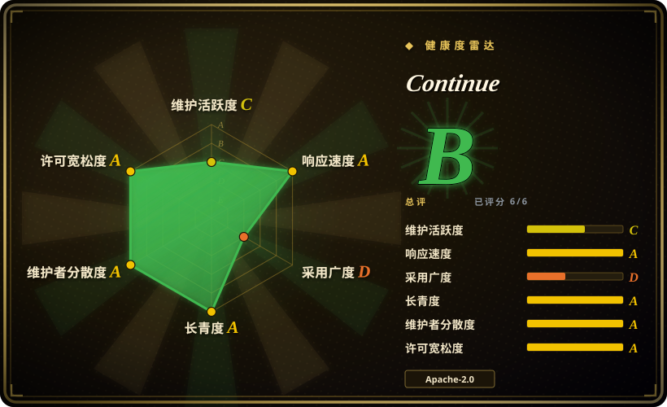
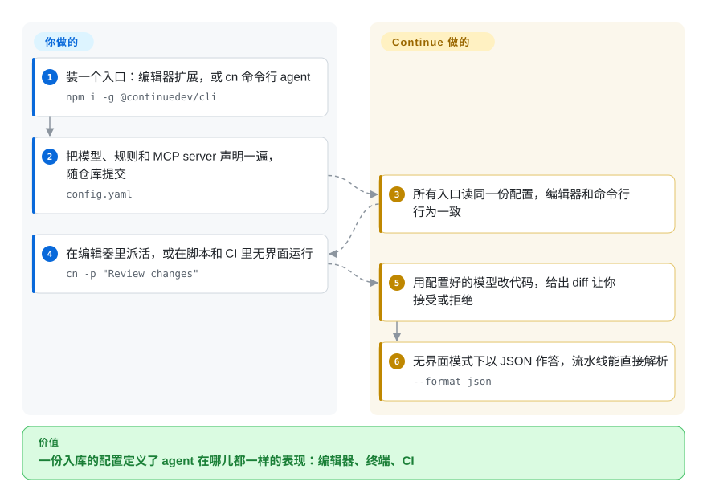

# Continue

如果你把 agent 的行为钉进了一份随仓库提交的 `config.yaml`——模型、规则、MCP server——让编辑器和终端表现完全一致，那套用法就出自 Continue。仓库在 2026-06-19 的最终 2.0.0 版本之后转为只读：设计仍值得研究，代码则从依赖变成了迁移问题。

## 何时使用

只有两种情形。第一种是 Continue 已经铺在你团队里：一份共享的 `config.yaml` 写着模型、项目规则和工具 server，而你需要知道它还算不算安全默认值。答案是不算——仓库已声明只读，你真正要做的决定是让哪个还在维护的 agent 继承这套配置。

第二种是设计调研。Continue 是本索引里**「配置即契约」**最干净的开源样例：一个入库文件声明了模型、规则、提示词、上下文来源和 MCP server，而所有入口——VS Code、JetBrains 和 `cn` 命令行——读的都是同一份文件。如果你要做的 agent 需要「行为能在 PR 里被评审」，或者它的命令行必须与编辑器插件行为完全一致，先读 Continue 的 `config.yaml` 设计，再决定自己那一套怎么长。想要同样形状但仍在维护的实现，[Cline](cline.zh.md) 的规则文件加 MCP 配置是当前对应的方案。

## 怎么用起来

Continue 拆成一个核心引擎、若干很薄的端侧客户端和一个小 GUI，其中最关键的决定是：几乎什么都不放在界面里。你写一份 `config.yaml`，声明要用的模型、规则、提示词、上下文来源和 MCP server，每个入口只负责把这份文件渲染出来——所以编辑器和命令行不可能各自跑偏。补全功能用配置里的模型给出你正在输入位置的行内补全；chat 和 agent 模式用它做跨文件改动，以 diff 形式让你接受；命令行则在同一个 agent 上跑无界面版本，用 `-p` 供脚本调用，用 `--format json` 让流水线直接解析结果。整套行为就是一个文件，因此「agent 工作方式的变更」本身也是有人评审的变更。

<!-- flow-steps:begin (generated from flows/continue.json by tools/flow_card.py — do not edit) -->

流程文字版

1. **你**：装一个入口：编辑器扩展，或 cn 命令行 agent — `npm i -g @continuedev/cli`
2. **你**：把模型、规则和 MCP server 声明一遍，随仓库提交 — `config.yaml`
3. **Continue**：所有入口读同一份配置，编辑器和命令行行为一致
4. **你**：在编辑器里派活，或在脚本和 CI 里无界面运行 — `cn -p "Review changes"`
5. **Continue**：用配置好的模型改代码，给出 diff 让你接受或拒绝
6. **Continue**：无界面模式下以 JSON 作答，流水线能直接解析 — `--format json`

**价值**：一份入库的配置定义了 agent 在哪儿都一样的表现：编辑器、终端、CI

<!-- flow-steps:end -->

## 何时不用

- **你正在为今天选一个要采用的 agent。** 仓库只读，维护者明说不再积极维护，安全修复和新模型支持到此为止。请用 [Cline](cline.zh.md) 或 [Kilo Code](kilocode.zh.md)。
- **你的自动化建在托管 Hub 或登录态上。** 最终版本移除了匿名遥测、也拆掉了认证；请把本地配置文件当作唯一受支持的界面，不要再围绕托管账号做设计。
- **你只要补全，其他都想托管出去。** 那是 GitHub Copilot 的产品，不是 Continue 的：控制更少、没有需要你维护的配置文件，模型清单由厂商定。
- **你要的是终端优先、改小 diff 的结对工具。** Continue 的命令行是它的第二个入口而非主场；专为外科手术式改动做的终端工具是 [Aider](../terminal-agents/aider.zh.md)。
- **你的采购要求厂商能响应 CVE、持续发版。** 冻结的代码库无论设计多好都是负债；要用在长生命周期的东西上之前先掂量这一点。
- **你需要插件生态或可构建的 SDK。** Continue 的扩展点是它的配置格式，不是插件 API；要做程序化的 agent 构建，用框架而不是它。

## 横向对比

| 替代品 | 是否收录 | 我们的评价 | 取舍 |
|---|---|---|---|
| [Cline](cline.zh.md) | ✅ | 要一个活的、持续发版的 agent，选 Cline；Continue 只保留为「值得抄的配置驱动设计」。 | Cline 是开源核心加厂商背书、一天多发；但它的配置面是规则文件加设置项，而不是一份与 CLI 共用的声明式 `config.yaml`。 |
| [Kilo Code](kilocode.zh.md) | ✅ | 想要一个仍在发版的开源扩展之上加模式和编排层，选 Kilo Code；只有「单一配置文件」是硬要求时才回到 Continue。 | Kilo Code 在活跃开发，但更年轻、自己也在快速变；Continue 的配置契约更干净，代价是已冻结。 |
| [Roo Code](roo-code.zh.md) | ✅ | Continue 和 Roo Code 都不是活选项——只把它们当设计参考来比：这边是一份共享配置文件，那边是一等公民模式。 | Roo Code 把能力切换做在单个编辑器内部；Continue 把它做成一份跨入口、跨 CI 共享的文件。两份仓库都已冻结。 |
| GitHub Copilot | 非仓库 | 想要零配置、模型由厂商托管，选 Copilot；只有需要把行为声明进自己仓库时才选 Continue。 | Copilot 是闭源托管产品，企业管控成熟；Continue 给你可评审的配置和任意供应商，代价是在冻结的代码库上自己维护。 |

## 技术栈

- **语言：** TypeScript，pnpm monorepo：`core/`（agent 引擎）、`extensions/vscode`、`extensions/intellij`、`extensions/cli`（发布为 `@continuedev/cli`，命令 `cn`）、`gui/`、`packages/`，另有 `binary/` 与 `actions/`。
- **配置：** 一份 `config.yaml`（外加 `.continue/` 目录与 `.continueignore`），声明模型、规则、提示词、上下文来源和 MCP server。
- **入口：** VS Code 扩展（`Continue.continue`）、JetBrains 插件，以及带交互式 TUI 和无界面模式的 `cn` 命令行。
- **模型接入：** provider 无关——模型和供应商是配置的一部分，本地端点还是托管端点只是改配置，不用改代码。

## 依赖

- **必需：** 用扩展就需要 VS Code 或 JetBrains IDE；用 CLI 就需要 Node.js 运行时（`npm i -g @continuedev/cli`，CLI README 写的门槛是 Node 20+）。另外至少要有一个能在配置里指到的模型端点。
- **可选：** 想要更多工具就接 MCP server；随仓库提交一个 `.continue/` 目录。
- **不需要任何服务。** 托管账号与 Hub 认证在 2.0.0 里被移除，整套东西在客户端跑——这也意味着没有厂商握着你的配置。

## 运维难度

**低。** 没有东西要部署或运维：装一个入口、提交一份配置文件，之后唯一的维护负担是代码不再更新。这笔成本会以「升级迁移项目」而不是「日常运维」的形式出现——配置文件搬到别的 agent 上，比那套集成容易得多。

## 健康度与可持续性

- **维护活跃度——官宣冻结。** README 明确写着仓库不再积极维护、且为只读；最终版本是 v2.0.0（2026-06-19），健康度扫描显示距最后提交已 63 天，近 13 周里只有 1 周有活动。
- **治理集中度——留下来把门关好的公司。** 路线图归 Continue Dev, Inc.（Apache-2.0，“2023-2026”）所有，贡献者需要签 CLA；维护者是刻意做了最后一个版本，而不是做到一半弃坑。
- **长青度——这一组里最老，也停得最突然。** 仓库始于 2023 年 5 月，服役时间已经长到足以让 Lindy 先验起作用——也正因如此，决定性的实事是那份只读声明，而不是年龄。
- **采用广度——冻结版本上仍有庞大装机。** GitHub 约 3.6 万 star，VS Code Marketplace 约 420 万装机；健康度扫描读到的 Open VSX 月度为 1,621,802。
- **风险——CLA 与已退役的托管层。** 贡献者授权对公司友好；2.0.0 移除了遥测与认证，对隐私是好事，但同时也说明托管业务已经结束。GitHub 仍将该仓库标为未归档，所以这次冻结写在 README 里，而不是由平台强制。

## 存疑（未验证）

- [未验证] 冻结的依据是 README 自己的声明；GitHub API 仍显示 `archived: false` 且近期有 push（2026-09-22），这更可能是 tag 或非默认分支活动，而非新开发。[推断]
- [未验证] JetBrains 插件与 `cn` 命令行是否和 VS Code 扩展一样收到最终的 2.0.0 收尾；本次只核了扩展在市场的版本（v2.1.0）。
- [未验证] 在仓库转为只读之后，docs.continue.dev 与 CLI README 引用的安装脚本是否仍会继续提供。
- [推断] 把它描述为「冻结而非死亡」，是我们基于「刻意发布最终版本 + 声明只读」的判断；本次读到的来源里维护者并未使用这两个词。
- [未验证] star 数与 Marketplace 装机量为 2026-09-22 的时点读数。
