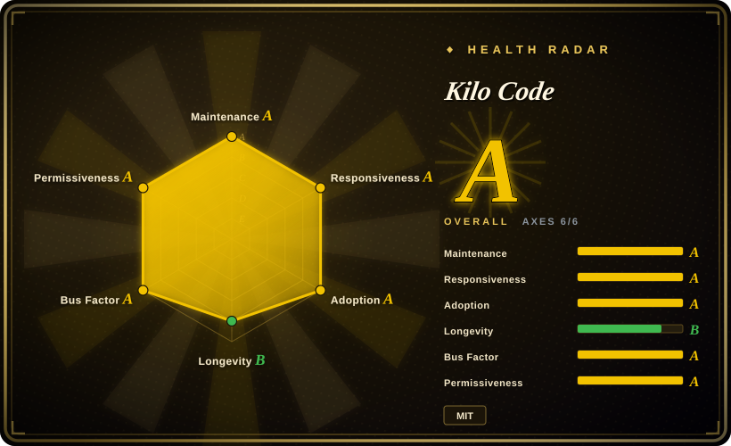
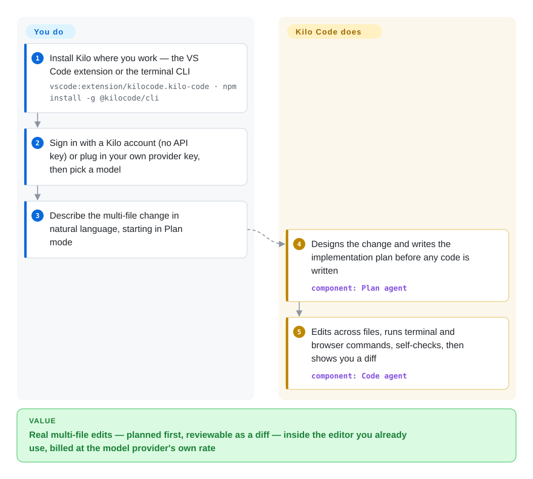

# Kilo Code

Your AI coding helper lives in a chat sidebar, so every multi-file change turns into copy-paste and hand-holding. Kilo Code is an open-source coding agent that works where you already are — VS Code, JetBrains, or the terminal: it plans the change, edits across files, runs commands, and lets you pick among 500+ models, billed at the provider's own rate.

## When to use

You're a developer who wants an autonomous coding agent *inside the editor you already use* (or in your terminal), not a separate chat window you copy-paste between. You're working through a multi-file change — refactor a service, wire up a new endpoint, chase a bug across the call graph — and you want the agent to read the repo, propose a plan, edit the files in place, run the test command, and show you a diff to approve. You also don't want to be locked to one model vendor or one opaque subscription price: you can start through a Kilo account with no API keys at all, or plug in your own Anthropic/OpenAI/Gemini/OpenRouter/Ollama key and pay the provider directly at its own rate.

You reach for it specifically when you want an *open-source* coding agent with an explicit agent-mode workflow — a `Plan` mode that designs the change before any code is written, a `Code` mode that implements it, plus `Ask` and `Debug`, and custom agents you define — rather than a single undifferentiated chat loop. It's a good fit when your bottleneck is *getting an agent to do real edits in your repo* and you value MIT-licensed, bring-your-own-key tooling over a closed product; less so when you want a library to build *your own* agents on (see "When NOT to use").

## How it works

Kilo puts a specialized agent inside your editor (or terminal) that acts on your workspace rather than just answering about it. You describe a task; a `Plan` agent designs the change and writes an implementation plan before any code is touched, then a `Code` agent edits across files, runs terminal and browser commands, and *self-checks* — reviewing and correcting its own work — before handing you a diff to approve. `Ask` answers questions without touching files and `Debug` traces issues; you can author custom agents too. What stays yours: approving edits, picking the model (500+ via the Kilo gateway at provider pricing, or your own provider keys/local models), and watching token spend. The same agent ships as a terminal CLI (`@kilocode/cli` — a fork of OpenCode per the README FAQ), where `kilo run --auto "…"` drives it unattended for CI/CD, and a Kilo Marketplace installs additional agents, skills, MCP servers, and plugins on top.

<!-- flow-steps:begin (generated from flows/kilocode.json by tools/flow_card.py — do not edit) -->

Text version of the flow

1. **You**: Install Kilo where you work — the VS Code extension or the terminal CLI — `vscode:extension/kilocode.kilo-code · npm install -g @kilocode/cli`
2. **You**: Sign in with a Kilo account (no API key) or plug in your own provider key, then pick a model
3. **You**: Describe the multi-file change in natural language, starting in Plan mode
4. **Kilo Code**: Designs the change and writes the implementation plan before any code is written — component: `Plan agent`
5. **Kilo Code**: Edits across files, runs terminal and browser commands, self-checks, then shows you a diff — component: `Code agent`

**Value**: Real multi-file edits — planned first, reviewable as a diff — inside the editor you already use, billed at the model provider's own rate

<!-- flow-steps:end -->

<!-- flow-steps:begin (generated from flows/kilocode.json by tools/flow_card.py — do not edit) -->
<!-- flow-steps:end -->

## When NOT to use

- **You want a framework to build your own agents on.** This is the sharpest filter: Kilo Code is an **end-user coding agent**, not a library/SDK — even its CLI is a fork of the end-user OpenCode agent. If you're building a custom multi-agent application or your own agent runtime, you want a framework ([DSPy](../../workflow-builders/dspy.md), [AgentScope](../../agent-runtimes/agent-sdks/agentscope.md)), not a finished extension. There's no provider-agnostic "agent core" you import.
- **JetBrains is your hard requirement.** The JetBrains plugin ships on its own, lagging release train (v7.1.x while the VS Code extension is at v7.8.x, as of 2026-09), and the repo carries an open `docs/jetbrains-vscode-settings-parity.md` work item — settings parity with VS Code is a stated goal, not a guarantee. [未验证] current feature gap size.
- **You need a stable, slow-moving surface.** The project ships extremely aggressively (VS Code extension v7.8.1 landed 2026-09-25; ~236 releases total, often several a week). That velocity is great for features but is churn you'd be coupling to if you standardize a team on it.
- **You want costs fully managed/predictable for you.** Whether you start through the Kilo account gateway or bring your own key, *you* own token-spend management — spend tracks whatever model you pick and how hard the agent works. A closed product with a flat subscription removes that variable; Kilo deliberately doesn't. The hosted pieces (Cloud Agent, automated Code Reviews at app.kilo.ai) add a platform surface beyond the open extension.
- **You need the most battle-tested open option.** Against Cursor / GitHub Copilot (years of polish, huge install base) and even the older open siblings — Cline (~69k stars) and the now-archived Roo Code — Kilo Code is younger as a named project (created 2025-03); for risk-averse, load-bearing adoption weigh that maturity gap.

## Comparison

| Alternative | In index | Our verdict | Tradeoff |
|---|---|---|---|
| [Cline](cline.md) | ✅ | When you want the largest community-driven open-source VS Code coding agent under Apache-2.0 with no platform account, pick Cline; pick Kilo when the mode workflow, JetBrains/CLI surfaces, and marketplace matter more. | Cline is the leaner, older open VS Code agent (Kilo descends from the same Roo Code / Cline lineage — see Caveats); Kilo layers modes, custom agents, a model gateway, and hosted platform pieces on top. |
| [Roo Code](roo-code.md) | ✅ | Choose Roo Code only as a design reference: it was archived on 2026-05-15, so pick Kilo Code for anything you must maintain. | Kilo Code descends from Roo Code (see Caveats), and the mode model overlaps — but Roo Code's products were shut down and its code is frozen, so it is no longer a live alternative. |
| Cursor | 非仓库 | Choose Cursor when you need a closed-source AI-first *editor* rather than an extension. | Closed-source AI-first *editor* (a VS Code fork), not an extension; deeply integrated, paid subscription, no BYOK-at-provider-cost openness. More polished, less open. |
| GitHub Copilot | 非仓库 | Choose GitHub Copilot when you need Microsoft's closed completion+chat+agent across VS Code/JetBrains. | Closed, Microsoft-backed completion+chat+agent in VS Code/JetBrains; huge adoption and stability, vendor-managed pricing, no self-keyed multi-provider model. |
| [oh-my-claudecode](../orchestration-and-review/oh-my-claudecode.md) | ✅ | Choose oh-my-claudecode when you've already standardized on Claude Code and want team pipelines and model routing on top of it. | Orchestration *layer on top of* Anthropic's Claude Code CLI (team pipelines, model routing, tmux). Kilo Code is a standalone agent with its own surfaces, not a wrapper around another agent CLI. |

## Tech stack

- **Language:** TypeScript (primary, per repo metadata 2026-09-27).
- **Surfaces:** **VS Code extension** (Marketplace), **JetBrains plugin** (Marketplace, separate version line), and a terminal **CLI** (`@kilocode/cli`, described in the README FAQ as a fork of OpenCode); plus hosted Cloud Agent and PR Code Reviews on app.kilo.ai.
- **Agent surface:** specialized agents — `Code`, `Plan`, `Ask`, `Debug` — for plan-then-implement workflows, custom agents, inline autocomplete (ghost text, tab to accept), self-checking, terminal and browser control.
- **Models:** 500+ models with mid-task switching at provider rate (zero markup, no API key required to start via a Kilo account); direct provider/BYOK config covers Anthropic, OpenAI, Gemini, OpenRouter, Ollama, Bedrock, and many more per kilo.ai/docs.
- **Extensions:** a Kilo Marketplace installs agents, skills, MCP servers, and plugins.

## Dependencies

- **Required:** a host surface — VS Code, a JetBrains IDE, or a terminal; **and a model behind it** — either a Kilo account (no API key to start) or your own provider keys / local model.
- **Install (VS Code):** install the Kilo Code extension from the VS Code Marketplace (or `vscode:extension/kilocode.kilo-code`).
- **Install (JetBrains):** install the Kilo Code plugin from the JetBrains Marketplace.
- **Install (CLI):** `npm install -g @kilocode/cli` (also curl script, pnpm/bun, Homebrew tap, AUR), then run `kilo`.
- **Optional:** hosted Cloud Agent and Code Reviews on app.kilo.ai — platform services beyond the open extension.

## Ops difficulty

**Low.** As an end-user tool there's no service to deploy or operate: install the extension or CLI, sign in (or paste a provider key), pick a model, and go. The real "ops" is (1) **provider-cost management** — token spend tracks your model choice and how hard the agent works — and (2) keeping up with a fast release cadence on up to three surfaces, whose version lines lag each other. There's no datastore, no server, no clustering. If you wire `kilo run --auto` into CI, note it auto-approves permission prompts unless a rule denies them, so restrict it to trusted environments. The harder, non-obvious cost is reviewing the agent's edits and command execution carefully — an in-repo agent that runs commands and rewrites files needs a human in the loop and sane git hygiene, which is workflow discipline rather than operational burden.

## Health & viability

- **Responsiveness — good (as of 2026-09).** Median first response 20.1 hours across 14 qualifying issues (health radar grade A).
- **Maintenance — very active (as of 2026-09).** Last push 2026-09-26; ~236 releases with the VS Code extension at v7.8.1 (2026-09-25) and the JetBrains line at v7.1.8 landing within days of each other. Not archived. Actively, heavily maintained.
- **Governance / backing — org-owned, appears funded.** Owned by an **Organization** (`Kilo-Org`), not a single user — a better bus-factor signal than a solo repo, and the "all-in-one agentic engineering platform" positioning (hosted Cloud Agent, Code Reviews, marketplace) suggests a commercial/funded effort building a paid platform around the open extension. [未验证] funding/commercial details and roadmap ownership.
- **Age & Lindy — past year one, still unproven.** Created 2025-03, ~1.5 years old (as of 2026-09). High activity and rapid adoption (~27.4k stars, npm download volume in the millions/month per the health radar), but no long track record — **active-but-unproven**, not Lindy-safe. Fast-moving surface ⇒ expect churn.
- **Lineage as a continuity signal.** The CLI is openly a fork of OpenCode (README FAQ, 2026-09); the VS Code extension is widely understood to descend from the Roo Code / Cline lineage (see Caveats), and its upstream Roo Code was **archived 2026-05-15** — consolidation of that lineage into Kilo cuts both ways: accumulated design maturity, but Kilo now carries the maintenance torch.
- **Lock-in & risk — low.** MIT-licensed and BYOK-capable, so low vendor lock-in: you keep your model keys and can walk to a sibling/alternative agent. The Kilo account gateway and hosted platform pieces are the soft spot — convenience now, a commercial dependency if pricing/APIs move. Main risk is velocity + the hosted platform's economics, not licensing.

## Caveats (unverified)

- [未验证] Funding/commercial details and roadmap ownership behind `Kilo-Org` and the paid platform (Cloud Agent, Code Reviews) — inferred from positioning, not from any published company disclosure read here.
- [推断] The VS Code extension's lineage from Roo Code and Cline (Kilo as a Roo Code fork that absorbed Cline features) is widely reported, but the current README does **not** state it (it only documents the CLI's OpenCode fork) — historical, not re-confirmed from the repo here.
- [推断] "500+ models," "zero markup," and the "all-in-one agentic engineering platform" framing are the project's own README/marketing claims; not independently benchmarked.
- [未验证] The four named agents (`Code`/`Plan`/`Ask`/`Debug`), self-checking, and browser control are per README; the README no longer lists a `Review` mode that earlier versions advertised — the set shifts release-to-release and was not verified against code.
- [未验证] JetBrains plugin feature parity with the VS Code extension: the repo itself tracks it as an open parity document; the size of the current gap was not measured.
- [推断] Classifying it as `app` (an end-user product) rather than `framework`/`library` is a judgment call — it is a packaged coding agent you use, not a toolkit you build agents with.
