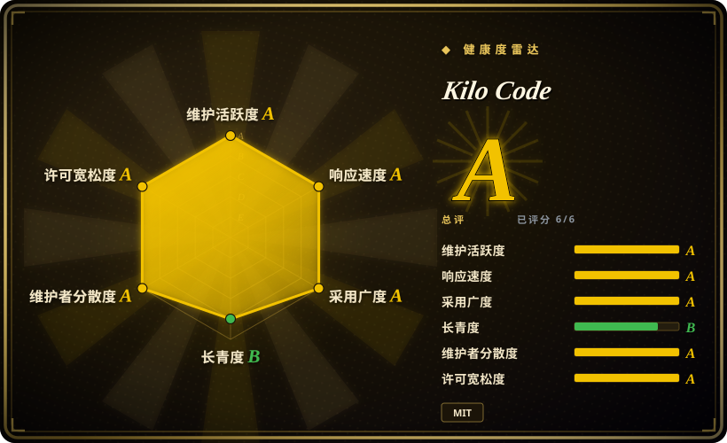
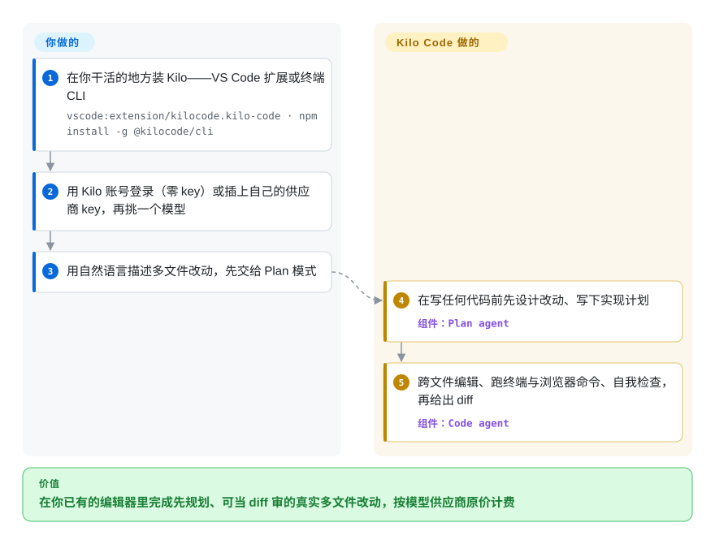

# Kilo Code

AI 编码助手住在聊天侧边栏里，于是每个多文件改动都变成复制粘贴和人工盯梢。Kilo Code 是一个开源编码 agent，直接在你已有的阵地工作——VS Code、JetBrains 或终端：它会先规划改动、跨文件编辑、执行命令，并让你在 500+ 模型间挑选，按供应商原价计费。

## 何时使用

你是个开发者，想要一个自主编码 agent *就在你已经在用的编辑器里*（或者在终端里），而不是一个要来回拷贝粘贴的独立对话窗。你正在做一个多文件改动——重构一个 service、接一个新 endpoint、顺着调用图追一个 bug——你希望 agent 读仓库、给出方案、原地改文件、跑测试命令、再给你一份 diff 让你批准。你也不想被绑死在单一模型厂商或一个不透明的订阅价上：既可以用 Kilo 账号直接开始（一个 API key 都不用），也可以插上自己的 Anthropic/OpenAI/Gemini/OpenRouter/Ollama key，按供应商原价直接付钱。

你之所以选它，正是因为想要一个*开源*、带显式 agent 模式工作流的编码 agent——一个在写任何代码前先设计改动的 `Plan` 模式、一个实现它的 `Code` 模式，外加 `Ask` 和 `Debug`，还能自定义 agent——而不是一条不加区分的单一对话循环。当你的瓶颈是*让一个 agent 在你的仓库里做真实改动*、且你看重 MIT 许可、可自带 key 的工具胜过封闭产品时，它很合适；当你想要一个用来搭*你自己的* agent 的库时则不太合适（见「何时不用」）。

## 怎么用起来

Kilo 把一个专职 agent 放进你的编辑器（或终端），让它直接对工作区动手，而不只是谈论它。你描述一个任务：`Plan` agent 先设计改动、在动任何代码前写下实现计划，然后 `Code` agent 跨文件编辑、跑终端和浏览器命令，并*自我检查*——先 review 并修正自己的成果——再把一份 diff 交给你批准。`Ask` 只回答问题不碰文件，`Debug` 负责追问题；你还能自己写自定义 agent。仍然归你管的：批准改动、挑模型（Kilo 网关按供应商原价提供 500+ 模型，或自带供应商 key/本地模型）、盯 token 花销。同一个 agent 也有终端 CLI 形态（`@kilocode/cli`，README FAQ 自述为 OpenCode 的分叉），`kilo run --auto "…"` 可以无提示驱动它跑 CI/CD；Kilo Marketplace 还能再装上额外的 agent、skills、MCP server 和插件。

<!-- flow-steps:begin (generated from flows/kilocode.json by tools/flow_card.py — do not edit) -->

流程文字版

1. **你**：在你干活的地方装 Kilo——VS Code 扩展或终端 CLI — `vscode:extension/kilocode.kilo-code · npm install -g @kilocode/cli`
2. **你**：用 Kilo 账号登录（零 key）或插上自己的供应商 key，再挑一个模型
3. **你**：用自然语言描述多文件改动，先交给 Plan 模式
4. **Kilo Code**：在写任何代码前先设计改动、写下实现计划 — 组件：`Plan agent`
5. **Kilo Code**：跨文件编辑、跑终端与浏览器命令、自我检查，再给出 diff — 组件：`Code agent`

**价值**：在你已有的编辑器里完成先规划、可当 diff 审的真实多文件改动，按模型供应商原价计费

<!-- flow-steps:end -->

<!-- flow-steps:begin (generated from flows/kilocode.json by tools/flow_card.py — do not edit) -->
<!-- flow-steps:end -->

## 何时不用

- **你想要一个用来搭自己 agent 的框架。** 这是最锋利的判别：Kilo Code 是个**最终用户编码 agent**，不是库/SDK——连它的 CLI 也是最终用户 agent OpenCode 的分叉。如果你在搭一个定制的多 agent 应用、或你自己的 agent 运行时，你该选框架（[DSPy](../../workflow-builders/dspy.zh.md)、[AgentScope](../../agent-runtimes/agent-sdks/agentscope.zh.md)），而不是一个成品扩展。这里没有一个可以 import 的供应商无关「agent 内核」。
- **JetBrains 是你的硬需求。** JetBrains 插件走自己滞后的发版列车（截至 2026-09，VS Code 扩展已在 v7.8.x，插件还在 v7.1.x），而且仓库里放着一份尚未完结的 `docs/jetbrains-vscode-settings-parity.md` 对齐清单——与 VS Code 的设置对等是明说目标，不是保证。[未验证] 当前差距有多大。
- **你需要一个稳定、慢节奏的表面。** 项目发版极猛（VS Code 扩展 v7.8.1 于 2026-09-25 落地；发布约 236 个，常一周数个）。这种速度对出特性是福音，但你要把团队标准化在它上面的话，耦合的就是这份 churn。
- **你想要成本被完全托管、可预测。** 无论从 Kilo 账号网关开始还是自带 key，*你自己*承担 token 成本管理——花销取决于你选哪个模型、agent 干得多狠。一个带统一订阅价的封闭产品会消掉这个变量；Kilo 刻意不这么做。托管件（Cloud Agent、app.kilo.ai 的自动 Code Reviews）还在开放扩展之外加了一层平台表面。
- **你需要最能打的开源选项。** 对比 Cursor / GitHub Copilot（多年打磨、海量装机），乃至更年长的开源兄弟 Cline（约 69k star）和已归档的 Roo Code，Kilo Code 作为一个具名项目更年轻（2025-03 创建）；对规避风险、承重的采用，要掂量这份成熟度差距。

## 横向对比

| 替代品 | 是否收录 | 我们的评价 | 取舍 |
|---|---|---|---|
| [Cline](cline.zh.md) | ✅ | 想要最大的社区驱动开源 VS Code 编码 agent、Apache-2.0 且无需平台账号时，选 Cline；看重模式工作流、JetBrains/CLI 表面和 marketplace 时，选 Kilo。 | Cline 是更精简、更年长的开源 VS Code 编码 agent（Kilo 与它同源于 Roo Code / Cline 血统——见存疑清单）；Kilo 在其上叠加模式、自定义 agent、模型网关和托管平台件。 |
| [Roo Code](roo-code.zh.md) | ✅ | 只把 Roo Code 当设计参考：它已于 2026-05-15 归档，要维护的东西请选 Kilo Code。 | Kilo Code 由其衍生（见存疑清单），模式模型也重叠——但 Roo Code 的产品已关停、代码已冻结，不再是活选项。 |
| Cursor | 非仓库 | 需要闭源 AI 优先*编辑器*，而不是扩展时，选 Cursor。 | 闭源的 AI 优先*编辑器*（一个 VS Code 分叉），不是扩展；集成很深、付费订阅，没有「按供应商原价的 BYOK」这份开放性。更精致，更不开放。 |
| GitHub Copilot | 非仓库 | 需要微软背书的闭源补全+对话+agent，覆盖 VS Code/JetBrains 时，选 GitHub Copilot。 | 闭源、微软背书的补全+对话+agent，在 VS Code/JetBrains 里；装机量巨大、稳定，厂商托管定价，没有自带 key 的多供应商模型。 |
| [oh-my-claudecode](../orchestration-and-review/oh-my-claudecode.zh.md) | ✅ | 已经全线押在 Claude Code 上、要在其上加 team 流水线与模型路由时，选 oh-my-claudecode。 | 架在 Anthropic Claude Code CLI *之上*的编排层（team 流水线、模型路由、tmux）。Kilo Code 是自带多种表面的独立 agent，不是包另一个 agent CLI 的壳。 |

## 技术栈

- **语言：** TypeScript（主语言，仓库元数据 2026-09-27）。
- **表面：** **VS Code 扩展**（Marketplace）、**JetBrains 插件**（Marketplace，独立版本线）、终端 **CLI**（`@kilocode/cli`，README FAQ 自述为 OpenCode 的分叉）；另有 app.kilo.ai 上的托管 Cloud Agent 与 PR Code Reviews。
- **agent 表面：** 专职 agent——`Code`、`Plan`、`Ask`、`Debug`——支撑「先规划再实现」工作流，外加自定义 agent、行内补全（ghost text、tab 接受）、自我检查、终端与浏览器控制。
- **模型：** 500+ 模型、可任务中途切换、按供应商原价（零加价，Kilo 账号起步无需 API key）；直连/BYOK 按 kilo.ai/docs 覆盖 Anthropic、OpenAI、Gemini、OpenRouter、Ollama、Bedrock 等众多供应商。
- **扩展：** Kilo Marketplace 可安装 agent、skills、MCP server 与插件。

## 依赖

- **必需：** 一个承载表面——VS Code、JetBrains IDE 或终端；**背后还要有模型**——要么一个 Kilo 账号（起步零 key），要么你自己的供应商 key/本地模型。
- **安装（VS Code）：** 从 VS Code Marketplace 安装 Kilo Code 扩展（或 `vscode:extension/kilocode.kilo-code`）。
- **安装（JetBrains）：** 从 JetBrains Marketplace 安装 Kilo Code 插件。
- **安装（CLI）：** `npm install -g @kilocode/cli`（也有 curl 脚本、pnpm/bun、Homebrew tap、AUR），然后运行 `kilo`。
- **可选：** app.kilo.ai 上的托管 Cloud Agent 与 Code Reviews——开放扩展之外的平台服务。

## 运维难度

**低。** 作为最终用户工具，没有服务要部署或运维：装扩展或 CLI、登录（或贴上供应商 key）、选个模型，就走。真正的「运维」是（1）**供应商成本管理**——token 花销取决于你的模型选择和 agent 的干活强度；以及（2）跟上最多三条表面各自的快速发版节奏，它们的版本线互相滞后。没有数据存储、没有服务端、没有集群。如果把 `kilo run --auto` 接进 CI，注意它会替你自动批准权限提示、除非有规则显式拒绝，所以只用在可信环境。更隐蔽的成本是仔细 review agent 的改动和命令执行——一个在仓库内跑命令、重写文件的 agent 需要人在环里加上像样的 git 卫生习惯，这是工作流纪律而非运维负担。

## 健康度与可持续性

- **响应速度——良好（截至 2026-09）。** 14 个合格 issue 的中位首响 20.1 小时（健康度雷达 A 档）。
- **维护——非常活跃（截至 2026-09）。** 最后推送 2026-09-26；发布约 236 个，VS Code 扩展 v7.8.1（2026-09-25）与 JetBrains v7.1.8 常彼此相隔几天落地。未归档。在被积极、密集地维护。
- **治理与背书——组织持有，看似有资金。** 由一个**组织**（`Kilo-Org`）持有，而非单个用户——比独自一人的仓库是更好的 bus-factor 信号，而「all-in-one agentic engineering platform」的定位（托管 Cloud Agent、Code Reviews、marketplace）暗示这是个商业/有资金的努力，在开源扩展周边搭一个付费平台。[未验证] 资金/商业细节与路线图归属。
- **年龄与 Lindy——过了第一年，仍未被证明。** 2025-03 创建，约 1 岁半（截至 2026-09）。活跃度高、采用迅猛（约 27.4k star，健康度雷达显示 npm 月下载量在百万级），但没有长期沉淀——是「活跃但未经证明」，而非 Lindy 安全。快速变动的表面 ⇒ 预期 churn。
- **血统作为延续性信号。** CLI 公开自述是 OpenCode 的分叉（README FAQ，2026-09）；VS Code 扩展则普遍认为衍生自 Roo Code / Cline 编码 agent 血统（见存疑清单），其上游 Roo Code 已于 **2026-05-15 归档**——血统向 Kilo 收拢这件事是双刃剑：积攒了设计成熟度，但维护的火炬如今落在 Kilo 手里。
- **锁定与风险——低。** MIT 许可、支持 BYOK，故厂商锁定低：你握着自己的模型 key，可以随时走向兄弟/替代 agent。软肋是 Kilo 账号网关与托管平台件——现在是便利，若定价/API 变动就成了商业依赖。主要风险是速度 + 托管平台的经济性，而非许可证。

## 存疑（未验证）

- [未验证] `Kilo-Org` 与付费平台（Cloud Agent、Code Reviews）背后的资金/商业细节与路线图归属——由产品定位推断，未在此读到任何公开的公司披露。
- [推断] VS Code 扩展来自 Roo Code 和 Cline 的血统（Kilo 是吸收了 Cline 特性的 Roo Code 分叉）被广泛报道，但当前 README 并**未**陈述它（只写明了 CLI 分叉自 OpenCode）——属历史认知，未在此从仓库重新确认。
- [推断]「500+ 模型」「零加价」「all-in-one agentic engineering platform」都是项目自己的 README/营销表述；未经独立基准测试。
- [未验证] 四个具名 agent（`Code`/`Plan`/`Ask`/`Debug`）、自我检查与浏览器控制均据 README；README 已不再列早期版本宣传过的 `Review` 模式——集合随版本变动，且未对照代码核实。
- [未验证] JetBrains 插件与 VS Code 扩展的能力对等性：仓库自己放着一份未完结的对齐清单文档；当前差距大小未经测量。
- [推断] 把它归为 `app`（一个最终用户产品）而非 `framework`/`library` 是判断：它是你拿来用的成品编码 agent，而非你用来搭 agent 的工具包。
