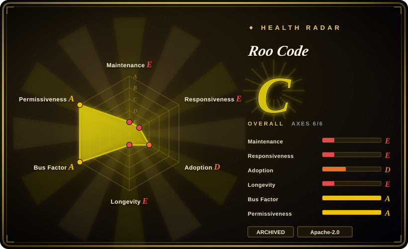
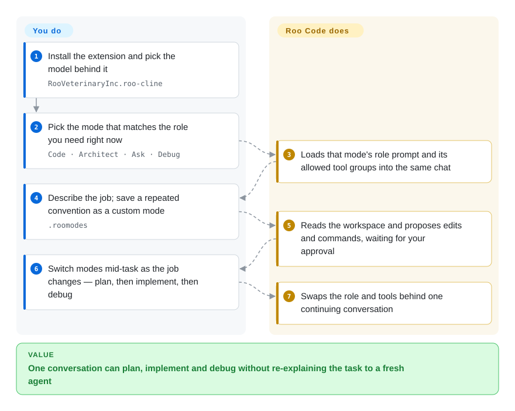

# Roo Code

The mode-per-role agent — Code / Architect / Ask / Debug plus custom modes with their own tool sets — lives here, in a repository archived on 2026-05-15 when its team shut down the extension, the cloud, and the router and moved to a different product. Read it for the design and the `.roomodes` format; do not start anything new on it.

## When to use

Two situations, and only two. The first is that you already have it: `.roomodes` in the repo, custom modes your team depends on, and an extension that has not received a release since 2026-05-15 — in which case you need to plan a migration, not a feature request. The second is that you are designing your own agent and want to see how a mature editor extension modelled **modes as first-class objects**: a slug, a role definition, per-mode custom instructions, and an explicit allowlist over tool groups (`read`, `edit`, `command`, `mcp`, `modes`, `browser`) that changes the agent's capabilities without restarting the conversation. That design is the reason this page stays in the index.

For the migration decision, the project's own sunset notice names the answer: it recommends [Cline](cline.md) to users who want a model-agnostic open-source extension, and points people who liked the cloud agents at roomote.dev. [Kilo Code](kilocode.md) is the other maintained descendant of this lineage. Both are live; Roo Code is not.

## How it works

Roo Code is a VS Code extension that wraps a model in a **mode machine**. A mode is not a prompt preset — it carries a role definition, its own custom instructions, and a list of tool groups it is allowed to use, so "Architect" can read and plan while "Code" can also edit and run commands behind the same chat. You switch modes mid-task: the conversation continues, but the instructions and the permitted tools behind it change. Reusable modes live in a `.roomodes` file in the repo, which makes a team's conventions reviewable the way a lint config is; the extension also runs alongside the original Cline extension rather than replacing it, which is why many people had both installed.

<!-- flow-steps:begin (generated from flows/roo-code.json by tools/flow_card.py — do not edit) -->

Text version of the flow

1. **You**: Install the extension and pick the model behind it — `RooVeterinaryInc.roo-cline`
2. **You**: Pick the mode that matches the role you need right now — `Code · Architect · Ask · Debug`
3. **Roo Code**: Loads that mode's role prompt and its allowed tool groups into the same chat
4. **You**: Describe the job; save a repeated convention as a custom mode — `.roomodes`
5. **Roo Code**: Reads the workspace and proposes edits and commands, waiting for your approval
6. **You**: Switch modes mid-task as the job changes — plan, then implement, then debug
7. **Roo Code**: Swaps the role and tools behind one continuing conversation

**Value**: One conversation can plan, implement and debug without re-explaining the task to a fresh agent

<!-- flow-steps:end -->

## When NOT to use

- **You are picking a coding agent today.** The repo is archived and the products are shut down; there are no security fixes and no new model support. Use [Cline](cline.md) — the project's own sunset notice recommends it — or [Kilo Code](kilocode.md).
- **Your threat model requires a vendor that answers CVEs.** An archived extension that still runs with your repo and your API keys is a dead end for security response; whichever replacement you choose, verify it is actively released.
- **You wanted the promised community handoff.** The final changelog said a community team would carry Roo Code forward, but no maintained successor repository with meaningful traction was found in this review. [未验证] Treat "someone is maintaining it" as unconfirmed.
- **You need the CLI or the cloud agent, not the extension.** Those were separate products (Roo Code Cloud, Roo Code Router) and were shut down with the extension; the same team's next product is Roomote, a cloud agent with a different architecture whose license GitHub reports as `NOASSERTION`.
- **You need a stable target for automation built on the extension API.** The surface is frozen at v3.54.0 and will drift out of step with VS Code and with model APIs, so builds pinned to it have a known expiry.

## Comparison

| Alternative | In index | Our verdict | Tradeoff |
|---|---|---|---|
| [Cline](cline.md) | ✅ | Pick Cline: Roo Code's own sunset notice recommends it as the model-agnostic open-source extension to move to, and it is the larger, actively released upstream of this lineage. | You keep the same broad shape (open-source VS Code agent, BYOK, per-action approval) and gain active releases; you lose Roo Code's mode machine unless you rebuild it with rules files and custom instructions. |
| [Kilo Code](kilocode.md) | ✅ | Pick Kilo Code when the mode-per-role workflow is what you actually valued — it is the maintained continuation with modes plus an orchestrator, and an open JetBrains plugin. | Closer to Roo Code's mental model than Cline is, at the cost of a younger project with its own fast-moving surface. |
| [Continue](continue.md) | ✅ | Neither is a live option: Continue is read-only after its final 2.0.0 release. Compare them only as design references — modes here, one shared `config.yaml` there. | Continue's config-driven model is cleaner to share across an editor and a CLI; Roo Code's modes are richer inside one editor. Both codebases are frozen. |
| Cursor | 非仓库 | Pick Cursor only if you are abandoning open extensions altogether; it is a closed editor, not a migration target for a `.roomodes` workflow. | Polished and integrated, but no BYOK-at-cost, no inspectable agent, and your modes become proprietary settings you cannot commit. |

## Tech stack

- **Language:** TypeScript (GitHub metadata, 2026-09-22).
- **Surface:** a VS Code Marketplace extension (`RooVeterinaryInc.roo-cline`), designed to run side-by-side with the original Cline extension. The JetBrains bridge and the cloud/router products are separate repositories and are also shut down.
- **Mode model:** built-in Code / Architect / Ask / Debug modes plus custom modes; `.roomodes` at the repo root defines slug, name, role definition, custom instructions, and allowed tool groups (`read`, `edit`, `command`, `mcp`, `modes`, `browser`).
- **Models:** model-agnostic; earlier release notes describe `.clinerules` support inherited from Cline, and OpenRouter compression among the provider features.

## Dependencies

- **Required:** VS Code (or a VS Code-compatible editor) and an LLM provider key or gateway. The extension is the only runtime.
- **Optional:** MCP servers for extra tools; a `.roo/` directory and `.rooignore` for project rules and exclusions.
- **No service to run.** The cloud and router products that once accompanied it were shut down on 2026-05-15, so there is nothing server-side to depend on — or to receive fixes from.

## Ops difficulty

**Low to run, unrecoverable to own.** Installation and configuration are ordinary extension work, and nothing needs operating. The difficulty is entirely in the exit: the code is frozen, so every future VS Code API change, provider change, or dependency CVE lands on you. Budget a migration rather than a maintenance task — `.roomodes` definitions map onto Cline's rules files or Kilo Code's modes, but the mapping is manual.

## Health & viability

- **Maintenance — archived, deliberately.** The repository was archived on 2026-05-15 and the final release is v3.54.0; the Marketplace listing has not been updated since that day. This is a shutdown, not neglect.
- **Governance — the organisation repurposed itself.** `RooCodeInc` now presents itself as Roomote and its blog points at roomote.dev; the sunset notice states the team concluded IDEs were not where coding was heading.
- **Adoption — a large installed base left behind.** ~24.3k GitHub stars, ~2.0M VS Code Marketplace installs, and the sunset notice cites passing 3 million extension installs. That is a lot of users to strand, and it is why the migration guidance matters more than the code.
- **Risk flags — archived, unlicensed-for-continuation risk is low but the bus factor is zero.** Apache-2.0 means a fork is legally possible, and thousands exist, but no maintained fork with meaningful adoption was identified here. [未验证]
- **Lindy read.** ~1.9 years old at archive time — the project never reached the age where a Lindy prior would help, and age cannot rescue an archived project anyway.

## Caveats (unverified)

- [未验证] No maintained community successor repository with meaningful traction was found; the final changelog's promised "community team" handoff is unconfirmed as of 2026-09-22.
- [推断] The lineage to Cline is inferred from the project's own documentation calling Roo Code "Roo Cline (now Roo Code)" and describing it as running side-by-side with "the original Cline" — a naming and design heritage, not a GitHub fork relationship (the repository is not marked as a fork).
- [未验证] Star and Marketplace install counts are 2026-09-22 readings; the 3-million-installs figure is the sunset notice's own claim.
- [未验证] Roomote's license file is reported by GitHub as `NOASSERTION`; whether it is open source in the OSI sense was not determined, so it is mentioned here as context rather than as an indexed alternative.
- [未验证] The claim that `.clinerules` support was inherited from Cline rests on Roo Code's release notes (v2.1.2/v2.1.9) and was not cross-checked against Cline's own history.
